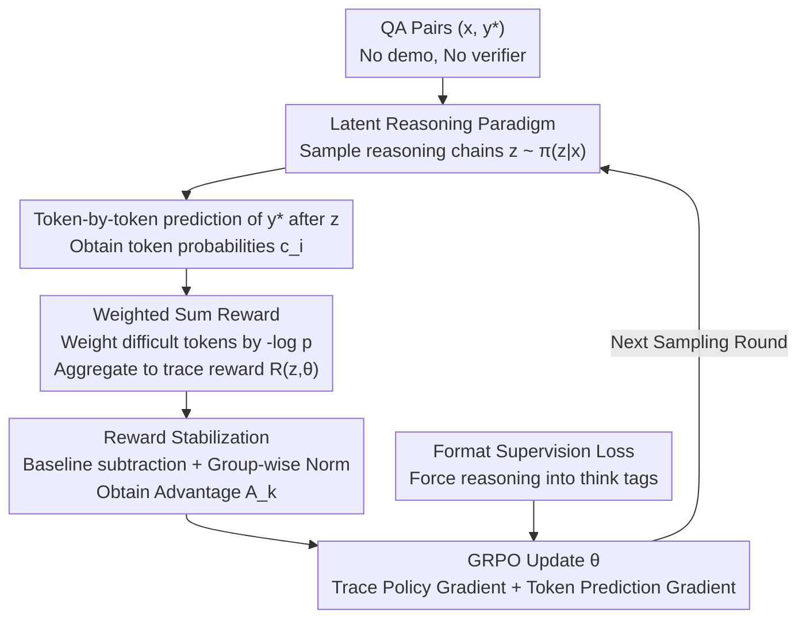

# Native Reasoning Models: Training Language Models to Reason on Unverifiable Data

**Conference**: ICLR2026  
**arXiv**: [2602.11549](https://arxiv.org/abs/2602.11549)  
**Code**: To be confirmed  
**Area**: LLM Reasoning  
**Keywords**: Reasoning Training, Verifier-free RL, Latent Variable Reasoning, GRPO, Reward Design

## TL;DR
The NRT (Native Reasoning Training) framework is proposed, treating reasoning chains as latent variables. It trains LLM reasoning capabilities using the model's own prediction confidence for reference answers as an intrinsic reward signal, without requiring external verifiers or expert reasoning demonstrations. On Llama-3.1-8B, it achieves an average improvement of 10.2 points across 9 benchmarks (46.0 $\rightarrow$ 56.2), outperforming RLPR, which requires a verifier, by +5.4 points.

## Background & Motivation

**Background**: Current improvements in LLM reasoning primarily follow two paths: (a) SFT using human or GPT-4 labeled reasoning chains (e.g., o1 replication), and (b) RL with external verifiers (RLVR), such as using final answer correctness as a reward for math problems. Both perform excellently in verifiable domains like mathematics and programming.

**Limitations of Prior Work**: Answers for a vast number of academic tasks (history, common sense, open QA, multi-hop reasoning) are **not programmatically verifiable**—there is no deterministic verifier to judge whether a reasoning process is correct. This type of "unverifiable data" constitutes the majority of practical applications, yet existing RLVR methods cannot handle it.

**Key Challenge**: Reasoning capabilities require RL training, and RL requires reward signals. Traditional rewards come from external verifiers—but such verifiers do not exist in unverifiable domains. How can reasoning be trained without external rewards?

**Goal**: How to train LLMs to generate effective reasoning chains when only (question, answer) pairs are available, without reasoning demonstrations and without external verifiers?

**Key Insight**: Treat the reasoning chain $z$ as a **latent variable**—a good reasoning chain should lead the model to a higher prediction probability for the correct answer $y^*$. Reward = the model's own token-level probability of predicting the answer after reading the reasoning.

**Core Idea**: Use "whether the reasoning chain helps the model itself better predict the answer" as an intrinsic reward, independent of any external verification—the model acts as both the reasoner and its own judge.

## Method

### Overall Architecture
NRT addresses the scenario where only (question $x$, answer $y^*$) pairs exist without reasoning demonstrations or external verifiers. For each question, the model samples a set of reasoning chains $z \sim \pi_\theta(z|x)$. After reading the reasoning, the model predicts the reference answer token-by-token, obtaining token-level probabilities $c_i = \pi_\theta(y^*_i \mid x, z, y^*_{<i})$. These probabilities are compressed into a trace-level reward $R(z,\theta)$ via a **weighted aggregation function**. Reasoning chains that elevate the prediction probability of difficult tokens receive higher rewards. This is further stabilized via **baseline subtraction and group-wise normalization** to obtain the advantage $A_k$, which is then used to update $\theta$ via GRPO. A lightweight format supervision loss is also applied during training to force the model to write reasoning inside `<think>` tags instead of skipping to the answer. No external signals are used; rewards come entirely from the model's own prediction confidence.

### Key Designs

**1. Latent Reasoning Paradigm: Evaluating via self-prediction**

The fundamental dilemma in unverifiable domains is the lack of a verifier to judge the correctness of a reasoning chain. NRT bypasses this: since $z$ cannot be labeled, it is treated as a latent variable that the model generates and evaluates itself. The criterion is a simple yet self-consistent hypothesis—a good reasoning chain $z$ should increase the model's prediction probability for the correct answer $\pi_\theta(y^*\mid x,z)$. In this setup, the model acts as both the student (generating reasoning) and the teacher (scoring with prediction confidence), providing a self-consistent reward source.

**2. Weighted Sum Reward: Focusing on critical tokens via inverse difficulty weighting**

If the sum of logarithms of token probabilities (standard logP) is used as a reward, the signal is dominated by high-frequency simple tokens like "the" or "of," which already have probabilities near 1. NRT adopts a weighted sum where weights are inversely proportional to basic token difficulty $w_i \propto 1/c_{i,base}$: simple tokens get weights near 0, while difficult tokens like key factual words are amplified. The most effective scheme, $-\log p$ weighting, outperformed logP by 3.3 points on Llama-3.1-8B. This is theoretically equivalent to minimizing the KL divergence on difficult tokens, naturally concentrating optimization pressure where the model is most uncertain.

**3. Reward Stabilization: Baseline subtraction and group-wise normalization**

Methods like RLPR suffer from a fatal issue: after a few training steps, the entropy of the reasoning chain collapses to 0, and reasoning quality drops to zero. NRT stabilizes training with two steps. First, it uses a clipped reward $R' = \max(0,\, R - R_{base})$, subtracting the "no reasoning" baseline reward to ensure only helpful reasoning receives positive rewards. Second, group-wise normalization is used to stabilize the gradient scale for GRPO within a sampling group. These ensure NRT maintains high entropy and high-quality reasoning without the collapse seen in RLPR.

**4. Format Supervision Loss: Preventing shortcuts**

With only intrinsic rewards, the model might take a shortcut by skipping reasoning and outputting the answer directly. NRT adds a format supervision loss with a weight of 0.3, requiring outputs to be enclosed in `<think>...</think>` tags to ensure the reasoning chain physically exists and the reward signal is targeted correctly.

### Loss & Training
The objective is to maximize the expected reward $J(\theta) = \mathbb{E}_{z \sim \pi_\theta}[R(z,\theta)]$, optimized via GRPO with importance sampling. The gradient decomposes into two parts: a trace policy gradient that strengthens the entire reasoning chain, and a token prediction gradient that updates token-level predictions according to the difficulty weights. Training utilized 200K samples from the tulu-3-sft-mixture, with an average response length of 415 tokens.

## Key Experimental Results

### Main Results

**Llama-3.1-8B across 9 benchmarks**:

| Method | BBH | MMLU | DROP | GSM8K | MATH | HumanEval | IFEval | Overall Mean |
|------|-----|------|------|-------|------|-----------|--------|---------|
| SFT | 38.0 | 59.2 | 36.7 | 29.0 | 17.8 | 74.7 | 58.3 | 46.0 |
| RLPR* | 41.2 | 58.7 | 32.5 | 65.0 | 27.8 | 77.8 | 61.3 | 50.8 |
| Verifree* | 35.7 | 58.3 | 33.5 | 54.3 | 19.4 | 76.3 | 59.3 | 48.1 |
| NRT-GM | 54.3 | 66.1 | 48.7 | 70.3 | 32.2 | 76.3 | 55.3 | 54.9 |
| **NRT-WS(-logp)** | **51.0** | **66.7** | **52.2** | **76.0** | **30.7** | **77.8** | **59.0** | **56.2** |

**Llama-3.2-3B**:

| Method | Overall Mean |
|------|---------|
| SFT | 36.4 |
| NRT-WS(-logp) | **39.9** (+3.5) |

### Ablation Study

| Reward Aggregation | Llama-3.1-8B Overall |
|-------------|------------------|
| logP | 52.9 |
| P (Product) | 51.4 |
| GM (Geometric Mean) | 54.9 |
| AM (Arithmetic Mean) | 53.3 |
| WS-1/p (Inverse Prob) | 53.3 |
| **WS-(-logp)** | **56.2** |

### Key Findings
- **Resolution of Policy Collapse**: In RLPR, reasoning entropy drops to 0 quickly, whereas NRT maintains high entropy and high-quality reasoning.
- **Targeted Improvement on Hard Tokens**: The WS weighting scheme increases model probability on high-entropy tokens by up to 15%, while RLPR shows almost no improvement.
- **No Requirement for Verifiable Data**: Substantial gains were observed in both GSM8K (verifiable) and BBH (unverifiable), proving the method is not limited to specific domains.
- **Decoupling of Reasoning and Answers**: Vocabulary analysis shows the model automatically learns to use meta-cognitive terms ("premise", "reasoning") in the reasoning chain while suppressing answer-formatting tokens.

## Highlights & Insights
- **Paradigm Innovation: Latent Reasoning**: The idea of treating reasoning as a latent variable and using self-prediction confidence as a reward is elegant—it removes the need for external labels or verifiers, extending RL reasoning training to all domains.
- **Theoretical Intuition of Hard Token Weighting**: The $-\log p$ weighting focuses rewards on the most uncertain key tokens, aligning with the spirit of curriculum learning and hard example mining. This simple modification yielded a significant 3.3-point gain.
- **Diagnosis of Policy Collapse**: The study clearly demonstrates the collapse phenomenon in RLPR (reasoning entropy $\rightarrow$ 0) and shows how NRT naturally avoids this through intrinsic reward design, as collapsed reasoning fails to assist in answer prediction.

## Limitations & Future Work
- **Manual Reward Design**: The 5 aggregation methods and weighting schemes are manually defined; automated reward function learning could be explored.
- **Sampling Efficiency**: RL training requires extensive sampling (GRPO requires multiple chains per group), leading to high computational costs.
- **Limited to Fine-tuning**: It has not been verified in the pre-training stage, where incorporating reasoning training might yield even better results.
- **Hallucination Risk**: Case studies indicate the model may generate non-existent program names in open tasks—intrinsic rewards do not necessarily prevent factual errors.

## Related Work & Insights
- **vs RLPR (Reasoning via Planning with RL)**: RLPR uses external answer-matching rewards and collapses on unverifiable tasks. NRT uses intrinsic prediction confidence and is applicable to all scenarios.
- **vs Verifree**: Prior verifier-free methods used simpler reward designs; NRT's token-level weighting scheme is more effective (+8.1 on Llama-8B).
- **vs STaR/Self-Improvement**: STaR relies on filtering reasoning chains with correct answers for SFT, whereas NRT uses RL to directly optimize reasoning quality, avoiding the distribution matching issues of SFT.

## Rating
- Novelty: ⭐⭐⭐⭐⭐ The latent reasoning paradigm and intrinsic reward design are fresh perspectives that fundamentally solve reasoning training in unverifiable domains.
- Experimental Thoroughness: ⭐⭐⭐⭐⭐ Covers 3 models, 9 benchmarks, 5 reward variants, alongside training dynamics, token-level analysis, and case studies.
- Writing Quality: ⭐⭐⭐⭐⭐ Logical progression from problem definition to theoretical derivation and experimental analysis with clear formulas.
- Value: ⭐⭐⭐⭐⭐ Addresses a core bottleneck in current reasoning training—extending RL training from verifiable domains to arbitrary domains.

<!-- RELATED:START -->

## Related Papers

- [\[ICLR 2026\] A Stitch in Time Saves Nine: Proactive Self-Refinement for Language Models](a_stitch_in_time_saves_nine_proactive_self-refinement_for_language_models.md)
- [\[ICLR 2026\] OpenThoughts: Data Recipes for Reasoning Models](openthoughts_data_recipes_for_reasoning_models.md)
- [\[ICLR 2026\] Understanding the Role of Training Data in Test-Time Scaling](understanding_the_role_of_training_data_in_test-time_scaling.md)
- [\[ICLR 2026\] ProofOptimizer: Training Language Models to Simplify Proofs without Human Demonstrations](proofoptimizer_training_language_models_to_simplify_proofs_without_human_demonst.md)
- [\[ICLR 2026\] Your Models Have Thought Enough: Training Large Reasoning Models to Stop Overthinking](your_models_have_thought_enough_training_large_reasoning_models_to_stop_overthin.md)

<!-- RELATED:END -->
