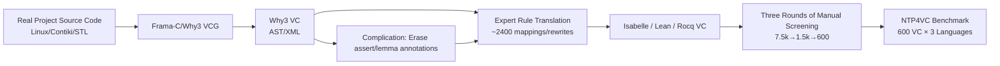

# Neural Theorem Proving for Verification Conditions: A Real-World Benchmark

**Conference**: ICLR 2026  
**OpenReview**: [https://openreview.net/forum?id=MfDyickxQA](https://openreview.net/forum?id=MfDyickxQA)  
**Code**: Open-sourced (as stated in the paper; links to be confirmed)  
**Area**: LLM Reasoning / Neural Theorem Proving / Program Verification / Benchmark  
**Keywords**: Neural Theorem Proving, Verification Condition, Program Verification, Isabelle/Lean/Rocq, Why3/Frama-C, Benchmark  

## TL;DR
This paper introduces NTP4VC—the first real-world, multi-language (Isabelle/Lean/Rocq) neural theorem proving benchmark targeting the core bottleneck of program verification: "Verification Condition (VC) proving." Using industrial pipelines (Why3/Frama-C), the authors extract 600 VCs from real projects like Linux and Contiki-OS. The results reveal a significant gap: even state-of-the-art LLMs/provers achieve a pass@8 of less than 12%, failing to outperform classic "hammers."

## Background & Motivation
- **Background**: The core workflow of program verification involves a Verification Condition Generator (VCG) compiling "source code + specifications + annotations" into a set of logical propositions known as Verification Conditions (VCs), which are then proven by provers. Traditionally, VCs are handled by Automated Theorem Provers (ATPs such as Z3/CVC4). Neural Theorem Proving (NTP) allows LLMs to generate formal proofs directly, showing impressive results in mathematical competitions (e.g., miniF2F, PutnamBench).
- **Limitations of Prior Work**: ATPs only excel within specific problem domains. In real engineering, many "hard VCs" exceed their capabilities, requiring manual proof writing and annotations. For instance, verifying a linked list library in Frama-C requires approximately 600 lines of annotations—nearly as long as the C source code. This massive manual cost is the primary reason program verification has not been widely adopted outside safety-critical domains.
- **Key Challenge**: NTP performs well on "mathematical problems," but proving VCs requires fundamentally different reasoning abilities (involving engineering semantics like memory, overflow, custom data types, and library dependencies). Furthermore, **no existing benchmark specifically targets the VC proving bottleneck**—existing works either contain few verification-related lemmas (VC ratio < 20%) or focus on programming puzzles in Lean (VC ratio 0%).
- **Goal**: To rigorously evaluate whether NTP can automate VC proving by constructing NTP4VC, the first real-world, multi-language benchmark, and systematically evaluating general LLMs, specialized provers, and classic hammers to quantify gaps and identify future directions.
- **Key Insight**: **Reusing industrial VCGs for VC extraction + Expert rules for multi-ITP translation + "Complication" to restore difficulty.** Instead of relying on unreliable LLM translation, the authors use grounded translation and erase manual annotations to restore the inherent difficulty of VCs under fully automated verification.

## Method

### Overall Architecture
The benchmark construction consists of two main steps: first, utilizing industrial pipelines to extract "already proven (thus guaranteed provable)" VCs from real projects and translating them into Isabelle, Lean, and Rocq using approximately 2,400 expert-written rules. Since these VCs are "too easy" due to abundant manual annotations, a **complication process** is applied to erase auxiliary annotations, restoring the difficulty to the level expected in fully automated verification while maintaining provability. Finally, 600 VCs are selected from over 7,500 candidates via three rounds of manual screening to balance breadth and difficulty.

### Key Designs

**1. Reusing industrial VCGs for extraction to overcome the lack of verification ecosystem in Lean:** The authors initially sought to extract VCs directly from Lean (the dominant NTP language) but found that Lean lacks mature program verification frameworks and large-scale industrial projects. The solution was to use established VCGs, Why3 and Frama-C: Frama-C processes C source code into Why3 specifications, and Why3 runs the VCG to produce VCs. Why3 was chosen as an intermediary because its logic system (Simple Typed Theory) is high-level enough to be subsumed by major ITPs, ensuring the feasibility of translation. This approach allows the extraction of VCs from real projects such as the Linux kernel scheduler, Contiki-OS memory allocators, C++ STL, and X.509 parsers.

**2. ~2,400 expert rules for "idiomatic" translation instead of LLM translation:** Given the unreliability of LLM translation, the authors wrote approximately 800 manual mapping and rewriting rules for each target language (totaling ~2,400). Translation dumps the VC's AST into XML, which is then mapped to the target ITP via a Python framework. Rules prioritize idiomatic expressions: syntactic rules map term structures to ITP-specific syntax (e.g., mid-fix operators, `if-then-else`, `match-case`, `list[index]`), while rewriting systems transform operations (e.g., converting integer arithmetic to natural number arithmetic) into common ITP conventions. Quality is ensured through syntax checks and expert cross-validation.

**3. Complication process: restoring difficulty by erasing annotations:** Since the source VCs come from verified projects, they are inherently provable by ATPs—but often only because developers provided extensive "hints." The authors identify and erase three types of simplification annotations: (1) `assert` annotations (subgoals used as lemmas); (2) `lemma` annotations (explicit global lemmas); and (3) lemma application hints (explicit instantiation). These have clear syntactic patterns for identification. Erase-based complication significantly impacts difficulty; on original Why3 samples, the pass rate of the strongest ATP dropped from ~99% to ~62%.

**4. Three-round screening for difficulty alignment and diversity:** The authors use the pass rate of Why3's strongest composite tactic, AL3 (which integrates Z3, CVC4, SPASS, Alt-Ergo, and E-prover), as a difficulty metric. A VC is labeled "Hard" if AL3 cannot solve it within 10 minutes. The goal is a 20%–25% AL3 pass rate per category to challenge NTP while distinguishing between methods. The benchmark is split into: **Pearls of Programs** (classic verification challenges like binomial heaps, VerifyThis'24) and **Real C Verification** (Functional, Loop, Memory, and Invalid Arg. properties from 8 C projects totaling 17,413 lines). After initial mapping and expert filtering, 600 VCs were finalized.

## Key Experimental Results

### Main Results: Pass@k across Lean/Rocq/Isabelle

| Model | Lean P@1/P@8 | Rocq P@1/P@8 | Isabelle P@1/P@8 |
|---|---|---|---|
| GPT-o4-mini-high | 0.50 / – | 0.00 / – | 1.17 / – |
| DeepSeek-V3.1 | 0.50 / 1.67 | 0.50 / 3.17 | 1.34 / 6.25 |
| Qwen3-235B-A22B | 0.67 / 1.00 | 0.83 / 3.33 | 1.19 / 3.13 |
| DeepSeek-Prover-V2-671B | 1.67 / 3.00 | – | – |
| Minilang | – | – | 2.08 / **11.46** |
| **CoqHammer / Sledgehammer** | – | **5.67 (P@1)** | **18.00 (P@1)** |

> All NTP models achieve a pass@8 **< 12%**, while classical hammers (e.g., Sledgehammer at 18%) outperform all LLMs. In contrast, DeepSeek-Prover-V2 achieves 55.5% pass@1 on miniF2F, highlighting the massive gap between math and VC proving.

### Results by Category (NTP Models vs. Hammer, Pass/Total)

| Category | NTP Models | Hammer |
|---|---|---|
| Pearls of Prog. | 15/300 (5.00%) | 32/300 (10.67%) |
| Real C Verif. | 16/300 (5.33%) | 82/300 (27.33%) |
| **Total** | **34/600 (5.67%)** | **114/600 (19.00%)** |

> Hammers maintain superior performance across all categories, with a particularly stark advantage in Real C Verification (27.33% vs. 5.33%), suggesting real-world engineering VCs are significantly more challenging for LLMs than "program pearls."

### Key Findings
- **Proficiency in Math $\neq$ Proficiency in Verification**: Models specialized for theorem proving reach near-SOTA on math benchmarks but fail on NTP4VC, confirming that VC proving requires distinct reasoning capabilities.
- **NTP has not surpassed classical techniques**: Even when using tools like Minilang (which includes Sledgehammer), LLMs fail to provide an incremental benefit over running Sledgehammer standalone.
- **Three failure modes**: Error analysis identifies syntax errors (e.g., unmatched parentheses), semantic confusion, and hallucinations as recurring issues.

## Highlights & Insights
- **Targeting Real Bottlenecks**: Rather than focusing on "math competition scores," this work targets the VC proving bottleneck that consumes high human effort—this "bottleneck perspective" is intrinsically valuable.
- **Reliable Automated Extraction**: Using industrial VCGs + expert rules + complication ensures provability while restoring difficulty. The pipeline is automated and scalable.
- **Multi-language Alignment**: The same VCs are semantically equivalent across Isabelle, Lean, and Rocq, facilitating cross-ecosystem comparison.
- **Honest Negative Results**: The comprehensive evaluation demonstrates that "LLMs are not yet ready," providing the community with a clear, quantifiable new battlefield.

## Limitations & Future Work
- **Provability Constraints**: As VCs pass through multiple stages (Frama-C/Why3/Translation), bugs in any stage could potentially render a case unprovable.
- **Rule Maintenance**: The ~2,400 expert rules are the foundation of quality but require significant expertise to extend to new languages or constructs.
- **Data Source Bias**: The "Real C" portion is limited to projects compatible with Frama-C, lacking coverage for other languages like Rust or Java.
- **Future Work**: The benchmark includes training data extraction capabilities (using the remaining 124 Pearl projects) to facilitate future fine-tuning or RAG-enhanced NTP models in the VC domain.

## Related Work & Insights
- **NTP / Math Theorem Proving**: Comparison with DeepSeek-Prover-V2, Goedel-Prover, miniF2F, and PutnamBench shows a significant performance drop for "math-strong" models in the VC domain.
- **Existing Verification Benchmarks**: Unlike prior works that contain limited VCs (Lin et al. 2024, Thompson et al. 2025) or focus solely on Lean puzzles, this is the first benchmark where VCs account for 100% of the content and originate from industrial pipelines.
- **Industrial Toolchains**: Reusing Why3 and Frama-C as "VC factories" represents a paradigm of leveraging mature engineering infrastructure for ML benchmarks.
- **Insight**: When a task lacks native data, "borrowing engineering pipelines + expert rules + reversing simplification" is a reproducible strategy for benchmark construction.

## Rating
- **Novelty**: ⭐⭐⭐⭐⭐ First real-world, multi-language, 100% VC benchmark for NTP; unique "VCG + complication" construction logic.
- **Experimental Thoroughness**: ⭐⭐⭐⭐ Solid quantification across 7 models + 2 hammers, three languages, multiple metrics, and detailed error analysis.
- **Writing Quality**: ⭐⭐⭐⭐ Logical flow from motivation to negative results; comprehensive charts and technical details.
- **Value**: ⭐⭐⭐⭐⭐ High long-term value for the NTP community by defining a high-value, low-contamination arena with clear room for improvement.

<!-- RELATED:START -->

## Related Papers

- [\[ICLR 2026\] OpenEstimate: Evaluating LLMs on Reasoning Under Uncertainty with Real-World Data](openestimate_evaluating_llms_on_reasoning_under_uncertainty_with_real-world_data.md)
- [\[ICLR 2026\] Mathesis: Towards Formal Theorem Proving from Natural Languages](mathesis_towards_formal_theorem_proving_from_natural_languages.md)
- [\[ICML 2025\] No Soundness in the Real World: On the Challenges of the Verification of Deployed Neural Networks](../../ICML2025/llm_reasoning/no_soundness_in_the_real_world_on_the_challenges_of_the_verification_of_deployed.md)
- [\[ICLR 2026\] Process-Verified Reinforcement Learning for Theorem Proving via Lean](process-verified_reinforcement_learning_for_theorem_proving_via_lean.md)
- [\[ICLR 2026\] EvolProver: Advancing Automated Theorem Proving by Evolving Formalized Problems via Symmetry and Difficulty](evolprover_advancing_automated_theorem_proving_by_evolving_formalized_problems_v.md)

<!-- RELATED:END -->
