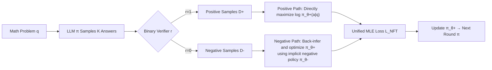

# NFT: Bridging Supervised Learning and Reinforcement Learning in Math Reasoning

**Conference**: ICLR 2026  
**arXiv**: [https://openreview.net/forum?id=ujBrsQm6Zu](https://openreview.net/forum?id=ujBrsQm6Zu)  
**Code**: [https://research.nvidia.com/labs/dir/Negative-aware-Fine-Tuning](https://research.nvidia.com/labs/dir/Negative-aware-Fine-Tuning)  
**Area**: LLM Reasoning / Post-training Algorithms  
**Keywords**: Mathematical Reasoning, Negative Sample Utilization, Supervised Learning, Reinforcement Learning, GRPO, Implicit Policy  

## TL;DR
NFT (Negative-aware Fine-Tuning) demonstrates that supervised learning can achieve "verification-driven" self-improvement. By constructing a negative policy implicitly parameterized by the target positive policy for negative samples, it unifies all self-generated answers (correct and incorrect) into maximum likelihood training. Its performance matches or exceeds GRPO/DAPO, and it is theoretically equivalent to the GRPO gradient under strict on-policy conditions.

## Background & Motivation
- **Background**: Recent leaps in LLM mathematical reasoning stem from the paradigm shift from "imitation" to "self-improvement"—requiring only problems and binary verifiers (correct/incorrect) for training, without relying on human reference answers. This paradigm is almost default for Reinforcement Learning (RL), as PPO and GRPO are designed to maximize reward signals, where binary correctness serves as the reward.
- **Limitations of Prior Work**: Rejection Fine-Tuning (RFT), the simplest supervised learning (SL) method, only collects positive samples identified by the verifier for SFT and discards all negative samples. This limits the model to "reinforcing what it already gets right" and prevents it from "reflecting on mistakes"—the latter being widely considered a key capability for general intelligence and a core reason SL lags behind RL.
- **Key Challenge**: A mainstream view (Chu et al. 2025) suggests that SL inherently only memorizes positive samples and cannot learn from negative feedback, making self-reflective improvement an exclusive advantage of RL. However, is there a fundamental gap between RL and SL, or has SL simply not found a way to utilize negative samples?
- **Goal**: To achieve "self-improvement utilizing negative feedback" within the SL paradigm and to theoretically clarify the true relationship between SL and RL in binary feedback learning systems.
- **Core Idea**: **[Implicit Negative Policy]** Instead of discarding negative samples, a negative policy $\pi_\theta^-$ is constructed for negative data. This policy is tightly coupled with the target positive policy $\pi_\theta^+$ through the old policy $\pi_{old}$. Thus, "maximum likelihood training of the negative policy on negative samples" is equivalent to "directly optimizing the positive policy," allowing all generations to be utilized while maintaining only a single model throughout the process.

## Method

### Overall Architecture
NFT splits an online iteration into two steps: **Data Collection**—the LLM samples $K$ answers for each problem, and a verifier assigns binary labels $r \in \{0, 1\}$, splitting them into a positive subset $D^+$ and a negative subset $D^-$; **Policy Optimization**—performing supervised maximum likelihood on positive samples like RFT, while on negative samples, optimizing the positive policy via back-inference from the implicit negative policy. Both losses are combined for unified maximum likelihood optimization of the target LLM $\pi_\theta^+$.

### Key Designs

**1. Policy Splitting Identity: Locking Positive and Negative Policies.** The foundation of NFT is a coupling relationship derived from Bayes' rule. Defining the target positive policy as $\pi^+(a|q)=\pi(a|q,r{=}1)$ and the negative policy as $\pi^-(a|q)=\pi(a|q,r{=}0)$, they satisfy a linear combination with the old policy: $r_q\,\pi^+(a|q)+(1-r_q)\,\pi^-(a|q)=\pi_{old}(a|q)$, where $r_q=p(r{=}1|q)$ is the model's accuracy on the problem, estimated in practice by $\hat r_q = \text{mean}\{r_{1:K}\}$. This identity implies that once $\pi_{old}$ and $r_q$ are known, "shaping the negative policy" is equivalent to "shaping the positive policy in reverse," providing the mathematical justification for back-inferring the positive policy from negative samples.

**2. Implicit Negative Policy: Rewriting Negative Sample Training as Positive Policy Optimization.** Training the negative policy directly is meaningless; the key is using the identity above to reparameterize $\pi_\theta^-$ as a function of the target positive policy $\pi_\theta^+$: $\pi_\theta^-(a|q):=\dfrac{\pi_{old}(a|q)-r_q\,\pi_\theta^+(a|q)}{1-r_q}$. Thus, performing maximum likelihood $\max_\theta \mathbb{E}_{\pi^-}[\log\pi_\theta^-(a|q)]$ on negative samples $D^-$ yields an optimal solution that exactly satisfies $\pi_\theta^{+*} = \pi^+$ under infinite data/capacity. This is the essence of how NFT differs from RFT: "discarding negative samples" is replaced by "negative samples optimizing the same positive policy."

**3. Unified Maximum Likelihood Loss + Token-level Stabilization.** Combining the positive and negative paths yields a practical objective: for positive samples ($r=1$), maximize the log likelihood ratio $R_\theta^t(q,a)=\pi_\theta^+(a_t|q,a_{<t})/\pi_{old}(a_t|q,a_{<t})$; for negative samples ($r=0$), maximize the implicit negative log likelihood ratio $\log\frac{1-\hat r_q R_\theta^t}{1-\hat r_q}$. The version used in practice is:
$$L_{NFT}=-\sum_{q,a,r}\omega(q)\sum_t\Big[r\log R_\theta^t+(1-r)\log\,\text{maxv}\big(\tfrac{1-\hat r_q R_\theta^t}{1-\hat r_q},\,\epsilon\big)\Big]$$
Three engineering points are essential: **Token-level loss** treats each token as an independent unit for summation to avoid high variance from sequence likelihood accumulation; **Negative likelihood ratio truncation**—since the argument for the log in the negative path must be positive, and $R_\theta^t$ might be negative before optimization, a lower bound $\epsilon > 0$ is enforced with straight-through gradients to preserve flow; **Hard problem weighting** $\omega(q)$ assigns higher weights to problems with low accuracy, focusing on informative samples and aligning NFT with the GRPO series.

**4. Equivalence to GRPO: Unmasking the Gap Between SL and RL.** The paper compares the loss gradients of NFT and GRPO (Proposition 4.1), discovering that GRPO's "group-relative advantage normalization" $\hat A_q$, often viewed as an empirical trick, is actually implicit in the NFT loss. When $\omega(q)=\sqrt{(1-\hat r_q)/\hat r_q}$, the positive and negative advantages are exactly $A_q^+=\sqrt{(1-\hat r_q)/\hat r_q}$ and $A_q^-=-\sqrt{\hat r_q/(1-\hat r_q)}$, consistent with GRPO. Proposition 4.2 further proves that their gradients are identical under strict on-policy conditions ($R_\theta^t=1$); the only difference lies in off-policy gradient clipping/truncation strategies. Adjusting $\omega(q)=1-\hat r_q$ aligns NFT with Dr. GRPO. This fundamentally shows that SL and RL are two sides of the same coin in binary feedback systems.

## Key Experimental Results

Setup: Online fine-tuning on Qwen2.5-Math-7B and Qwen2.5-32B, DAPO-Math-17k dataset, ~5000 steps, batch 512, temperature 1.0. Evaluation averages across AIME24/25, AMC23, MATH500, OlympiadBench, and Minerva Math.

### Main Results (7B / 32B Average Accuracy)

| Model / Algorithm | AIME24 | MATH500 | AIME25 | AMC23 | Olympiad | Minerva | Average |
|---|---|---|---|---|---|---|---|
| Qwen2.5-Math-7B (Base) | 13.3 | 69.0 | 5.5 | 45.8 | 34.7 | 21.3 | 31.6 |
| + DPO | 29.8 | 79.8 | 13.8 | 83.2 | 48.0 | 39.0 | 48.9 |
| + GRPO | 30.2 | 80.4 | 17.1 | 79.5 | 51.8 | 38.2 | 49.5 |
| + Dr. GRPO | 31.8 | 83.4 | 15.7 | 80.2 | 49.6 | 38.2 | 49.8 |
| + DAPO | 33.1 | 81.6 | 18.7 | 85.0 | 49.9 | 39.3 | 51.2 |
| + RFT (SL Baseline) | 33.7 | 79.8 | 13.4 | 79.7 | 44.3 | 38.6 | 48.3 |
| **+ NFT (Ours)** | 32.0 | **83.2** | 18.3 | **88.5** | 47.3 | **40.8** | **51.7** |
| Qwen2.5-32B (Base) | 4.1 | 68.6 | 1.0 | 45.0 | 31.1 | 27.9 | 29.6 |
| + DAPO | 44.1 | 89.2 | 33.4 | 90.9 | 54.1 | 47.5 | **59.9** |
| + RFT | 29.9 | 86.2 | 19.1 | 92.4 | 45.3 | 44.1 | 52.8 |
| **+ NFT (Ours)** | 37.8 | 88.4 | 31.5 | **93.8** | **55.0** | **48.9** | 59.2 |

On 7B, NFT averages 51.7, surpassing DAPO (51.2) and all RL algorithms. On 32B, NFT scores 59.2, nearly matching DAPO (59.9) and significantly exceeding RFT (52.8).

### Ablation Study

| Ablation Item | Comparison | Conclusion |
|---|---|---|
| Weighting $\omega(q)$ | Constant 1 / $1-\hat r_q$ / $\sqrt{(1-\hat r_q)/\hat r_q}$ | The latter two (aligned with Dr. GRPO/GRPO) perform similarly and better than constant weighting. |
| Truncation $\epsilon$ | 0.1 → 4.0 | $\epsilon \to 0$ over-penalizes mistakes and leads to performance drops; default $\epsilon=1.0$ is most stable. |
| Pos/Neg Data Contribution (32B) | RFT Pos Samples vs NFT Neg Samples | Positive samples contribute ~80% of the gain, while negative samples contribute the remaining 20%. |

### Key Findings
- **Negative Feedback Enables Exploration and Improvement**: NFT consistently and significantly outperforms RFT; while RFT's entropy decreases monotonically, NFT/DAPO encourage higher entropy, implying stronger exploration, which likely drives NFT's superiority.
- **Larger Models Benefit More from Negative Feedback**: The gap between RFT and NFT grows faster on 32B than on 7B, echoing DeepSeek-R1's observation that "reflecting on mistakes" becomes the new bottleneck once models have sufficient memory.
- **On-policy NFT ≈ GRPO**: Training curves for convergence speed and final performance match DAPO, validating theoretical equivalence.

## Highlights & Insights
- **Conceptual Demystification**: Refutes the claim that "self-reflection is exclusive to RL"—pure SL can achieve verification-driven self-improvement if it utilizes negative feedback.
- **Theoretical Bridge**: Provides the first proof of gradient equivalence between SL (NFT) and RL (GRPO) under strict on-policy conditions and explains why GRPO's group normalization works—it is implicit in the MLE objective.
- **Engineering Simplicity**: Uses a single model throughout without a critic or reference model. Old policy likelihoods can be pre-computed during generation, making memory overhead comparable to RFT while delivering RL-level performance.
- **Scalability**: The loss naturally supports continuous rewards $r\in[0,1]$ without changing convergence properties, extending beyond binary verification.

## Limitations & Future Work
- Experiments focused on math reasoning and the Qwen series; transferability to code, general reasoning, or other model families is unverified.
- Negative samples contribute about 20% of gains; maximizing their value remains an open question—the current implicit negative policy may not have fully exhausted their potential.
- Lack of detailed experimental breakdown on the impact of soft vs. hard truncation differences between NFT and GRPO in off-policy scenarios.
- $\hat r_q$ is estimated with $K$ samples; noise from small $K$ or extreme problem difficulty may affect training stability and was not fully discussed.

## Related Work & Insights
- **RLVR Lineage**: Compared to traditional RLHF relying on reward models, RLVR (GRPO, DAPO, Dr. GRPO) shifts toward ground-truth verifiers for binary supervision; NFT "translates" this line back to the SL side.
- **Implicit Model Parameterization**: Inspired by DPO and visual generation models that use policy networks to implicitly define another model for direct optimization.
- **Insight**: Apparent exclusive capabilities of one paradigm (RL) are often just missing mechanisms in another (SL); unified analysis through "gradient alignment" can be extended to preference learning and alignment.

## Rating
- **Novelty**: ⭐⭐⭐⭐⭐ — Implicit negative policy + SL/RL gradient equivalence is an original contribution that bridges two paradigms with strong conceptual impact.
- **Experimental Thoroughness**: ⭐⭐⭐⭐ — Solid across 7B/32B scales, multiple benchmarks, and seeds; however, limited to math + Qwen, lacking cross-domain validation.
- **Writing Quality**: ⭐⭐⭐⭐⭐ — Progresses clearly from identity to implicit policy to equivalence; Figure 1 and Figure 4 clarify abstract theories effectively.
- **Value**: ⭐⭐⭐⭐⭐ — Provides a practical, high-performance single-model post-training algorithm while clarifying theoretical disputes between SL and RL.

<!-- RELATED:START -->

## Related Papers

- [\[ICLR 2026\] Learning to Reason over Continuous Tokens with Reinforcement Learning (HyRea)](learning_to_reason_over_continuous_tokens_with_reinforcement_learning.md)
- [\[ICLR 2026\] TRAPO: Enhancing LLM Reasoning with Semi-supervised Reinforcement Learning](trapo_a_semi-supervised_reinforcement_learning_framework_for_boosting_llm_reason.md)
- [\[ICLR 2026\] Emergent Hierarchical Reasoning in LLMs through Reinforcement Learning](emergent_hierarchical_reasoning_in_llms_through_reinforcement_learning.md)
- [\[ICLR 2026\] Learning What Reinforcement Learning Can't: Interleaved Online Fine-Tuning for Hardest Questions](learning_what_reinforcement_learning_cant_interleaved_online_fine-tuning_for_har.md)
- [\[ICLR 2026\] CORE: Concept-Oriented Reinforcement for Bridging the Definition–Application Gap in Mathematical Reasoning](core_concept-oriented_reinforcement_for_bridging_the_definitionapplication_gap_i.md)

<!-- RELATED:END -->
