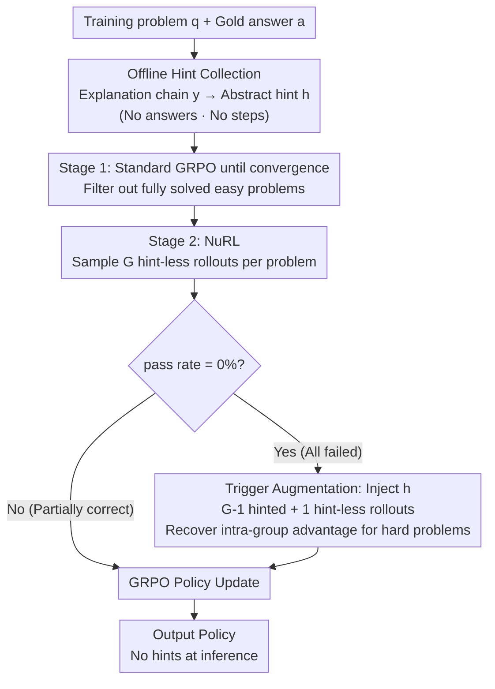

# Nudging the Boundaries of LLM Reasoning

**Conference**: ICLR 2026  
**arXiv**: [2509.25666](https://arxiv.org/abs/2509.25666)  
**Code**: [GitHub](https://github.com/SalesforceAIResearch/NuRL)  
**Area**: LLM Reasoning  
**Keywords**: RL Reasoning, GRPO improvement, Self-generated hint, Breaking capability upper bounds, Zone of Proximal Development

## TL;DR
This paper identifies a fundamental limitation where GRPO fails to learn from hard problems that the model cannot solve at all (pass rate = 0%). It proposes NuRL, which injects self-generated abstract hints (without leaking answers) into hard problems during training to make them learnable, consistently outperforming GRPO across three models and six benchmarks and effectively raising the $pass@k$ capability ceiling.

## Background & Motivation
- **Key Challenge**: Online RL (GRPO) generates zero gradients for unsolvable problems (where all rollouts are incorrect), preventing the model from learning from them.
- **Distribution Sharpening Hypothesis**: Increasing evidence suggests that RL post-training primarily performs "distribution sharpening"—increasing the probability of known solutions—rather than discovering new reasoning capabilities.
- **Constant $pass@k$**: Under large $k$, $pass@k$ often remains unchanged after RL training, indicating that the capability upper bound has not been breached.
- **Zone of Proximal Development**: Drawing an analogy to Vygotsky's Zone of Proximal Development—hard problems are in the "learning zone" but remain inaccessible without guidance.
- **Value of Hard Problems**: These "unsolvable" problems contain rich learning signals by exposing the model's weaknesses.
- **Self-sufficiency Requirement**: There is a need for methods that break capability boundaries without relying on external stronger models.

## Method

### Overall Architecture
NuRL adds a "hard problem rescue" mechanism on top of GRPO: it first generates an abstract hint for each problem offline using the model itself. During training, if all rollouts for a specific problem fail ($pass\ rate = 0\%$), the hint is appended to the prompt for re-sampling, allowing the previously zero-gradient hard problem to produce learnable differences in correctness. The process consists of two stages: Stage 1 uses standard GRPO to master simple problems, and Stage 2 switches to NuRL to inject hints at the capability boundary. The hints are used only as temporary scaffolding during training and are completely removed during inference.

### Key Designs

**1. Offline Hint Collection: Distilling "Why it's Right" into Non-leaking Clues**

Hard problems produce zero gradients because the model gains nothing from them; however, each problem comes with a gold answer $a$, which the model simply doesn't know how to reach. NuRL extracts this information in two steps: first, the old policy generates an explanation chain $y = \pi_{old}(q, a; p_y)$ conditioned on the gold answer. Then, the model refines this explanation into a high-level hint $h = \pi_\theta(q, a, y; p_h)$. The key constraint is that the hint must remain at the level of abstract knowledge (e.g., which theorem to use, which direction to think), neither containing the final answer nor listing specific steps. This ensures the model still performs the reasoning itself, preserving the learning signal. This process is self-contained and requires no external models.

**2. Failure-triggered Online Rollout Augmentation: Scaffolding Only When Stuck**

GRPO initially samples $\mathcal{G}$ hint-less rollouts for each problem. NuRL only intervenes for problems where the $pass\ rate = 0\%$ (all rollouts incorrect). This binary trigger ensures hints are only applied to problems the model truly cannot solve independently, avoiding contamination of solved tasks. Upon triggering, the hint is appended to the prompt. Specifically, $\mathcal{G}-1$ rollouts are sampled with the hint, while 1 rollout remains "naked" (without the hint). This single hint-less rollout prevents the intra-group advantage from collapsing to zero variance ($A_{i,t}=0$ if all succeed), allowing the hinted successful samples to maintain a positive relative advantage.

**3. Counter-intuitive Principle of Hint Abstraction: Less is More**

Design 1 strictly enforces "direction only, no answers" because NuRL evaluated four levels of hint granularity: abstract clues, partial steps, full explanations, and direct answers. The results showed that abstract clues performed best while direct answers were the worst. Providing answers or steps leads to reward hacking, where the model learns to "repeat the hint" rather than "reasoning independently." Abstract directions force the model to complete the intermediate reasoning, internalizing transferable problem-solving patterns. This aligns with the pedagogical intuition of "prompting rather than doing."

### Loss & Training
The strategy follows a two-stage pipeline: Stage 1 runs standard GRPO until the training reward and validation accuracy plateau for 10 consecutive steps, clearing the "easy" problems the model can already solve. Before Stage 2, the Stage 1 checkpoint is used to sample 8 rollouts per problem, filtering out those that are fully solved. Training then continues with NuRL, focusing compute on the remaining hard problems at the capability boundary.

## Key Experimental Results

### Main Results

| Model | Method | MATH500 | MATH Hard | AIME | GPQA | Date | Average |
|------|------|:-------:|:---------:|:----:|:----:|:----:|:----:|
| Llama-3B | GRPO | 56.92 | 30.11 | 8.33 | 27.98 | 57.10 | 35.87 |
| Llama-3B | **Ours(Self)** | **58.04** | **31.62** | **9.17** | **28.28** | **61.65** | **37.49** |
| OctoThinker-3B | GRPO | 68.81 | 41.29 | 8.33 | 23.26 | 69.85 | 42.63 |
| OctoThinker-3B | **Ours(Self)** | **70.13** | **42.07** | **9.66** | **27.15** | **71.75** | **44.38** |

### Ablation Study

| Configuration | MATH500 | GPQA | Description |
|------|:-------:|:----:|------|
| Hint from scratch + No trigger | 53.41 | 24.84 | Worst performance |
| Hint from scratch + Fail-only trigger | 56.06 | 27.63 | Trigger is beneficial |
| Two-stage + No trigger | 53.09 | 26.62 | Two-stage is beneficial |
| Two-stage + Fail-only trigger (NuRL) | **58.04** | **28.28** | Best performance |

### Key Findings
- **Gain in $pass@1024$**: GPQA increased from $63.6\% \rightarrow 69.7\%$, and Date increased from $86.4\% \rightarrow 94.0\%$, while GRPO remained stagnant, indicating a breakthrough in the capability upper bound.
- **Teacher vs. Self-hints**: Using teacher hints (GPT-o4-mini) further improved results by $+3.44\%$, though self-generated hints are already effective.
- **Complementarity**: NuRL + Self-Consistency (SC) showed a $9.4\%$ improvement vs. $7.8\%$ for GRPO + SC, demonstrating better synergy.
- **Learnable Ratio**: The proportion of learnable problems increased from $66\%$ to $70\%$ during NuRL training, whereas it remained at $66\%$ for standard GRPO.

## Highlights & Insights
- Clearly and profoundly reveals the fundamental limitation of GRPO in learning from unsolvable problems.
- The Vygotsky ZPD analogy is accurate and provides a highly inspiring motivation.
- The "more abstract hints are better" insight is counter-intuitive but powerful; direct answers lead to reward hacking.
- Self-generated hints eliminate the need for external models, avoiding distribution shift and ensuring self-sufficiency.
- The two-stage strategy (GRPO convergence followed by NuRL) is simple and practical.

## Limitations & Future Work
- The magnitude of improvement is relatively modest (average $+1-2\%$), with limited Gains on very strong models like Qwen3-4B ($+0.79\%$).
- The quality of self-generated hints is capped by the model's own capabilities; extremely difficult problems may fail to yield useful hints.
- The binary trigger (all failed vs. partially successful) lacks more fine-grained control.
- Offline hint collection requires gold answers, limiting applicability in scenarios where answers are unavailable.
- Hint quality evaluation and dynamic update mechanisms have not yet been explored.

## Related Work & Insights
- **vs. GRPO/DAPO/Dr.GRPO**: While these improve advantage estimation, KL, or sampling, NuRL orthogonally addresses the "unsolvable sample" problem.
- **vs. STaR**: While STaR uses answer-conditioned reasoning, NuRL abstracts it further into hints that do not leak the answer.
- **vs. TBA**: While TBA uses multiple search nodes to generate diverse trajectories, NuRL uses hints to reduce the problem difficulty.

## Rating
- **Novelty**: ⭐⭐⭐⭐ Insight into GRPO upper bound limits + self-generated hint solution.
- **Experimental Thoroughness**: ⭐⭐⭐⭐ 3 models, 6 benchmarks + multiple hint types + $pass@k$ analysis.
- **Writing Quality**: ⭐⭐⭐⭐⭐ Elegant ZPD analogy; smooth logic from motivation to method and experiments.
- **Value**: ⭐⭐⭐⭐ Addresses a practical bottleneck in RL reasoning training with a simple, deployable method.

<!-- RELATED:START -->

## Related Papers

- [\[ICLR 2026\] A State-Transition Framework for Efficient LLM Reasoning](a_state-transition_framework_for_efficient_llm_reasoning.md)
- [\[ICLR 2026\] FlowRL: Matching Reward Distributions for LLM Reasoning](flowrl_matching_reward_distributions_for_llm_reasoning.md)
- [\[ICLR 2026\] Predicting LLM Reasoning Performance with Small Proxy Model](predicting_llm_reasoning_performance_with_small_proxy_model.md)
- [\[ICLR 2026\] Quantile Advantage Estimation: Stabilizing RLVR for LLM Reasoning](quantile_advantage_estimation_stabilizing_rlvr_for_llm_reasoning.md)
- [\[ICLR 2026\] Rethinking LLM Reasoning: From Explicit Trajectories to Latent Representations](rethinking_llm_reasoning_from_explicit_trajectories_to_latent_representations.md)

<!-- RELATED:END -->
