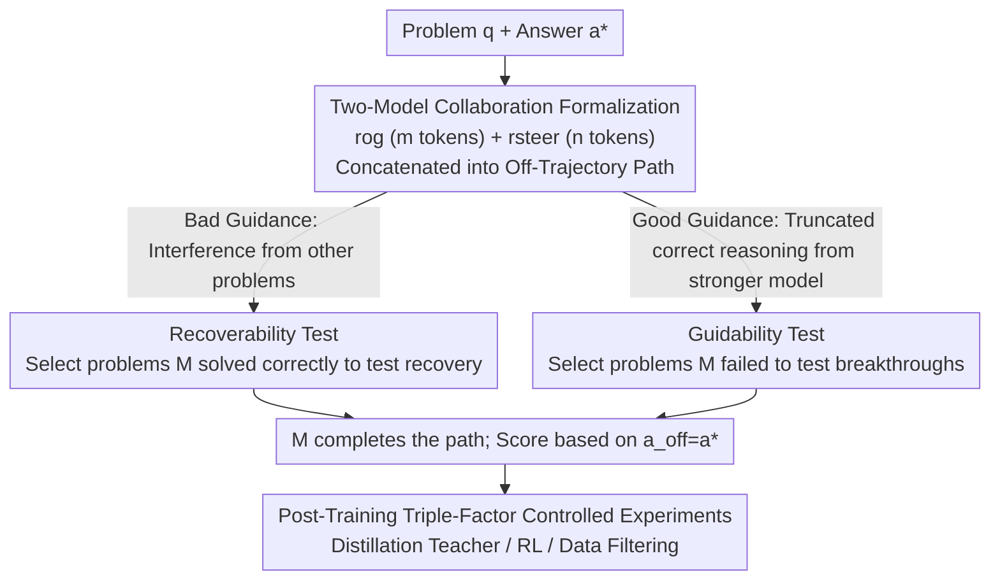

# Off-Trajectory Reasoning: Can LLMs Collaborate on Reasoning Trajectories?

**Conference**: ICLR 2026  
**OpenReview**: [https://openreview.net/forum?id=hVUIguIm14](https://openreview.net/forum?id=hVUIguIm14)  
**Code**: None  
**Area**: LLM Reasoning  
**Keywords**: Off-Trajectory Reasoning, Multi-Model Collaboration, Recoverability, Guidability, Distillation Transfer

## TL;DR
This paper introduces the problem of "off-trajectory reasoning"—whether multiple reasoning models can collaborate in a relay fashion on the same chain-of-thought. By designing a "twin test" system evaluating Recoverability and Guidability across 15 open-source reasoning LLMs, the study reveals that models with stronger benchmarks are often more susceptible to interference, and almost all models fail to leverage correct guidance from stronger models to surpass their own capability ceilings.

## Background & Motivation
**Background**: Reasoning LLMs, represented by OpenAI's o-series, DeepSeek-R1, and Qwen3-Thinking, have learned to verbalize their thinking processes through RLVR or distillation. This transparency suggests an intriguing direction: since models can already intersperse tool outputs, code execution results, and retrieved documents (tokens produced by others) into their own reasoning, can multiple reasoners collaborate directly on a **shared chain-of-thought**? For instance, a large model could focus on difficult derivations while offloading arithmetic verification to a smaller model (efficiency), or models with complementary expertise could branch out for exploration (exploration), or a supervisor could steer reasoning toward safety mid-trajectory (safety).

**Limitations of Prior Work**: Most current LLMs are trained for "solo-reasoning"—independently generating from start to finish. However, collaboration requires a primary model $M$ to process a trajectory $r = [r_M, r_{M'}, r_{M''}, \dots]$ consisting of a **mixture of in-distribution and out-of-distribution tokens**. This is a novel capability requirement for which standard solo-reasoning training pipelines have never been optimized.

**Key Challenge**: Benchmark scores measure how many problems a model can solve alone, whereas collaborative capability measures whether a model can correctly judge the utility of another's partial reasoning and continue from it. Whether these two are consistent has not been systematically tested; there may be a hidden gap masked by benchmark-driven optimization.

**Goal**: To decompose "off-trajectory reasoning capability" into two complementary sub-problems: whether a model can **recover** from misleading guidance (resisting bad tokens) and whether it can breakthrough its own ceiling via **correct guidance** from a stronger model (absorbing good tokens). The study aims to provide an automatically constructed, scalable evaluation protocol.

**Key Insight**: Any complex multi-model collaboration can be simplified into "two-model collaboration." By using trajectories sampled from the same model on different problems to create artificial interference or guidance, the performance after being influenced can be cleanly decoupled from the model's inherent ability.

**Core Idea**: Utilize a pair of extreme "twin tests" (Recoverability for worst-case interference, Guidability for best-case steering) to orthogonally characterize off-trajectory reasoning capability. Further controlled experiments investigate how post-training decisions—distillation teachers, RL, and data filtering—shape this capability.

## Method

### Overall Architecture
This paper proposes an **evaluation framework and controlled analysis** rather than a new model. The core object is the completion performance of a primary model $M$ on a trajectory composed of "half self-written, half externally inserted" tokens. Given a problem $q$ and ground truth $a^*$, the framework samples an independent reasoning trajectory $r$ from $M$, truncates the first $m$ tokens as the original segment $r_{og}$, and constructs a steering segment $r_{steer}$ of length $n$. These are concatenated into a shared off-trajectory path for $M$ to complete and be evaluated:

$$(r_{off}, a_{off}) \sim M(\cdot \mid q, [r_{og}, r_{steer}])$$

Success is measured by whether $a_{off}$ equals $a^*$. When $r_{steer}$ represents the two extremes, the framework splits into Recoverability (bad guidance) and Guidability (good guidance) evaluation lines. Controlled experiments then explore how post-training decisions affect these lines. The workflow is as follows:

### Key Designs

**1. Formalizing Two-Model Off-Trajectory Collaboration: Compressing "Relay Reasoning" into Testable Concatenated Trajectories**

Testing relay reasoning is difficult due to the variety of real-world collaboration scenarios. The authors simplify this into two-model collaboration: the primary model $M$ contributes an original segment $r_{og}$, and a collaborator $M_{steer}$ provides a steering segment $r_{steer}$. The concatenated $[r_{og}, r_{steer}]$ is then completed by $M$. Here, $r_{og}$ is obtained by truncating $M$'s solo trajectory at $m$ tokens (at the nearest sentence end for coherence), and $r_{steer}$ is truncated at $n$ tokens. Two knobs, $m$ (insertion position) and $n$ (steering strength), allow scanning for "early vs. late" and "small vs. large" insertions. This formalization collapses a complex system into a **two-parameter controllable probe** suitable for automated, large-scale testing on verifiable tasks like mathematics or coding.

**2. Recoverability Test: Forcing Recovery via "Strong Interference" Produced by the Model Itself**

This test addresses whether models can be led astray. The authors select only problems that $M$ **already solves correctly** in solo mode ($a = a^*$), ensuring that any failure can be attributed to the interference rather than lack of capability. To create potent interference without prefix-specific knowledge, the authors **sample a trajectory $r'$ from $M$ on a completely different problem $q'$ and use its first $n$ tokens as $r_{steer}$**. Since this reasoning is irrelevant, if $M$ blindly follows it, the conclusion will be incorrect. Performance thus reflects the model's ability to identify the off-topic reasoning and "recover" to its original logic. Default $n = 0.2 \times |r'|$ while scanning $m \in \{0, 0.2, 0.4, 0.6, 0.8\}\times |r|$.

**3. Guidability Test: Evaluating Reception of Partial Correct Reasoning from Stronger Models**

This test measures the absorption of helpful guidance. The authors select problems that $M$ **almost never solves alone** (solve rate 0 or 1 across 8 samples), so any improvement stems from the guidance. Two settings are critical: first, **set $m = 0$** to exclude $M$'s original segment, which might contain errors that anchor $M$ to a wrong path; the guidance is placed at the very beginning. Second, $r_{steer}$ is taken from a stronger model $M_{steer}$ with higher benchmarks (e.g., DeepSeek-R1, Qwen3-235B), providing only the first $n$ tokens ($0.2/0.4/0.6/0.8$ ratios) of its correct trajectory. The authors also monitor "spoiler" guidance: 18.6% of segments already contain the final answer, and true guidability is lower when these are excluded.

**4. Post-Training Triple-Factor Controlled Experiments: Tracing Robustness to Training Recipes**

Observing that models with similar benchmarks can have drastically different off-trajectory stability, the authors conducted three controlled experiments on mathematical benchmarks: (a) **Distillation Teacher**: Distilling Qwen2.5-1.5B/3B using AM-32B, QwQ-32B, or Qwen3-32B using **only correct trajectories**; (b) **RL**: Using the SFT-saturated AM-Distill checkpoint as the policy and continuing with GRPO on MATH8K; (c) **Data Filtering**: Comparing FULL-8K against "small but high-quality" data like LIMO-600/800. These isolate single factors to determine what post-training decisions shape recoverability and guidability.

### A Complete Example
Using Recoverability: $M$ receives the problem "Solve $x = \sqrt{11 - 2x} + 4$," which it solves correctly ($x = 5$). The framework takes the first 40% of its reasoning as $r_{og}$. It then inserts $r_{steer}$ from its reasoning on a "Carbon-14 dating" problem, which mentions "half-life of 5730 years." If $M$ identifies the deviation and returns to algebraic solving, it is "recovered"; if it follows the carbon dating logic, it fails. The percentage of such recovered cases defines the recoverability score.

## Key Experimental Results

### Main Results
15 open-source models (1.5B–32B) were evaluated across 1,507 math problems and 1,762 code problems (Pass@1 from 8 samples). Recoverability was measured on "shared" (all models solved) and "individual" subsets.

| Model | Family | Benchmark Avg. | Math Recover.(Sh.) | Math Guidab.(Sh.) |
| :--- | :--- | :--- | :--- | :--- |
| Qwen3-1.7B | Qwen3 | 59.9 (L) | **98.4** | 6.1 |
| OpenThinker3-1.5B | QwQ | 59.2 (L) | 95.2 | 5.7 |
| Qwen3-32B | Qwen3 | 81.0 (H) | 71.8 | N/A |
| AM-Thinking-32B | Comm. | **82.6 (Max)** | **33.4** | N/A |
| LIMO-32B | Comm. | 67.3 (M) | 29.3 | 8.8 |

The average math recoverability on the shared subset was only 74.9% (a 25.1 percentage point drop from solo mode); code was lower at 59.1%. In guidability, no math model exceeded 9.2% on the shared subset.

### Ablation Study

| Analysis | Key Metric | Description |
| :--- | :--- | :--- |
| Insertion Position (Fig. 4) | Degradation worst at 0% | Interference at the very beginning is most fatal. |
| Retaining Initial Restatement | Avg. recover. >83.5% | Retaining only the initial restatement of the problem significantly restores performance. |
| Guidability Spoiler Correction | Teach. 26.7 → 18.6 Corrected | 18.6% of segments contain the answer; true guidability is lower. |
| Distillation Teacher (§4.1) | AM-Distill sig. below QwQ/Qwen3-Distill | Using only correct trajectories, gaps appear after step 300 (p≤.005). |
| RL after SFT (§4.2) | recover. +15.3~28.9% | GRPO significantly improves recoverability after SFT saturation. |
| LIMO Data (§4.3) | High recover. variance | Small-but-high-quality data causes recoverability to fluctuate wildly despite similar benchmarks. |

### Key Findings
- **Strong Benchmark $\neq$ Strong Collaboration**: The top math model, AM-Thinking-32B (82.6%), had the second-lowest recoverability (33.4%), while the small Qwen3-1.7B (59.9%) reached 98.4%. Explicit benchmark optimization may mask off-trajectory vulnerability.
- **The Guidability Ceiling**: Models almost never use correct guidance from stronger models to breakthrough their own ceilings, even when paired with their own distillation teacher. Many "effective" steers are actually spoilers containing the answer; even then, models often fail to recognize correct reasoning and pivot to a wrong direction.
- **The Beginning of Reasoning is Crucially Important**: At 0% trajectory progression, models usually just restate the problem, yet interference here is most fatal. This suggests that the initial restatement acts as an anchor; preserving it raises recoverability to over 83.5%.
- **Vulnerability Inherited via Distillation**: Teacher vulnerability is passed to students even when training only on correct trajectories. This indicates vulnerability is encoded in **reasoning style** rather than just success/failure. Twin tests should be a selection criterion for distillation teachers.
- **RL Complements SFT**: SFT only provides successful demonstrations (what right reasoning looks like), while RL exposes failure trajectories and explicitly rewards "error recovery," filling the recoverability gap left by SFT.

## Highlights & Insights
- **Generating interference using the model's own output** is a brilliant evaluation stroke. Using its own reasoning on a different problem ensures "following it leads to error," decoupling "being interfered with" from "capability limits."
- **Dimensionality reduction of collaboration into $(m, n)$ probes**: Positioning and steering length knobs allow for granular conclusions like "the beginning is most fragile," applicable to any verifiable task.
- **Honest "Spoiler Correction"**: The authors proactively identify that guidability is inflated by segments containing answers (18.6%), ensuring the results reflect actual capability.
- **Vulnerability lies in reasoning style**: This insight directly informs data/teacher selection—distillation teachers should be chosen based on off-trajectory stability as well as accuracy.

## Limitations & Future Work
- The experiments cover only the simplest "two-model collaboration" setting; real-world multi-model, multi-turn, or human-in-the-loop scenarios are not addressed.
- Evaluation is limited to **reasoning correctness**. While the framework can extend to alignment dimensions (e.g., robustly rejecting unsafe trajectories), this was not empirically explored.
- Cross-domain comparisons require caution; recoverability/guidability scores for math and code are not directly comparable due to differences in task difficulty and verifiability.
- The hypothesis that RL improves recoverability by "exposing failures and rewarding correction" remains a theory; the underlying mechanism requires further study.

## Related Work & Insights
- **vs. Standard Solo-Reasoning Benchmarks**: Existing benchmarks measure independent solving; this paper measures relay performance. They are orthogonal, and this work proves that high solo scores do not imply relay strength.
- **vs. Reasoning Offloading/Meta-Reasoning Methods**: Unlike works that build specific collaborative systems and report gains, this paper steps back to ask if solo models possess the prerequisite capability for collaboration, offering diagnosis instead of a new system.
- **vs. LIMO "Less is More" Hypothesis**: While LIMO shows small high-quality data triggers reasoning, this work finds such data leads to high variance in off-trajectory stability—"Less is More" may not hold for robustness.

## Rating
- Novelty: ⭐⭐⭐⭐⭐ Formalizes "off-trajectory reasoning" and provides an actionable evaluation framework via twin tests.
- Experimental Thoroughness: ⭐⭐⭐⭐⭐ 15 models across Math/Code domains + controlled factor experiments on Distillation/RL/Data.
- Writing Quality: ⭐⭐⭐⭐ Clear concepts and intuitive diagrams, though some protocol details require appendix lookup.
- Value: ⭐⭐⭐⭐⭐ Reveals the disconnect between benchmarks and collaborative capability; offers direct guidance for multi-agent reasoning and distillation strategies.

<!-- RELATED:START -->

## Related Papers

- [\[ICLR 2026\] Rethinking LLM Reasoning: From Explicit Trajectories to Latent Representations](rethinking_llm_reasoning_from_explicit_trajectories_to_latent_representations.md)
- [\[ICLR 2026\] When Silence is Golden: Can LLMs Learn to Abstain in Temporal QA and Beyond?](when_silence_is_golden_can_llms_learn_to_abstain_in_temporal_qa_and_beyond.md)
- [\[ICLR 2026\] The Path of Least Resistance: Guiding LLM Reasoning Trajectories for Efficient Consistency](the_path_of_least_resistance_guiding_llm_reasoning_trajectories_for_efficient_co.md)
- [\[ICLR 2026\] The Path of Least Resistance: Guiding LLM Reasoning Trajectories with Prefix Consensus](the_path_of_least_resistance_guiding_llm_reasoning_trajectories_with_prefix_cons.md)
- [\[ICLR 2026\] A Simple "Motivation" Can Enhance Reinforcement Finetuning of Large Reasoning Models](a_simple_motivation_can_enhance_reinforcement_finetuning_of_large_reasoning_mode.md)

<!-- RELATED:END -->
