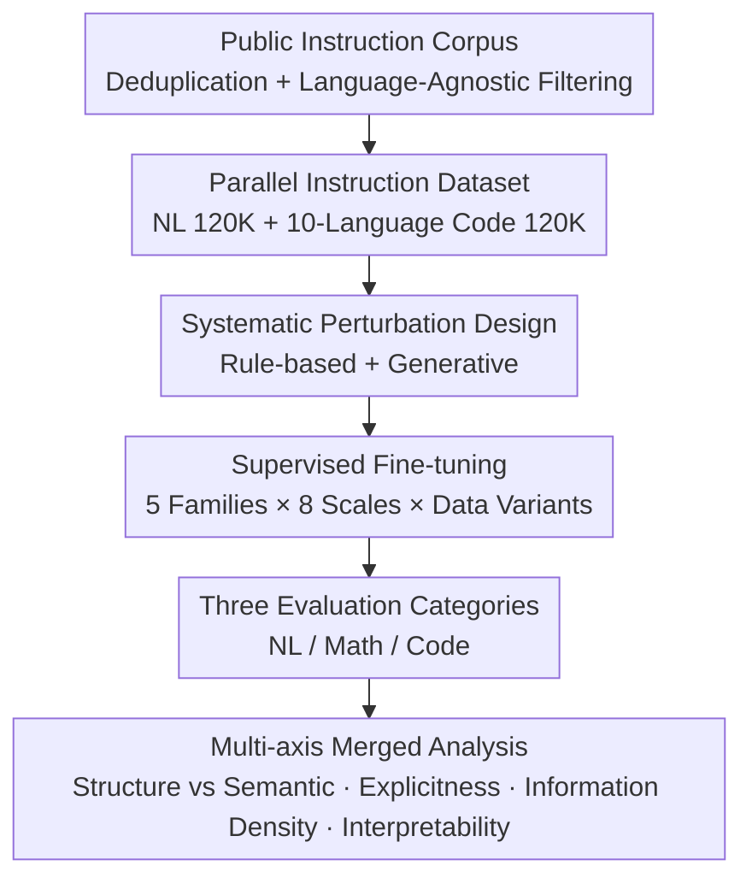

# On Code-Induced Reasoning in LLMs

**Conference**: ICLR 2026  
**OpenReview**: [https://openreview.net/forum?id=LIv0bfJZIi](https://openreview.net/forum?id=LIv0bfJZIi)  
**Code**: To be confirmed (Paper provides Code / Data links)  
**Area**: LLM Reasoning  
**Keywords**: Code training data, reasoning ability, controlled perturbations, data-centric analysis, supervised fine-tuning

## TL;DR
This paper employs a data-centric controlled experimental framework (parallel instruction data for 10 programming languages + over ten types of structural/semantic perturbations + 3,331 experiments across 5 model families and 8 scales) to systematically dissect which specific parts of code data assist LLM reasoning. It concludes that the **structural skeleton** of code—rather than verbose surface details—is crucial; abstractions like pseudocode or flowcharts can equivalently substitute for code, and even corrupted code remains effective as long as surface regularity is preserved.

## Background & Motivation
**Background**: Recent works have discovered that incorporating code data during pre-training or post-training improves LLM performance on "non-coding" reasoning tasks, such as mathematics and logic. A common explanation is that code possesses logical consistency, compositional structure, and less ambiguity compared to natural language, providing beneficial reasoning signals.

**Limitations of Prior Work**: However, these explanations remain at the "hypothesis" level. No study has definitively identified **which specific attribute** of code is responsible: Is it syntactic regularity? Structural abstraction? Or a specific linguistic style? Since code is a mixture of multiple attributes, past comparative experiments could not isolate and attribute them individually.

**Key Challenge**: To perform causal attribution, one must conduct controlled experiments where "only one attribute is changed while others remain constant." Real-world code corpora naturally entwine syntax, semantics, comments, and indentation, making them impossible to separate directly.

**Goal**: To construct a controlled experimental design to strip or disrupt structural and semantic attributes of code one by one, observing the impact of each disruption on downstream reasoning. This aims to answer three RQs: (1) whether code-based fine-tuning truly improves reasoning; (2) how various perturbations affect performance; and (3) differences brought by different programming languages.

**Key Insight**: Starting from "parallel data + controlled perturbations," the authors create content-aligned natural language and code-based instruction data. They then apply a series of perturbations that disrupt only one specific attribute of the code. Each perturbation is used to fine-tune a separate model, using large-scale experiments as a "microscope" for observation.

**Core Idea**: Transforming the question "why code helps reasoning" into an ablatable data engineering problem—by disabling specific code attributes through controlled perturbations and measuring the resulting reasoning loss to locate the truly functional components.

## Method

### Overall Architecture
This work does not propose a new model but builds a "data-centric" experimental pipeline to decompose "which code attribute helps reasoning" into measurable comparisons. The process consists of three serial steps: first, **constructing parallel instruction data** (120K natural language versions + 120K code versions across 10 languages); second, applying a set of **controlled perturbations** to the code data (rule-based + generative, where each perturbation disrupts only one attribute without changing the sample count); finally, **supervised fine-tuning** a separate model for each data variant across 5 families and 8 scales, followed by evaluation on natural language, mathematics, and code tasks, with perturbations grouped into four analytical axes.

### Key Designs

**1. Parallel Instruction Dataset: Placing Code vs. Natural Language on a Comparable Scale**
To judge where the reasoning gain of "code" relative to "natural language" comes from, the two datasets must convey comparable information in different forms. The authors construct two sets of 120K instruction-response pairs: the natural language version is sampled from OpenHermes 2.5 (excluding coding/agent/summarization categories); the code version aggregates multiple code instruction corpora, performs exact deduplication, and filters out instructions tied to specific languages or domains. GPT-4o-mini is then used to generate answers in 10 mainstream languages (Java, JavaScript, PHP, Python, C#, TypeScript, C, C++, Go, Rust) for each instruction, using 20 language-specific templates. To ensure validity, syntax/compilation checks (e.g., `ast.parse` for Python, `gcc -fsyntax-only` for C) were performed, with an average pass rate of 82.59%.

**2. Dual Categories of Systematic Perturbations: Isolating Structure from Semantics**
Through carefully designed perturbations, the authors "disable" specific code attributes **without changing the number of samples**. Perturbations are divided into: **Rule-based (Deterministic Transformations)**, including removing all whitespace (testing reliance on indentation/formatting), renaming variables to `var_i` placeholders (stripping identifier semantics), keyword replacement (replacing `if`/`return`/`def` with meaningless tokens), comment removal, and comment swapping (misaligning documentation with code). **Generative (GPT-4o-mini Rewriting)** includes comment enhancement, comment obfuscation (misleading comments), pseudocode (retaining control flow like `IF...THEN` but removing syntax), Markdown flowcharts (using Mermaid), step-by-step natural language solutions, and fictional language code (replacing all identifiers/syntax with invented tokens to test surface familiarity vs. true semantics).

**3. Multi-axis Merged Analysis: Reorganizing Perturbations into Interpretable Axes**
To make conclusions readable, perturbations are grouped into four axes: **Structure vs. Semantic** (syntax skeleton vs. meaningful tokens); **Structural Explicitness** (ranging from runnable code to pseudocode/flowcharts to pure natural language processes); **Relative Information Density** ($\rho = \frac{\text{Perturbed Tokens}}{\text{Original Code Tokens}}$); and **Human Interpretability** (High, Medium, Low/Misleading). Each axis corresponds to an independent scientific question.

**4. Large-scale Fine-tuning and Evaluation**
To ensure robustness, all models use the same pre-trained backbone and SFT objective $\mathcal{L}_{\text{SFT}}=-\sum_{t=1}^{n}\log P_\theta(y_t\mid x,y_{<t})$. The study covers 5 model families (Qwen3, LLaMA-3, Gemma3, OLMo2, SmolLM2) and 8 scales (0.6B–8B). Evaluations span Natural Language (Common sense/Logic), Math (GSM8K/HRM8K), and Code Understanding/Generation (using a GPT-4o-mini based 1–10 scoring judge). A total of 3,331 experiments were conducted.

## Key Experimental Results

### Main Results (RQ1: Does Code-ft Improve Reasoning)
Using Qwen3-4B-Base as an example, comparing Zero-shot, Code Fine-tuning (code-ft), Natural Language Fine-tuning (nl-ft), and 50/50 Mixed Fine-tuning (mixed-ft):

| Task | zero-shot | nl-ft | mixed-ft | code-ft |
|------|-----------|-------|----------|---------|
| NL & General Knowledge (acc) | 0.531 | 0.536 | 0.531 | **0.552** |
| Math (acc/EM) | 0.553 | 0.661 | 0.584 | **0.745** |
| Code Understanding (acc) | 0.570 | 0.529 | 0.545 | **0.621** |
| Code Generation (1–10 judge) | 7.033 | 6.943 | 7.576 | **8.454** |

Across 14 model bases, code-ft or mixed-ft achieved the best results in 64% of NL tasks, 86% of math and code understanding tasks, and **all** code generation tasks.

### Ablation Study (RQ2: Key Comparisons across Four Axes)

| Analysis Axis | Key Comparison | Conclusion |
|---------------|----------------|------------|
| Structure vs. Semantic | Structural vs. Semantic vs. Unperturbed | Structural perturbations are more damaging, especially in math/code. |
| Structural Explicitness | Runnable → Pseudocode/Flowchart → Pure NL | Pseudocode and flowcharts often match or exceed original code performance. |
| Info Density $\rho$ | High Compression vs. Baseline vs. Density Increase | High/medium compression often matches/exceeds baseline (except for code generation). |
| Interpretability | High / Medium / Low (including misleading) | Low interpretability shows limited drop; models exploit residual surface patterns. |

### Key Findings
- **Structure > Semantic**: Disrupting syntactic skeletons/layout is more damaging to reasoning than disrupting identifiers or comments, a gap that widens with model size.
- **Abstractions can Substitute for Code**: Pseudocode and flowcharts, which highlight algorithmic structure while stripping surface syntax, are equivalent or superior to raw code in most tasks.
- **Density Over Verbosity**: High token compression often does not degrade performance; code’s benefit to reasoning stems from its ability to retain key information using fewer tokens.
- **Corrupted Code Remains Effective**: Variants with low interpretability or misleading comments do not suffer massive drops, as models utilize surface regularities and repetitive structures.
- **Language Style Shapes Task Gains** (RQ3): Python’s proximity to natural language benefits NL tasks; lower-level languages like Java and Rust often lead in math tasks due to richer structural details.

## Highlights & Insights
- **Turning "Vague Explanations" into Ablatable Experiments**: Moves beyond qualitative hypotheses by using parallel data and single-attribute perturbations to provide quantitative attribution.
- **Strategic Grouping via Four Analysis Axes**: Reorganizes fragmented perturbations into clear scientific questions, allowing the insight "Structure is Key" to emerge.
- **Actionable Counter-intuitive Conclusions**: Since pseudocode/flowcharts can substitute for code and compressed tokens do not hurt performance, training data can utilize more token-efficient abstract representations.
- **Information Density $\rho$ as a Reusable Metric**: Quantifying "how tightly information is packed" provides a simple calculated characterization of data efficiency.

## Limitations & Future Work
- Restricted to small-to-mid-sized base models (0.6B–8B); results for larger or instruction-tuned models are unverified.
- Perturbations are extensive but not exhaustive; factors like code complexity and data diversity are not fully covered.
- Human evaluation was limited to small subsets (30 samples per perturbation).
- Reliance on LLM-as-judge for code generation evaluation, though consistency checks were performed.
- Future work aims to extend the framework to larger models, CoT (Chain-of-Thought), and preference optimization.

## Related Work & Insights
- **vs. Lam et al. (2025)**: While both use perturbations to stress-test LLMs, Ours goes further by using parallel data for **positive attribution** to guide training data design.
- **vs. "To code or not to code"**: Earlier work confirmed code's benefit; Ours refines this into actionable principles: "Structure > Semantic, Abstraction is substitutable, Density > verbosity."
- **vs. Data-centric Studies (Longpre et al. 2024)**: While others study broad composition, Ours provides a fine-grained decomposition of internal attributes within "code" specifically.

## Rating
- Novelty: ⭐⭐⭐⭐ (Novel causal attribution framework for code-reasoning)
- Experimental Thoroughness: ⭐⭐⭐⭐⭐ (3,331 experiments across 5 families and 8 scales)
- Writing Quality: ⭐⭐⭐⭐ (Clear RQs/axes and reproducible conclusions)
- Value: ⭐⭐⭐⭐ (Provides direct operational principles for designing reasoning-focused training data)

<!-- RELATED:START -->

## Related Papers

- [\[ICLR 2026\] Executable Counterfactuals: Improving LLMs' Causal Reasoning Through Code](executable_counterfactuals_improving_llms_causal_reasoning_through_code.md)
- [\[ICLR 2026\] Beyond Prompt-Induced Lies: Investigating LLM Deception on Benign Prompts](beyond_prompt-induced_lies_investigating_llm_deception_on_benign_prompts.md)
- [\[ICML 2026\] Is Code Better Than Language for Algorithmic Reasoning?](../../ICML2026/llm_reasoning/is_code_better_than_language_for_algorithmic_reasoning.md)
- [\[NeurIPS 2025\] CoRe: Benchmarking LLMs' Code Reasoning Capabilities through Static Analysis Tasks](../../NeurIPS2025/llm_reasoning/core_benchmarking_llms_code_reasoning_capabilities_through_static_analysis_tasks.md)
- [\[ICLR 2026\] AceReason-Nemotron 1.1: Advancing Math and Code Reasoning through SFT and RL Synergy](acereason-nemotron_11_advancing_math_and_code_reasoning_through_sft_and_rl_syner.md)

<!-- RELATED:END -->
