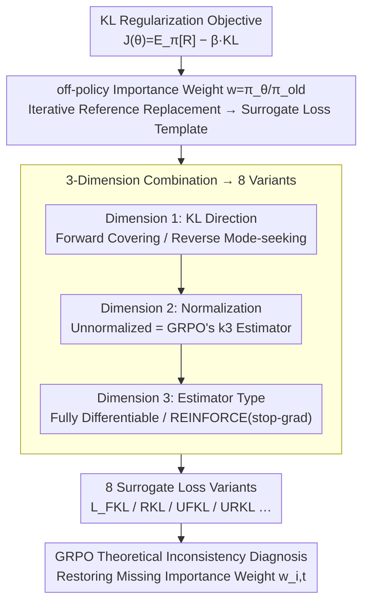

# On the Design of KL-Regularized Policy Gradient Algorithms for LLM Reasoning

**Conference**: ICLR 2026  
**arXiv**: [2505.17508](https://arxiv.org/abs/2505.17508)  
**Code**: [https://github.com/complex-reasoning/RPG](https://github.com/complex-reasoning/RPG)  
**Area**: LLM Reasoning / Reinforcement Learning  
**Keywords**: KL Regularization, Policy Gradient, LLM Reasoning, GRPO, REINFORCE

## TL;DR

Ours proposes the Regularized Policy Gradient (RPG) framework, which systematically derives and analyzes policy gradient methods based on Forward/Reverse KL divergence (in both normalized and unnormalized forms). The study identifies a theoretical inconsistency in the KL term of GRPO and achieves superior results compared to GRPO, REINFORCE++, and DAPO on mathematical reasoning tasks.

## Background & Motivation

Policy gradient methods (e.g., PPO, GRPO) have been widely adopted for RLHF and enhancing the reasoning capabilities of LLMs. KL divergence regularization is a critical technique for stabilizing policy optimization, preventing the policy from deviating too far from the reference policy, thus avoiding catastrophic forgetting and overconfident outputs.

However, existing methods exhibit significant differences in their specific implementation of KL divergence:
- **Selection of KL Direction**: Forward KL (zero-forcing) vs. Reverse KL (mode-seeking), which possess different optimization properties.
- **Normalization**: Standard normalized KL vs. Unnormalized KL (UKL), the latter being related to the $k_3$ estimator implementation in GRPO.
- **Estimator Types**: Fully differentiable forms vs. REINFORCE-style (using the stop-gradient operator).
- **Off-policy Estimation**: In off-policy settings, the handling of importance weights affects the correctness of the gradient.

The authors point out that the KL penalty term in GRPO lacks importance weights during off-policy estimation, leading to a gradient that does not precisely correspond to the gradient of the objective function. The KL processing in REINFORCE++ is also non-standard—its KL term is based on the old policy and the SFT policy, rather than the current policy being optimized.

## Method

### Overall Architecture

RPG aims to resolve the ambiguity among current KL-regularized policy gradient methods (GRPO, REINFORCE++, DAPO...) regarding KL direction, normalization, and estimator choice. RPG places them into a unified derivation template: first, define the KL-regularized objective $J(\theta) = \mathbb{E}_{\pi_\theta}[R] - \beta \cdot \text{KL}$, then transform it into a surrogate loss for direct gradient descent using off-policy importance weights $w(x) = \pi_\theta(x)/\pi_{\text{old}}(x)$. The process is iterative—in each round, the reference model $\pi_{\text{old}}$ is replaced by the policy from the previous round $\pi_{\theta^{(t)}}$, allowing the regularization target to adapt dynamically during training rather than being fixed to a static SFT model. Starting from this unified template, a family of 8 variants is expanded across three dimensions: **KL Direction** (Forward or Reverse), **Normalization** (Normalized or Unnormalized, the latter corresponding to the $k_3$ estimator), and **Estimator Type** (Fully Differentiable or REINFORCE-style). After combining these three dimensions, the framework diagnoses the theoretical inconsistency in GRPO and provides a correction.

### Key Designs

**1. Dimension 1: KL Direction — Forward Covering vs. Reverse Mode-seeking**

The first choice is the KL direction, which determines whether the policy spreads out or tightens. **Forward KL (FKL)** takes $\text{KL}(\pi_{\text{old}} \| \pi_\theta)$, and the objective is $J_{\text{FKL}}(\theta) = \mathbb{E}_{\pi_\theta}[R(x)] - \beta \text{KL}(\pi_{\text{old}} \| \pi_\theta)$. Its gradient can be simplified under $\pi_{\text{old}}$ sampling as $\nabla_\theta J = \mathbb{E}_{x \sim \pi_{\text{old}}}[(w(x)R(x) + \beta) \nabla_\theta \log \pi_\theta(x)]$, corresponding to the surrogate loss $\mathcal{L}_{\text{FKL}} = \mathbb{E}[-w(x)R(x) - \beta \log \pi_\theta(x)]$. It is zero-forcing: it forces $\pi_\theta$ to cover the entire high-probability support of $\pi_{\text{old}}$. An insightful boundary case is when $R=0$, where the loss degrades to pure MLE, which is the SFT training objective—this explains why Forward KL serves a stabilization role similar to SFT during training. Reversing the direction to $\text{KL}(\pi_\theta \| \pi_{\text{old}})$ yields **Reverse KL (RKL)**, with the objective $J_{\text{RKL}}(\theta) = \mathbb{E}_{\pi_\theta}[R(x)] - \beta \text{KL}(\pi_\theta \| \pi_{\text{old}})$ and surrogate loss $\mathcal{L}_{\text{RKL}} = \mathbb{E}[w(x)(-R(x) + \beta \log w(x))]$. It is mode-seeking: it encourages $\pi_\theta$ to contract onto the modes with the highest probability in $\pi_{\text{old}}$, making it more suitable for concentrating probability mass when certain policies are known to be good. Experiments show FKL excels in AMC23 while RKL performs better in AIME25.

**2. Dimension 2: Normalization — Embedding GRPO's $k_3$ Estimator into Unified Derivation**

In real training, the reference distribution is often not strictly normalized. Thus, the second dimension involves using normalized KL or Unnormalized KL (UKL), where the latter includes a mass correction term. The surrogate loss for **Unnormalized Forward KL (UFKL)** is $\mathcal{L}_{\text{UFKL}} = Z_{\text{old}} \mathbb{E}[-w(x)R(x) + \beta(w(x) - \log w(x) - 1)]$. A key observation is that the regularization term $w(x) - \log w(x) - 1$ is exactly the form of the $k_3$ estimator used in GRPO. This step brings the seemingly empirical KL penalty of GRPO into the unified RPG derivation, providing it with a clear theoretical origin. For **Unnormalized Reverse KL (URKL)**, the authors prove that the expectation of $k_3(\pi_{\text{old}}/\pi_\theta)$ is equivalent to $\text{UKL}(\pi_\theta \| \pi_{\text{old}})$, resulting in $\mathcal{L}_{\text{URKL}} = Z_{\text{old}} \mathbb{E}[-w(x)R(x) + \beta(w(x)\log w(x) - w(x))]$. Its appeal lies in the fact that the effective reward scaling factor in the gradient is reduced to a clean $R(x) - \beta \log w(x)$, which is both easy to implement and strictly equivalent to the $k_3$ estimator. In other words, this dimension does more than just add two losses; it provides a theoretical "identity card" for the widely used $k_3$ estimator as being Unnormalized KL.

**3. Dimension 3: Fully Differentiable vs. REINFORCE-style — Trading Stop-gradient for Flexibility**

Each KL form defined by the first two dimensions can be implemented using either a fully differentiable approach or a REINFORCE-style approach. The REINFORCE-style approach freezes the reward weights using the stop-gradient operator $\text{SG}(\cdot)$, written as $\mathcal{L}^{\text{REINFORCE}} = -\mathbb{E}[\text{SG}(\text{Weight}(x, \theta)) \log \pi_\theta(x)]$. Here, the gradient is backpropagated only through the $\log \pi_\theta(x)$ term, aligning the structure with classic REINFORCE. The authors prove that the REINFORCE-style loss with stop-gradient is gradient-equivalent to the corresponding fully differentiable surrogate loss. Therefore, the choice depends on engineering convenience—training frameworks that only support REINFORCE interfaces can use the former directly. In experiments, the two versions showed complementary performance (the former better in AIME24, the latter better in AMC23). The combinations of the three dimensions (Direction × Normalization × Estimator) cover all 8 variants.

**4. Diagnosis of GRPO Theoretical Inconsistency: Restoring Missing Importance Weights**

A practical byproduct of the framework is the diagnosis of a theoretical flaw in GRPO. GRPO uses the $k_3$ estimator as a KL penalty but subtracts this term directly in the off-policy setting without multiplying it by the corresponding importance weight $w_{i,t} = \pi_\theta(o_{i,t})/\pi_{\text{old}}(o_{i,t})$. According to the unified RPG derivation, this term should carry the weight in the correct gradient. By omitting it, the actual gradient of GRPO cannot precisely correspond to its claimed objective $J_{\text{Clip}} - \beta \text{UKL}(\pi_\theta \| \pi_{\text{ref}})$—i.e., the optimization target on paper does not match the implementation. RPG fixes this bias by explicitly including importance weights in the surrogate loss, which is a direct reason for its superior stability and performance in math reasoning over GRPO.

### Loss & Training

During implementation, RPG adopts several stabilization techniques: using a Dual-Clip variant of PPO to clip positive and negative advantages separately to prevent gradient explosion; using batch mean rewards as a baseline to reduce variance; borrowing dynamic sampling from DAPO to oversample difficult prompts and filter uninformative samples (accuracy near 1 or 0); and adding a penalty for excessively long outputs in rewards to suppress verbosity. Engineering-wise, there is a memory benefit—the log probabilities of $\pi_{\text{old}}$ can be pre-computed and stored, so only one model $\pi_\theta$ needs to reside on the GPU during training, making it more memory-efficient than GRPO/REINFORCE++ which require both current and reference policies.

## Key Experimental Results

### Main Results

Based on Qwen2.5-7B-Instruct, using DAPO-Math-17k (13.9k samples for the English portion), trained for 400 steps.

| Method | AMC23 (Best) | AIME24 (Best) | AIME25 (Best) |
|------|-------------|---------------|---------------|
| GRPO | 0.7250 | 0.1406 | 0.0948 |
| REINFORCE++ | 0.7664 | 0.1177 | 0.0740 |
| REINFORCE++-Baseline | 0.8711 | 0.1510 | 0.0969 |
| DAPO | 0.8734 | 0.1240 | 0.1063 |
| **RPG-FKL** | **0.8836** | 0.1490 | 0.1083 |
| **RPG-RKL** | 0.8672 | 0.1469 | **0.1240** |
| **RPG-UFKL** | 0.8703 | 0.1427 | 0.1177 |
| RPG-REINFORCE-FKL | 0.8727 | **0.1667** | 0.0875 |
| RPG-REINFORCE-URKL | 0.8531 | 0.1500 | 0.0938 |

### Ablation Study

| Configuration | Key Findings |
|------|---------|
| Clip (0.1,0.1) vs (0.2,0.28) | RPG-REINFORCE crashes on Qwen-Math-7B with large clip parameters; smaller clip is more stable. |
| AdamW vs Schedule-Free AdamW | Schedule-Free improves stability for high-variance algorithms (GRPO, REINFORCE++). |
| Comparison of KL Types | FKL is optimal for AMC23, RKL is optimal for AIME25; each has advantages. |

### Key Findings

- RPG variants significantly outperform GRPO in training stability (the latter shows greater volatility).
- The connection between Forward KL and MLE suggests its role in stabilizing training is similar to SFT regularization.
- Fully differentiable and REINFORCE-style versions show complementary labels: the former performs better on AMC23, the latter on AIME24.
- Well-pretrained models (Qwen-Math-7B) require tighter clip parameters to encourage exploitation over exploration.
- The Schedule-Free optimizer provides more stable training dynamics through internal parameter averaging.

## Highlights & Insights

- **Systematic Framework**: Unifies KL-regularized policy gradients into a single framework covering Forward/Reverse × Normalized/Unnormalized × Differentiable/REINFORCE-style = 8 variants, aiding research understanding and selection.
- **GRPO Correction**: Identifies the theoretical flaw of missing importance weights in the GRPO KL term and provides a correction, offering significant value for improving existing RLHF methods.
- **Memory Efficiency**: RPG requires only one model on the GPU during training, making it more efficient than GRPO/REINFORCE++ which require both current and reference policies.
- **Theoretical Grounding of $k_3$**: Proves that the $k_3$ estimator is equivalent to Unnormalized KL divergence, providing theoretical support for its widespread use.

## Limitations & Future Work

- Validated only on mathematical reasoning tasks; does not cover code generation or general instruction following.
- Experiments limited to 7B models; performance on larger-scale models remains unverified.
- Optimal selection of KL variants depends on the specific task; clear selection criteria are lacking.
- Dual-Clip modifies the original KL-regularized objective, introducing approximation errors.
- Sensitivity analysis for training hyperparameters (e.g., $\beta$, clip range) is limited; different models may require different configurations.

## Related Work & Insights

- **GRPO** (Shao et al., 2024): Uses group relative advantage estimation and $k_3$ KL penalty, but the KL term lacks importance weights.
- **REINFORCE++** (Hu, 2025): Introduces token-level KL penalty and normalization, but the KL term is based on $\pi_{\text{old}}^{\text{RL}}$ instead of $\pi_\theta$.
- **DAPO** (Yu et al., 2025): Proposes Clip-Higher, oversampling, and token-level loss for stable training.
- **Dr. GRPO** (Liu et al., 2025): Identifies and corrects bias in the GRPO advantage estimator.
- **VAPO** (Yuan et al., 2025): Length-adaptive advantage estimation.
- **DPO/SimPO**: Representative work in direct preference optimization, complementary to policy gradient methods.

**Insight**: This work suggests that when designing RL algorithms, it is necessary to carefully examine the mathematical correctness of KL regularization, especially in off-policy settings. A framework-based approach helps in discovering and correcting theoretical flaws in established methods.

## Rating

- Novelty: ⭐⭐⭐⭐ — The framework itself is a systematic reorganization rather than a brand-new method, but the GRPO correction and theoretical unification are valuable.
- Experimental Thoroughness: ⭐⭐⭐⭐⭐ — 8 variants × 2 optimizers × 2 models, thorough ablations.
- Writing Quality: ⭐⭐⭐⭐ — Mathematical derivations are rigorous and clear, though the numerous variants make it lengthy.
- Value: ⭐⭐⭐⭐ — Provides a critical theoretical reference and practical methodology for the LLM RL community.

<!-- RELATED:START -->

## Related Papers

- [\[ICLR 2026\] Stabilizing Policy Gradients for Sample-Efficient Reinforcement Learning in LLM Reasoning](stabilizing_policy_gradients_for_sample-efficient_reinforcement_learning_in_llm_.md)
- [\[ICLR 2026\] ∇-Reasoner: LLM Reasoning via Test-Time Gradient Descent in Latent Space](nabla-reasoner_llm_reasoning_via_test-time_gradient_descent_in_latent_space.md)
- [\[ICLR 2026\] DESIGNER: Design-Logic-Guided Multidisciplinary Data Synthesis for LLM Reasoning](designer_design-logic-guided_multidisciplinary_data_synthesis_for_llm_reasoning.md)
- [\[ICLR 2026\] Reference-guided Policy Optimization for Molecular Optimization via LLM Reasoning](reference-guided_policy_optimization_for_molecular_optimization_via_llm_reasonin.md)
- [\[ICLR 2026\] Slow-Fast Policy Optimization: Reposition-Before-Update for LLM Reasoning](slow-fast_policy_optimization_reposition-before-update_for_llm_reasoning.md)

<!-- RELATED:END -->
