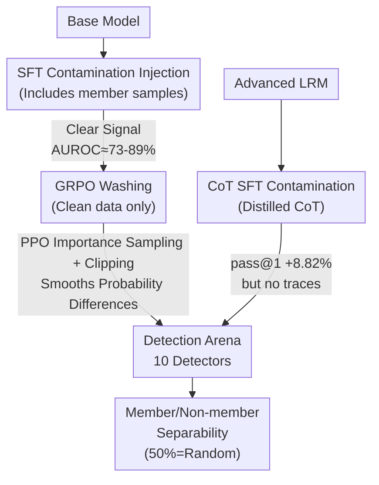

# On The Fragility of Benchmark Contamination Detection in Reasoning Models

**Conference**: ICLR 2026  
**arXiv**: [2510.02386](https://arxiv.org/abs/2510.02386)  
**Code**: [https://github.com/ASTRAL-Group/LRM_Conta_Detection_Arena.git](https://github.com/ASTRAL-Group/LRM_Conta_Detection_Arena.git)  
**Area**: LLM Reasoning  
**Keywords**: Benchmark Contamination, Reasoning Models, GRPO, Detection Fragility, Evaluation Integrity

## TL;DR
Systematic research reveals that benchmark contamination detection in LRMs is extremely fragile: contamination introduced during the SFT stage nearly disappears after GRPO training (PPO-style importance sampling/clipping is the root cause), while directly applying CoT SFT contamination to advanced LRMs leaves almost no detectable traces. All 10 existing detection methods perform close to random guessing in these scenarios.

## Background & Motivation

**Background**: LLM leaderboards have become a competitive stage, incentivizing model developers to mix evaluation benchmarks into training data to achieve artificially high scores. Various contamination detection methods (based on generation, perturbation, reference models, etc.) have been developed.

**Limitations of Prior Work**:
   - Existing detection methods assume contamination equals memorization (higher probabilities for seen samples), but LRMs achieve answers through CoT reasoning; detectors typically lack access to the CoT data used during training.
   - The acquisition of reasoning capabilities in LRMs involves an SFT → RL two-stage process. Developers can contaminate in the early stage (SFT) and "wash" the evidence during the later stage (RL).
   - The detectability of direct CoT SFT contamination on advanced LRMs remains entirely unknown.

**Key Challenge**: Evaluation fairness relies on the detectability of contamination. However, if RL training itself can hide evidence and CoT SFT leaves almost no trace, the integrity of the entire leaderboard system is threatened.

**Key Insight**: Two realistic scenarios are investigated—Stage I: SFT contamination → RL "washing" (base model → LRM); Stage II: Direct CoT SFT contamination on an existing LRM (post-LRM).

**Core Idea**: The importance sampling and clipping objective functions in GRPO/PPO systematically eliminate the separability between members and non-members. RL training serves as a natural "sanitizer" for contamination evidence.

## Method

### Overall Architecture
This paper does not propose a new detector but builds a controlled "Contamination—Washing—Detection" arena to evaluate whether 10 existing detection methods remain reliable on reasoning models (LRMs). The framework covers two realistic scenarios. Stage I simulates a developer starting from a base model, performing Supervised Fine-Tuning (SFT) with data containing contaminated samples, and then running GRPO reinforcement learning with clean data to obtain an LRM, observing how detection signals change before and after RL. Stage II involves directly applying Chain-of-Thought (CoT) SFT contamination to an already powerful LRM to see if detectors can identify traces. Both lines converge on the same evaluation metric: randomly splitting benchmark samples into member/non-member sets and using AUROC to measure the detector's ability to distinguish them (where 50% equals random guessing).

### Key Designs

**1. Stage I: GRPO "Washes" Contamination from the SFT Stage**

This stage addresses whether contamination mixed in early on is quietly erased during subsequent RL training. Experiments first confirm that SFT contamination is initially visible—probability-based methods like Min-K%, Max-K%, and LOSS achieve an AUROC of approximately 73%, while LiRA (which relies on a reference model) reaches 89%. However, after one round of GRPO (using clean data without members), the AUROC of nearly all methods collapses to around 50%. To rule out the explanation that "more training data simply diluted the memory," a control experiment shows that continuing SFT with clean data does not eliminate the detection signal, whereas GRPO does. This points to the optimization objective itself rather than data volume.

**2. PPO-style Importance Sampling and Clipping: Mechanistic Root Cause**

The paper explains the phenomenon through the objective function shared by GRPO and PPO, which multiplies samples by an importance sampling ratio $r(\theta) = \pi_\theta / \pi_{\theta_{\text{old}}}$ and applies clipping. For member samples that were memorized during SFT and already have high probabilities, the clipping mechanism places an upper bound on their gradients, preventing the model from pushing their probabilities higher. Conversely, non-member samples lack this constraint, allowing their probabilities to rise relatively. This simultaneous capping and lifting causes the probability distributions of members and non-members to overlap, erasing the signal of "higher probability for seen samples" that detectors rely on. To confirm this, an ablation study used RAFT (pure rejection sampling without importance sampling/clipping), where the detection signal remained (AUROC ~70%). Once the clipping term was added (RAFT++), the hiding capability appeared (AUROC dropped to ~52%), matching GRPO.

**3. Stage II: CoT SFT on Advanced LRMs is Nearly Trace-free**

Even without RL washing, directly contaminating advanced LRMs is difficult to detect. The authors distilled CoT from a stronger LRM as SFT data to contaminate a target model. Although pass@1 scores increased by an average of 8.82% (proving the contamination was "learned"), the AUROC for all 10 detection methods remained near 50%. The root cause is the failure of the "contamination = memorization" assumption in LRMs: these models already have high confidence for in-distribution samples. Even for samples they have not truly seen, the log-probabilities are not significantly lower than those for seen samples. Per-sample log-prob analysis shows high overlap between member and non-member distributions.

### Loss & Training
Contamination simulation consistently uses CoT distilled from advanced LRMs as SFT data, with half of the samples randomly selected as the member set. GRPO training uses standard settings and is fed only clean data (no members) to ensure the "washing" effect is not caused by the contamination data itself. During evaluation, 8 responses are sampled per question to calculate an average detection score, and AUROC is used to distinguish members from non-members across two models (Qwen2.5-7B, Llama-3.1-8B).

## Key Experimental Results

### Stage I: AUROC Changes Before/After GRPO (Qwen2.5-7B-Instruct)

| Detection Method | Post-SFT AUROC↑ | Post-SFT+GRPO AUROC↑ | Change |
|---------|-------------|-------------------|------|
| Min-K% | ~73% | ~52% | -21% |
| Max-K% | ~72% | ~51% | -21% |
| LOSS | ~75% | ~53% | -22% |
| LiRA (Ref-based) | ~89% | ~55% | -34% |
| Generative | ~60% | ~50% | -10% |

### Stage II: LRM CoT SFT Contamination Detection

| Detection Method | AUROC↑ |
|---------|--------|
| All 10 Methods | **~50%** (≈ Random Guessing) |
| Pass@1 Gain from Contamination | **+8.82%** Average |

### Ablation: Pure RL vs. RL + Clipping

| RL Variant | Contamination Detection AUROC |
|---------|-------------|
| RAFT (Pure Rejection Sampling) | ~70% (Still Detectable) |
| RAFT++ (+ Importance Sampling Clipping) | ~52% (Hidden) |
| GRPO | ~52% (Hidden) |

### Key Findings
- **SFT Contamination + GRPO Washing = Perfect Crime**: Developers can mix benchmark data during SFT to gain a +8.82% boost, then use GRPO with clean data to erase all detection traces.
- **PPO Clipping is the Mechanistic Root Cause**: It is the mathematical structure of the optimization objective, rather than "more training data," that leads to hiding—RAFT does not hide, but RAFT++ does.
- **CoT SFT is Nearly Immune to Detection in Advanced LRMs**: Even without RL "washing," CoT SFT itself leaves almost no traces.
- **"Contamination = Memorization" Assumption Fails**: LRMs show high confidence even for unseen in-distribution samples, causing all probability-based detection methods to fail.
- **Consistency Across Models**: Both Qwen2.5-7B and Llama-3.1-8B exhibit the same vulnerabilities.

## Highlights & Insights
- **First to reveal the contamination hiding mechanism at the algorithmic level**: It is not data processing or training duration, but the clipping objective function of PPO/GRPO itself that converges to a distribution where members and non-members are inseparable.
- **Serious warning for the LRM leaderboard system**: If developers can easily contaminate models and evade all detection, benchmark-based evaluation systems require fundamental reform.
- **RAFT vs. RAFT++ ablation**: A textbook example of causal inference experimental design, precisely isolating the root cause through minimal modifications.

## Limitations & Future Work
- Only tested on 7B/8B scale models—larger models (70B+) might behave differently.
- Contaminated samples used distilled CoT from advanced LRMs—simpler CoT (e.g., human-written) might have different effects.
- New detection methods based on model behavior (rather than probability) were not explored—such as analyzing structural features of reasoning paths.
- Theoretical analysis uses simplified assumptions—actual GRPO dynamics are more complex.
- Feasibility of countermeasures—whether detection methods immune to PPO clipping can be designed.

## Related Work & Insights
- **vs. Traditional Contamination Detection (Shi, Mattern, Dong, etc.)**: These methods are effective on standard LLMs but fail entirely on LRMs.
- **vs. Dekoninck/Samuel (Evasion via Data Augmentation)**: They evade detection by rewriting data; this paper finds RL training itself is a natural "evader," which is more dangerous as it requires no extra effort.
- **vs. Bordt (Training Dynamics Perspective)**: They study the natural decay of contamination effects during pre-training; this paper finds that RL fine-tuning actively accelerates this decay.

## Rating
- Novelty: ⭐⭐⭐⭐⭐ First to reveal the algorithmic mechanism of RL training hiding contamination, a critical issue.
- Experimental Thoroughness: ⭐⭐⭐⭐⭐ 10 detection methods × 6 benchmarks × 2 models × ablation/theoretical analysis.
- Writing Quality: ⭐⭐⭐⭐⭐ Clear two-stage analysis framework, elegant RAFT vs. RAFT++ ablation design.
- Value: ⭐⭐⭐⭐⭐ Highlights an existential threat to the LRM evaluation ecosystem that warrants community attention.

<!-- RELATED:START -->

## Related Papers

- [\[ICLR 2026\] Neural Theorem Proving for Verification Conditions: A Real-World Benchmark](neural_theorem_proving_for_verification_conditions_a_real-world_benchmark.md)
- [\[ICLR 2026\] Conditional Advantage Estimation for Reinforcement Learning in Large Reasoning Models](conditional_advantage_estimation_for_reinforcement_learning_in_large_reasoning_m.md)
- [\[AAAI 2026\] From Classification to Ranking: Enhancing LLM Reasoning for MBTI Personality Detection](../../AAAI2026/llm_reasoning/from_classification_to_ranking_enhancing_llm_reasoning_capabilities_for_mbti_per.md)
- [\[ICLR 2026\] Tina: Tiny Reasoning Models via LoRA](tina_tiny_reasoning_models_via_lora.md)
- [\[ICLR 2026\] FATE: A Formal Benchmark Series for Frontier Algebra of Multiple Difficulty Levels](fate_a_formal_benchmark_series_for_frontier_algebra_of_multiple_difficulty_level.md)

<!-- RELATED:END -->
