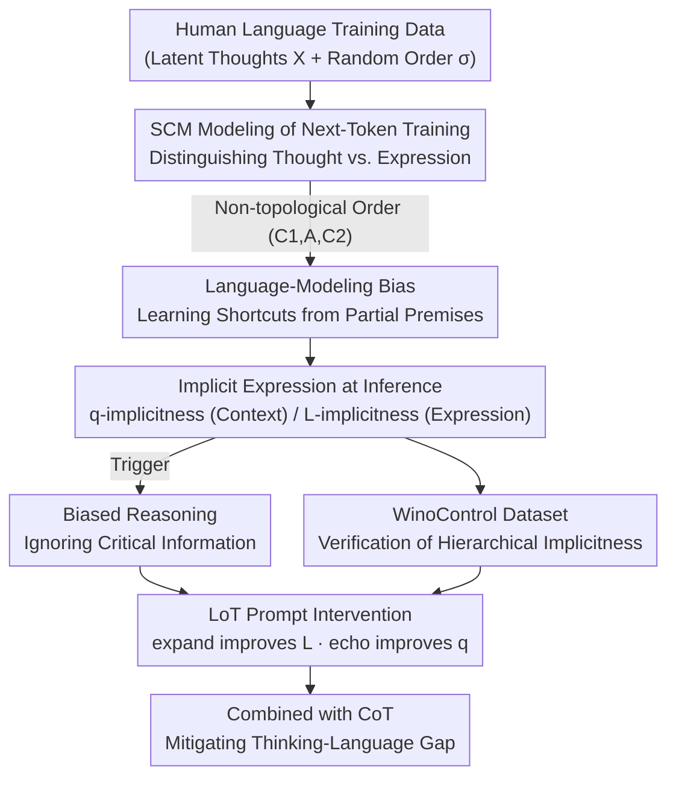

# On the Thinking-Language Modeling Gap in Large Language Models

**Conference**: ICLR 2026  
**OpenReview**: [https://openreview.net/forum?id=lSWIzMX2Ie](https://openreview.net/forum?id=lSWIzMX2Ie)  
**Code**: https://causalcoat.github.io/lot  
**Area**: LLM Reasoning  
**Keywords**: Structural Causal Model, Implicit Expression, Language-of-Thought Gap, Prompt Intervention, Reasoning Bias

## TL;DR
This paper uses a Structural Causal Model (SCM) to characterize the process of "LLMs learning to think from human language," pointing out that language is merely a vehicle for knowledge rather than thought itself. Consequently, expression habits in training data inject biases into models—LLMs ignore critical information when it appears as "implicit expressions." A prompt-level intervention called LoT (observe / expand / echo) is proposed to mitigate this bias across 11 tasks and 4 representative LLMs.

## Background & Motivation
**Background**: By performing next-token prediction on massive amounts of human-written natural language, LLMs have learned to mimic human thought processes. Combined with prompting strategies like CoT, they can even outperform humans in complex tasks such as mathematical reasoning. The mainstream narrative suggests that "language modeling = learning to think."

**Limitations of Prior Work**: Even the strongest LLMs fail on tasks that are trivial for humans—ignoring key information in prompts, failing to handle "reverse expressions" (e.g., learning "A is B" but failing to answer "B is A," known as the Reversal Curse), or failing to identify simple logic in context (e.g., Alice has N brothers and M sisters; when asked how many sisters Alice's brother has, answering M instead of M+1). These failures have been viewed as isolated incidents lacking a unified explanation.

**Key Challenge**: The root cause is that language and thought are not the same. Cognitive science (e.g., Fedorenko et al.) indicates that language is primarily a tool for **communicating knowledge** rather than a tool for thinking; linguistic expression and underlying thought reside in different brain regions. The "Language of Thought Hypothesis" (LOTH) also posits that true thinking operates on a mental language. Thus, a single thought can have multiple linguistic expressions, and humans have preferences for specific sentence patterns and word orders. When LLMs learn to think directly from written language, they internalize these **expression biases** as the structure of thought.

**Goal**: To answer "how the mode of expression in written language affects the reasoning process of LLMs" and provide a practical mitigation method based on these findings.

**Key Insight**: Modeling "thought" as a latent variable and "language" as its tokenized expression. By explicitly distinguishing the two using a Structural Causal Model (SCM), it becomes possible to theoretically derive when and how expression bias is learned by the model and how it is triggered during inference.

**Core Idea**: Formalize next-token training using SCM to prove that "non-topological linguistic expressions" lead models to learn shortcuts by attending only to partial premises (language-modeling bias). Define "implicit expression" and provide a lower-bound theorem for the thinking-language gap. Finally, use a prompt to encourage the model to actively expand and echo all information to offset this gap.

## Method

### Overall Architecture
The methodology consists of two layers: a **theoretical layer** using SCM to explain the origins of bias, and a **practical layer** involving the design of controlled datasets and prompt interventions. Theoretically, the authors view sentence generation as "first sampling latent variables (thoughts) $X$, then writing each variable as tokens (language) according to a random order $\sigma$." When the writing order does not match the topological order of the causal graph (e.g., conclusion A appears before its cause), the next-token objective forces the model to predict $A$ using only the already-present premises, thereby learning a "shortcut" distribution during training. During inference, if premises are given in "uncommon expression forms" (implicit expressions), the model fails to utilize them effectively, triggering the same shortcut reasoning. Implicitness is further categorized into q-implicitness (unfavorable context) and L-implicitness (unfavorable expression). Correspondingly, the mitigation prompt includes two components: *echo* to improve context $q$, and *expand* to improve expression $L$, combined as LoT.

### Key Designs

**1. Characterizing Next-Token Training and Language-Modeling Bias with SCM**

To address whether LLMs learn thoughts or expressions, the authors set thoughts as a set of latent variables $X=(X_1,\dots,X_d)$ following a causal graph $G=(X,E)$, where each $X_i:=f_i(\mathrm{Pa}(X_i),N_i)$. After $X$ takes value $x$, a permutation $\sigma$ is sampled, and each $X_k=x_k$ is written as a token from set $L_{X_k=x_k}$ to form an observed sequence $l$. Language is thus a tokenized projection of thought with random ordering. In a minimal two-premise case ($X=(C_1,C_2,A)$ with $C_1\to A\leftarrow C_2$), the authors prove (Proposition 2.3): when the word order is anti-topological $(C_1,A,C_2)$—where conclusion $A$ precedes cause $C_2$—the next-token objective causes the model to treat $A$ as determined only by $C_1$. It fits a distribution that marginalizes out $C_2$:

$$\Pr(L_A\mid L_1)=\sum_{C_1,C_2,A}\Pr(C_1\mid L_1)\Pr(C_2)\Pr(A\mid C_1,C_2)\Pr(L_A\mid A,L_1).$$

This implies that bias is not a lack of "reasoning ability" but a shortcut learned during training due to word order. This unifies failures like the "Reversal Curse" and "premise order sensitivity" into a single language-modeling bias.

**2. Implicit Expression and the Thinking-Language Gap Lower Bound Theorem**

While Proposition 2.3 addresses training, the paper aims to explain why models ignore information present in the prompt. The authors define **implicit expression**: if an expression form is rare in training, the model struggles to use it. The model's understanding of premises is decomposed as $\Psi(c_1^\*,\dots,c_k^\*\mid L_1,\dots,L_k)=\prod_i\Psi(c_i\mid q_i,L_i)$, identifying two types of implicitness: if a better alternative expression $L_i'$ increases conditional probability, $c_i^\*$ is **L-implicit**; if a better context $q_i'$ increases it, it is **q-implicit**. Theorem 2.4 provides a lower bound for the KL divergence between the predicted distribution and the ground truth:

$$D_{\mathrm{KL}}\ge\Big(\tfrac{1-\Psi(C=c^\*\mid L=l)}{2}\Big)^2\cdot V^2\big(\Pr(A\mid C=c^\*),\,\Psi(A\mid L=l,C\ne c^\*)\big),$$

where $V(p,q)=\sum_x|p(x)-q(x)|$ is the total variation distance. The variation distance measures the "cost of total misunderstanding," while $(1-\Psi(C=c^\*\mid L=l))$ measures "how poorly the task is understood." This bound suggests: **even if the next-token predictor perfectly learns the relationship between latent variables ($\Psi(A\mid C)=\Pr(A\mid C)$), reasoning will still be biased if the expression is implicit.** This theoretically decouples "understanding" from "reasoning."

**3. WinoControl: Dataset for Controlled Implicitness**

Since $\Psi(c_1^\*,c_2^\*\mid L_1,L_2)$ involves latent variables and cannot be measured directly, the authors constructed WinoControl based on WinoBias, using three levels of qualitative implicitness. For L-implicitness, clarity is scaled from 0 (easy, with a clarifying hint) to 2 (hard, original WinoBias sentence). For q-implicitness, noise is scaled from 0 (no insertion) to 2 (multiple distracting sentences with different pronouns). By evaluating on a 3×3 grid, accuracy is observed to drop as implicitness in either dimension increases, directly aligning with Theorem 2.4.

**4. LoT: Observe, Expand, and Echo Prompt Intervention**

Since Theorem 2.4 shows bias stems from a large $(1-\Psi)$ term, mitigation should focus on reducing this term rather than improving reasoning itself. The authors designed **LoT (Language-of-Thoughts)**: "Please **observe**, **expand**, and **echo** all the relevant information based on the question." **Expand** leverages instruction following to generate more useful expressions from $L_{C_i=c_i^\*}$, targeting L-implicitness. **Echo** makes the model repeat key information during reasoning, refreshing surrounding context to target q-implicitness. A variant, LoT′, uses only expand and echo. Since LoT focuses on "understanding information" rather than "calculation" (the latter depending on $\Psi(A\mid c)$), it is designed to be **combined with** reasoning methods like CoT. Ablations show *expand* is more effective for L-implicitness, while *echo* excels in q-implicit scenarios.

### Full Example
Consider the pronoun resolution sentence: "The manager promoted the housekeeper because she appreciated the dedication" (Who does "she" refer to?). At q-implicitness 0 and L-implicitness 0, CoT accuracy is ~76.3%. When both dimensions are set to 2 (no hints, multiple distractor sentences), CoT accuracy drops to ~48.5%—purely because the information became "implicit," even though the model's reasoning capability remained constant. Adding *echo* shows the largest gain (+11.4%) in the high q-implicitness region, while *expand* is more effective (+7.8%) in high L-implicitness regions. The gain distributions match their theoretical targets.

## Key Experimental Results

### Main Results
Evaluated on 4 LLMs (DeepSeek-V3 / GPT-4o-mini / Qwen2-72B / Llama-3.1-70B) across multiple benchmarks against Direct, CoT, RaR, RaR+CoT, and LtM baselines (greedy decoding).

| Benchmark | Metric | Key Comparison | Result |
|-----------|--------|----------------|--------|
| WinoBias | Con / Delta | CoT vs LoT | LoT is best/second best for most; on DeepSeek, Delta dropped from 10.6 (CoT) to 5.8 |
| Alice (Math Common Sense) | Acc | CoT vs LoT | +8% on GPT-4o-mini, +43.5% on Qwen2-72B vs CoT |
| BBQ (Social Bias) | Acc | 5 Baselines vs LoT | LoT outperformed all baselines in 11/12 (model × bias type) settings |
| HotpotQA (Multi-hop) | macro-F1 | CoT vs LoT variants | Improv. in 9/12 settings; most consistent improv. under ToT setting |

### Ablation Study

| Configuration | Function | Phenomenon |
|---------------|----------|------------|
| LoT (observe+expand+echo) | Full Intervention | Overall best or second best when combined with CoT |
| LoT′ (expand+echo) | Removed observe | Slightly worse than LoT but still outperformed all baselines |
| Expand only | Improves L-implicitness | Significantly better for Alice and WinoBias (implicit facts) |
| Echo only | Improves q-implicitness | Significantly outperformed Expand and CoT on BBQ (strong q-implicitness) |

### Key Findings
- Consistency between implicitness and performance: Increasing either q or L dimension (fixing the other) leads to performance degradation, matching Theorem 2.4.
- Gains are **not** merely from token budget: Performance of echo/expand showed no significant correlation with token cost (Pearson r = −0.132 and 0.063), and *echo* was often more accurate than CoT with fewer tokens.
- Distinct roles for interventions: On BBQ (strong q-implicitness), *echo* leads significantly while *expand* can introduce noise; on Alice (strong L-implicitness), *expand* is superior—confirming the q/L dichotomy.
- LLM-as-a-judge confirms LoT induces "echo/expand" behaviors. Specifically, *echo* is necessary for *expand* to work: without *echo*, the "success rate of expansion" negatively correlates with correctness; with *echo*, it becomes positive.
- Model-specific failure modes: On Llama-3.1-70B, *expand* performed worse than CoT on WinoBias/Alice, suggesting that intervention efficacy depends on the model's inherent instruction-following capabilities.

## Highlights & Insights
- A single minimal SCM with random word order provides an elegant, unified explanation for disparate failures like the Reversal Curse, premise order sensitivity, and context distraction.
- Decoupling "understanding" from "reasoning" in Theorem 2.4: Even if latent relationships are learned, implicit expressions degrade performance. This suggests many LLM failures are due to "not understanding the prompt" rather than "logic failure," offering a valuable diagnostic tool.
- The q-implicitness/L-implicitness dichotomy is theoretically defined, validated via controlled datasets, and addressed by specific interventions (echo for $q$, expand for $L$), creating a self-consistent "theory-data-method" loop.
- Extremely low intervention cost (one prompt) that is orthogonal to and combinable with any reasoning protocol. Gains are independent of token cost, making it highly portable for CoT/ToT/Self-Consistency pipelines.

## Limitations & Future Work
- Theoretical derivations rely on simplifying assumptions (e.g., perfect knowledge $\Psi(A\mid C)=\Pr(A\mid C)$, Markov property). The validity of bounds when these assumptions are violated is only qualitatively discussed in the appendix.
- Efficacy is model-sensitive: On weaker models (e.g., Llama-3.1-70B), *expand* may hurt performance, indicating that the method requires a baseline level of instruction following.
- Implicitness scales are qualitative; quantitative measurement of $\Psi(c^\*\mid L)$ remains difficult. The gain in ReAct + External API settings is less stable, requiring further study of retrieval/tool-use scenarios.
- Evaluation is concentrated on QA, disambiguation, social bias, and a single math benchmark; generalization to long-chain mathematical proofs or code reasoning remains to be verified.

## Related Work & Insights
- **Compared to existing LLM reasoning failure studies**: While prior work empirically reports specific failures (e.g., order sensitivity), this paper provides a unified SCM that explains them all as elevations of the $(1-\Psi)$ term—moving from "observing phenomena" to "formalizing mechanisms."
- **Compared to RaR (Rephrase-and-Respond)**: RaR also rewrites questions but lacks a causal explanation of its success. This paper explains why rephrasing helps (improves L) or hurts (introduces context noise, hurts q) and differentiates interventions accordingly.
- **Compared to CoT/LtM**: These methods improve "reasoning ability," whereas LoT improves "information comprehension." They are orthogonal, and the best results come from combining them—suggesting an engineering path of "ensuring understanding before triggering reasoning."

## Rating
- Novelty: ⭐⭐⭐⭐⭐ Unique perspective using SCM to formalize the language-thought gap and unify multiple failure cases.
- Experimental Thoroughness: ⭐⭐⭐⭐ Covers 4 models and 11 tasks with multi-angle ablation, though benchmark types could be broader.
- Writing Quality: ⭐⭐⭐⭐ Clear connection between theory and practice; theorems and controlled datasets are well-integrated, though notation is dense.
- Value: ⭐⭐⭐⭐⭐ Provides both strong theoretical insight and a zero-cost, combinable intervention for diagnosing and mitigating reasoning bias.

<!-- RELATED:START -->

## Related Papers

- [\[ICLR 2026\] TSLM: Tree-Structured Language Modeling for Divergent Thinking](tslm_tree-structured_language_modeling_for_divergent_thinking.md)
- [\[ICLR 2026\] Adaptive Thinking: Large Language Models Know When to Think in Latent Space](adaptive_thinking_large_language_models_know_when_to_think_in_latent_space.md)
- [\[ICML 2026\] Modeling Hierarchical Thinking in Large Reasoning Models](../../ICML2026/llm_reasoning/modeling_hierarchical_thinking_in_large_reasoning_models.md)
- [\[ICLR 2026\] Enhancing Language Model Reasoning with Structured Multi-Level Modeling](enhancing_language_model_reasoning_with_structured_multi-level_modeling.md)
- [\[ICLR 2026\] Variation in Verification: Understanding Verification Dynamics in Large Language Models](variation_in_verification_understanding_verification_dynamics_in_large_language_.md)

<!-- RELATED:END -->
