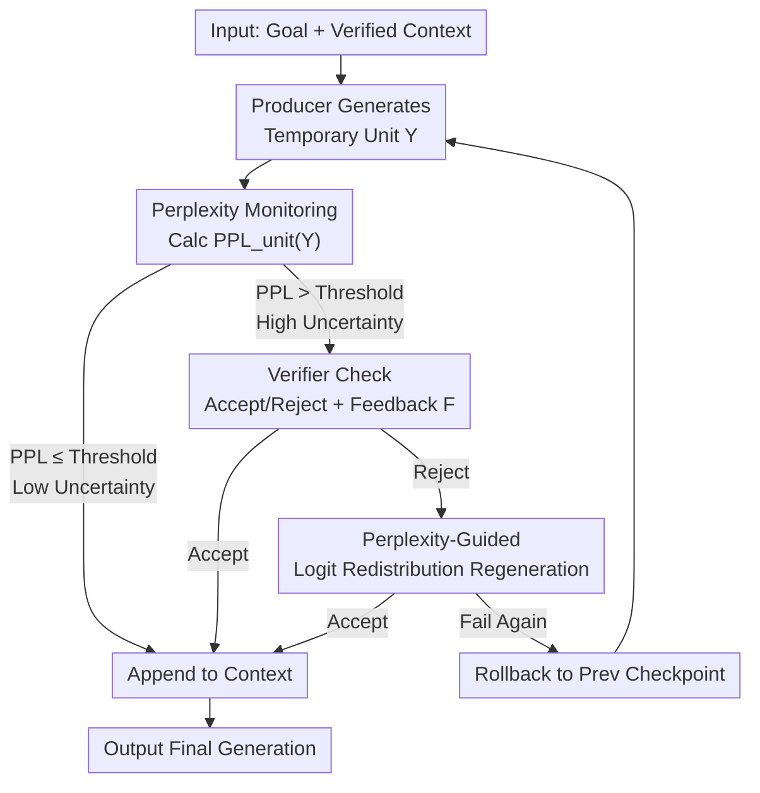

# Once-More: Continuous Self-Correction for Large Language Models via Perplexity-Guided Intervention

**Conference**: ICLR 2026  
**OpenReview**: [https://openreview.net/forum?id=3CKdjb5SuH](https://openreview.net/forum?id=3CKdjb5SuH)  
**Code**: To be open-sourced (GitHub promised after publication)  
**Area**: LLM Reasoning  
**Keywords**: Self-correction, Perplexity, Logit intervention, Inference-time guidance, Multi-agent

## TL;DR
Once-More is a training-free, model-agnostic inference-time self-correction framework. It calculates real-time perplexity by "units" (sentences/formulas/code blocks) during generation, triggering Verifier checks for high-uncertainty units. Rejected units are regenerated using "feedback + perplexity-guided logit redistribution," correcting the generation trajectory before errors propagate. It outperforms representative self-correction methods like Self-Refine and CRITIC on multiple reasoning benchmarks including AIME, GPQA, and LiveBench.

## Background & Motivation

**Background**: The autoregressive generation of LLMs suffers from a "snowball effect"—an early error in a single token propagates through subsequent tokens, eventually leading to collapsed logic, repetition, or incorrect reasoning paths. To mitigate this, self-correction has become a popular direction, currently following two main routes: one is "burning" correction behavior into the model via Supervised Fine-Tuning (e.g., S3c-MATH), and the other is iterative refinement at inference time (e.g., Self-Refine, CRITIC).

**Limitations of Prior Work**: The supervised fine-tuning route requires specialized data collection and is limited by the training distribution, often failing or still suffering from error cascading on out-of-distribution tasks. Iterative refinement routes, while generalizable, typically provide feedback on **complete drafts or coarse-grained steps**. They wait for the model to finish a long segment before intervening, by which time errors have already propagated. Furthermore, relying solely on prompt-based output feedback is often "too coarse"; the model may acknowledge the error but revert to the same path during sampling due to strong priors, leading to non-convergent refinement loops.

**Key Challenge**: Effective correction should be **continuous, fine-grained, and synchronized with generation**, allowing incremental "correctness" to accumulate into a better final result. However, existing methods either correct post-hoc (granularity too coarse, intervention too late) or solidify correction capabilities into parameters (sacrificing generality). Neither the "when to intervene" nor "how to make feedback truly change the trajectory" problems have been well-addressed.

**Goal**: To achieve (1) mid-generation detection of potential errors and (2) effective trajectory change upon intervention, without training or restricting model architecture.

**Key Insight**: The authors observed a key empirical phenomenon—**the perplexity (PPL) of erroneous units is systematically higher than that of correct units** (validated in paper Figure 3 across AIME24/GPQA/LiveBench). Perplexity is a free, token-level uncertainty signal, making it a natural trigger for "when to check."

**Core Idea**: Transform the generation process into a Producer–Verifier multi-agent interaction. **Use perplexity as a sentry to decide when to trigger verification, and use perplexity-guided logit redistribution to force the model to explore tokens outside its previous path**, achieving continuous "generation-time correction."

## Method

### Overall Architecture

Once-More transforms standard LLM generation into a continuous "generation-monitoring-correction" loop consisting of three core components: **Producer** (a frozen pre-trained LLM generating content incrementally by units, requiring access to token probabilities), **Verifier(s)** (one or multiple evaluators providing a binary "accept/reject" judgment + optional natural language feedback $F$, which can be LLMs, programs, or tool-augmented modules), and **Generation Units** (adaptive granularity—formulas/derivation steps in math, functions/blocks in code, sentences/paragraphs in prose, split by syntax markers like punctuation or indentation).

The process is a loop: The Producer generates a temporary unit $Y=[y_1,\dots,y_n]$ conditioned on (Goal, Context) $\rightarrow$ Calculate unit perplexity $\text{PPL}_{\text{unit}}(Y)$ $\rightarrow$ If below threshold $P_{th}$ (low uncertainty), trust and append to Context; if above threshold (high uncertainty), invoke Verifier for explicit check $\rightarrow$ If accepted, append to Context and create a checkpoint; if rejected, trigger "Guided Regeneration" (combining feedback + logit adjustment) $\rightarrow$ If regeneration fails again, roll back to the previous checkpoint and restart from there (as the error may have been buried earlier). This hierarchical design of "perplexity filtering first, Verifier judging second, logit forcing third" ensures expensive verification is only spent on truly suspicious units.

### Key Designs

**1. Unit-level Perplexity Monitoring: Using free uncertainty signals to decide when to check**

Existing methods lack reliable signals for "when to intervene," either verifying every token (too expensive) or waiting for the full text (too late). Once-More utilizes perplexity as a real-time quality sentry. At position $t$, the Producer outputs distribution $q_t(v)$. To avoid traversing the full vocabulary, token-level perplexity is approximated using the top-$K$ most likely tokens:

$$\text{PPL}_t^{(K)} = \exp\!\left(\frac{1}{K}\sum_{i=1}^{K}\big(-\log q_t(v_{t,i})\big)\right)$$

When one token dominates, $\text{PPL}_t^{(K)}\approx 1$; higher dispersion leads to higher values. The unit-level signal $\text{PPL}_{\text{unit}}(Y)=\frac{1}{n}\sum_{t=1}^{n}\text{PPL}_t^{(K)}$ triggers verification when it exceeds threshold $P_{th}$. $P_{th}$ is calibrated on a small validation set such that verification only targets the most uncertain units (e.g., top 25%). This is effective because empirical evidence confirms "erroneous units have higher perplexity"—PPL naturally focuses verification compute on truly suspicious steps.

**2. Producer–Verifier Multi-agent Loop: Fine-grained feedback with accept/reject + checkpoint rollback**

To address the failure of coarse-grained feedback, Once-More splits generation into adaptive units, letting the Verifier judge each temporary unit immediately. Finer granularity makes feedback easier for the Verifier to provide (judging one formula is easier than a whole paper) and allows for timely intervention. Accepted units create checkpoints; rejected ones trigger guided regeneration. If regeneration consistently fails, the framework rolls back to the previous checkpoint—acknowledging that "the error may have originated earlier."

**3. Perplexity-Guided Logit Redistribution: Forcing the model to actually change paths**

Addressing the issue where models accept feedback but sample the same tokens due to strong priors, Once-More **directly modifies the probability distribution** during regeneration. Token PPL from the rejected unit is normalized into suppression intensity $\hat{u}_i^{(1)}=\frac{\text{PPL}_i-\min(\text{PPL})}{\max(\text{PPL})-\min(\text{PPL})+\varepsilon}\in[0,1]$. A monotonic alignment matrix $A$ transfers these weights to new positions during regeneration, combined with distance decay $\hat{u}_j^{\rightarrow}=A_{ij}\cdot\exp\!\big(-(|i-j|/\tau)^{\gamma}\big)\cdot\hat{u}_i^{(1)}$ and Gaussian smoothing to prevent localized overfitting, resulting in effective suppression $\alpha_j=\alpha\cdot u_j^{\star}$.

Probability redistribution follows: suppress target tokens and boost others,

$$s_j(v)=\begin{cases}1-\alpha_j\,r_j(v), & v=\text{target}_j\ (\text{Suppression})\\ 1+\kappa_j\,r_j(v)^{\beta}, & v\neq\text{target}_j\ (\text{Boost})\end{cases}$$

where $r_j(v)=q_j^{(2)}(v)/\max(\varepsilon,\bar{q}_j^{(1)}(v))$ measures the change in belief between attempts. The coefficient $\kappa_j$ ensures the total probability mass remains constant. This mechanism combines semantic guidance (feedback) with logit intervention (forced exploration).

## Key Experimental Results

### Main Results

Base models: Qwen3 (4B/8B/14B, non-thinking). Baselines: Raw, Self-Refine, CRITIC, S3c-MATH.

| Model | Benchmark | Raw | Self-Refine | CRITIC | Once-More |
|------|-----------|-----|-------------|--------|-----------|
| Qwen3-14B | AIME24 | 26.7 | 28.8 | 28.8 | **36.7** |
| Qwen3-14B | AIME25 | 18.8 | 23.3 | 22.2 | **26.7** |
| Qwen3-14B | LiveBench(Reason.) | 44.0 | 46.5 | 45.5 | **52.5** |
| Qwen3-14B | GPQA Diamond | 48.0 | 49.2 | 50.5 | **55.6** |
| Qwen3-8B | AIME24 | 24.4 | 25.6 | 24.4 | **33.3** |
| Qwen3-4B | LiveBench(Reason.) | 20.3 | 21.0 | 20.7 | **33.0** |

Once-More improves over Raw by 3.4~10 points in math reasoning, while baseline gains are limited to 2.1~4.5 points. On LiveBench, Once-More gains 9.0~12.7 points compared to <1 point for baselines. Compared to SFT methods (Table 2), Once-More reaches the best results in the Llama3-8B and Qwen2-Math-7B families on SVAMP without training.

### Ablation Study

| Config (Qwen3-14B) | AIME24 | GPQA | Description |
|------|--------|------|------|
| Raw | 26.7 | 48.0 | No correction |
| w/o Redistribution | 33.3 | 51.5 | Feedback only |
| w/o Feedback | 30.3 | 48.4 | Redistribution only |
| Full Once-More | **36.7** | **55.6** | Both included |

| Unit Length (Sentences) | AIME24 | LiveBench | GPQA-D |
|------|--------|-----------|--------|
| 1 | 36.6 | 52.3 | 55.6 |
| 4 | 35.5 | 52.3 | 56.1 |
| 32 | 30.0 | 49.8 | 49.7 |
| 128 | 26.7 | 45.3 | 50.0 |

### Key Findings

- **Synergy of Feedback and Redistribution**: In AIME24, the effects are additive; in GPQA, they are "super-additive." Feedback provides semantic direction, while redistribution forces exploration to ensure the direction is followed.
- **Fine-grained Granularity is Critical**: Performance is stable when unit length is $\leq 4$ sentences, but drops significantly at $\geq 32$ sentences, reverting to Raw levels at 128 sentences.
- **Scaling with Model Size**: Relative gains on AIME24 increase from 25.6% (4B) to 37.4% (14B), unlike post-hoc methods where gains often diminish.
- **Revitalizing Small Models**: Self-Refine shows zero gain on 4B models, while Once-More provides significant boosts even when feedback quality is low.
- **Token Efficiency**: Despite regeneration loops, Once-More uses 17~21% fewer tokens than Self-Refine on AIME due to its targeted intervention.

## Highlights & Insights

- **Perplexity as Sentry and Steering Wheel**: PPL determines when to verify (efficiency) and acts as the weight for logit suppression (guidance).
- **Direct Probability Manipulation**: Unlike methods that only modify prompts, Once-More's logit redistribution forces the model out of its local minima.
- **Checkpoint & Rollback**: Acknowledging that errors might be rooted in past context, the rollback mechanism prevents infinite loops on currently unfixable units.
- **Adaptive Unit Granularity**: Tailoring intervention granularity to the task (math steps vs. code blocks) is a key hyperparameter for success.

## Limitations & Future Work

- **Deeply Buried Errors**: The framework struggles to trace errors hidden far back in the generation history.
- **False Negatives**: Assertive but incorrect units (low PPL) can bypass the sentry.
- **Verifier Quality**: Performance is capped by the Verifier's ability to identify errors accurately.
- **Future Directions**: Exploring adaptive thresholds and dynamic rollback strategies.

## Related Work & Insights

- **vs. Iterative Refinement (Self-Refine / CRITIC)**: These act post-hoc on coarse drafts. Once-More intervenes earlier and "harder" (via logits).
- **vs. SFT Self-Correction (S3c-MATH)**: Once-More is training-free and model-agnostic, yet matches or exceeds SFT performance on several benchmarks.
- **vs. Decoding-time Guidance (DoLa / Contrastive Decoding)**: Once-More combines local logit manipulation with external semantic feedback.

## Rating
- Novelty: ⭐⭐⭐⭐⭐ 
- Experimental Thoroughness: ⭐⭐⭐⭐ 
- Writing Quality: ⭐⭐⭐⭐⭐ 
- Value: ⭐⭐⭐⭐⭐ 

<!-- RELATED:START -->

## Related Papers

- [\[ICLR 2026\] Towards Safe Reasoning in Large Reasoning Models via Corrective Intervention](towards_safe_reasoning_in_large_reasoning_models_via_corrective_intervention.md)
- [\[ICLR 2026\] Inpainting-Guided Policy Optimization for Diffusion Large Language Models](inpainting-guided_policy_optimization_for_diffusion_large_language_models.md)
- [\[ICLR 2026\] Co-rewarding: Stable Self-supervised RL for Eliciting Reasoning in Large Language Models](co-rewarding_stable_self-supervised_rl_for_eliciting_reasoning_in_large_language.md)
- [\[ICLR 2026\] RFEval: Benchmarking Reasoning Faithfulness under Counterfactual Reasoning Intervention in Large Reasoning Models](rfeval_benchmarking_reasoning_faithfulness_under_counterfactual_reasoning_interv.md)
- [\[ICLR 2026\] On the Thinking-Language Modeling Gap in Large Language Models](on_the_thinking-language_modeling_gap_in_large_language_models.md)

<!-- RELATED:END -->
