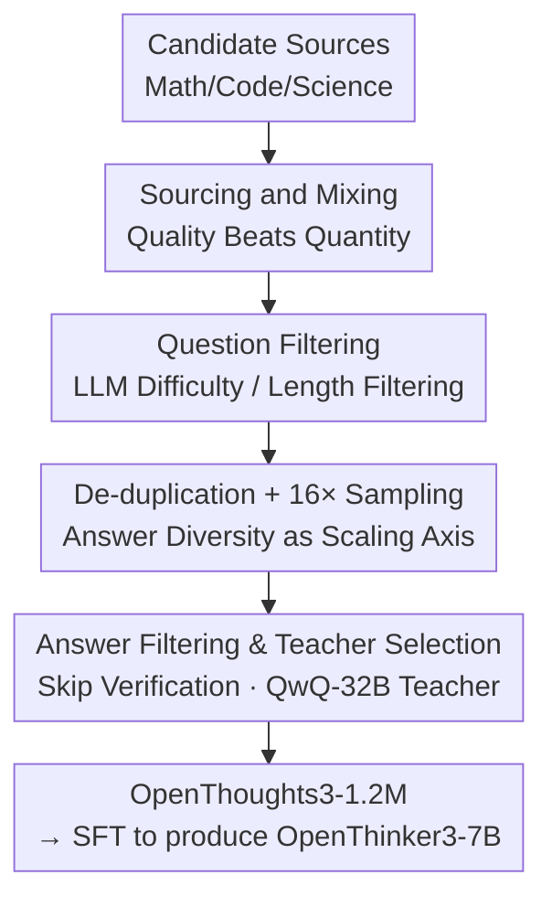

# OpenThoughts: Data Recipes for Reasoning Models

**Conference**: ICLR 2026  
**OpenReview**: [https://openreview.net/forum?id=7xjoTuaNmN](https://openreview.net/forum?id=7xjoTuaNmN)  
**Code**: https://openthoughts.ai (Data and models open-sourced)  
**Area**: LLM Reasoning  
**Keywords**: Reasoning Distillation, SFT Data Recipe, Data Filtering, Multi-answer Sampling, Teacher Model Selection

## TL;DR
The authors decompose the creation of "Reasoning Model SFT Data" into six pipeline stages and conduct over 1,000 controlled ablation experiments. They derive a simple yet counter-intuitive data recipe (high-quality sources + LLM difficulty/length filtering + 16x answer sampling per question + skipping answer verification + using the weaker QwQ-32B as the teacher). Using this, they produced the OpenThoughts3-1.2M dataset and trained OpenThinker3-7B, which outperforms R1-Distill-7B by 15.3/17.2/20.5 percentage points on AIME25, LiveCodeBench, and GPQA respectively, achieving state-of-the-art among open-source models of the same scale.

## Background & Motivation
**Background**: Reasoning models like DeepSeek-R1 and o3 have achieved breakthroughs by first selecting strong base models and then training them (via SFT/RL) to output long Chains of Thought (CoT). A widely verified path is **pure SFT distillation**, which feeds triplets of "Question + CoT tokens + Answer" to a student model, where the CoT is generated by a strong teacher model (e.g., R1). Projects like R1-Distill, SkyT1, S1, and LIMO demonstrate that major gains can be achieved solely by **improving training data** while keeping the architecture and SFT process standard.

**Limitations of Prior Work**: The **complete data recipes** for leading reasoning models are generally not public, forcing the community to rely on intuition. Furthermore, existing open-source projects often explore only a small corner of the design space—using only human-written problems or only R1 as a teacher—and frequently change multiple variables at once, making it unclear which step actually provides the gain.

**Key Challenge**: Systematically exploring the design space for generating question-answer pairs is **prohibitively expensive**. Both teacher model inference and model training are costly, preventing typical researchers from conducting comprehensive sweeps, leading to a reliance on heuristics.

**Goal**: To systematically ablate every stage of the SFT reasoning data production pipeline (sourcing → mixing → filtering → answer generation → answer verification → teacher selection) to determine the optimal strategy for each step and understand why.

**Key Insight**: The authors fix the rest of the pipeline and ablate one stage at a time by fine-tuning Qwen2.5-7B-Instruct at a uniform scale that is "small enough to be affordable yet large enough to provide signal" ($31,600$ samples per strategy, the logarithmic midpoint between 10K and 100K: $\sqrt{10}\approx 3.16$). They use the average score across eight math, code, and science benchmarks as the final metric.

**Core Idea**: Instead of pursuing "data diversity," it is better to identify the empirically optimal choice for each pipeline stage and stack them. Many intuitions typically assumed to be correct (stronger teachers are always better, answer verification is necessary, more sources are better) do not hold up under controlled experiments.

## Method

### Overall Architecture
OpenThoughts is not a new model or algorithm, but a **data production pipeline optimized through experimentation**. The approach decomposes the creation of an SFT reasoning dataset into six serial stages. In each stage, several candidate strategies are tested, and the one that produces the highest average score on downstream tasks (using a uniform 31,600 sample scale) is selected before moving to the next stage. The stages are: ① **Question Sourcing** (selecting from dozens of synthetic, semi-synthetic, and human-written sources) → ② **Problem Mixing** (deciding how many top sources to combine) → ③ **Question Filtering** (selecting high-quality subsets) → ④ **De-duplication + Multi-answer Sampling** (number of answers per question) → ⑤ **Answer Filtering** (whether to remove potentially incorrect answers) → ⑥ **Teacher Model Selection**. By combining the winners and scaling to 1.2 million samples, they produced OpenThoughts3-1.2M (850k Math + 250k Code + 100k Science) and fine-tuned Qwen2.5-7B-Instruct to create OpenThinker3-7B.

### Key Designs

**1. Question Sourcing and Mixing: Quality Beats Quantity**

The first stage identifies where questions should come from. The authors categorized sources into: Fully Synthetic (LLM-generated templates, e.g., CodeAlpaca), Semi-Synthetic (generated from seeds like CommonCrawl/FineWeb, e.g., TigerLabMath), and Non-Synthetic (human-written, e.g., StackExchange/competitions). After testing 27 code, 21 math, and 14 science sources using R1 answers at a fixed scale, they found **source quality has a massive impact**. The best code source (StackExchange-CodeGolf, 38.8) outperformed the worst by 17.2 points. Furthermore, **simple synthesis often equals or outperforms** complex manual pipelines; there is no rule that "human-written is always better."

The "Mixing" results were counter-intuitive. While logic suggests mixing more sources increases diversity, sweeping $N\in\{1,2,4,8,16\}$ top sources showed that **mixing at most two sources works best**. Mixing more actually reduced performance—using the top 2 code sources outperformed the top 16 by 5% across all benchmarks. This suggests downstream performance is driven by **source quality** rather than diversity from mixing. Consequently, the final recipe is lean: math uses only OpenMath-2-Math, code uses CodeGolf + OpenCodeReasoning, and science uses StackExchange-Physics + OrganicChemistry-PDFs.

**2. Question Filtering: LLM Difficulty/Length vs. Traditional Methods**

Instead of traditional fastText classifiers or embedding distances used in pre-training, the authors tested two LLM-driven filters: **Difficulty Filtering** (GPT-4o-mini rates difficulty; keep the hardest) and **Response-Length Filtering** (LLM answers the question; keep those with the longest responses—assuming long answers indicate a higher need for reasoning).

Both LLM filtering methods significantly outperformed traditional methods. Difficulty filtering was the winner for code, while response-length filtering won for math and science, providing gains of ~6% and 4% respectively compared to random filtering. A key detail is that **stronger LLMs generally perform better for length filtering** (GPT-4.1-mini > GPT-4.1-nano). The final recipe uses GPT-4o-mini difficulty filtering for code and GPT-4.1-mini length filtering for math and science.

**3. De-duplication + 16× Multi-answer Sampling: Answer Diversity as a Scaling Axis**

The authors swept combinations of question-level de-duplication (none / exact / fuzzy) and sampling counts per question ($1\times / 4\times / 16\times$). While de-duplication improves **question diversity**, sampling multiple CoTs for the same question improves **answer diversity**. The latter provides a **new scaling axis**: even with limited questions, the dataset can be expanded at least 16-fold by sampling more answers.

Across nine combinations, "sampling more answers" was consistently effective. For math, exact de-duplication + $4\times$ was optimal; for code, no de-duplication + $16\times$ was near-optimal. For **scalability**, the authors standardized on $16\times$ sampling. This technique is a core scaling trick of the paper, explaining how they reached 1.2 million samples easily.

**4. Answer Filtering & Teacher Models: Verification is Useless, Weak Teachers Win**

**Answer Filtering**: Intuition suggests removing incorrect answers should help. The authors tested majority voting, GPT verification, and length/language filters. However, **no filtering strategy consistently beat the "no filtering" baseline**. In math, random filtering was even optimal, while only fastText was slightly better for code. The conclusion: the cost of losing samples outweighs the benefit of verification; **skip this step**.

**Teacher Model**: Distilling from DeepSeek-R1, Phi-4-Reasoning-Plus-14B, and QwQ-32B revealed **QwQ-32B is the strongest teacher overall**, providing +1.9%/2.6% gains for code/math respectively over R1—even though QwQ-32B is significantly weaker than R1 on benchmarks (R1 leads QwQ by 9%/8%/23% on CodeElo/GPQA/JEEBench). This indicates that **a teacher's benchmark score does not predict its quality as a distillation teacher**.

### Loss & Training
Standard supervised fine-tuning (SFT) was used throughout, with no RL or curriculum learning. Ablations were performed on Qwen2.5-7B-Instruct with 31,600 samples per strategy. The final OpenThinker3-7B was trained on OpenThoughts3-1.2M. The dataset was de-contaminated (removing samples similar to benchmarks), and a set of held-out benchmarks (AIME25, HMMT, HLE-MCQ, LCB 06/24-01/25) was used only after the pipeline was finalized to test generalization.

## Key Experimental Results

### Main Results
Comparison of OpenThinker3-7B with other 7B/8B reasoning models (all fine-tuned from Qwen2.5-7B-Instruct; selecting representative tasks):

| Model | Data Scale | Method | Avg | AIME25 | LCB 06/24-01/25 | GPQA-D |
|------|---------|------|------|--------|------------------|--------|
| **OpenThinker3-7B (Ours)** | 1.2M | SFT | **55.3** | **53.3** | **51.7** | 53.7 |
| DS-R1-Distill-Qwen-7B | 800K | SFT | 42.9 | 38.0 | 34.5 | 33.2 |
| Nemotron-Nano-1M | 1M | SFT | 47.3 | 41.3 | 42.2 | 52.9 |
| AM-1.4M | 1.4M | SFT | 42.1 | 28.7 | 40.3 | 48.3 |
| Qwen2.5-7B-Instruct (Base) | — | — | 24.0 | 8.0 | 16.3 | 24.6 |

Ours outperforms R1-Distill-7B by an average of 12.4 points across 12 tasks, and leads the next best open model, Nemotron-Nano-8B, by 2.1 points.

### Ablation Study (Selected Winning Strategies)

| Stage | Key Comparison | Value | Description |
|------|---------|------|------|
| Problem Mixing | Top-2 Code Sources vs. Top-16 | 41.3 vs 36.4 | Few but fine wins; ~+5% |
| Question Filtering | Length Filter (Math) vs. Random | 66.0 vs ~62 | LLM filter ~+4% |
| Answer Sampling | 16× vs. 1× (Science) | 49.7 vs 46.9 | Stable gains from sampling |
| Answer Filtering | No Filter vs. Others (Math) | 65.6 ≈ Others | No significant gain from filtering |
| Teacher Model | QwQ-32B vs. R1 (Code) | 29.5 vs. 27.2 | Weak teacher wins; +1.9% |

### Key Findings
- **Multi-answer sampling is the most critical scaling lever**: Sampling 16 CoTs per question scales any source by 16x with stable gains.
- **Strong models $\neq$ strong teachers**: QwQ-32B is a better distillation teacher than R1 despite lower benchmark scores.
- **Answer verification failed entirely**: No filtering strategy consistently outperformed "no filtering," suggesting quantity of CoTs matters more than absolute correctness in distillation.
- **Quality > Diversity**: Both source mixing ($\le 2$ sources is best) and de-duplication experiments show that marginal gains from question diversity are limited when answer diversity is high.
- **LLM Filtering > Traditional Cleaning**: Difficulty and length signals from LLMs are superior to fastText or embedding-based cleaning tools.

## Highlights & Insights
- **Data recipes as reproducible science**: Over 1,000 controlled ablations with a uniform scale and held-out benchmarks offer a rigorous methodology that counters "intuition-based" data construction.
- **Counter-intuitive findings**: More sources can be worse, answer verification is often unnecessary, and weaker models can be better teachers.
- **Answer sampling as a scaling axis**: When high-quality questions are scarce, sampling multiple answers for existing good questions is more cost-effective than finding new ones.
- **Fully open-source** (data, models, prompts, code), making the claim of "open-source data catching up to R1-Distill" a verifiable reality.

## Limitations & Future Work
- The authors **did not touch RL**, which is now standard for reasoning models. Conclusions from pure SFT might not translate directly to RL data construction.
- No exploration of **staged SFT or curriculum learning**; all data was used in a single pass.
- Strategies were chosen based on **average scores across eight specific benchmarks**. Whether "Quality > Diversity" holds beyond these benchmarks is unclear.
- Optimal choices (e.g., $16\times$, QwQ-32B) were found using Qwen2.5-7B-Instruct; it is unknown if these results are sensitive to different base models or teacher generations.

## Related Work & Insights
- **vs. DeepSeek-R1-Distill**: While R1-Distill uses a single strong teacher (R1), this work systematically breaks down teacher, source, and filtering, finding that QwQ-32B is superior and verification is optional, surpassing R1-Distill-7B with the same scale of open data.
- **vs. S1 / LIMO**: Unlike those focusing on "small and expert" manual selections, this work proves that LLM-automated filtering and multi-answer sampling can scale while maintaining quality.
- **vs. OpenR1 / Nemotron**: Unlike projects that introduce multiple innovations simultaneously, this "one step at a time" ablation provides quantifiable attribution for every design choice.

## Rating
- Novelty: ⭐⭐⭐⭐ (Systematic data science rather than a new model; solid counter-intuitive findings)
- Experimental Thoroughness: ⭐⭐⭐⭐⭐ (1,000+ ablations is exceptionally thorough)
- Writing Quality: ⭐⭐⭐⭐⭐ (Clear staged narrative with distinct takeaways)
- Value: ⭐⭐⭐⭐⭐ (Provides a reproducible optimal recipe and a "pitfall list" for the community)

<!-- RELATED:START -->

## Related Papers

- [\[ICLR 2026\] Native Reasoning Models: Training Language Models to Reason on Unverifiable Data](native_reasoning_models_training_language_models_to_reason_on_unverifiable_data.md)
- [\[ICLR 2026\] The Quest for Efficient Reasoning: A Data-Centric Benchmark to CoT Distillation](the_quest_for_efficient_reasoning_a_data-centric_benchmark_to_cot_distillation.md)
- [\[ICLR 2026\] Scaling Generalist Data-Analytic Agents](scaling_generalist_data-analytic_agents.md)
- [\[ICLR 2026\] Front-Loading Reasoning: The Synergy between Pretraining and Post-Training Data](front-loading_reasoning_the_synergy_between_pretraining_and_post-training_data.md)
- [\[ICLR 2026\] DESIGNER: Design-Logic-Guided Multidisciplinary Data Synthesis for LLM Reasoning](designer_design-logic-guided_multidisciplinary_data_synthesis_for_llm_reasoning.md)

<!-- RELATED:END -->
