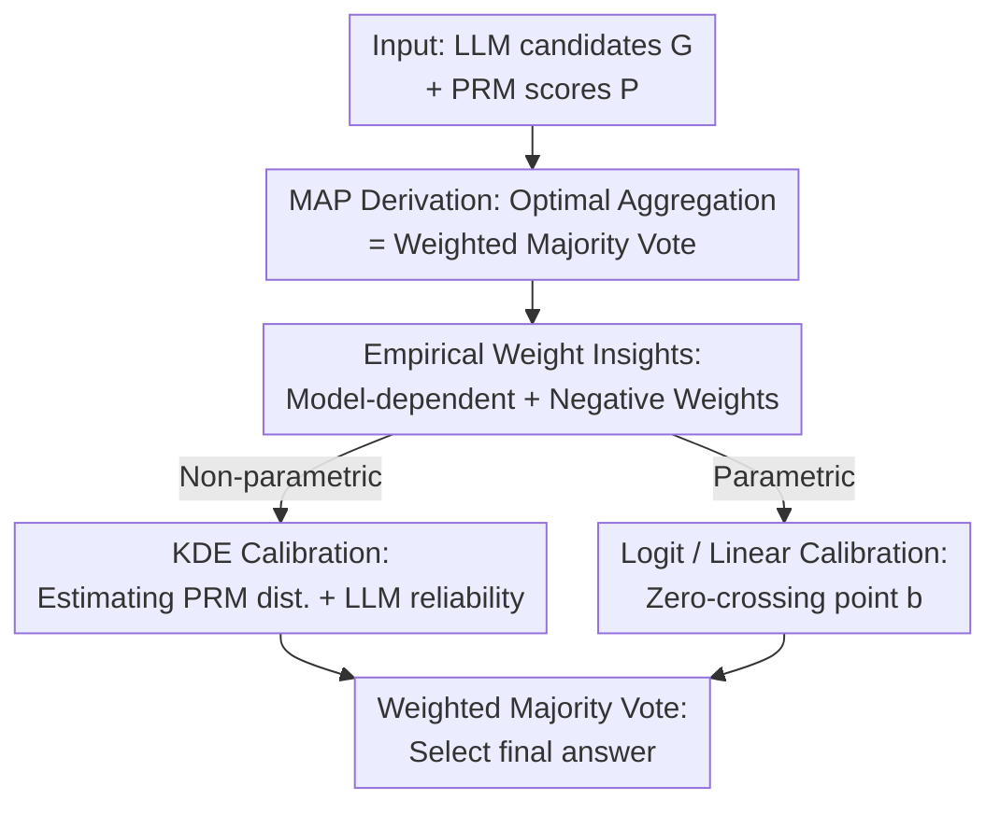

# Optimal Aggregation of LLM and PRM Signals for Efficient Test-Time Scaling

**Conference**: ICLR 2026  
**OpenReview**: [https://openreview.net/forum?id=x85kiYqL4y](https://openreview.net/forum?id=x85kiYqL4y)  
**Code**: TBD  
**Area**: LLM Inference / Test-Time Scaling  
**Keywords**: Test-time scaling, Process Reward Model, Weighted Majority Vote, Signal Aggregation, Calibration

## TL;DR
This paper demonstrates through MAP estimation that the optimal combination of LLM majority consensus and PRM scoring is equivalent to a **weighted majority vote**. It reveals that optimal weights are highly dependent on the specific LLM-PRM combination and should assign **negative weights** to low-scoring responses. Based on this, several low-cost offline calibration methods are proposed to approximate this weight function, outperforming vanilla weighted voting while using only approximately 21.3% of the compute.

## Background & Motivation
**Background**: Test-time scaling (TTS) is a mainstream approach to improving LLM reasoning capabilities without retraining. The most common paradigm is "generate-and-select": sampling $N$ candidate solutions for a problem and using a mechanism to select the best one. Selection mechanisms typically fall into two categories: using a Process Reward Model (PRM) to score steps and selecting the answer with the highest score (Best-of-N), or ignoring the PRM and counting answer frequencies (Majority Voting / Self-Consistency).

**Limitations of Prior Work**: A counter-intuitive phenomenon has challenged the status of PRMs—on recent benchmarks, simple majority voting that completely ignores the expensive PRM can outperform PRM-guided Best-of-N. The fact that a precisely trained, high-cost verifier can be surpassed by a simple vote-counting method suggests that the current way of utilizing PRM signals is fundamentally flawed and fails to leverage fine-grained feedback effectively.

**Key Challenge**: BoN considers only the **single** highest-scoring candidate, discarding consensus information carried by other responses. Majority voting only counts votes, completely ignoring PRM scores. Both approaches occupy extreme ends of the spectrum and fail to **unify** the "generator consensus" and "verifier scoring" evidence.

**Goal**: To provide a principled framework answering "how to optimally combine PRM verification signals with LLM generation signals" and to implement it as a practical method that requires no ground-truth labels at test time and saves computational resources.

**Key Insight**: The authors formalize the problem of "aggregating multiple responses to obtain a final answer" as a Maximum A Posteriori (MAP) estimation problem—given all candidate responses $G$ and their PRM scores $P$, find the most probable true answer $\hat{\alpha}$. From this probabilistic perspective, the optimal solution emerges naturally rather than relying on heuristic design.

**Core Idea**: Optimal aggregation is not "picking the highest score" but a **weighted majority vote**. The weight of each response consists of a "PRM signal term" and an "LLM reliability term." Since this weight function is difficult to derive analytically, a one-time offline calibration set is used to **learn** its approximation.

## Method

### Overall Architecture
The paper follows an approach in two stages: first, theoretically deriving the form of the optimal aggregation strategy, and second, finding practical ways to approximate it at low cost.

The theoretical part formalizes aggregation as a MAP problem: an LLM $M$ generates $L$ responses $G=\{g_1,\dots,g_L\}$ for a problem, where each response contains a reasoning process $r_i$ and a final answer $s_i$; a PRM $V$ assigns a scalar score $p_i$ to each response. Under a uniform prior and two conditional independence assumptions, maximizing the posterior is equivalent to maximizing a **score** for each candidate answer $\alpha_k$—which happens to be the "sum of weights of all responses voting for $\alpha_k$," i.e., weighted voting. The key is that each weight $w_i$ is decomposed into a PRM signal term and an LLM signal term.

The authors then empirically characterize this optimal weight function, discovering that it **varies by model combination** and **assigns negative weights** to low-scoring responses—two points that directly refute the validity of fixed practices like "using the PRM score directly as the weight."

The practical part uses a one-time pre-computed calibration set $D_{cal}=\{(r_i,p_i,c_i)\}$ (containing correctness labels $c_i$ for each response) to learn the weight function $w(p)$, providing both non-parametric (KDE) and parametric (Logit / Linear) paths. Once $w(p)$ is learned, weighted voting $\hat{\alpha}=\arg\max_{\alpha_k}\sum_{i:s_i=\alpha_k} w(p_i)$ is performed directly for each new problem at test time, requiring no ground truth.

### Key Designs

**1. MAP Derivation: Proving Optimal Aggregation as Weighted Majority Vote**

Addressing the pain point that "BoN only looks at a single top score while majority voting ignores scores," the authors re-derive aggregation from first principles. Finding the most likely true answer is formulated as $\hat{\alpha}=\arg\max_{\alpha_k} P(G,P\mid\alpha_k,M,V)$, then decomposed via the causal chain into likelihoods $P(P\mid G,\alpha_k,V)\cdot P(G\mid\alpha_k,M)$ (LLM generates responses, then PRM scores them). After introducing conditional independence assumptions (PRM scores are independent, and responses are independent), the log-likelihood becomes a sum over responses. The LLM term is modeled simply: generating the correct answer with probability $q_M$, or a specific incorrect answer with $(1-q_M)/(m-1)$ (where $m$ is the number of candidate answer types). This leads to Theorem 3.2:

$$\text{Score}(\alpha_k)=\sum_{i:s_i=\alpha_k} w_i,\quad w_i=\underbrace{\log\frac{P(p_i\mid c_i=1,V)}{P(p_i\mid c_i=0,V)}}_{\text{PRM Signal Term}}+\underbrace{\log\frac{q_M(m-1)}{1-q_M}}_{\text{LLM Signal Term}}$$

This unifies BoN and majority voting into a single framework: the PRM signal term is the "likelihood ratio of score $p_i$ appearing in correct vs. incorrect reasoning," characterizing the trustworthiness of the reasoning quality; the LLM signal term is determined by $q_M$, essentially corresponding to problem difficulty. The optimal strategy is not to pick the highest score, but to let each response vote with its own weight.

**2. Empirical Insights on Optimal Weights: Model-Dependent + Negative Weights**

The theorem provides the weight form, but empirical characterization of $w^*(p)$ yields two conclusions guiding the method design. First, **the weight function is highly dependent on the specific LLM-PRM combination**: the shape of the optimal function varies significantly across different model pairs, so fixed practices like "using PRM scores directly as weights" are naturally suboptimal; calibration is necessary for the specific pair in use. Second, **low PRM scores are mapped to negative weights**: a response judged poor by the PRM should not simply be ignored; it is actually strong evidence "against that answer." Repeated poor-quality responses should not increase the probability of that answer being true. BoN and majority voting both waste this negative signal. These two points are design constraints for calibration. To instantiate the optimal weight, the authors use Kernel Density Estimation (KDE) in logit space to fit the score distributions of correct/incorrect responses and set $q_M$ as the ground-truth accuracy of the $L$ responses for that problem; the resulting "optimal aggregator" provides a tighter performance upper bound than Pass@N.

**3. Non-Parametric Calibration (KDE WV): Directly Estimating Unknowns in the Weight Function**

The most direct approach is to estimate each unknown in the theorem: the PRM score distributions $P(p\mid c{=}1,V)$, $P(p\mid c{=}0,V)$, and the LLM reliability $q_M$. For the distributions, since PRM scores lie in $[0,1]$ and KDE is unbounded (causing probability density to leak), the authors first transform scores to logit space via $\text{logit}(p)=\log\frac{p}{1-p}$ before applying KDE:

$$\hat{f}_c(p)=\frac{1}{|D_c|\cdot h}\sum_{i\in D_c} K\!\left(\frac{\text{logit}(p)-\text{logit}(p_i)}{h}\right)$$

where $D_c$ splits the calibration set by correctness $c_i$, and $K, h$ are the kernel and bandwidth. $q_M$ is estimated without test labels by training a binned probability calibrator $g(\cdot)$ on the calibration set; at test time, the calibrated probability for each of the $L$ responses is averaged: $\hat{q}_M=\frac{1}{|D_{test}|}\sum_i g(p_i')$. Substituting these back yields the practical weight $w_{KDE}(p)=\log\hat{f}_1(p)-\log\hat{f}_0(p)+\log\hat{q}_M+\log(m-1)-\log(1-\hat{q}_M)$. This is a practical version of the optimal estimator, differing only in that the optimal version uses ground-truth labels for test responses.

**4. Parametric Calibration (Logit WV / Linear WV): Explicitly Encoding Negative Weights with Zero-Crossing Point b**

While KDE is flexible, it requires estimating entire distributions. The authors propose simpler parametric forms using grid search on the calibration set. The core is a threshold parameter $b$—the **zero-crossing point**: weights are positive when the score is above $b$ and negative when below $b$, explicitly encoding the "penalty for low-quality responses." Inspired by the log-ratio form in the theorem, Logit weight is $w_{logit}(p)=\text{logit}(p)-\text{logit}(b)$, while the simpler Linear baseline is $w_{linear}(p)=p-b$. During grid search, $b$ is searched in $[0,1]$ (Logit WV) and $[-1,1]$ (Linear WV) to maximize accuracy on the calibration set. This path requires minimal distribution estimation but remains robust due to the explicit negative weight mechanism; Logit WV is often the top-performing method.

## Key Experimental Results

### Main Results
Evaluated across 35 combinations of 5 LLMs (Mistral-7B, Qwen2.5-1.5B/7B, DeepSeek-1.5B/7B) and 7 PRMs. Datasets include MATH/MATH500 and non-mathematical tasks like MMLU-Pro. A core conclusion is that calibrated weighted voting matches or exceeds baselines using significantly less compute.

| Dataset | Comparison | Key Result |
|--------|----------|----------|
| MATH | Logit WV vs Vanilla WV | Matches Vanilla WV using ~**37.1%** compute |
| MATH500 | Logit WV vs Vanilla WV | Matches Vanilla WV using ~**21.3%** compute |
| MATH (Llama3.1-Mistral-8B PRM, n=32) | Logit WV vs Best Baseline (Vanilla WV) | Avg **61.2 vs 58.2** (+3 points) |

The following table shows average accuracy for various methods on 5 LLMs using Qwen-PRM-7B at n=32 (Selected from Table 1):

| Method | Avg Accuracy | Description |
|------|-----------|------|
| Optimal (Upper Bound) | 66.5 | Theoretical optimal aggregator using ground truth |
| BoN | 61.8 | Selects answer with highest score |
| MV (Majority Vote) | 57.1 | Ignores PRM scores |
| Vanilla WV | 60.8 | Uses raw PRM score as weight |
| KDE WV | 60.2 | Non-parametric calibration |
| Linear WV | 62.9 | Parametric linear |
| **Logit WV** | **63.3** | Parametric logit, best performer |

### Ablation Study

| Configuration | Key Phenomenon | Description |
|------|----------|------|
| Using raw PRM score as weight | Suboptimal across model pairs | Weight function is model-dependent; fixed mapping fails |
| Removing negative weights | Wasted negative evidence | Low-quality responses should oppose the answer |
| Zero-crossing point $b$ | Logit/Linear are robust | Explicitly implements penalty for low scores |
| MMLU-Pro (Multi-domain) | Stable and effective | Method generalizes beyond mathematics |

### Key Findings
- The shape of the optimal weight function varies significantly across different LLM-PRM pairs, proving that model-specific calibration is necessary.
- Negative weighting is a recurrent critical signal: responses judged poor by the PRM carry "counter-evidence" that both BoN and majority voting discard.
- Parametric Logit WV is often the best method, requiring minimal distribution estimation while outperforming KDE WV in most cases.
- Investing in "smarter aggregation strategies" is more cost-effective than simply increasing test-time compute—this is the primary message.

## Highlights & Insights
- **Formalizing TTS aggregation as a MAP problem and deriving weighted voting**: It provides a unified theoretical framework for BoN and majority voting, turning "how to aggregate" from a heuristic into a derivable conclusion.
- **The discovery of negative weights is counter-intuitive yet powerful**: While previous methods assumed poor responses should simply be ignored, this paper shows they are strong counter-evidence, a perspective transferable to any selector/verifier scenario.
- **The zero-crossing point $b$ is a clever simplification for implementation**: A single scalar threshold encodes the penalty for low-quality responses, making parametric methods simple and robust.
- **Practical value in compute efficiency**: Achieving superior performance to vanilla weighted voting with ~1/5 of the compute is attractive for deployment under inference cost constraints.

## Limitations & Future Work
- Theoretical derivation relies on two conditional independence assumptions (between responses and between PRM scores); in reality, multiple samples from the same LLM may not be independent.
- Calibration requires a one-time pre-computed set with correctness labels; weights may mismatch if ground truth is unavailable or if the test distribution deviates significantly from the calibration set.
- The LLM signal term uses a simplified model ("accuracy $q_M$ + uniform error distribution"), assuming all incorrect answers are equally likely, which may not align with real-world error distributions.
- Main experiments focus on math (MATH/MATH500) and MCQ-style MMLU-Pro; applicability to open-ended generation where answers are hard to compare precisely requires further validation.

## Related Work & Insights
- **vs Best-of-N (BoN)**: BoN selects only the single highest-scoring response, discarding the rest of the consensus; this paper proves the optimal solution involves voting all responses by weight, with BoN being a degenerate case.
- **vs Majority Voting / Self-Consistency**: SC only counts votes and ignores PRMs; this paper incorporates both PRM signals and LLM reliability into weighted voting and assigns negative weights to low scores.
- **vs CISC (Confidence-based Weighted Voting)**: CISC uses LLM self-evaluated confidence as weights; this paper derives weights from a MAP framework combining "LLM consensus + external verifier scores" and emphasizes model-dependency and negative weights.
- **vs Vanilla Weighted Vote**: Uses raw PRM scores as weights; this paper shows this ignores model-dependent weight functions and that calibration allows exceeding its performance with less compute.

## Rating
- Novelty: ⭐⭐⭐⭐⭐ Formalizing TTS aggregation as MAP and deriving weighted voting + negative weight insight is novel and theoretically grounded.
- Experimental Thoroughness: ⭐⭐⭐⭐ 35 LLM-PRM combinations + cross-domain validation is extensive, though primarily limited to math/MCQs.
- Writing Quality: ⭐⭐⭐⭐ Clear progression from theory to practice; insights are well-aligned with methods.
- Value: ⭐⭐⭐⭐⭐ Surpassing vanilla weighted voting with ~1/5 the compute has practical significance for inference deployment.

<!-- RELATED:START -->

## Related Papers

- [\[ICLR 2026\] TATTOO: Tool-Grounded Thinking PRM for Test-Time Scaling in Tabular Reasoning](tattoo_tool-grounded_thinking_prm_for_test-time_scaling_in_tabular_reasoning.md)
- [\[ICLR 2026\] CaTS: Calibrated Test-Time Scaling for Efficient LLM Reasoning](cats_calibrated_test-time_scaling_for_efficient_llm_reasoning.md)
- [\[ACL 2026\] Efficient Test-Time Scaling via Temporal Reasoning Aggregation](../../ACL2026/llm_reasoning/efficient_test-time_scaling_via_temporal_reasoning_aggregation.md)
- [\[ICLR 2026\] Tracing the Traces: Latent Temporal Signals for Efficient and Accurate Reasoning](tracing_the_traces_latent_temporal_signals_for_efficient_and_accurate_reasoning.md)
- [\[ICLR 2026\] Efficient Test-Time Scaling for Small Vision-Language Models](efficient_test-time_scaling_for_small_vision-language_models.md)

<!-- RELATED:END -->
