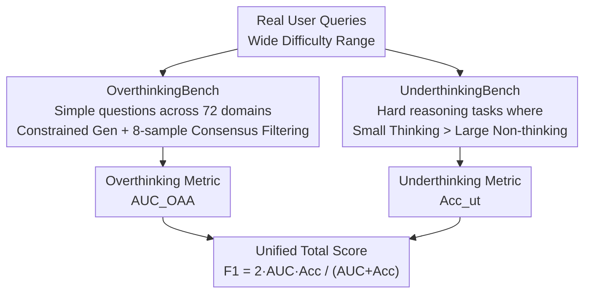

# OptimalThinkingBench: Evaluating Over and Underthinking in LLMs

**Conference**: ICLR 2026  
**OpenReview**: [https://openreview.net/forum?id=N5kWa3sRJt](https://openreview.net/forum?id=N5kWa3sRJt)  
**Code**: https://github.com/facebookresearch/RAM/tree/main/projects/otb (Available)  
**Area**: LLM Reasoning  
**Keywords**: Overthinking, Underthinking, Reasoning Efficiency Evaluation, Unified Benchmark, thinking-adjusted accuracy

## TL;DR
This paper proposes OptimalThinkingBench, a unified benchmark that simultaneously measures "overthinking" in LLMs on simple tasks (generating hundreds of thinking tokens without improving accuracy) and "underthinking" on difficult tasks. By combining a thinking-adjusted accuracy metric with F1 scores, the benchmark provides a single representative value. Evaluations of 33 models reveal that no current model excels at both ends, and existing efficiency-improving methods often resolve one issue only to exacerbate the other.

## Background & Motivation
**Background**: User queries for LLMs span a vast difficulty range—from "how many centimeters are in 1 meter" to complex competitive mathematical proofs. An ideal model should provide instantaneous answers for simple queries and engage in deep thought for difficult ones. Recently, "thinking" models like DeepSeek-R1 and o1 have significantly outperformed others in complex reasoning via long Chain-of-Thought (CoT), leading providers to release both "thinking" and "non-thinking" variants.

**Limitations of Prior Work**: Thinking models suffer from **overthinking** on simple tasks—generating hundreds or thousands of thinking tokens for trivial questions, which increases latency and cost, and sometimes even reduces accuracy. Conversely, non-thinking models suffer from **underthinking** on difficult tasks, failing to provide correct answers even when their parameter counts far exceed those of smaller thinking models.

**Key Challenge**: The decision of "whether to think and for how long" is pushed to the end-user, who must manually select between model variants—an impractical approach for scaled applications. Furthermore, existing benchmarks either measure only accuracy (encouraging overthinking) or only efficiency, lacking a metric that **simultaneously** penalizes both overthinking and underthinking.

**Goal**: To construct a unified benchmark that (1) quantifies both overthinking and underthinking, (2) ranks models using a single metric, and (3) evaluates and compares various methods for achieving "optimal thinking."

**Key Insight**: Overthinking and underthinking are two sides of the same coin—a model is only optimal if it reflects less on simple queries and more on difficult ones. Thus, the benchmark is split into two opposing subsets, using an F1 score to ensure high scores only for models performing well on both.

**Core Idea**: Redefining the overthinking dimension through "thinking-adjusted accuracy" and the underthinking dimension via a subset of tasks where small thinking models outperform large non-thinking models. The final OptimalThinkingBench score is the F1 combination of the two.

## Method

### Overall Architecture
OptimalThinkingBench consists of two complementary sub-benchmarks: **OverthinkingBench**, containing simple questions where additional thought is useless or detrimental, and **UnderthinkingBench**, containing difficult reasoning tasks that require thinking to solve. Both subsets are automatically synthesized and sustainably extensible to prevent data contamination. Evaluation yields an overthinking metric $\text{AUC}_\text{OAA}$ and an underthinking accuracy $\text{Acc}_{ut}$, which are combined into a single $F_1^{otb}$ score. The strength of this pipeline lies in the natural opposition of the two subsets: any model optimizing only one side will fail on the other, bringing the F1 score down to the level of the lower component.

### Key Designs

**1. OverthinkingBench: Constrained Synthesis + 8-Sample Consensus Filtering for "Simple-to-not-think" Tasks**

To quantify overthinking, a set of simple questions is needed where non-thinking models are almost always correct, yet thinking models waste tokens. Direct generation often leads to repetitive or degenerate problems. This paper uses **constrained generation**: given constraint pairs $C=\{D,T\}$ ($D$ is the domain, $T$ is the answer type), a generator $L$ outputs matching Q&A pairs $L(C)\to\{(q_i,a_i)\}_{i=1}^n$. Domains are drawn from 72 subjects in SuperGPQA (mechanics, quantum physics, common sense, etc.), and answer types include numeric, multiple-choice, word/phrase, and open-ended. This modular approach ensures coverage, facilitates ablation by domain/type, and allows for re-generation to combat contamination.

Synthesized tasks undergo **filtering** based on the principle that truly simple questions should be answered correctly and consistently. For each task, another model $L'$ generates $k=8$ sample responses $L'(q_i)\to\{y_1,\dots,y_k\}$. A task is retained only if all 8 responses are judged consistent with the reference answer $a_i$ by an LLM judge $L_{judge}$ ($\forall j:\ L_{judge}(q_i,a_i,y_j)=\text{True}$). This 100% consensus requirement guarantees three properties: correctness (cross-sample verification), lack of ambiguity, and sufficiently low difficulty. The final OvT-General contains 1,327 questions, and OvT-Math contains 133 Level 1–2 problems from the MATH dataset.

**2. UnderthinkingBench: Selecting Hard Tasks via "Small Thinking > Large Non-thinking" Gap**

The underthinking dimension requires tasks where **no matter how large a non-thinking model is, it cannot outperform a much smaller thinking model**—indicating that "thinking" itself is the key to solving the problem. The authors filter tasks from 100 tasks in Reasoning Gym and 4 math benchmarks. For each task, they evaluate a small thinking model $P^{think}_{small}$ (Qwen3-1.7B) and a large non-thinking model $P^{non\text{-}think}_{large}$ (Qwen3-235B-A22B), retaining only those where $P^{think}_{small}-P^{non\text{-}think}_{large}>\lambda$ ($\lambda=0.1$).

This results in UT-Reasoning (550 tasks across 11 categories like games and logic) and UT-Math (60 competitive problems from AIME'25 and HMMT'25). All tasks are scored via programmatic verifiers (e.g., simulating path validity for maze tasks). The programmatic nature allows for a continuous supply of harder tasks as models evolve.

**3. Thinking-adjusted Accuracy and F1: Penalizing "Thinking Too Much" and "Thinking Too Little"**

Standard accuracy cannot penalize overthinking. Thus, **Overthinking-Adjusted Accuracy** is defined for OverthinkingBench, counting only correct samples where the thinking token count is below a threshold $t$:

$$\text{OAA}_t=\frac{1}{n}\sum_{i=1}^{n}\big(\text{Correctness}_i\cdot \mathbb{I}(\text{ThinkTokens}_i<t)\big)$$

To avoid sensitivity to a single $t$, the metric integrates over a range of budgets to calculate the Area Under the Curve:

$$\text{AUC}_\text{OAA}=\int_0^{t_{max}}\frac{\text{OAA}_t}{t_{max}}dt\approx\sum_{t=0}^{t_{max}}\frac{\text{OAA}_t}{t_{max}},\quad t_{max}=1000$$

This metric is comparable to and as interpretable as standard accuracy, while yielding low scores for both "correct but overthought" and "not thought through and incorrect." The final score combines $\text{AUC}_\text{OAA}$ and $\text{Acc}_{ut}$:

$$F_1^{otb}=2\cdot\frac{\text{AUC}_\text{OAA}\cdot \text{Acc}_{ut}}{\text{AUC}_\text{OAA}+\text{Acc}_{ut}}$$

The F1 score ensures the total score remains close to the lower of the two components, forcing models to achieve proficiency in both domains.

## Key Experimental Results

### Main Results
Evaluation of 33 models (with hybrid models tested in both modes). Representative results ($F_1^{otb}$ higher is better):

| Model | $F_1^{otb}$ ↑ | OvB AUC_OAA ↑ | OvB Tokens ↓ | UnB Acc(%) ↑ |
|------|------|------|------|------|
| o3 (Closed-Thinking) | **71.1** | 78.6 | 235 | **65.0** |
| GPT-OSS-120B (Open-Thinking) | 68.3 | **83.3** | 154 | 57.9 |
| Sonnet-4 (Closed-Thinking) | 64.2 | 71.3 | 706 | 58.3 |
| GPT-OSS-20B (Open-Thinking) | 57.3 | 72.7 | 467 | 47.3 |
| Sonnet-4 (Closed-Non-thinking) | 48.3 | 97.4 | 0 | 32.1 |
| GPT-4.1 (Closed-Non-thinking) | 35.4 | 97.1 | 0 | 21.7 |
| Qwen3-235B-A22B (Thinking) | 23.2 | 14.6 | 1632 | 55.5 |
| Magistral-Small-2506 (Thinking) | 11.2 | 6.4 | 3303 | 42.9 |

### Comparison of Efficiency Methods (Based on R1-Distill-Qwen-7B / Qwen3-8B)

| Method | $F_1^{otb}$ ↑ | OvB AUC_OAA ↑ | OvB Tokens ↓ | UnB Acc(%) ↑ |
|------|------|------|------|------|
| R1-Distill-Qwen-7B (Baseline) | 24.5 | 25.4 | 1172 | 23.6 |
| + AdaptThink (Length Reward Shaping) | **38.3 (+13.8)** | 77.2 (+51.8) | 211 (-82%) | 25.4 (+1.8) |
| + VeriThinker (Verification Aux Task) | 27.4 (+2.9) | 46.2 (+20.8) | 689 (-41%) | 19.4 (-4.2) |
| + L1 (Length Penalty) | 20.8 (-3.7) | 19.9 (-5.5) | 1037 (-12%) | 21.8 (-1.8) |
| Qwen3-8B + Model Merging | 38.2 (+13.9) | 32.4 (+16.1) | 1024 (-36%) | 46.5 (-1.2) |
| Qwen3 (Avg) + Trained Router | 46.9 (+20.4) | 55.2 | 876 | 41.7 |
| Qwen3 (Avg) + Oracle Router | 61.2 | 94.5 | 0 | 45.9 |

### Key Findings
- **No model excels at both**: o3 ranks first with 71.1; the best open-source model GPT-OSS-120B scores 68.3. Most other open-source models have F1 scores below 50 because they are strong only on one subset.
- **Thinking models overthink simple questions severely**: Most thinking models use over 1,300 tokens for simple tasks (Magistral exceeds 3,300), making their $\text{AUC}_\text{OAA}$ much lower than their raw accuracy. o3 and GPT-OSS are notable exceptions.
- **Efficiency methods involve trade-offs**: 5 out of 6 "model + efficiency method" combinations lost accuracy on UnderthinkingBench (up to 13%). Only AdaptThink showed clean improvement.
- **Routing still has a large gap**: A trained difficulty router improves performance by 20.4% but remains 15% behind the oracle router.
- **Prompts can mitigate overthinking**: Adding "Don't Overthink" saves 23% tokens without losing accuracy. Conversely, "Let's think step-by-step" exacerbates overthinking, increasing tokens by 10% and decreasing the F1 score.

## Highlights & Insights
- **Ingenious AUC Metric**: Integrating OAA against a thinking budget threshold avoids the difficulty of choosing a single threshold and naturally penalizes both overthinking and failure.
- **F1 Score as a Final Metric**: By tracking the lower of the two components, the F1 score forces balanced performance and prevents "leaderboard hacking" via one-sided optimization.
- **Sustainable and Anti-contamination Design**: Both subsets rely on automated constraints and consensus filtering, allowing for the generation of higher-difficulty tasks as models progress.
- **Counter-intuitive Prompting Insight**: For thinking models, classical CoT prompts can be counterproductive, suggesting a need to recalibrate prompt engineering for this model class.

## Limitations & Future Work
- The reliance on Llama-4-Maverick for generation, filtering, and judging may introduce systematic bias.
- Defining "simple" as "8/8 consensus" might overlook real-world simple queries where models occasionally vary.
- UnderthinkingBench task selection is anchored to specific reference model pairs (Qwen3-1.7B vs 235B); changing the reference models might yield different task sets.
- Thinking token statistics rely on explicit markers (e.g., `<think>`), which may not be comparable for models without explicit thought output.

## Related Work & Insights
- **Vs. Pure Accuracy Benchmarks (MATH, AIME)**: While those reward correctness regardless of cost, this paper incorporates "thinking cost" into the metric through $\text{AUC}_\text{OAA}$.
- **Vs. Efficient Inference Methods (AdaptThink, VeriThinker, etc.)**: This benchmark serves as a "test paper" for these "solutions," revealing the hidden costs many of these methods pay in UnderthinkingBench accuracy.
- **Vs. Difficulty Routing**: The paper proves that while routers are effective (+20.4%), universal difficulty discrimination remains an open challenge compared to oracle performance.

## Rating
- Novelty: ⭐⭐⭐⭐⭐ First unified benchmark to quantify both over/underthinking with a balanced F1 metric.
- Experimental Thoroughness: ⭐⭐⭐⭐⭐ Evaluation of 33 models and systematic comparison of multiple improvement methods.
- Writing Quality: ⭐⭐⭐⭐ Clear motivation and solid metric derivation.
- Value: ⭐⭐⭐⭐⭐ Addresses the critical "thinking vs. non-thinking" split in current LLM development with a sustainable, anti-contamination evaluation framework.

<!-- RELATED:START -->

## Related Papers

- [\[ICLR 2026\] OpenEstimate: Evaluating LLMs on Reasoning Under Uncertainty with Real-World Data](openestimate_evaluating_llms_on_reasoning_under_uncertainty_with_real-world_data.md)
- [\[ICML 2026\] Evaluating Relational Reasoning in LLMs with REL](../../ICML2026/llm_reasoning/evaluating_relational_reasoning_in_llms_with_rel.md)
- [\[ICLR 2026\] When More Is Less: Understanding Chain-of-Thought Length in LLMs](when_more_is_less_understanding_chain-of-thought_length_in_llms.md)
- [\[ICLR 2026\] Plan and Budget: Effective and Efficient Test-Time Scaling on Reasoning LLMs](plan_and_budget_effective_and_efficient_test-time_scaling_on_reasoning_large_lan.md)
- [\[ICLR 2026\] On Code-Induced Reasoning in LLMs](on_code-induced_reasoning_in_llms.md)

<!-- RELATED:END -->
