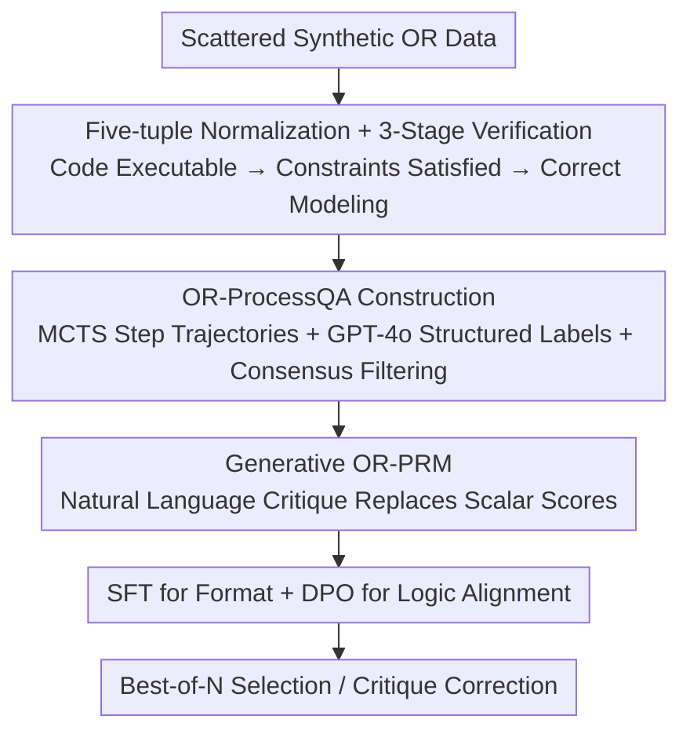

# OR-PRM: A Process Reward Model for Algorithmic Problem in Operations Research

**Conference**: ICLR 2026  
**OpenReview**: [https://openreview.net/forum?id=tFEAzYdz92](https://openreview.net/forum?id=tFEAzYdz92)  
**Code**: None  
**Area**: LLM Reasoning  
**Keywords**: Process Reward Model, Operations Research, Step-level Supervision, Data Synthesis, Generative PRM

## TL;DR
For Operations Research (OR) modeling tasks, the authors observed that over 30% of labels in existing OR datasets are severely incorrect, rendering directly trained PRMs nearly ineffective. They first cleaned seed data using a three-stage verification, then constructed the first OR-ProcessQA dataset with step-level correctness labels using MCTS and GPT-4o. This enabled the training of the first generative process reward model for OR, OR-PRM, which improves base model performance by approximately 12.5% on average in a Best-of-N setting.

## Background & Motivation
**Background**: Process Reward Models (PRMs) have significantly enhanced the reliability of LLM reasoning in mathematics and programming by scoring each step of the reasoning process rather than just the final answer. These models are widely used for Best-of-N sampling and offline data filtering. Since OR tasks involve translating natural language descriptions into mathematical models for solvers—requiring both correct final answers and self-consistent logical steps—they represent a natural application for PRMs.

**Limitations of Prior Work**: When the authors attempted to train the first OR-specific PRM, performance was significantly lower than expected, even with powerful LLM backbones. Systematic investigation identified the root cause as the data rather than the model: existing OR datasets are "dangerously unreliable." For instance, over 30% of samples in the IndustryOR dataset have incorrect final answers, alongside numerous incomplete or noisy reasoning steps. This noise prevents the PRM from learning "faithful reasoning," instead teaching it to accept solutions that look plausible but quietly violate hidden constraints or logic.

**Key Challenge**: PRM training depends heavily on step-level correctness labels. However, the OR field lacks large-scale step-level supervised data, and existing datasets suffer from widespread errors in final answers. This creates a deadlock: a judge cannot be trained to detect dirty data using dirty data.

**Goal**: (1) Create a set of OR data with trustworthy final answers and reliable step-level labels; (2) Train a PRM capable of incrementally evaluating and correcting OR reasoning; (3) Verify that step-level supervision improves the reliability of LLMs in OR.

**Key Insight**: Rather than training on dirty data, the foundation of "data credibility" must be solidified. Objective criteria, such as executable solver code, should be used to filter seed data, followed by search-based methods and strong model cross-validation to generate step-level labels.

**Core Idea**: Use a "code execution + constraint satisfaction + modeling correctness" screening process to clean seed data. Diverse reasoning trajectories are then expanded via MCTS, structured step-level labels are generated with GPT-4o, and consensus filtering is applied. Finally, a generative OR-PRM is trained to output natural language critiques and corrections rather than a single scalar score.

## Method

### Overall Architecture
The method revolves around a three-stage pipeline: **Building clean seed data → Expanding to OR-ProcessQA with step-level labels → Training the generative OR-PRM**. The input consists of scattered, quality-varying synthetic OR data, and the output is a judge model capable of identifying "where it is wrong, why it is wrong, and how to fix it" for every step of OR reasoning.

### Key Designs

**1. Five-tuple Normalization + 3-Stage Seed Verification: Using "Code Executability" as an Objective Filter**

OR data is often "dirty" in both final answers and intermediate steps. To avoid high manual verification costs, the authors adopt the LLMOPT generation strategy, representing each problem as a standard five-tuple $p=(S,\theta,x,f(x),g(x)\le c)$, where $S$ is the index set, $\theta$ denotes parameters, $x$ is the decision variable, $f(x)$ is the objective, and $g(x)\le c$ represents constraints. This defines an optimization task $\min_x f(x)\ \text{s.t.}\ g(x)\le c$. This solver-agnostic structure enables automated verification through three gates: **Code Execution** (code must run without errors, with the numerical solution $\hat{x}$ serving as the ground truth), **Constraint Satisfaction** (using Qwen3-8B to substitute $\hat{x}$ into $g(x)\le c$ to verify all constraints), and **Modeling Correctness** (using GPT-4o to judge if the five-tuple faithfully reflects the original problem). Only samples passing all three gates are retained.

**2. OR-ProcessQA: MCTS Sampling + GPT-4o Structured Annotation + Dual Consensus Filtering**

Seed data is sufficient for SFT but not for PRM training, which requires step-level labels. Following the OmegaPRM approach, the authors use MCTS to sample multiple trajectories for seed problems: correct steps are labeled 1.0, and the first error step in a failed path is labeled 0.0, resulting in over 550,000 labeled steps. To mitigate bias in MCTS labels, GPT-4o performs a structured review of each step, checking (1) Parameter Definition → (2) Objective & Constraints → (3) Code Generation → (4) Execution Output. GPT-4o stops at the first error and outputs four fields: Issue, Judgement, Corrected Version, and Corrected Step. **Consensus Filtering** is then applied: a step is retained only if $\text{Label}_{\text{MCTS}}(s)=\text{Label}_{\text{GPT-4o}}(s)$.

**3. Generative PRM: Natural Language Critique Instead of Scalar Scores**

Traditional PRMs assign a scalar score to each step. However, OR tasks require analyzing complex logical structures like variable relationships ($x$ over $S$) and constraint satisfaction ($g(x)\le c$). A single number cannot capture this complexity. Inspired by GM-PRM, the authors use generative modeling. Given problem $p$ and a step-by-step solution, the model sequentially analyzes four components: (1) Variable definitions, (2) Objective $f(x)$ and constraints $g(x)\le c$, (3) Code implementation, and (4) Final output. For each component, it produces an intent statement, analysis, and a binary judgment. If an error is detected, a corrected version is provided for the **first** flawed component.

**4. SFT + DPO Two-stage Training: Format First, Then Logic**

Training consists of two stages. **SFT** uses standard autoregressive next-token prediction to teach the model the format and style of critiques using the structured fields (Issue/Judgement/Corrected Version/Corrected Step). The loss is:
$$\mathcal{L}_{\text{SFT}}(\theta)=-\mathbb{E}_{(x,y)\sim D_{\text{SFT}}}\left[\sum_{t=1}^{T}\log P_\theta(y_t\mid x,y_{<t})\right]$$
**Alignment** uses DPO to improve logical reliability. Failure cases from the SFT model are used to construct preference pairs $(x,y_w,y_l)$, where $y_w$ is the correct step and $y_l$ is the flawed generated step. The optimization objective is:
$$\mathcal{L}_{\text{DPO}}(\pi_\theta;\pi_{\text{ref}})=-\mathbb{E}_{(x,y_w,y_l)\sim D}\left[\log\sigma\left(\beta\log\frac{\pi_\theta(y_w\mid x)}{\pi_{\text{ref}}(y_w\mid x)}-\beta\log\frac{\pi_\theta(y_l\mid x)}{\pi_{\text{ref}}(y_l\mid x)}\right)\right]$$
DPO pushes the model from merely mimicking the format to truly judging correctly, yielding an +8.0% improvement in ablation studies.

## Key Experimental Results

### Main Results
Using OR-PRM as a judge for Best-of-8 selection across six cleaned OR benchmarks (IndustryOR, Easy-LP, Complex-LP, NL4LP, NL4OPT, ReSocratic) showed consistent gains over various base models:

| Model | IndustryOR | Easy-LP | Complex-LP | NL4OPT | Overall |
|------|-----------|---------|-----------|--------|---------|
| Qwen2.5-7B | 19.0 | 49.7 | 12.6 | 41.3 | 34.9 |
| + OR-PRM | 23.8 | 61.8 | 16.2 | 52.1 | **42.9** (+8.0) |
| Qwen2.5-14B | 35.7 | 66.2 | 3.6 | 61.0 | 48.8 |
| + OR-PRM | 45.2 | 89.4 | 12.6 | 67.6 | **61.3** (+12.5) |
| Qwen2.5-32B | 47.6 | 80.0 | 8.2 | 68.5 | 59.6 |
| + OR-PRM | 57.1 | 96.0 | 32.4 | 74.2 | **70.3** (+10.7) |
| LLMOPT | 52.4 | 96.0 | 48.6 | 81.7 | 73.6 |
| + OR-PRM | 59.5 | 97.8 | 67.6 | 85.0 | **80.5** (+6.9) |

### Ablation Study
Analyzing DPO and performance variations on Qwen2.5-14B:

| Configuration | Easy-LP | Complex-LP | Average | Description |
|------|---------|-----------|---------|------|
| Pass@8 (Upper Bound) | 94.7% | 23.4% | 59.1% | Theoretical limit of 8 samples |
| OR-PRM (Ours, SFT+DPO) | 89.4% | 12.6% | 51.0% | Full model |
| OR-PRM (SFT only) | 79.6% | 6.3% | 43.0% | Without DPO (-8.0%) |
| self-consistency (filtered null) | 88.3% | 9.9% | 49.6% | Voting after filtering null results |
| self-consistency | 50.8% | 3.6% | 27.2% | Naive majority voting |

### Key Findings
- DPO is essential: Performance dropped from 51.0% to 43.0% with SFT-only, confirming that SFT teaches format while DPO aligns logic.
- OR-PRM consistently outperforms majority voting baselines, indicating it identifies real errors rather than exploiting simple patterns.
- Gains are higher on difficult tasks (e.g., Complex-LP), suggesting process-level feedback is especially effective for complex modeling errors.

## Highlights & Insights
- **Objective Grounds for Data Credibility**: Using "executable code + constraint satisfaction + semantic correctness" transforms OR labeling from subjective judgment into reproducible signals.
- **Dual Consensus Filtering**: Requiring alignment between MCTS search labels and GPT-4o review labels reduces noise more effectively than relying on a single source.
- **Generative Critique as a Corrector**: OR-PRM is not just for selection; in a Modeling-Critique-Code loop, it drives self-correction by identifying and fixing the specific component that failed.

## Limitations & Future Work
- Lack of external baselines: Since existing OR datasets weren't designed for PRMs, performance on OR-ProcessQA primarily relies on internal ablation.
- Gap to theoretical bound: Best-of-N performance (51.0%) remains below the theoretical Pass@8 limit (59.1%), indicating room for improvement in fine-grained error detection.
- Propagation of bias: The pipeline heavily depends on GPT-4o and LLMOPT; systematic errors in these models may propagate into the labels.

## Related Work & Insights
- **vs. Scalar PRMs**: Traditional PRMs provide a single score and target general math/coding. OR-PRM uses generative natural language critiques tailored for the specific structural components of OR problems.
- **vs. OR Data Synthesis**: While previous methods focus on generating more problems, this work addresses the 50%+ error rates in existing benchmarks, providing the first step-level supervision for OR.

## Rating
- Novelty: ⭐⭐⭐⭐ First process reward model and step-level dataset for OR.
- Experimental Thoroughness: ⭐⭐⭐⭐ Coverage of six benchmarks and multiple model scales, though external PRM comparisons are limited.
- Writing Quality: ⭐⭐⭐ Clear logic, though some redundancy in text.
- Value: ⭐⭐⭐⭐ Provides a reusable pipeline for data cleaning and step-level supervision in verifiable reasoning domains.

<!-- RELATED:START -->

<!-- RELATED:END -->

## Related Papers

- [\[ICLR 2026\] StepORLM: A Self-Evolving Framework with Generative Process Supervision for Operations Research Language Models](steporlm_a_self-evolving_framework_with_generative_process_supervision_for_opera.md)
- [\[ICLR 2026\] Why is Your Language Model a Poor Implicit Reward Model?](why_is_your_language_model_a_poor_implicit_reward_model.md)
- [\[ICML 2026\] GRPO is Secretly a Process Reward Model](../../ICML2026/llm_reasoning/grpo_is_secretly_a_process_reward_model.md)
- [\[ICLR 2026\] Optimal Aggregation of LLM and PRM Signals for Efficient Test-Time Scaling](optimal_aggregation_of_llm_and_prm_signals_for_efficient_test-time_scaling.md)
- [\[ICLR 2026\] Linking Process to Outcome: Conditional Reward Modeling for LLM Reasoning](linking_process_to_outcome_conditional_reward_modeling_for_llm_reasoning.md)

<!-- RELATED:END -->
