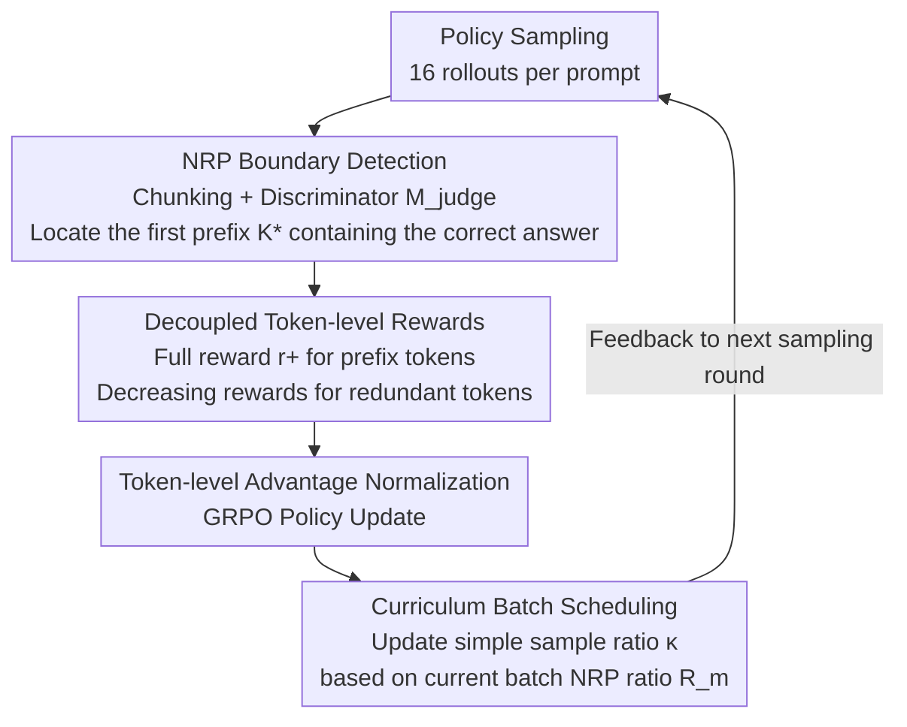

# Overthinking Reduction with Decoupled Rewards and Curriculum Data Scheduling

**Conference**: ICLR 2026 Oral  
**arXiv**: [2509.25827](https://arxiv.org/abs/2509.25827)  
**Code**: [github.com/pixas/DECS](https://github.com/pixas/DECS)  
**Area**: LLM Reasoning  
**Keywords**: overthinking, decoupled rewards, curriculum learning, RLVR, NRP

## TL;DR

Theoretically reveals two fundamental flaws of existing length penalty methods—incorrectly punishing high-entropy exploration tokens and incorrectly rewarding redundant tokens. Proposes the DeCS framework, which, through decoupled token-level rewards and curriculum batch scheduling, reduces inference tokens by more than 50% across 7 benchmarks while maintaining or even improving model performance.

## Background & Motivation

**Background**: Large Reasoning Models (LRMs) demonstrate powerful reasoning capabilities through RLVR. However, they suffer from a severe "overthinking" problem—models continue to generate excessive redundant reasoning steps after obtaining the correct answer, leading to low inference efficiency.

**Limitations of Prior Work**: Existing methods encourage concise reasoning by adding a length penalty to the correctness reward, $r'(\boldsymbol{o}_i) = r(\boldsymbol{o}_i) - \gamma |\boldsymbol{o}_i|$. However, efficiency gains often come at the expense of performance, failing to achieve an optimal efficiency-performance trade-off.

**Key Challenge**: A fundamental misalignment exists between trajectory-level length rewards and token-level policy optimization—(1) negative advantage backpropagates to all tokens, incorrectly suppressing correct high-entropy exploration tokens (e.g., "wait", "however"); (2) redundant tokens following the Necessary Reasoning Prefix (NRP) in shorter trajectories still receive positive advantage and are incorrectly reinforced.

**Goal**: How to accurately distinguish and punish redundant tokens while protecting necessary tokens that contribute to reasoning, achieving truly lossless inference compression.

**Key Insight**: Define the "Necessary Reasoning Prefix" (NRP) as the judgment criterion and decouple the reward at the NRP boundary, applying different reward signals to tokens before and after the NRP.

**Core Idea**: Train a lightweight discriminator to identify NRP boundaries, granting maximum rewards to tokens within the NRP and decreasing penalties to redundant tokens thereafter. This is combined with curriculum scheduling to control the proportion of simple samples to protect high-entropy exploration capabilities.

## Method

### Overall Architecture

DeCS first utilizes a lightweight judgment model $\mathcal{M}_{\text{judge}}$ to identify the "shortest prefix sufficient to derive the correct answer" (NRP) boundary for each correct trajectory. It then decouples token-level rewards at this boundary—tokens within the prefix receive full rewards, while subsequent redundant tokens receive decreasing rewards inversely proportional to their position. This is integrated with a curriculum scheduler that dynamically adjusts the proportion of simple samples based on the NRP ratio of the current batch. The entire pipeline is built upon GRPO: sampled correct trajectories are processed by the discriminator to locate the NRP, decoupled rewards are issued based on the boundary, and token-level advantages are calculated to update the policy. The scheduler then adjusts the sample mix for the next round based on current redundancy levels. These three components combined precisely suppress redundancy without harming exploration capabilities.

### Key Designs

**1. NRP Boundary Detection: Transforming Vague "Overthinking" into Actionable Token Labels** The root cause of the difficulty in handling overthinking is the lack of a definition for "which tokens are redundant." This paper formalizes it as the "Necessary Reasoning Prefix (NRP)"—the shortest sequence of chunks required to reach the correct answer first. Specifically, it fine-tunes a lightweight language model $\mathcal{M}_{\text{judge}}$, segments the reasoning process into chunks $\{s_1, \ldots, s_{|S|}\}$ using delimiters, and judges whether each chunk already contains the correct answer given the question $q$, prefix $s_c$, and ground truth $y^*$: $j_{s_c} \sim \mathcal{M}_{\text{judge}}(\cdot \mid q, s_c, y^*)$. The first chunk judged as "Yes" and all preceding chunks constitute the NRP, with the boundary denoted as $K_{o_i}^*$. This step refines the training signal from coarse trajectory-level to fine-grained token-level, providing a pivot for subsequent differentiated rewards.

**2. Decoupled Token-level Rewards: Rejecting Redundancy from the First Token** Existing length penalties harm performance because they apply rewards to the entire trajectory. Theorem 2 of this paper proves a more fatal issue: under sequence-level length rewards, the gradient signal for the first redundant token after the NRP is $\mathcal{J}(A; j=K^*+1) > 0$, meaning the model is actually encouraged to continue writing rather than stopping in time. DeCS splits the reward at the NRP boundary: tokens within the prefix ($j \leq K_{o_i}^*$) receive the maximum reward $r_{i,j} = r_+ \cdot \mathbf{1}_{\text{correct}}$; the "thinking" tokens after the prefix ($j > K_{o_i}^*$) receive a reward that decays with trajectory length $r_{i,j} = (r_0 - (r_+ - r_0)L_i/L_{\max}) \cdot \mathbf{1}_{\text{correct}}$. In this way, any leading redundant token after the NRP receives a negative advantage, and through the autoregressive property, the pressure to "stop early" is transmitted to the entire redundant segment, cutting off verbosity at its source.

**3. Curriculum Batch Scheduling: Providing Simple Samples as Needed to Protect High-Entropy Exploration Tokens** Simple samples (prompts where all rollouts are correct) are the main drivers of efficiency optimization because length becomes the only distinguishable signal. However, if simple samples are too frequent, the logit decrease of high-entropy exploration tokens (e.g., "wait", "however") will dominate the batch gradient, crushing the model's exploration capability. This paper uses Lemma 2 to prove that length penalties cause the expected logit change of high-entropy tokens to be strictly negative and provides a necessary and sufficient condition $\kappa \sigma_L < C$ to maintain their generation probability via Theorem 1. Accordingly, the scheduler updates the simple sample ratio as $\kappa_m = \text{clip}(\kappa_{m-1} + \beta(\mathcal{R}_m - \mathcal{R}_{m-1}), 0, \kappa_m^0)$, where $\mathcal{R}_m$ is the NRP ratio of correct sequences in the current batch: if redundancy is lower (higher NRP ratio), more simple samples are included for further compression; otherwise, the ratio is tightened to protect exploration, achieving a dynamic balance between compression and exploration. The theoretical foundation of this entire design is provided by Lemma 1—it establishes a linear relationship between logit changes and advantages under policy gradient, enabling the derivation of the aforementioned two theorems.

### Loss & Training

Training follows the GRPO-based PPO surrogate loss (Eq. 3), with token-level advantage normalization $A_{i,j}^{\text{DeCS}} = (r_{i,j} - \text{mean})/\text{std}$. Hyperparameters are set to $r_+=1.1$, $r_0=1.0$, and $\beta=0.2$. The training set is DeepScaleR (40k math problems), sampling 16 rollouts per prompt. Base models are DS-1.5B and DS-7B, using the veRL framework.

## Key Experimental Results

### Main Results

| Dataset | Metric | DeCS(1.5B) | Base(1.5B) | Best Baseline | Description |
|--------|------|------|------|------|------|
| 7 Bench Avg | Pass@1 | 47.78 | 45.21 | 45.83(ThinkPrune) | +2.57, gain in both efficiency and performance |
| 7 Bench Avg | #Token | 4000 | 9340 | 3975(ThinkPrune) | 57.17% reduction |
| 7 Bench Avg | AES | 0.74 | 0.00 | 0.62(ThinkPrune) | Optimal AES |
| AIME2024(1.5B) | Pass@1 | 31.25 | 27.99 | 29.87(TLMRE) | +3.26 improvement |
| AIME2024(1.5B) | #Token | 5550 | 12202 | 5306(ThinkPrune) | 54.5% reduction |
| 7 Bench Avg(7B) | Pass@1 | 62.48 | 61.57 | 62.17(ThinkPrune) | +0.91 |
| 7 Bench Avg(7B) | #Token | 3968 | 7857 | 4940(ThinkPrune) | 49.5% reduction |

### Ablation Study

| Configuration | Pass@1 | #Token | Description |
|------|------|------|------|
| DR Only (Decoupled Rewards) | Improvement but ~25% redundancy remains | Limited | High-entropy tokens over-suppressed without scheduling |
| CS Only (Curriculum Scheduling) | Performance drop | Limited reduction | Redundancy not accurately punished without decoupled rewards |
| DR+CS (Full DeCS) | Optimal | Maximum reduction | Mutual complementarity |
| Qwen3-4B Backbone | 69.72(+1.32) | 4115(54.8% reduction) | AES 0.61, good backbone generalization |

### Key Findings

- DeCS reduces tokens by >50% while maintaining or even improving Pass@1, and the Pass@K curves almost completely overlap with the base model, proving that exploration capability is not impaired.
- Although the NRP detector is trained on mathematical corpora, it remains effective on out-of-domain tasks (GPQA-D reduced by 56.33%, LCB reduced by 33.52%).
- Token analysis shows that DeCS primarily reduces "Self-Correction/Verification" and "Conclusion" class tokens, while the frequency of "Exploration/Alternative" class tokens remains almost unchanged.

## Highlights & Insights

- Theoretical analysis is the core contribution: Two theorems precisely characterize two failure modes of sequence-level length rewards, not only explaining why existing methods are sub-optimal but also directly guiding the design of decoupled rewards. This research paradigm of "theoretical proof of failure followed by targeted solution design" is noteworthy.
- The conceptual definition of NRP is simple yet profound—"the shortest prefix that first yields the correct answer"—precisely refining the vague concept of "overthinking" into operational token-level labels.

## Limitations & Future Work

- The quality of the NRP detector directly influences the method's effectiveness; detection errors might lead to the punishment of necessary reasoning.
- Current chunk segmentation relies on predefined delimiters (like newlines); finer-grained semantic segmentation might bring further improvements.
- Experiments only cover math, programming, and scientific reasoning; generalization to soft tasks such as natural language inference has not been verified.

## Related Work & Insights

- **vs ThinkPrune**: Although ThinkPrune reduces a similar amount of tokens, some reduction comes from necessary reasoning tokens (low PNRP scores), leading to a performance drop; DeCS precisely reduces the non-NRP part.
- **vs LC-R1**: LC-R1 leaves ~10% redundancy; DeCS further compresses it through decoupled rewards.
- **vs GRPO + Length Penalty**: Theoretically proven that GRPO + length penalty inevitably leads to high-entropy token degradation (Lemma 2); DeCS protects these tokens via NRP.

## Rating

- Novelty: ⭐⭐⭐⭐⭐ Decisive theoretical analysis guiding method design; the NRP concept and decoupled reward scheme are highly original.
- Experimental Thoroughness: ⭐⭐⭐⭐⭐ 7 benchmarks + 2 model scales + backbone generalization + 5 research questions analyzed; extremely comprehensive.
- Writing Quality: ⭐⭐⭐⭐⭐ Rigorous theoretical derivation, thorough analysis, and rich visualization.
- Value: ⭐⭐⭐⭐⭐ Solves the core efficiency problem of reasoning LLMs; high practical value in 50%+ compression without sacrificing performance.

<!-- RELATED:START -->

## Related Papers

- [\[ICLR 2026\] DRPO: Efficient Reasoning via Decoupled Reward Policy Optimization](drpo_efficient_reasoning_via_decoupled_reward_policy_optimization.md)
- [\[ICLR 2026\] CyclicReflex: Improving Reasoning Models via Cyclical Reflection Token Scheduling](cyclicreflex_improving_reasoning_models_via_cyclical_reflection_token_scheduling.md)
- [\[ICLR 2026\] Curriculum Reinforcement Learning from Easy to Hard Tasks Improves LLM Reasoning](curriculum_reinforcement_learning_from_easy_to_hard_tasks_improves_llm_reasoning.md)
- [\[ICLR 2026\] Random Policy Valuation is Enough for LLM Reasoning with Verifiable Rewards](random_policy_valuation_is_enough_for_llm_reasoning_with_verifiable_rewards.md)
- [\[ICLR 2026\] Your Models Have Thought Enough: Training Large Reasoning Models to Stop Overthinking](your_models_have_thought_enough_training_large_reasoning_models_to_stop_overthin.md)

<!-- RELATED:END -->
