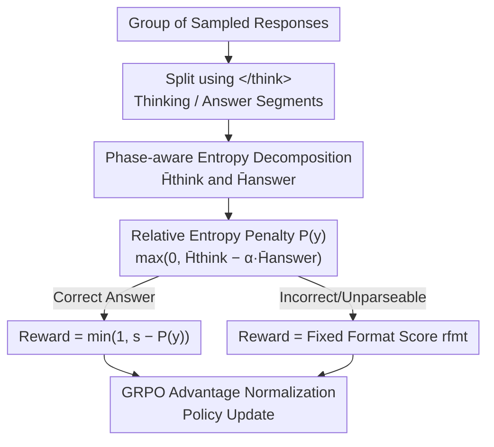

# PEAR: Phase Entropy Aware Reward for Efficient Reasoning

**Conference**: ICLR 2026  
**OpenReview**: [https://openreview.net/forum?id=HLc2igXEA3](https://openreview.net/forum?id=HLc2igXEA3)  
**Code**: https://github.com/iNLP-Lab/PEAR  
**Area**: LLM Reasoning  
**Keywords**: Efficient Reasoning, Entropy Reward, GRPO, Thinking Phase, Length Compression

## TL;DR
This paper discovers that token entropy in Large Reasoning Models (LRMs) positively correlates with response length, and entropy during the "thinking phase" is significantly higher than in the "final answer phase." Based on this, PEAR is proposed—a reward mechanism that incorporates phase-aware entropy into Group Relative Policy Optimization (GRPO). By penalizing excessive entropy in the thinking phase while maintaining adequate exploration in the answer phase, PEAR reduces response length by 32%–57% across six benchmarks with negligible accuracy loss (<1%) and strong robustness to out-of-distribution (OOD) tasks.

## Background & Motivation
**Background**: Large Reasoning Models (LRMs) such as DeepSeek-R1, Qwen3, and QwQ have significantly improved complex reasoning capabilities through an explicit "thinking phase" (long-chain CoT between `<think>...</think>` tags), which has become the mainstream paradigm for mathematical and scientific reasoning.

**Limitations of Prior Work**: These models tend to generate excessively long chains of thought, filled with repetitive calculations and verbose explanations, leading to high inference costs and reduced usability. Making models "think less without losing accuracy" remains a major challenge.

**Key Challenge**: Current compression methods primarily rely on "training on filtered concise data"—modifying training corpora into short reasoning trajectories and using supervised signals to enforce length constraints. This approach faces two fundamental issues: first, rigid supervision makes it difficult for models to adapt to new reasoning styles or out-of-distribution (OOD) problems where optimal reasoning lengths may vary; second, it risk losing intermediate steps that contribute to accuracy. In other words, there is a trade-off between "data-level hard constraints" and "reasoning flexibility."

**Goal**: To find an adaptive mechanism that does not rely on manual data filtering, explicit length targets, or hard truncations, allowing the model to learn concise reasoning autonomously.

**Key Insight**: The authors focus on token-level entropy (uncertainty in the predictive distribution). Prior work noted that high-entropy segments correspond to exploratory reasoning while low-entropy segments correspond to deterministic computation, but the link between entropy and efficient reasoning has been overlooked. The authors provide systematic empirical evidence: (1) across model scales and benchmarks, average entropy consistently correlates positively with response length; (2) this relationship is uneven across reasoning phases—entropy in the thinking phase is significantly higher than in the answer phase; (3) filtering a certain percentage of high-entropy tokens does not harm performance up to a specific threshold, suggesting that excess entropy can be pruned without damaging reasoning quality.

**Core Idea**: Treat entropy as a "knob" to control reasoning redundancy—penalizing excess entropy in the thinking phase and allowing moderate entropy in the answer phase to achieve soft, adaptive compression of reasoning length.

## Method

### Overall Architecture
PEAR does not modify the RL algorithm framework but adjusts the scalar reward for each sampled response in GRPO. GRPO estimates advantages by normalizing rewards across a group of responses for the same prompt, eliminating the need for a critic model. The original reward is a rule-based binary signal (1 for correct, 0 for incorrect). The core modification in PEAR is: given a correct answer, the reward is fine-tuned using a penalty term calculated from phase-aware entropy. Responses that are both correct and have lower thinking-phase entropy (more concise) receive higher rewards. The process involves: sampling a group of responses $\rightarrow$ splitting each response into a thinking segment and an answer segment using the `</think>` token $\rightarrow$ calculating average entropy for both segments $\rightarrow$ combining them into a phased penalty term $\rightarrow$ subtracting this penalty from the base score for correct answers (or giving a fixed format score for incorrect ones) $\rightarrow$ feeding the new rewards back into the GRPO advantage normalization.

### Key Designs

**1. Phase-aware Entropy Decomposition: Separating Exploration from Convergence**

To address the limitation where prior methods treated all tokens equally or ignored entropy, PEAR distinguishes between the "exploratory thinking phase" and the "deterministic answer phase." Using the position $k$ of the `</think>` closing token as a boundary, a response $y=(y_1,\dots,y_T)$ is split into two segments. Per-token entropy $H_t = -\sum_{v\in V}\pi_{\theta_{old}}(v\mid y_{<t})\log\pi_{\theta_{old}}(v\mid y_{<t})$ is calculated under the old policy $\pi_{\theta_{old}}$, and the average entropy for each segment is computed (excluding the `</think>` token itself):

$$\bar H_{think}=\frac{1}{k-1}\sum_{t=1}^{k-1}H_t,\qquad \bar H_{answer}=\frac{1}{T-k}\sum_{t=k+1}^{T}H_t.$$

This step is effective because empirical evidence shows the statistical properties of entropy differ significantly between these phases; separate measurement allows for pruning redundant exploration without sacrificing necessary flexibility in the final answer.

**2. Relative Entropy Penalty: Using Answer Entropy as a Baseline to Prevent Entropy Collapse**

If the absolute value of $\bar H_{think}$ were penalized directly, the model might minimize entropy indiscriminately to maximize rewards, triggering "reward gaming" or "entropy collapse"—where the model converges prematurely, reasoning becomes brittle, and accuracy drops. PEAR defines the penalty as the difference between the two phase entropies:

$$P(y)=\max\big(0,\ \bar H_{think}-\alpha\,\bar H_{answer}\big).$$

Subtracting $\alpha\bar H_{answer}$ does not encourage answer uncertainty but rather "relativizes" the thinking phase entropy using the natural entropy level required to express a correct answer as a baseline. The penalty only activates when thinking entropy is disproportionately higher than answer entropy. The $\max(0,\cdot)$ ensures a non-negative penalty, keeping the reward within the standard $[0,1]$ range to avoid pathological advantage scaling.

**3. Phase-Aware Reward and Boundary Handling: Entropy Shaping Only for Correct Answers**

PEAR only applies entropy shaping when the answer is correct; incorrect answers receive a fixed format score. Given a base score $s\in(0,1]$ for correct answers and a format score $r_{fmt}\in[0,1)$ for incorrect/malformed responses, the reward is:

$$r(y)=\begin{cases}\min\big(1,\ s-P(y)\big), & \text{Extracted Answer = Ground Truth}\\ r_{fmt}, & \text{Otherwise}\end{cases}$$

The $r(y_i)$ replaces $r_i$ in the GRPO advantage formula $A_i=\frac{r(y_i)-\mathrm{mean}(\{r(y_j)\})}{\mathrm{std}(\{r(y_j)\})}$. The policy is updated using the standard clipped-surrogate objective. This design ensures correctness remains the primary signal, while the entropy term acts as a "second-order preference" among correct responses. Boundary cases are handled cleanly: if a response lacks a `</think>` tag, $k=T$ and $\bar H_{answer}=0$ (only thinking entropy applies); if it is unparseable, it receives $r_{fmt}$. Since most responses lacking closing tokens are incomplete or incorrect, they naturally fall into the fixed-score category.

### Loss & Training
The base algorithm is GRPO, using a clipped-surrogate objective with KL regularization:

$$J_{GRPO}(\theta)=\mathbb{E}\Big[\tfrac{1}{G}\sum_{i=1}^{G}\tfrac{1}{|o_i|}\sum_{t}\big(\min[r_{i,t}\hat A_{i,t},\ \mathrm{clip}(r_{i,t},1-\epsilon,1+\epsilon)\hat A_{i,t}]-\beta D_{KL}(\pi_\theta\|\pi_{ref})\big)\Big]$$

PEAR replaces the sample-level scalar reward with $r(y)$. Training utilizes the verl framework with 7,473 samples from the GSM8K training set, a batch size of 128, a learning rate of $1\times10^{-6}$, and an answer entropy coefficient $\alpha=1$.

## Key Experimental Results

### Main Results
Performance of PEAR across three scales of LRMs (DeepSeek-R1-Distill-Qwen-1.5B, Qwen3-4B, Qwen3-8B) across six benchmarks showing Acc@1 and generated tokens (↓ indicates reduction relative to Original):

| Model | Method | Avg Acc | Avg Tok | Tok Gain |
|------|------|----------|----------|----------|
| DS-1.5B | Original | 55.73 | 4805 | — |
| DS-1.5B | LCPO | 56.03 | 3591 | ↓25.3% |
| DS-1.5B | **PEAR** | 56.45 | **3250** | **↓32.4%** |
| Qwen3-4B | Original | 74.85 | 7428 | — |
| Qwen3-4B | LCPO | 74.65 | 4485 | ↓39.6% |
| Qwen3-4B | **PEAR** | 74.27 | **3221** | **↓56.6%** |
| Qwen3-8B | Original | 77.48 | 6845 | — |
| Qwen3-8B | Step Entropy | 76.85 | 4738 | ↓30.8% |
| Qwen3-8B | **PEAR** | 77.56 | **3200** | **↓53.3%** |

PEAR achieves the largest length reduction across all models, with an average accuracy drop of only 0.58%. Notably, on Qwen3-8B, PEAR slightly improves accuracy from 77.48 to 77.56 while cutting tokens by over half, whereas Step Entropy and LCPO suffer significant accuracy drops (~3 points). Larger models exhibit more "over-explanation" and benefit more from PEAR (exceeding 50% reduction for 4B/8B).

### Ablation Study
Effect of the coefficient $\alpha$ (answer phase entropy baseline) on Qwen3-4B:

| $\alpha$ | Accuracy (%) | Avg Tokens | Note |
|----------|-----------|-------------|------|
| -1.0 | 73.5 | 2307 | Both phases penalized; over-constrained and unreliable |
| 0.0 | 77.4 | 2843 | Only thinking phase penalized; loses answer flexibility |
| 0.5 | 78.1 | 3098 | — |
| **1.0** | **80.5** | 3498 | Optimal point: reduces redundancy while maintaining performance |
| 2.0 | 79.9 | 3612 | Weak penalty; degrades towards baseline |

### Key Findings
- **Redundancy is Concentrated in Thinking**: Entropy filtering experiments (Qwen3-4B) show that retaining 80%/60% of low-entropy tokens maintains or improves accuracy (88.2%, 87.1% vs. baseline 81.1%); performance only drops when pruned below 40%. The answer segment length remains nearly constant during filtering, proving redundancy lies primarily in the thinking phase.
- **PEAR Reduces Both Steps and Per-step Tokens**: Post-training, Qwen3-4B shows a decrease in both reasoning steps and average tokens per step (50.1 → 35.7). On AIME24, thinking steps are reduced by more than half.
- **Relative Entropy Adjustment**: After training, overall entropy decreases, but the reduction is steepest in the thinking phase; answer phase entropy actually increases slightly, validating the "prune exploration, preserve convergence" design.
- **Robustness of $\alpha\approx1$**: Small $\alpha$ leads to premature convergence and performance drops; large $\alpha$ nullifies the penalty. $\alpha=1$ is consistently stable across benchmarks and model scales.
- **OOD Robustness**: Although trained only on GSM8K, performance remains stable across mathematics (MATH500/AIME24/AMC23) and knowledge-based (GPQA/MMLU) benchmarks, identifying phase-aware entropy as a domain-agnostic control signal.

## Highlights & Insights
- **Converting Internal Signals to Reward Knobs**: PEAR elegantly avoids external length labels or truncation rules by leveraging the model's own entropy—an inherent internal metric—for soft guidance. Using internal states for reward shaping makes the method naturally robust to OOD scenarios.
- **Relativization to Prevent Reward Gaming**: Using $\bar H_{answer}$ as a baseline for $\bar H_{think}$ rather than penalizing absolute entropy is a simple but critical design choice that prevents the common RL pitfall of "entropy collapse."
- **Hierarchical Reward Structure**: The design of "correctness as the primary signal + entropy as a second-order preference" provides an elegant template for efficient reasoning rewards, ensuring that compression does not come at the cost of accuracy.

## Limitations & Future Work
- **Dependency on Explicit Phase Boundaries**: The method is tied to the `</think>` token and is not directly applicable to models without explicit thinking phases. The fallback mechanism for missing tokens is relatively basic.
- **Limited Training Diversity**: Evaluated primarily on GSM8K (primary school math). While OOD robustness was demonstrated, performance on more complex or long-range tasks requires further validation.
- **Hyperparameter Tuning**: While $\alpha\approx1$ is generally effective, it remains a global hyperparameter that might require per-model tuning rather than being fully automated.
- **Entropy as a Proxy**: The assumption that entropy equals redundancy holds generally, but in certain tasks, high entropy may reflect necessary multi-path exploration. Pruning risks in such domains require more granular discrimination.

## Related Work & Insights
- **vs. Data-Filtering Compression**: Prior works modify training corpora with shorter trajectories. PEAR leaves data untouched and uses rewards for soft guidance, preserving adaptability to new reasoning styles and OOD problems.
- **vs. LCPO (Length-Controlled Policy Optimization)**: LCPO requires user-specified length constraints. PEAR requires no length targets and adaptively determines pruning based on entropy, achieving greater compression and smaller accuracy drops in large models.
- **vs. Step Entropy**: Step Entropy uses two-stage training and `[SKIP]` tokens. PEAR is more lightweight as it only modifies rewards and achieves better results (no accuracy drop on Qwen3-8B compared to Step Entropy's 3.3-point drop).

## Rating
- Novelty: ⭐⭐⭐⭐ The "phase-aware entropy + relative penalty" reward design is novel and supported by solid empirical observations.
- Experimental Thoroughness: ⭐⭐⭐⭐ Covers three scales and six benchmarks with comprehensive analysis of filtering, hyperparameters, and steps.
- Writing Quality: ⭐⭐⭐⭐ Clear logic from observation to method, with well-defined formulas and boundary handling.
- Value: ⭐⭐⭐⭐ A plug-and-play reward mechanism for efficient reasoning that significantly reduces length without sacrificing accuracy.

<!-- RELATED:START -->

## Related Papers

- [\[ICLR 2026\] DRPO: Efficient Reasoning via Decoupled Reward Policy Optimization](drpo_efficient_reasoning_via_decoupled_reward_policy_optimization.md)
- [\[ACL 2026\] ETR: Entropy Trend Reward for Efficient Chain-of-Thought Reasoning](../../ACL2026/llm_reasoning/etr_entropy_trend_reward_for_efficient_chain-of-thought_reasoning.md)
- [\[ICLR 2026\] Making Slow Thinking Faster: Compressing LLM Chain-of-Thought via Step Entropy](making_slow_thinking_faster_compressing_llm_chain-of-thought_via_step_entropy.md)
- [\[ICLR 2026\] Retrieval-of-Thought: Efficient Reasoning via Reusing Thoughts](retrieval-of-thought_efficient_reasoning_via_reusing_thoughts.md)
- [\[ICLR 2026\] Harder Is Better: Boosting Mathematical Reasoning via Difficulty-Aware GRPO and Multi-Aspect Question Reformulation](harder_is_better_boosting_mathematical_reasoning_via_difficulty-aware_grpo_and_m.md)

<!-- RELATED:END -->
