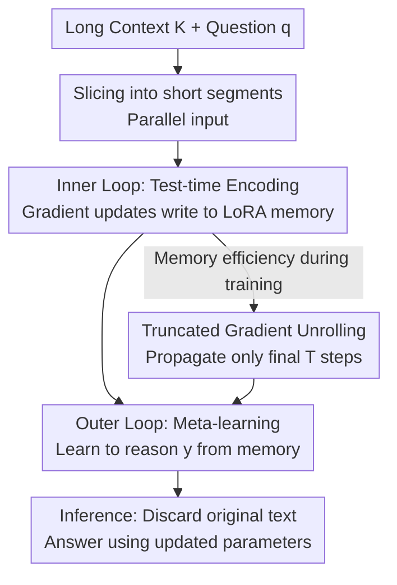

# PERK: Long-Context Reasoning as Parameter-Efficient Test-Time Learning

**Conference**: ICLR 2026  
**OpenReview**: [https://openreview.net/forum?id=qxDTe8fIyA](https://openreview.net/forum?id=qxDTe8fIyA)  
**Code**: https://perk-long-context.web.app (Project Page)  
**Area**: LLM Reasoning / Long Context / Meta-Learning  
**Keywords**: Long-context reasoning, test-time learning, meta-learning, LoRA, truncated gradient unrolling

## TL;DR
PERK reformulates long-context reasoning as "test-time learning": instead of cramming ultra-long text into the context window during inference, it uses gradient descent to "write" the context into a LoRA adapter, allowing the model to recall and reason from this parameterized memory. Combined with a bi-level meta-learning framework and truncated gradient unrolling, a 0.5B Qwen model achieves a ~20% average improvement in long-context reasoning over same-scale in-context fine-tuning baselines, outperforming specialized 7B+ long-context models.

## Background & Motivation
**Background**: There are two main approaches to enable LLMs to handle long contexts. One is expanding the context window—via positional interpolation, modified attention, or continued training on long documents (referred to as FT-ICR: Fine-Tuning for In-Context Reasoning). The second is adopting more efficient architectures (Linear Attention, RNNs, SSMs like Mamba). Both treat "long text" as a sequence of tokens to be processed within the context window at inference time.

**Limitations of Prior Work**: As context length increases, performance degrades due to increased distracting information and higher reasoning hops. More critically, long-context models exhibit strong positional bias, focusing on the beginning and end while often ignoring middle information (lost-in-the-middle). Consequently, even models claiming 128K, 512K, or 1M windows perform poorly in precise localization and multi-hop reasoning within noisy data.

**Key Challenge**: The authors point out a counter-intuitive observation—the same CLM compresses massive knowledge into its parameters during pre-training and can retrieve/reason from them, yet it frequently fails with long contexts whose information volume is much smaller than the pre-training corpus. This suggests that **reasoning using "knowledge in parameters" is more reliable than "knowledge in context."** This implies that encoding long text into parameters may be superior to leaving it in the context window.

**Goal**: Split long-context reasoning into two steps: (1) encoding context into model parameters via gradient updates at test time; (2) discarding the original text and answering questions solely based on the updated parameters. The difficulty lies in the fact that direct test-time updates of all parameters using bi-level optimization (like MAML) incur explosive memory costs due to backpropagating through long optimization trajectories, making it unscalable to LLMs and long contexts.

**Key Insight**: Since the bottleneck is "what to update + how deep to backpropagate," parameter efficiency is applied to both—encoding context only into a lightweight LoRA adapter (instead of the whole model) and backpropagating through only the last few steps of the inner-loop trajectory.

**Core Idea**: Replace "cramming long text into the context window" with "writing context into LoRA memory at test-time + meta-learning to reason from this memory."

## Method

### Overall Architecture
PERK (Parameter-Efficient Reasoning over Knowledge) is a bi-level meta-learning algorithm. A reasoning problem is denoted as $r=(K,q,y)$, where $K$ is the long context, $q$ is the question, and $y$ is the answer. PERK runs two nested loops during training: the **inner loop** chunks the long context $K$ into short segments and performs a few steps of gradient updates on a LoRA adapter using a causal language modeling loss to "memorize" the context into the adapter (termed a memory scratchpad); the **outer loop** optimizes the initial state of the adapter such that the model learns to answer $q$ **without viewing the original text, relying only on parameterized memory**. Both loops update only LoRA parameters while the base model remains frozen.

A key transition is that long text is not read sequentially token-by-token but is sliced into multiple segments shorter than the native window and processed in **parallel** via gradient encoding. This allows PERK to handle sequences far exceeding the model's native window. Since it processes "a batch of segments" rather than a "continuous sequence," the encoding is naturally permutation-invariant to segment order, reducing sensitivity to information position. At inference, only the inner segment is executed (encoding $K$ into LoRA), the original text is discarded, and the parameters carry the information.

### Key Designs

**1. LoRA Memory Scratchpad: Writing context only into low-rank adapters**

The most direct pain point is the memory cost: test-time learning requires gradient updates. Updating the full model and backpropagating in MAML causes memory to explode linearly with parameter count. PERK restricts the updateable parameters to a LoRA adapter: let base parameters be $\theta_{base}$ (frozen) and adapter parameters be $\theta_{adapter}$. The inner loop (test-time) objective is causal language modeling $L_{NLL}(K,(\theta_{base},\theta_{adapter}))$, but gradients only update $\theta_{adapter}$. The adapter acts as a writable "memory scratchpad." The outer loop meta-learns a **good initial state** for $\theta_{adapter}$:

$$\theta^*_{adapter}=\arg\min_{\theta_{adapter}}\ \mathbb{E}_{r\sim R}\Big[L_{reason}\big(\theta_{base},\ \phi_{adapter}((\theta_{base},\theta_{adapter}),K),\ \{(q,y)\}\big)\Big]$$

where $\phi_{adapter}(\cdot)=\mathrm{Alg}(L_{NLL},K,(\theta_{base},\theta_{adapter}),h)$ represents the adapter parameters after inner-loop adaptation to $K$. This low-rank, frozen-base approach keeps memory usage low and ensures the "context memory" can be quickly rewritten and discarded between different problems.

**2. Slicing long sequences into permutation-invariant segment batches**

Sequential processing is limited by the native window (e.g., 32K) and inherits "lost-in-the-middle" positional biases. PERK splits $K$ into a batch of short sub-sequences and calculates $\nabla L_{NLL}$ over this "batch" for gradient encoding. This offers two benefits: first, individual segment lengths can be much smaller than the native window (e.g., 128 tokens), allowing 128K sequences to be ingested via gradient accumulation. Second, because information is encoded into parameter space as a "permutation-invariant batch," the impact of absolute position is significantly weakened. This makes PERK robust to positional distribution shifts, whereas FT-ICR performance collapses (up to 90% drop) when information moves to unseen positions.

**3. Truncated Gradient Unrolling (TGU): Enabling bi-level optimization for LLMs**

Even with LoRA, calculating outer-loop gradients through $N$ inner-loop steps involves high-order derivatives and storing the entire trajectory. Let the $N$ inner steps be $\phi^{(0)}_{adapter}=\theta_{adapter}$ and $\phi^{(n+1)}_{adapter}=\phi^{(n)}_{adapter}-\alpha\,g^{(n)}$. The outer meta-gradient follows the chain rule as a product of Jacobians:

$$\nabla_{\theta_{adapter}}L_{reason}=\frac{\partial L_{reason}}{\partial \phi^{(N)}_{adapter}}\prod_{n=0}^{N-1}J^{(n)},\qquad J^{(n)}=I-\alpha H^{(n)}$$

where $H^{(n)}$ is the Hessian of the inner loss. Saving every $J^{(n)}$ causes memory to grow linearly with $N$. PERK uses a truncation strategy: the inner loop runs for $N$ steps, but **only the computation graph of the last $T\ll N$ steps is retained**. Jacobians for $n<N-T$ are treated as constants (identity or truncated):

$$\nabla_{\theta_{adapter}}L_{reason}\approx\frac{\partial L_{reason}}{\partial \phi^{(N)}_{adapter}}\underbrace{\prod_{n=N-T}^{N-1}J^{(n)}}_{\text{Last } T \text{ steps}}$$

This introduces a slight bias in the meta-gradient but drastically reduces memory, enabling PERK to scale to larger models and longer contexts. This, along with Design 1 (LoRA), forms the two scalable pillars of PERK: one reduces "what to update," the other reduces "how deep to backpropagate."

### Loss & Training
The inner/test-time objective is the Causal Language Modeling NLL on the context. The outer objective is the reasoning loss $L_{reason}$ (predicting the answer token using the updated adapter). The inner loop uses AdamW to optimize $\theta_{adapter}$ (4 steps during inference). The outer loop uses truncated unrolling (retaining the last $T$ steps) to compute meta-gradients. During inference, context is sliced into 128-token segments, and gradient accumulation (2–16 steps) is used to trade runtime for memory efficiency.

## Key Experimental Results

### Main Results
Evaluation covers three long-context reasoning categories: NIAH (BabiLong: single/two/three-hop QA), Multi-Doc Open Domain QA (HotpotQA, TriviaQA), and the newly proposed Drops-in-the-Ocean (DIO: Student Records). All PERK and FT-ICR models were trained on 8K context.

| Setting | Comparison | PERK vs. FT-ICR |
|------|------|------------------|
| NIAH (32K extrapolation, avg) | Both 8K trained | +23% |
| Multi-Doc (8K, 0.5B) | FT-ICR | +20% absolute |
| Multi-Doc (8K, 7B) | FT-ICR | +15% absolute |
| Multi-Doc (32K extrapolation, 0.5B / 7B) | FT-ICR | +30% / +14% |
| Multi-Doc | Qwen-1M / ProLong | Gap only 3% (Hotpot) / 1.5% (Trivia) |

PERK (Qwen-0.5B) achieved up to a 20% average absolute improvement over same-scale FT-ICR, matching or exceeding specialized 7B+ models trained on long context. The 7B version outperformed commercial models like GPT-4 and Gemini in specific symbolic reasoning tasks.

### Length Extrapolation (BabiLong, 8K Training → 64K/128K Test)

| Model | QA1@128K | QA2@128K |
|------|----------|----------|
| GPT-4.1 | 69.4 | 48.2 |
| Gemini-1.5-pro | 73.1 | 40.2 |
| Qwen2.5-7B-Instruct-1M | 21.4 | 12.2 |
| ProLong-8B-512K | 24.3 | 17.7 |
| FT-ICR (Qwen-0.5B) | 0 | 0 |
| FT-ICR + Yarn+DCA | 25.4 | 18.5 |
| **PERK (Qwen-0.5B)** | **61.4** | **44.4** |

PERK-0.5B, trained on only 8K, maintained 61.4/44.4 at 128K, crushing FT-ICR (which dropped to 0) and outperforming open-weight models trained on 256K/512K, approaching the performance of GPT-4.1.

### Key Findings
- **Advantage scales with difficulty**: The gap between PERK and FT-ICR increases as task complexity grows (Aggregate > Relation > Recall in DIO), suggesting PERK specifically enhances complex reasoning over simple retrieval.
- **Positional Robustness**: FT-ICR performance drops by up to 90% when information shifts; PERK is nearly unaffected due to "permutation-invariant batch encoding."
- **Stability across scales**: FT-ICR performance varies wildly (e.g., 18.2% on GPT-2, 89.8% on LLaMA-8B); PERK remains consistently high across models, leading FT-ICR by 9.3% even on LLaMA-8B.
- **Efficiency for ultra-long context**: At 128K, FT-ICR fails with OOM. PERK (16-step accumulation) finishes in 20.9s using 35.2GB VRAM. At 8K, increasing accumulation from 1 to 16 steps reduces VRAM from 35.2GB to 5.9GB (runtime 1.9s to 8.5s).

## Highlights & Insights
- **Turning "Reading" into "Writing"**: The core reframe is elegant: long-context reasoning = test-time learning. It bypasses the limitations of context windows and positional biases, as information in parameters is independent of token positions.
- **Dual Parameter Efficiency**: LoRA (what to update) and TGU (how deep to backprop) are the two legs that make expensive MAML-style trajectories scalable to LLMs.
- **Permutation-Invariant Encoding**: Slicing long sequences into unordered batches naturally solves "lost-in-the-middle" issues. This "side effect" is perhaps more elegant than the method itself.
- **Small Models beating Large Models**: 0.5B models trained on 8K outperform 1M specialized models at 128K, suggesting "parameterized memory + test-time adaptation" is a more cost-effective path than simply scaling context windows or data.

## Limitations & Future Work
- **Inference overhead**: PERK requires gradient updates for every query to encode the context, making it slower than FT-ICR for short contexts. It is only beneficial for ultra-long contexts where it saves memory and total time.
- **Runtime-Memory Trade-off**: Gradient accumulation saves VRAM but increases runtime (8K: 1.9s → 8.5s). Deployment requires length-dependent parameter tuning.
- **Decay at 128K**: While strong, there is still an noticeable drop-off at 128K compared to in-distribution (8K) performance; ultra-long context is not yet "solved."
- **Hyperparameter Sensitivity**: Batch slicing, inner steps ($N$), and unrolling window ($T$) require tuning; systematic sensitivity analysis is partially deferred to the appendix.

## Related Work & Insights
- **vs. FT-ICR**: FT-ICR keeps text in context and aligns position with answers, causing fragility to distribution shifts. PERK uses parameterized memory and permutation invariance for superior extrapolation and robustness.
- **vs. MAML / Chen et al. 2023b**: Classical test-time learning attempts full-parameter updates on long trajectories, which are unscalable. PERK makes this scalable via LoRA + TGU.
- **vs. Titans / TTT-RNN / ATLAS**: These integrate differentiable memory into the architecture and often require training from scratch. PERK enhances existing pretrained LLVs without architectural changes or massive retraining.

## Rating
- Novelty: ⭐⭐⭐⭐⭐ Reframing long-context reasoning as parameter-efficient test-time learning is a cohesive and fresh perspective.
- Experimental Thoroughness: ⭐⭐⭐⭐⭐ Covers NIAH, Multi-Doc, and new DIO tasks across various model sizes/families, including extrapolation to 128K and efficiency metrics.
- Writing Quality: ⭐⭐⭐⭐ Clear motivation and formulas; heavy reliance on text to explain dense charts.
- Value: ⭐⭐⭐⭐⭐ Demonstrates that a 0.5B model can beat specialized 1M-context giants, offering a high-ROI alternative for long-context research.

<!-- RELATED:START -->

## Related Papers

- [\[ICLR 2026\] InftyThink: Breaking the Length Limits of Long-Context Reasoning in Large Language Models](inftythink_breaking_the_length_limits_of_long-context_reasoning_in_large_languag.md)
- [\[ICLR 2026\] Is In-Context Learning Learning?](is_in-context_learning_learning.md)
- [\[ICLR 2026\] CaTS: Calibrated Test-Time Scaling for Efficient LLM Reasoning](cats_calibrated_test-time_scaling_for_efficient_llm_reasoning.md)
- [\[ICLR 2026\] Plan and Budget: Effective and Efficient Test-Time Scaling on Reasoning LLMs](plan_and_budget_effective_and_efficient_test-time_scaling_on_reasoning_large_lan.md)
- [\[ICLR 2026\] Efficient Test-Time Scaling for Small Vision-Language Models](efficient_test-time_scaling_for_small_vision-language_models.md)

<!-- RELATED:END -->
