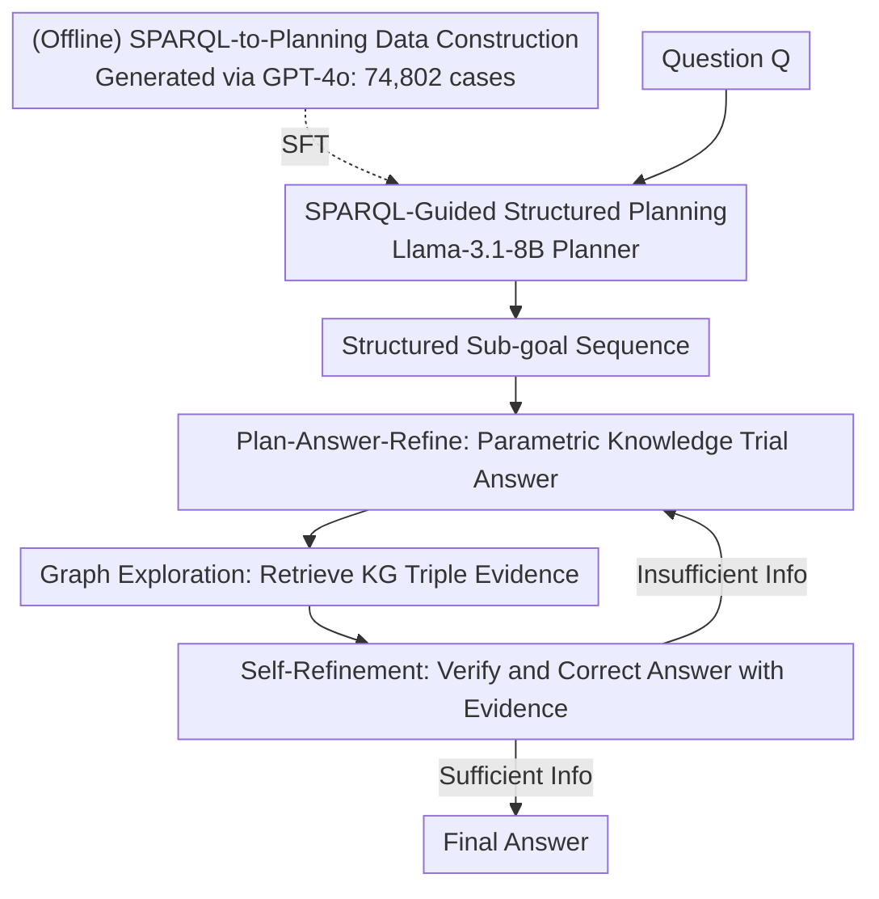

# Plan-Answer-Refine-on-Graph: Structured Planning and Self-Refinement for Large Language Model Reasoning on Knowledge Graphs

**Conference**: ICLR 2026  
**OpenReview**: [https://openreview.net/forum?id=g6XnP7Sgui](https://openreview.net/forum?id=g6XnP7Sgui)  
**Code**: https://github.com/shiyuxin2000/PARoG  
**Area**: LLM Reasoning / KGQA  
**Keywords**: KGQA, Knowledge Graph Enhancement, Structured Planning, SPARQL, Self-Refinement

## TL;DR
PARoG trains a small planner using SPARQL queries as supervision signals to decompose complex questions into composable structured sub-goals. It utilizes a "Plan-Answer-Refine" loop where the LLM first attempts to answer using parametric knowledge and subsequently corrects errors using knowledge graph evidence. This approach significantly outperforms SOTAs like PoG on WebQSP, CWQ, and GrailQA, particularly showing substantial improvements in complex logical queries involving conjunction, comparison, and superlatives.

## Background & Motivation

**Background**: Integrating Knowledge Graphs (KG) into LLM reasoning is a mainstream approach to mitigate hallucinations and supplement factual knowledge. Existing LLM⊗KG methods generally fall into two categories: step-by-step graph exploration (e.g., ToG), where the LLM traverses an "entity-relation-entity" path, and global planning (e.g., RoG, PoG), where the problem is decomposed into sub-goals before following a planned path for querying.

**Limitations of Prior Work**: The authors identify two fundamental flaws through systematic analysis. The first is **Search Space Truncation Bias**: existing methods construct linear entity-relation paths and use top-k pruning to control combinatorial explosion. However, this greedy pruning often **eliminates correct entities prematurely**. For example, when searching for "countries bordering France with airports serving Nijmegen," the correct answer, Germany, might be eliminated during early pruning. The second is **Error Amplification**: current methods follow a retrieve-and-answer paradigm where LLMs over-rely on retrieved evidence. Once spurious or weakly related entities/relations are introduced into the path, errors propagate through subsequent steps, leading to incorrect final answers.

**Key Challenge**: Linear paths cannot represent complex logical structures such as conjunction, composition, comparative, and superlative operations, which are prevalent in real-world KGQA. Simultaneously, "unconditional trust in retrieval results" deprives the model of self-correction capabilities.

**Goal**: (1) Enable the planning phase to produce composable, non-linear reasoning paths to prevent correct candidates from being pruned at the source. (2) Ensure the answering phase no longer blindly trusts retrieval, but instead uses KG evidence to verify and override earlier errors.

**Key Insight**: The authors observe that SPARQL, a formal query language, naturally supports logical operations like conjunction and composition. Its graph-matching process itself decomposes complex queries into a sequence of search operations and constraints—essentially providing an ready-made, precise "planning path." Thus, SPARQL can be used as a structured supervision signal to teach LLM planning.

**Core Idea**: Train a small model capable of structured planning via SPARQL supervision, and replace the retrieve-and-answer paradigm with plan-answer-refine—answering first with parametric knowledge and then performing self-refinement with KG evidence.

## Method

### Overall Architecture
PARoG is a hybrid reasoning framework that tightly couples "explicit structured guidance" with "LLM parameterized reasoning," divided into two main stages. **Phase 1 (Offline + Planning)**: Uses SPARQL to decompose complex questions into structured sub-goals and trains a relatively small model (Llama-3.1-8B) specialized in this planning. Given a natural language question, it outputs a sequence of logically consistent, uniformly granular sub-goals. **Phase 2 (Online Inference, per Sub-goal Loop)**: For each sub-goal, the model first provides a tentative answer using its internal knowledge, then initiates KG exploration to retrieve relevant triples, and finally performs self-refinement to verify and correct the tentative answer using retrieved evidence. Each round concludes by judging if the information is sufficient; if so, it stops; otherwise, it continues exploration until convergence or the maximum round is reached.

### Key Designs

**1. SPARQL-Guided Structured Planning: Replacing Linear Paths with Composable Logical Sub-goals**

This design directly addresses the "Search Space Truncation Bias." Traditional methods expanding linearly from ⟨entity-relation-entity⟩ struggle with conjunctions or comparisons. Using SPARQL as supervision, the WHERE clause naturally expresses complex queries as a set of triple patterns and constraints, corresponding to non-linear planning where sub-constraints are solved and then logic-composed. For the "countries bordering France with airports serving Nijmegen" example, the planner generates parallel sub-goals—"Find countries bordering France" and "Find countries with airports serving Nijmegen"—and performs a **conjunction**. Since it no longer relies on greedy pruning along a single linear chain, correct candidates like Germany are not eliminated.

**2. SPARQL-to-Planning Data Construction and Small Model Training: Teaching 8B Models SPARQL Compositional Logic**

To transfer SPARQL's expressiveness, an automated pipeline was designed. **Source Data Collection**: multi-hop ⟨Question, SPARQL⟩ pairs were selected from WebQSP, CWQ, and GrailQA. **Semantic-Consistent Mapping**: SPARQL is decomposed into atomic operations, and GPT-4o translates each into a fluent natural language sub-goal. To ensure semantic consistency, the sub-goal sequence is **back-translated** into a natural language query, and this back-translated query (rather than the original) is paired with the sub-goals for training. The pipeline produced **74,802** high-quality samples covering composition (29.68%), conjunction (35.78%), superlative (4.83%), comparative (4.49%), and linear (25.22%) types. Llama-3.1-8B was used as the backbone with a standard autoregressive loss:

$$\arg\min_{\theta} \mathcal{L}(\theta) = -\sum_{i}^{H}\sum_{j}^{T_h} \log P_\theta(o_{i,j} \mid o^h_{i,<j}, x)$$

where $H$ is the number of sub-goals, $T_h$ is the token count of a sub-goal, and $o_i$ is the $i$-th sub-goal. Notably, the 8B planner outperforms GPT-3.5 and DeepSeek-R1 (671B) in generating reasoning paths due to the strong logical signals from SPARQL.

**3. Plan-Answer-Refine Paradigm and Self-Refinement: Blocking Error Amplification**

This design targets "Entity Error Amplification." The "Answering" step has sub-goal $o_i$ answered by the LLM using parametric knowledge as $\hat{a}_i = M(Q, o_i, I_A)$. "Exploration" then iteratively expands paths from subject entities; relevant triples are retrieved using SPARQL templates $(e, r, ?)$ or $(?, r, e)$ and filtered based on relevance to the plan $O$. Finally, "Self-Refinement" uses retrieved evidence to correct the tentative answer $a_i = M(P_i, o_i, \hat{a}_i, I_R)$. Crucially, if the LLM determines retrieved knowledge is misaligned with the question, it **adopts the trial answer instead of being misled by wrong evidence**, blocking error propagation.

## Key Experimental Results

### Main Results
Datasets: WebQSP, CWQ, GrailQA (based on Freebase). Metric: Exact Match (Hits@1), average of three seeds ± 95% confidence interval. Base LLMs: GPT-3.5 / GPT-4.

| Dataset | Setting | PARoG | Prev. SOTA (PoG) | Gain |
|---------|---------|-------|------------------|------|
| WebQSP  | GPT-3.5 | 89.0  | 82.0             | +7.0 |
| CWQ     | GPT-3.5 | 73.1  | 63.2             | +9.9 |
| WebQSP  | GPT-4   | 91.2  | 87.3             | +3.9 |
| CWQ     | GPT-4   | 79.3  | 75.0             | +4.3 |
| GrailQA | GPT-3.5 | 82.7  | 77.8 (DoG)       | +4.9 |
| GrailQA | GPT-4   | 87.1  | 84.7             | +2.4 |

Significant gains were observed on the weaker base (GPT-3.5) and the more complex CWQ dataset.

### Ablation Study

| Query Type (vs PoG) | Gain |
|---------------------|------|
| Compositions        | +8.1%|
| Conjunctions        | +14.4%|
| Comparatives        | +12.7%|
| Superlatives        | +20.5%|
| Linear              | +8.9%|

| Ablation Configuration | WebQSP | GrailQA | CWQ |
|------------------------|--------|---------|-----|
| Full (GPT-3.5)         | 89.3   | 82.7    | 73.3|
| w/o Self-Refinement    | 88.0   | 78.9    | 69.2|

### Key Findings
- **Self-refinement offers higher gains on weaker backbones**, compensating for the LLM's inherent limitations.
- **Complexity correlates with improvement**: Superlatives (+20.5%) and conjunctions (+14.4%) outperformed linear queries (+8.9%), proving structured planning wins on complex logic.
- **Quantifiable error correction**: In samples where the initial trial answer was wrong, self-refinement corrected approximately 70% (WebQSP 73.4%, CWQ 62.4%, GrailQA 77.1%).
- **Cross-schema generalization**: Performance leads were maintained even when switching to the larger, more heterogeneous WikiData.

## Highlights & Insights
- **SPARQL as a "Free Planning Teacher"**: Instead of manual plan labeling, the graph-matching structure of existing ⟨Question, SPARQL⟩ pairs is distilled into sub-goals.
- **Small Models Outperforming Large Models in Planning**: The 8B planner's success suggests that "planning capability" is more about structured signaling than pure parameter scale.
- **Asymmetric Trust Design**: Treating parametric knowledge as a prior and retrieval as verification (rather than absolute truth) is a reusable trick to prevent RAG system error amplification.

## Limitations & Future Work
- **Dependency on SPARQL Annotations**: The data construction requires existing ⟨Question, SPARQL⟩ pairs, making cold-starts in domains without such labels challenging.
- **Synthesized Data Noise**: Sub-goals are generated via GPT-4o; while constrained by consistency checks, systemic biases might remain.
- **Base Model Dependency**: Inference still relies on closed-source LLMs for the answering and refinement steps despite the small planner.

## Related Work & Insights
- **vs ToG / StructGPT**: These use linear iterative pruning; PARoG uses SPARQL-supervised non-linear planning to avoid pruning the correct answer.
- **vs PoG**: PoG is retrieve-and-answer; PARoG introduces the "answering first + self-refinement" loop.
- **vs DoG (Debate-on-Graph)**: PARoG significantly outperforms DoG on GrailQA, suggesting explicit evidence refinement is more robust than multi-agent debate for zero-shot queries.

## Rating
- Novelty: ⭐⭐⭐⭐ SPARQL-supervised planning combined with plan-answer-refine loop is highly effective.
- Experimental Thoroughness: ⭐⭐⭐⭐⭐ Extensive benchmarks, ablation, and cross-dataset testing.
- Writing Quality: ⭐⭐⭐⭐ Clear problem definition and intuitive diagrams.
- Value: ⭐⭐⭐⭐ Significant boost for complex logical KGQA; principles are transferable to general agents.

<!-- RELATED:START -->

## Related Papers

- [\[ICLR 2026\] Selection, Reflection and Self-Refinement: Revisit Reasoning Tasks via a Causal Lens](selection_reflection_and_self-refinement_revisit_reasoning_tasks_via_a_causal_le.md)
- [\[ICLR 2026\] Enhancing Language Model Reasoning with Structured Multi-Level Modeling](enhancing_language_model_reasoning_with_structured_multi-level_modeling.md)
- [\[AAAI 2026\] Graph of Verification: Structured Verification of LLM Reasoning with Directed Acyclic Graphs](../../AAAI2026/llm_reasoning/graph_of_verification_structured_verification_of_llm_reasoning_with_directed_acy.md)
- [\[ICLR 2026\] A Stitch in Time Saves Nine: Proactive Self-Refinement for Language Models](a_stitch_in_time_saves_nine_proactive_self-refinement_for_language_models.md)
- [\[ICLR 2026\] VoG: Enhancing LLM Reasoning through Stepwise Verification on Knowledge Graphs](vog_enhancing_llm_reasoning_through_stepwise_verification_on_knowledge_graphs.md)

<!-- RELATED:END -->
