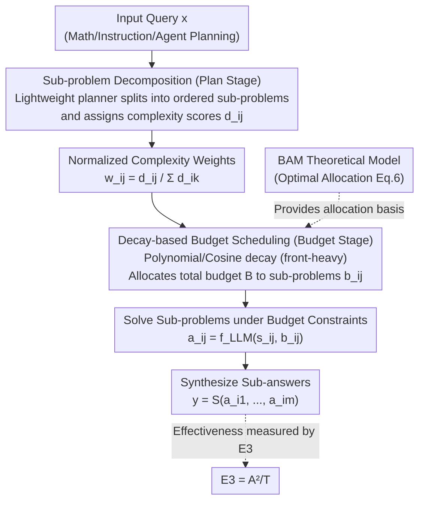

# Plan and Budget: Effective and Efficient Test-Time Scaling on Reasoning LLMs

**Conference**: ICLR 2026  
**arXiv**: [2505.16122](https://arxiv.org/abs/2505.16122)  
**Code**: [github.com/junhongmit/P-and-B](https://github.com/junhongmit/P-and-B)  
**Area**: LLM Reasoning  
**Keywords**: Test-time scaling, Reasoning Efficiency, Overthinking, Token Budget Allocation, Reasoning LLMs

## TL;DR

The Plan-and-Budget framework is proposed to achieve efficient test-time scaling for reasoning LLMs by decomposing complex queries into sub-problems and adaptively allocating token budgets based on estimated complexity—achieving up to 70% higher accuracy, 39% fewer tokens, and a 193.8% improvement in the E3 metric.

## Background & Motivation

Reasoning-heavy Large Language Models (e.g., DeepSeek-R1, QwQ) have achieved significant success in complex tasks like mathematical reasoning and code generation. however, computational efficiency during the inference phase has become increasingly problematic:

**Overthinking**: Many mainstream LLMs generate long, digressive reasoning chains even for simple queries. The models "think too much," producing many unnecessary intermediate steps and wasting computational resources.

**Limitations of Prior Work (Fixed Budget)**: Recent works attempt to mitigate overthinking by imposing a fixed token budget. However, this "one-size-fits-all" strategy leads to **Underthinking**—for difficult problems, a fixed budget may be insufficient, resulting in incomplete reasoning.

**Key Challenge (Heterogeneity)**: Real-world query complexity varies significantly. A simple arithmetic problem and a complex multi-step reasoning task require vastly different computational resources, yet existing methods lack a rational resource allocation mechanism.

**Goal**: There is a lack of a formalized theoretical framework for optimally allocating reasoning computation resources.

**Key Insight**: The authors' empirical analysis reveals that **reasoning inefficiency often stems from unclear problem-solving strategies**—models begin reasoning without a clear plan, making them prone to drifting off track.

## Method

### Overall Architecture

This paper addresses the issue of "disorganized thinking" in reasoning LLMs: without a plan, models drift during reasoning, overthinking simple problems and underthinking difficult ones due to rigid budgets—the authors term this "reasoning miscalibration." The Plan-and-Budget approach first decomposes problems into structured sub-problems and then allocates tokens where they are most needed based on the difficulty of each sub-problem.

The framework is a **model-agnostic, pure test-time method** that relies only on prompts without retraining. It consists of two stages: **Plan**, where a lightweight planner decomposes the query into ordered sub-problems and assigns complexity scores; and **Budget**, which uses a decay-based schedule to distribute the total token budget (heavier at the start for high uncertainty, lighter towards the end for convergence). The optimality of this scheduling is backed by the **BAM** theoretical model, and performance is measured by the new **E3** metric.

### Key Designs

**1. BAM Theoretical Model (Budget Allocation Model): Optimal allocation for "thinking more on hard problems and less on easy ones"**

While intuition suggests allocating more computation to harder problems, a rigorous proof was missing. BAM formalizes reasoning as a sequence of sub-problems with uncertainty, following the classic decomposition $U = U_{epistemic} + U_{aleatoric}$. It assumes epistemic uncertainty reduces per inverse power law as tokens increase $U_{epistemic}(s_{ij}\mid b_{ij}) = c_{ij} / b_{ij}^{\alpha_{ij}}$, where $c_{ij}$ is the initial uncertainty and $\alpha_{ij}$ characterizes the rate of reduction. Solving with Lagrange multipliers under a total budget $B_i$ yields the closed-form optimal allocation:

$$b_{ij} = B_i \cdot \frac{(c_{ij}\,\alpha_{ij})^{1/(\alpha_{ij}+1)}}{\sum_k (c_{ik}\,\alpha_{ik})^{1/(\alpha_{ik}+1)}}$$

This reveals a **unimodal** relationship: medium-difficulty sub-problems should receive more budget to avoid underthinking, while extremely difficult ones receive less as marginal returns diminish (avoiding overthinking).

**2. Sub-problem Decomposition (Plan Phase): Providing a "soft scaffold" for reasoning**

To address the root cause of models drifting off track, the Plan phase avoids immediate answering. A lightweight planner $P$ decomposes the query $x_i$ into sub-problems $\Gamma_i = \langle s_{i1}, \dots, s_{im}\rangle$ and assigns complexity scores $d_{ij}$ based on heuristics like confidence or structure. This plan acts as a "soft scaffold"—it doesn't guarantee optimality but provides a high-level reasoning path, significantly suppressing divergence.

**3. Decay-based Budget Scheduling (Budget Phase): Implementing optimal allocation via lightweight scheduling**

Since estimating $c_{ij}$ and $\alpha_{ij}$ for black-box LLMs is expensive, the paper uses **decay scheduling functions** as lightweight proxies. Observing that early stages of multi-step reasoning (understanding, strategy formulation) have the highest epistemic uncertainty, the budget is "front-loaded." The framework supports various shapes (linear, polynomial, exponential, cosine annealing), with polynomial and cosine decay most closely matching BAM's predictions.

**4. E3 Evaluation Metric (Efficiency-Aware Effectiveness Evaluation): Measuring correctness and economy simultaneously**

Existing metrics often fail to capture the trade-off between accuracy and tokens. The paper defines E3 to weight accuracy against token usage:

$$E3 = A \cdot \frac{A}{T} = \frac{A^2}{T}$$

where $A$ is average accuracy and $T$ is average decoded tokens per query. The squared $A$ term prioritizes "getting it right" while rewarding token reduction.

### Loss & Training

Plan-and-Budget is a pure test-time method requiring no training or fine-tuning. It relies on prompts to guide the planner and the main LLM. It is model-agnostic and can be applied to any reasoning LLM.

## Key Experimental Results

### Main Results

Evaluated across four reasoning LLMs (DS-Qwen-32B, QwQ-32B, DS-LLaMA-70B, OpenAI o4-mini) and three task types, the best improvements relative to strong baselines were:

| Metric | Max Improvement | Description |
|------|---------|------|
| Accuracy | Up to +70% | Best case across models/tasks |
| Token Consumption | Up to -39% | Improved correctness with fewer tokens |
| E3 | Up to +193.8% | Most significant in agent planning tasks |

**Key Insight**: On agent planning tasks, the smaller DS-Qwen-32B with Plan-and-Budget improved its E3 from 0.16 to 0.47, approaching the much larger DS-LLaMA-70B (E3 = 0.50), acting as a "test-time equalizer."

### Ablation Study

| Configuration | Key Metrics | Description |
|------|---------|------|
| Plan Only (No budget ctrl) | Accuracy Gain, Limited Efficiency | Decomposition alone is helpful |
| Budget Only (No decomposition) | Efficiency Gain, Accuracy may drop | Lacks structured guidance |
| Plan + Uniform Budget | Moderate Improvement | Inferior to adaptive allocation |
| Plan + Adaptive Budget | **Optimal** | Best overall performance |

### Key Findings

1.  **Synergy**: Plan and Budget are both necessary; planning solves direction, while budgeting solves resource efficiency.
2.  **Ours (Small) ≈ Prev. SOTA (Large)**: The framework effectively bridges the gap caused by model scale.
3.  **Adaptive > Fixed**: Adaptive allocation consistently outperforms both large and small fixed budgets.
4.  **Generality**: The framework is effective across different reasoning LLM architectures.

## Highlights & Insights

1.  **Theoretical-Practical Linkage**: The BAM theoretical model provides a non-heuristic foundation for adaptive allocation.
2.  **E3 Metric**: Provides a unified standard for evaluating reasoning efficiency.
3.  **Diagnosis of Overthinking**: Identifies "lack of strategy" rather than "lack of capability" as the root of overthinking.
4.  **Zero Training Cost**: A plug-and-play test-time method.

## Limitations & Future Work

1.  **Dependency on Decomposition**: If the planner's decomposition is poor, the subsequent stages suffer.
2.  **Complexity Estimation**: The accuracy of adaptive budgeting depends on the complexity scores, which is a non-trivial estimation task.
3.  **Prompt Overhead**: Additional prompt tokens for the Plan/Budget phases may be inefficient for extremely simple queries.
4.  **Integration with RL**: Future work could explore combining this with reinforcement learning-based reasoning optimization.

## Related Work & Insights

-   **Test-time Scaling**: Complements methods like Tree-of-Thought and Best-of-N.
-   **Overthinking Research**: Builds on work like STILL and S1 concerning reasoning redundancy.
-   **Insight**: The BAM logic can be extended to other resource-allocation scenarios like multi-modal reasoning or tool use.

## Rating

-   **Novelty**: ⭐⭐⭐⭐
-   **Experimental Thoroughness**: ⭐⭐⭐⭐⭐
-   **Writing Quality**: ⭐⭐⭐⭐
-   **Value**: ⭐⭐⭐⭐⭐

<!-- RELATED:START -->

## Related Papers

- [\[ICLR 2026\] Efficient Test-Time Scaling for Small Vision-Language Models](efficient_test-time_scaling_for_small_vision-language_models.md)
- [\[ICLR 2026\] CaTS: Calibrated Test-Time Scaling for Efficient LLM Reasoning](cats_calibrated_test-time_scaling_for_efficient_llm_reasoning.md)
- [\[ICLR 2026\] Optimal Aggregation of LLM and PRM Signals for Efficient Test-Time Scaling](optimal_aggregation_of_llm_and_prm_signals_for_efficient_test-time_scaling.md)
- [\[ICLR 2026\] Test-Time Scaling in Diffusion LLMs via Hidden Semi-Autoregressive Experts](test-time_scaling_in_diffusion_llms_via_hidden_semi-autoregressive_experts.md)
- [\[ACL 2026\] Efficient Test-Time Scaling via Temporal Reasoning Aggregation](../../ACL2026/llm_reasoning/efficient_test-time_scaling_via_temporal_reasoning_aggregation.md)

<!-- RELATED:END -->
