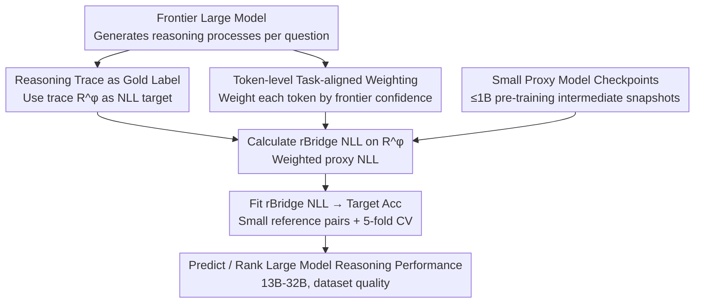

# Predicting LLM Reasoning Performance with Small Proxy Model

**Conference**: ICLR 2026  
**arXiv**: [2509.21013](https://arxiv.org/abs/2509.21013)  
**Code**: Yes (Planned open source for datasets and code)  
**Area**: LLM Evaluation  
**Keywords**: scaling law, proxy model, reasoning, pre-training data selection, negative log-likelihood

## TL;DR
The paper proposes rBridge, which utilizes reasoning traces from frontier models as gold labels and performs token-level task-aligned weighted NLL. This enables small models ($\le$1B) to effectively predict the reasoning performance of large models (13B-32B), achieving over 100$\times$ computational savings in dataset ranking tasks.

## Background & Motivation
The cost of pre-training large language models is extremely high; thus, the industry frequently uses small proxy models to evaluate pre-training design choices. Research on scaling laws and dataset ranking invariance has demonstrated the feasibility of this strategy for general tasks.

**Key Challenge**: Reasoning ability exhibits **emergent behavior**, appearing reliably only in sufficiently large models (typically >7B). Small models ($\le$1B) are extremely noisy on reasoning benchmarks or even show reverse slopes (e.g., a 1B model's accuracy on MATH500 may decrease as training progresses). This implies:
- Direct prediction of large model performance using small model accuracy $\rightarrow$ Fails.
- Practitioners are forced to use 7B-15B "proxy models," which remains prohibitively expensive (training a 7B model on 500B tokens can cost >$50K USD).

**The authors' analysis reveals two fundamental problems**:

**Evaluation Target Mismatch**: The training objective for small models is NTP (next-token prediction), but evaluation uses Acc./Pass@K—discrete metrics that are entirely disconnected from the training objective.

**Task Alignment Gap**: Even when using NLL, the choice of gold labels is critical. If gold labels are out-of-distribution (OOD), the NLL signal becomes noisy. Furthermore, standard NLL treats all tokens with equal weight, failing to distinguish between task-critical tokens and formatting tokens.

## Method

### Overall Architecture
rBridge aims to solve a specific problem: reliably predicting and ranking the reasoning performance of 13B–32B large models using a small proxy model ($\le$1B) without actually training the large models. The core idea returns to the fundamentals of pre-training: since the training objective of small models is next-token prediction, evaluation should also utilize NLL rather than discrete accuracy metrics (Acc./Pass@K) that are decoupled from the training objective. However, directly calculating NLL using benchmark standard answers is noisy. Therefore, rBridge calibrates NLL into a predictive measure aligned with reasoning ability through two steps: first, it uses a frontier large model to generate a reasoning trace for each question and treats this trace (rather than the standard answer) as the gold label for NLL calculation, bringing the target text back into the pre-training distribution; second, it re-weights the NLL using the frontier model's confidence for each token, amplifying critical reasoning steps and suppressing formatting noise.

By calculating this "weighted NLL" (rBridge NLL) on intermediate checkpoints of small models saved during pre-training, a proxy metric significantly more stable than accuracy is obtained. Finally, a mapping curve from rBridge NLL to target Acc/Pass@K is fitted using a small number of reference "proxy-target" model pairs, allowing for the zero-cost prediction of large model performance and ranking of candidate datasets. The reasoning traces and token probabilities from the frontier model are annotated offline once (costing less than $10 per benchmark), and the entire process adds almost no additional training overhead.

### Key Designs

**1. Reasoning Trace as Gold Label: Bringing NLL Back to Training Distribution**

The first step of the pipeline is determining the text for NLL calculation. The standard approach uses benchmark ground truth answers, but small models yield noisy signals on such labels because answer text often deviates significantly from the pre-training data distribution. The paper uses $-\log p(Y^*)$ to measure how in-distribution a gold label $Y^*$ is; more OOD labels result in worse signals. rBridge instead uses the **reasoning trace** $R^\phi$ (extracting only the reasoning process and stripping the final answer and its format) generated by a frontier model $\pi^\phi$ as the gold label. This offers two advantages: first, $R^\phi$ is continuous long text, closer to the long-form nature of pre-training corpora (average NLL on 5 benchmarks decreased by 74.7% compared to standard answers, significantly reducing noise); second, the trace itself is the reasoning chain leading to the correct answer, naturally aligning with the goal of "solving the problem." Conversely, ScalingBench uses $R^\phi + A^\phi$ (trace plus answer), where the answer part contains formatting artifacts like "\n", "Final Answer:", or "I hope it is correct." which rarely appear in pre-training data and are heavily OOD, polluting the NLL signal (Tab. 1 shows its NLL and fitting quality are inferior to using $R^\phi$ alone).

**2. Token-level Task-aligned Weighting: Separating Critical Reasoning Steps from Formatting Noise**

Changing the gold label addresses "where to calculate," but not "how much weight each token carries." Standard NLL treats all tokens in $R^\phi$ equally, yet a reasoning trace contains both critical steps (e.g., "sum modulo 9") and layout tokens (e.g., line breaks, numbering), which contribute differently to demonstrating reasoning ability. rBridge uses the frontier model's own confidence for each token as an automatic task-alignment weight, defined as:

$$\text{rBridge NLL}(\text{token}_i) = \underbrace{-\log p^p(\text{token}_i)}_{\text{Standard NLL}} \cdot \underbrace{\frac{1}{|\text{token}_i|} \sum_{\text{letter} \in \text{token}_i} p^\phi(\text{letter})}_{\text{Automatic Task-alignment Weight}}$$

The intuition is straightforward: tokens where the frontier model has high confidence are often key reasoning nodes and should receive higher weight; tokens with low confidence (e.g., newlines, numbers) are mostly formatting noise and should be suppressed. To address cross-tokenizer issues—where the proxy and frontier models use different tokenization—rBridge does not take token probabilities directly. Instead, it distributes weights to the **letter-level** $p^\phi(\text{letter})$ and averages them within the token, eliminating tokenization variance. Finally, a MinMax normalization is applied to the weight factors to amplify the contrast between critical and noise tokens. This weighting scheme is a one-time pre-processing cost for the frontier model; subsequent evaluations on the proxy model take only seconds of CPU time.

### Loss & Training
rBridge does not train new models. It directly uses intermediate checkpoints of small models saved during pre-training as proxy models to calculate rBridge NLL. The reasoning traces and token probabilities from the frontier model are pre-calculated as offline annotations. To transform the proxy metric into a prediction for large models, curve fitting is performed on a small set of known "proxy-target" data points. The candidate function space (linear/quadratic/exponential/logarithmic) is fixed to prevent overfitting, and 5-fold cross-validation is used to select the optimal function based on training $R^2$, reporting the test MAE. This fitted curve can also be transferred zero-shot to another pre-training dataset for prediction and ranking.

## Key Experimental Results

### Main Results (1B $\rightarrow$ 13B Proxy-Target Relationship)

| Method | Avg. Train R² ↑ | Avg. Test MAE ↓ |
|------|:---:|:---:|
| Acc./Pass@1 | 0.304 | 3.709 |
| iSFT | 0.290 | 5.123 |
| TED | 0.375 | 3.377 |
| MPCA | 0.194 | 302.642 |
| NLL | 0.485 | 5.173 |
| $R^\phi$ (Trace NLL only) | 0.867 | 1.455 |
| **rBridge** | **0.874** | **1.384** |

- rBridge achieved the best results in 10 out of 12 settings (6 benchmarks $\times$ R²/MAE).
- 1B $\rightarrow$ 32B: R²=0.826, MAE=1.481, also optimal.
- 1B $\rightarrow$ 13B+SFT: R²=0.846, MAE=1.304, optimal.

### Ablation Study (Dataset Ranking <100M $\rightarrow$ 1.2B)

| Proxy Scale | rBridge DAcc | Best Baseline DAcc | Compute Saving |
|:---:|:---:|:---:|:---:|
| 3.7M (87.3M tokens) | ~70% | ~50% (Random level) | 733.4$\times$ |
| 6M (81.6M tokens) | ~75% | ~55% | 100.2$\times$ |
| 97.9M | ~80% | ~75% | - |

- With the smallest proxy (3.7M), rBridge outperforms baselines by **27% DAcc**.
- To achieve the same ranking accuracy, rBridge saves **100.2$\times$ to 733.4$\times$** FLOPs.

### Key Findings
1. **rBridge outranks models 7-13$\times$ larger**: The predictive capability of a 1B model using rBridge exceeds that of 7B/13B models evaluated directly via accuracy.
2. **Zero-shot cross-dataset transfer**: The rBridge $\rightarrow$ Acc function fitted on OLMo-Mix-1124 transfers zero-shot to another dataset, achieving perfect ranking (5/5) across 5 benchmarks with MAE between 0.043-1.417 (excluding one outlier at 9.716).
3. **Ablation confirms component effectiveness**: Iterating from standard NLL $\rightarrow$ using $R^\phi$ $\rightarrow$ adding weighting $\rightarrow$ MinMax normalization yields consistent improvements at each step.

## Highlights & Insights
- **Deep Insight**: The "failure" of small models on reasoning benchmarks is not due to a lack of information, but because the evaluation method (Acc.) is mismatched with small model capabilities.
- **NLL Back to Basics**: Since the objective of pre-training is NTP, evaluation should return to NLL—the key determines what to use as the gold label.
- **Frontier Model Probabilities as Automatic Annotators**: Token probabilities naturally encode "which steps are critical reasoning," eliminating the need for manual annotation.
- **High Practicality**: The two-stage dataset optimization framework (<100M initial screening $\rightarrow$ 1B fine-ranking) has direct industrial application value.

## Limitations & Future Work
- Frontier models are not 100% accurate; a small number of incorrect reasoning traces might introduce noise (though experiments show filtering incorrect traces provides marginal improvement).
- Frontier models occasionally fail to generate in the requested format (currently discarded after one retry).
- Zero-shot transfer was only validated on one dataset pair for 1B $\rightarrow$ 7B due to compute budgets.
- Effectiveness on non-reasoning tasks has not been verified (though mature solutions already exist for those).
- The two-stage optimization framework is proposed as a discussion and has not undergone full experimental validation.

## Related Work & Insights
- Complementary to Scaling Law literature (Kaplan et al., Hoffmann et al.): rBridge specifically addresses proxy difficulties caused by emergent reasoning.
- Direct comparison with the DataDecide benchmark: Achieved optimal ranking at extremely low cost on its tasks.
- Insights for pre-training data mixture optimization (Xie et al., Liu et al.): NLL/perplexity is a sub-optimal metric; rBridge is better suited for reasoning-oriented data selection.
- Broad inspiration: The rBridge paradigm can be considered for any scenario requiring "using small models to predict large models."

## Rating
- Novelty: ⭐⭐⭐⭐ The core insights (NLL + frontier trace + token weighting) are not entirely new, but the combination is clever and highly effective.
- Experimental Thoroughness: ⭐⭐⭐⭐⭐ Rigorous three-stage experimental design across 6 benchmarks, multiple model scales, ablations, and cross-dataset transfer.
- Writing Quality: ⭐⭐⭐⭐ Clear structure with progressive problem analysis, though notation and tables are somewhat dense.
- Value: ⭐⭐⭐⭐⭐ Extremely high industrial value, directly reducing pre-training exploration costs by 100$\times$+.

<!-- RELATED:START -->

## Related Papers

- [\[ICLR 2026\] Latent-Guided Reasoning: Empowering Small LLMs with Large-Model Thinking](latent-guided_reasoning_empowering_small_llms_with_large-model_thinking.md)
- [\[ICLR 2026\] The CoT Encyclopedia: Analyzing, Predicting, and Controlling the Thinking Process of Reasoning Models](the_cot_encyclopedia_analyzing_predicting_and_controlling_how_a_reasoning_model_.md)
- [\[ICLR 2026\] Following the Navigation: Enhancing Small Language Models Contextual Reasoning with LLM Guidance](following_the_navigation_enhancing_small_language_models_contextual_reasoning_wi.md)
- [\[ICLR 2026\] SLM-MUX: Orchestrating Small Language Models for Reasoning](slm-mux_orchestrating_small_language_models_for_reasoning.md)
- [\[ICLR 2026\] Why is Your Language Model a Poor Implicit Reward Model?](why_is_your_language_model_a_poor_implicit_reward_model.md)

<!-- RELATED:END -->
