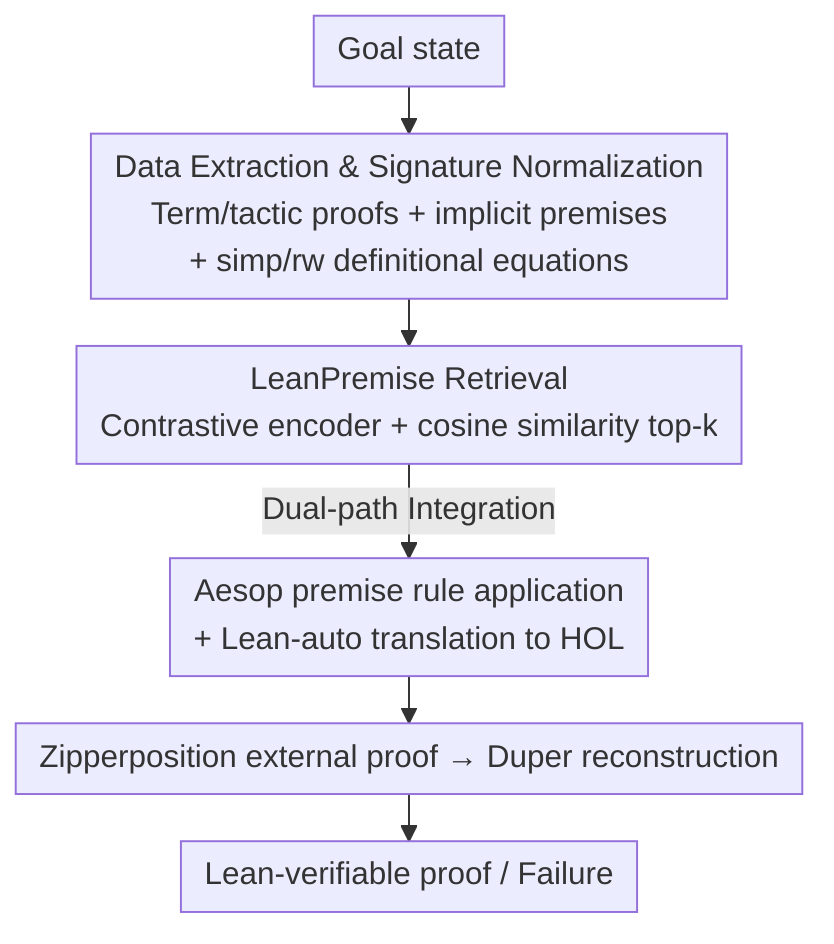

# Premise Selection for a Lean Hammer

**Conference**: ICLR 2026  
**OpenReview**: [https://openreview.net/forum?id=m04JJNeRK6](https://openreview.net/forum?id=m04JJNeRK6)  
**Code**: https://github.com/hanwenzhu/premise-selection ; https://github.com/JOSHCLUNE/LeanHammer  
**Area**: LLM Reasoning / Formal Theorem Proving / Neuro-symbolic  
**Keywords**: Premise Selection, Lean, Hammer, Contrastive Learning, Neuro-symbolic

## TL;DR
This paper proposes the neural premise selector LeanPremise (a sentence encoder trained via contrastive learning) and integrates it with Aesop / Lean-auto / Duper to create LeanHammer, the first end-to-end general-purpose hammer tool for Lean. It proves 21% more theorems than existing premise selectors and generalizes to libraries unseen during training.

## Background & Motivation
**Background**: In interactive theorem provers like Lean, Isabelle, and Coq, one of the most tedious tasks for users is **manually naming** the premises (lemmas/definitions) required for the current reasoning step. Isabelle has long had "hammer" tools like Sledgehammer to automate this: given a goal, it first performs **premise selection** to pick a small set of potentially useful lemmas, **translates** them into formats suitable for external automated theorem provers (ATPs like Vampire, E, Zipperposition, Z3), and finally **reconstructs** the found proofs back into the prover.

**Limitations of Prior Work**: Despite the popularity of the Lean community (Liquid Tensor Experiment, Sphere Eversion, Mathlib), **Lean has lacked a usable hammer**. Existing Lean premise selectors (ReProver, Lean Copilot, Random Forest) were not designed for hammers—they either serve "next-tactic generation" only, extract only explicit premises, target modified goals rather than closed goals, or cannot be invoked directly within Lean with support for dynamic, user-defined lemmas.

**Key Challenge**: The **objective functions** for premise selection in hammers versus tactic generation are fundamentally different. A hammer aims to "close the entire goal in one blow," prioritizing **recall** (missing a critical lemma makes the proof impossible, while external ATPs can handle some irrelevant ones). Tactic generation only needs premises for the immediate next step. Directly repurposing tactic-generation selectors leads to improper training signals, loss functions, and signature representations.

**Goal**: (1) Train a premise selector specifically for hammers and Lean's dependent type theory; (2) Combine it with existing translation/reconstruction components into an end-to-end general hammer for Lean; (3) Ensure the tool can be invoked as a direct tactic in the Lean IDE with low latency and the ability to dynamically incorporate local user definitions.

**Core Idea**: Use hammer-oriented data extraction (term-style proofs, implicit premises, equational definitions from simp/rw, normalized signature serialization) and a masked contrastive learning loss to train a lightweight sentence encoder for retrieval. The retrieved results are **simultaneously** fed into Aesop's premise application rules and Lean-auto's external ATP translation path.

## Method

### Overall Architecture
LeanHammer takes a goal state as input and outputs a formal proof accepted by the Lean kernel (or a failure). The pipeline fuses neural retrieval with symbolic proof search: LeanPremise retrieves the most relevant lemmas from all visible premises in the environment. These lemmas are then **used in two parallel paths**: one as rules for Aesop's premise application, and another translated by Lean-auto into High-Order Logic (HOL) for the external ATP Zipperposition. If Zipperposition succeeds, the specific premises used are passed to Duper for trusted proof reconstruction within Lean. Duper is a proof-producing search tool designed to ground external results into verifiable Lean proof terms.

### Key Designs

**1. Hammer-oriented Data Extraction: Feeding everything needed to "close the goal"**

This addresses the limitation where prior selectors (e.g., ReProver) only extracted from tactic-style proofs or explicit source premises. Hammer-oriented extraction involves four steps: (a) **Extracting from both term-style and tactic-style proofs**, increasing training samples for short proofs where hammers excel; (b) For multi-tactic proofs, training the model to select **all premises needed to close the goal** rather than just the first tactic's premises; (c) **Extracting both explicit and implicit premises**, including lemmas used by automation like `simp` and **definitional equations** used in `rw/simp`—crucial for Lean’s dependent type theory where terms can be definitionally equal but syntactically different; (d) Normalizing signatures. Each sample is a tuple of (proof state, theorem signature, premise set).

**2. Normalized Signature Serialization: Type-dependent premise representation**

The representation of premises is critical. Prior works used raw source strings, which lose details and are susceptible to `open` namespaces or custom notations. Ours serializes theorems/definitions into a uniform format: `docstring? kind name arguments* : type`. It disables notation pretty-printing (`ℕ` becomes `Nat`) and uses fully qualified names (`I` becomes `Complex.I`). This ensures premise representation **depends only on its type**, remaining stable regardless of local namespaces or notations.

**3. Masked Contrastive Learning Loss: Addressing the "in-batch false negative" problem**

Retrieval uses a standard dual-encoder: an encoder-only Transformer $E$ encodes state $s$ and premises $p$, using cosine similarity for top-k: $\text{select\_premises}(s,k,P_s)=\text{top-}k_{p\in P_s}\,\text{sim}(E(s),E(p))$. To handle datasets where many premises are never used or are shared across proofs, the model uses an improved InfoNCE loss. For a pair $(s_i, p_i^+)$, the loss **masks premises in the batch that belong to the ground truth set $P_{s_i}^+$** from the negative set $N_i$:

$$L(E)=\frac{1}{B}\sum_{i=1}^{B}\frac{\exp(\text{sim}(E(s_i),E(p_i^+))/\tau)}{\exp(\text{sim}(E(s_i),E(p_i^+))/\tau)+\sum_{p_i^-\in N_i}\exp(\text{sim}(E(s_i),E(p_i^-))/\tau)}$$

with temperature $\tau=0.05$. This prevents punishing shared premises as false negatives. No re-ranking model is used because hammers favor recall at higher $k$ (e.g., 16+), where re-ranking provides diminishing returns and adds latency.

**4. Direct API Integration and Dynamic Premise Support**

When invoked, the Lean client collects all defined premises $P_s$ and the current state $s$, sending them to a server. The server **caches embeddings for fixed Mathlib versions** and only computes embeddings for new local premises on-the-fly. The client also caches these local signatures. Retrieval takes ~1s on CPU and much less on GPU. This is the first LM-based Lean selector that supports dynamic user-defined premises without complex local setup.

### Loss & Training
Fine-tuning from three pre-trained sentence encoders: small (MiniLM-L6, 23M), medium (MiniLM-L12, 33M), and large (DistilRoBERTa-base, 82M). Learning rate 2e-4, batch size $B=256$, and $B^-=3$ sampled negatives per positive. Training the large model takes ~6.5 A6000-days.

## Key Experimental Results

### Main Results
Comparison of different selectors integrated into LeanHammer on Mathlib-test (full = full pipeline):

| Premise Selector | Params | Recall@16 | Recall@32 | full Proof Rate | cumul Proof Rate |
|:---|:---:|:---:|:---:|:---:|:---:|
| None | — | 0.0 | 0.0 | 16.9 | 16.9 |
| Random forest* | — | 22.1 | 22.3 | 19.1 | 19.1 |
| MePo (Symbolic) | — | 38.4 | 42.1 | 26.3 | 27.5 |
| ReProver | 218M | 35.1 | 38.7 | 12.0 | 22.3 |
| LeanPremise (large) | 82M | 63.5 | 72.7 | 30.1 | 33.3 |
| LeanPremise (large) ∪ MePo | — | — | — | 35.9 | 37.6 |
| Ground truth (Upper bound) | — | — | — | 41.0 | 43.0 |

LeanPremise large achieves a recall@32 of 72.7% (73% higher than MePo) and a cumul proof rate of 33.3% (21% higher than MePo). Combining neural and symbolic methods (∪MePo) yields higher gains than scaling, indicating complementarity. Compared to ReProver, the 82M model proves **150%** more theorems in the full setting.

Cross-library generalization (miniCTX-v2-test, large model trained on Mathlib):

| Setting | Carleson | ConNF | FLT | Foundation | HepLean | Seymour | Avg |
|:---|:---:|:---:|:---:|:---:|:---:|:---:|:---:|
| None | 0.0 | 10.0 | 27.3 | 38.0 | 8.0 | 6.0 | 14.9 |
| LeanPremise (large) | 0.0 | 16.0 | 36.4 | 38.0 | 10.0 | 24.0 | 20.7 |
| Ground truth | 7.1 | 16.0 | 39.4 | 40.0 | 20.0 | 34.0 | 26.1 |

### Ablation Study
On Mathlib-valid (medium model):

| Configuration | Recall@16 | Recall@32 | full Proof Rate | cumul Proof Rate | Description |
|:---|:---:|:---:|:---:|:---:|:---|
| LeanPremise (medium) | 61.1 | 71.9 | 34.6 | 37.6 | Full version |
| + naive data | 57.5 | 66.8 | 33.1 | 35.2 | Reverting to naive extraction |
| − negatives | 51.8 | 59.5 | 33.0 | 36.8 | No sampled negatives ($B^-=0$) |
| − loss mask | 59.1 | 69.6 | 34.4 | 38.4 | Removing loss masking |

### Key Findings
- **Data extraction is critical for Lean-auto**: Performance drops most significantly in the auto/full settings with naive data, showing that hammer-oriented extraction directly enables external ATP success.
- **Negative sampling impacts recall most**: Removing negatives dropped recall@16 by nearly 10%.
- **Pipeline components are additive**: The proof rate increases from auto < aesop < aesop+auto < full.
- **Removing the loss mask in "cumul" produced a slight outlier (38.4 vs 37.6)**: Attributed to noise, as individual settings and recall were consistently lower without masking.

## Highlights & Insights
- **Prioritizing Recall**: Leverages the domain knowledge that hammers tolerate redundant premises but fail without critical ones, resulting in a design that favors high k over precision or re-ranking.
- **Dependent Type Nuances**: Extracting definitional equations that don't appear in proof terms but are used in tactic proofs is a specific insight derived from Lean's semantics.
- **Modular Integration**: Using the same retrieved set for both internal rules (Aesop) and external translation (Lean-auto) is a portable paradigm for neuro-symbolic search.
- **Usability as a First-class Contribution**: Caching Mathlib embeddings and incrementally encoding user premises solves the main friction points for using LM-based tools in real-time formalization.

## Limitations & Future Work
- Failure modes: (1) Missing premises in retrieval; (2) Goal features exceeding Lean-auto's translation capabilities; (3) Reasoning requiring induction or arithmetic beyond current ATP support.
- Integration between LeanPremise and symbolic MePo is currently a simple union; more sophisticated hybrid methods are left for future work.
- There remains a gap between current results (30%+) and the ground-truth upper bound (41%).

## Related Work & Insights
- **vs ReProver / Lean Copilot**: These focus on "next-tactic" source premises and use ℓ2 loss. Ours targets "closing the goal," utilizes masked contrastive loss, and integrates dynamic signatures.
- **vs Magnushammer (Isabelle)**: Similar contrastive approach but Magnushammer uses a re-ranker. Ours skips re-ranking for lower latency and better recall-at-scale.
- **vs MePo (Symbolic)**: LeanPremise has much higher recall, but the two are complementary, suggesting a hybrid neuro-symbolic retrieval future.

## Rating
- Novelty: ⭐⭐⭐⭐ First Lean end-to-end hammer with specialized extraction/loss; solid engineering and synthesis.
- Experimental Thoroughness: ⭐⭐⭐⭐⭐ Comprehensive benchmarks, scaling analysis, cross-library tests, and ablations.
- Writing Quality: ⭐⭐⭐⭐ Motivations and design choices are well-articulated.
- Value: ⭐⭐⭐⭐⭐ Fills a major gap in the Lean ecosystem; open-source and ready for practical use.

<!-- RELATED:START -->

## Related Papers

- [\[ICLR 2026\] Process-Verified Reinforcement Learning for Theorem Proving via Lean](process-verified_reinforcement_learning_for_theorem_proving_via_lean.md)
- [\[ICLR 2026\] ProofBridge: Auto-Formalization of Natural Language Proofs in Lean via Joint Embeddings](proofbridge_auto-formalization_of_natural_language_proofs_in_lean_via_joint_embe.md)
- [\[ICLR 2026\] Selection, Reflection and Self-Refinement: Revisit Reasoning Tasks via a Causal Lens](selection_reflection_and_self-refinement_revisit_reasoning_tasks_via_a_causal_le.md)
- [\[ACL 2026\] On the Step Length Confounding in LLM Reasoning Data Selection](../../ACL2026/llm_reasoning/on_the_step_length_confounding_in_llm_reasoning_data_selection.md)
- [\[ACL 2026\] Stabilizing Efficient Reasoning with Step-Level Advantage Selection](../../ACL2026/llm_reasoning/stabilizing_efficient_reasoning_with_step-level_advantage_selection.md)

<!-- RELATED:END -->
## Related Papers

- [\[ICLR 2026\] Process-Verified Reinforcement Learning for Theorem Proving via Lean](process-verified_reinforcement_learning_for_theorem_proving_via_lean.md)
- [\[ICLR 2026\] ProofBridge: Auto-Formalization of Natural Language Proofs in Lean via Joint Embeddings](proofbridge_auto-formalization_of_natural_language_proofs_in_lean_via_joint_embe.md)
- [\[ACL 2026\] On the Step Length Confounding in LLM Reasoning Data Selection](../../ACL2026/llm_reasoning/on_the_step_length_confounding_in_llm_reasoning_data_selection.md)
- [\[ACL 2026\] Stabilizing Efficient Reasoning with Step-Level Advantage Selection](../../ACL2026/llm_reasoning/stabilizing_efficient_reasoning_with_step-level_advantage_selection.md)
- [\[ICML 2026\] From LLM-Generated Conjectures to Lean Formalizations: Automated Polynomial Inequality Proving via Sum-of-Squares Certificates](../../ICML2026/llm_reasoning/from_llm-generated_conjectures_to_lean_formalizations_automated_polynomial_inequ.md)

<!-- RELATED:END -->
