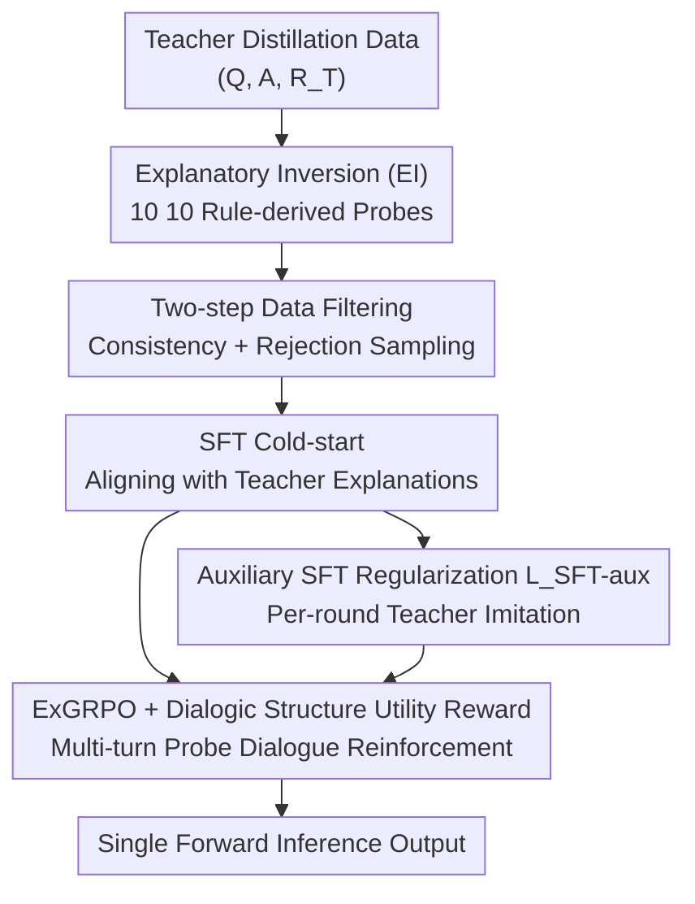

# Probing to Refine: Reinforcement Distillation of LLMs via Explanatory Inversion

**Conference**: ICLR 2026  
**OpenReview**: [https://openreview.net/forum?id=rkIw2GqYEt](https://openreview.net/forum?id=rkIw2GqYEt)  
**Code**: https://github.com/Zhen-Tan-dmml/ExGRPO  
**Area**: LLM Reasoning / Knowledge Distillation / Reinforcement Learning  
**Keywords**: Reasoning Distillation, Explanatory Inversion, GRPO, Generalization, Multi-turn Dialogue Reward

## TL;DR
This paper identifies that distilled small models "amplify" generalization defects (memorizing patterns while failing upon directional shifts). It proposes "Explanatory Inversion" to generate probes that compel students to clarify underlying logic, followed by reinforcement refinement using ExGRPO with a "Dialogic Structure Utility Reward" to organize these probes into multi-turn dialogues. Across 12 datasets, Gemma-7B achieves an average gain of 20.39% over zero-shot and 6.02% over the strongest distillation baseline.

## Background & Motivation
**Background**: Distilling Chain-of-Thought (CoT) reasoning capabilities from large teacher models into smaller student models is a mainstream route for cost-efficient deployment. The standard approach involves Supervised Fine-Tuning (SFT), where students mimic the reasoning trajectories generated by teachers—essentially "copying what the teacher writes."

**Limitations of Prior Work**: Such mimicry-based distillation results in **surface-level pattern memorization**, which collapses under slight distributional shifts. A typical case is the "reversal curse": models can solve $5-2=3$ but fail the inverse problem: "Given 3 remains and 2 was given away, what was the original amount?" ($3+2=5$). The authors further observe a new phenomenon—**generalization defects are not merely present but are amplified in distilled models** (Figure 1a, where the distilled small model drops significantly more than the teacher on EI-Test).

**Key Challenge**: Existing "inverse thinking" remedies (e.g., RevThink) merely teach another directional mapping (A $\rightarrow$ Q), essentially adding another pattern to memorize without deeper understanding of dual relationships like addition and subtraction. SFT, with its fixed supervision targets, naturally suffers from exposure bias and a lack of exploration, failing to internalize complex reasoning structures. The root of the problem is: **the student is "mimicking outputs" rather than "understanding logic."**

**Goal**: Address this from both the data side and optimization side—generating training signals that force students to explain "why" and replacing pure SFT with an RL-based internalization mechanism.

**Core Idea**: Use "Explanatory Inversion" (EI) to generate probes that investigate underlying logic, then employ ExGRPO (with Dialogic Structure Utility Reward) tailored for distillation to organize these probes into multi-turn dialogues, compelling the student to build a conceptual understanding of the task.

## Method

### Overall Architecture
The workflow revolves around a pipeline: "Probe Generation $\rightarrow$ Data Filtering $\rightarrow$ Cold-start $\rightarrow$ RL Refinement." Input consists of teacher distillation data $(Q, A, R_T)$. First, EI applies $N=10$ transformation rules to each sample to derive "explanatory probes" $Q^{aug}_i$. These candidates undergo a two-step filtering process to form the high-quality dataset $D_{EI}$. SFT is performed on $D_{EI}$ to cold-start the student for these challenges. Finally, ExGRPO randomly samples and sequences probes into multi-turn dialogues for reinforcement refinement using rule-based rewards (accuracy + dialogic structure utility reward). Crucially, **all multi-turn probing, random sampling, and reward calculations occur only during training**; during inference, the student performs a single forward pass for a given $Q$, incurring no extra overhead.

### Key Designs

**1. Explanatory Inversion (EI): Transforming Mimicry into Understanding via "Why" Probes**

To address students' tendency to copy patterns, EI moves beyond merely creating inverse problems. Inspired by "explanation-driven understanding" in cognitive science, it deconstructs and challenges the underlying logic, assumptions, and principles in teacher reasoning $R_T = (s_1, \dots, s_T)$. Specifically, it applies $N=10$ template-based transformation rules $F = \{f_1, \dots, f_N\}$ to each original datum $(Q, A, R_T)$ to generate candidate probes $D_{cand}(Q) = \{(Q^{aug}_i, A^{aug}_i, R^{aug}_{T,i})\}_{i=1}^N$. For a problem like $5-2=3$, probes might include "Why is subtraction used here?", "If given the result 3 and the subtrahend 2, what operation finds the original number?", or "Is the order of $5-2$ and $2-5$ important?". Key rules include **R1 Counterfactual Scenario Generation** (changing premises to see how the conclusion shifts) and **R2 Explanatory Challenge** (requiring justification for a logical jump). Unlike learning a secondary mapping, EI forces the student to build a richer conceptual model from multiple angles.

**2. Two-step Data Filtering: Removing Invalid and Outlier Probes**

Using all candidates introduces noise. Two filters construct the final $D_{EI}$. First, **EI Consistency Filtering** ensures probes do not derail the original problem by prepending the probe, its reasoning, and answer to the original $Q$; it is kept only if the teacher $T$ still predicts correctly: $\zeta_{EI}(d_k) \Leftrightarrow T([Q^{aug}_k \| R^{aug}_{T,k} \| A^{aug}_{T,k} \| Q]) = A$. Second, **Rejection Sampling Filtering** counts how many consistent probes the baseline student $S_{base}$ (pre-SFT) gets right ($\Lambda_{Q,S_{base}}$). It requires that the student "neither gets all right nor fails too many":

$$\big(\lnot(\Lambda_{Q,S_{base}} = N'_Q \wedge N'_Q>0)\big) \wedge \big(\lnot(\Lambda_{Q,S_{base}} \geq \tau_{hard} \wedge N'_Q>0)\big)$$

This removes samples that are "too easy" (no learning value) or "too hard" (beyond current capacity). The remaining probes represent the "Goldilocks zone" for SFT and RL refinement.

**3. ExGRPO and Dialogic Structure Utility Reward: Rewarding "Contextual Benefit"**

Internalization is achieved via ExGRPO. For each $Q$, $k$ probes (e.g., $k=5$) are sampled without replacement and presented sequentially to the student, using dialogue history as context, followed by the original $Q$. This forms a "Full Dialogue" (Scenario A). The **Dialogic Structure Utility Reward** $r_{dsu}$ compares this against a "Partial Dialogue" (Scenario B) using $k' < k$ probes. If the full dialogue significantly outperforms the partial one, a bonus is added:

$$r_{dsu} = \begin{cases} \delta, & \text{if } P_{full} > \nu \cdot P_{partial} \\ 0, & \text{otherwise} \end{cases}$$

This explicitly rewards the student for "genuinely learning from the explanatory chain" rather than isolating individual answers. Total reward is $R_{total} = R_{base} + r_{dsu}$. Advantages are normalized within the group, and a clipped GRPO objective with KL regularization is used for updates.

**4. Auxiliary SFT Regularization $L_{SFT\text{-}aux}$: Preventing Training Collapse**

Sparse rewards based only on final answers can lead to divergence in multi-turn interactions. An auxiliary SFT loss provides dense supervision for intermediate reasoning rounds by having the student mimic teacher responses $R^{aug}_{T,j}$:

$$L_{SFT\text{-}aux} = -\sum_{j=1}^{k} \log \pi_\theta(R^{aug}_{T,j} \mid Q^{aug}_j, \text{context})$$

This stabilizes training by constraining exploration within a reasonable trajectory.

### Loss & Training
The process is three-stage: (1) Data Filtering; (2) Cold-start SFT on $D_{EI}$ by minimizing $L_{SFT}$; (3) Reinforcement Refinement using $L_{ExGRPO}$ combined with $L_{SFT\text{-}aux}$. Gemini-1.5-Pro serves as the teacher, with Gemma-7B-it and Qwen2.5-7B-Instruct as students ($N=10$, $k \approx 5$).

## Key Experimental Results

### Main Results
On 8 held-in reasoning datasets (Commonsense, Math, Table, NLI, Logic):

| Student Model | Method | Avg. Acc (%) | Gain vs. Zero-shot |
|----------|------|----------|-----------|
| Qwen2.5-7B | Zero-shot | 77.99 | — |
| Qwen2.5-7B | RevThink | 80.89 | +2.90 |
| Qwen2.5-7B | On-Policy Distill | 81.60 | +3.61 |
| Qwen2.5-7B | **ExGRPO** | **82.54** | **+4.55** |
| Gemma-7B | Zero-shot | 46.80 | — |
| Gemma-7B | RevThink | 61.17 | +14.37 |
| Gemma-7B | On-Policy Distill | 65.40 | +18.60 |
| Gemma-7B | **ExGRPO** | **67.19** | **+20.39** |

ExGRPO is superior on both students, with larger gains for the weaker model (Gemma). It is the **only** method to show positive transfer on GSM8K for the already strong Qwen model. Notably, EI enhancement even improved the teacher’s zero-shot performance (83.48 $\rightarrow$ 85.70).

### Ablation Study
(Qwen2.5-7B, 8-dataset Avg. Acc)

| Configuration | Avg. Acc | Note |
|------|---------|------|
| SFT (3 ep) only | 79.17 | Cold-start only |
| RL (Cold-start, $R_{base}$) | 15.99 | RL without SFT: Catastrophic collapse (-62.00) |
| RL (Cold-start) + $L_{SFT\text{-}aux}$ | 71.53 | Collapse remains despite dense supervision |
| SFT (3ep) + RL ($R_{base}$) | 80.13 | Stable with cold-start |
| SFT (3ep) + RL + $L_{SFT\text{-}aux}$ | 81.23 | Gain with auxiliary supervision |
| **Complete Model** | **82.54** | Optimal configuration |

### Key Findings
- **SFT Cold-start is essential**: Unlike LLM post-training, distillation via RL collapses without initial SFT (77.99 to 15.99).
- **Synergy of rewards and supervision**: $r_{dsu}$ and $L_{SFT\text{-}aux}$ cumulatively improve performance from 80.13 to 82.54.
- **Efficiency**: Achieving results superior to vanilla fine-tuning using only 10–25% of the data while showing strong OOD generalization.

## Highlights & Insights
- **Amplified generalization defect**: Identifying that distillation not only inherits but amplifies teacher weaknesses is a significant contribution to Knowledge Distillation research.
- **RL as an internalization engine**: Integrating RL into the distillation process rather than just for alignment is innovative. The finding that SFT is mandatory for RL stability in this context is a practical engineering insight.
- **Transferable Dialogic Reward**: The concept of comparing "full vs. partial" trajectories to ensure information utilization can be applied to various multi-turn or long-context tasks.

## Limitations & Future Work
- **High Teacher Dependence**: Generating 10 rules of probes and their answers requires high-tier models like Gemini-1.5-Pro, which is costly.
- **Training Overhead**: Scenario A/B comparisons and multi-turn loops make RL training significantly more compute-intensive than pure SFT.
- **Hyperparameter Sensitivity**: Selection of thresholds for $\delta$, $\nu$, and $\tau_{hard}$ currently relies on empirical tuning.
- **Template Constraints**: The 10 transformation rules are template-based; automated discovery of optimal probe types remains an open question.

## Related Work & Insights
- **vs. RevThink**: While RevThink uses inverse questions (A $\rightarrow$ Q) to fix directionality, it still relies on pattern mapping. EI seeks conceptual understanding through logic-probing and adds RL refinement (67.19 vs 61.17 on Gemma).
- **vs. Standard GRPO**: Standard GRPO lacks intermediate supervision and teacher-trajectory integration, making it unsuitable for distillation. ExGRPO bridges this with $r_{dsu}$ and $L_{SFT\text{-}aux}$.

## Rating
- Novelty: ⭐⭐⭐⭐⭐ (Amplify-defect observation + EI + ExGRPO)
- Experimental Thoroughness: ⭐⭐⭐⭐ (12 datasets, two students; lacks extensive teacher-variance analysis)
- Writing Quality: ⭐⭐⭐⭐ (Logical flow, though notation-heavy)
- Value: ⭐⭐⭐⭐ (Practical framework for reasoning distillation)

<!-- RELATED:START -->

## Related Papers

- [\[ICLR 2026\] Emergent Hierarchical Reasoning in LLMs through Reinforcement Learning](emergent_hierarchical_reasoning_in_llms_through_reinforcement_learning.md)
- [\[ICLR 2026\] SkillFactory: Self-Distillation for Learning Cognitive Behaviors](skillfactory_self-distillation_for_learning_cognitive_behaviors.md)
- [\[ICLR 2026\] Where Did This Sentence Come From? Tracing Provenance in LLM Reasoning Distillation](where_did_this_sentence_come_from_tracing_provenance_in_llm_reasoning_distillati.md)
- [\[ICLR 2026\] KaVa: Latent Reasoning via Compressed KV-Cache Distillation](kava_latent_reasoning_via_compressed_kv-cache_distillation.md)
- [\[ICLR 2026\] Explain in Your Own Words: Improving Reasoning via Token-Selective Dual Knowledge Distillation](explain_in_your_own_words_improving_reasoning_via_token-selective_dual_knowledge.md)

<!-- RELATED:END -->
