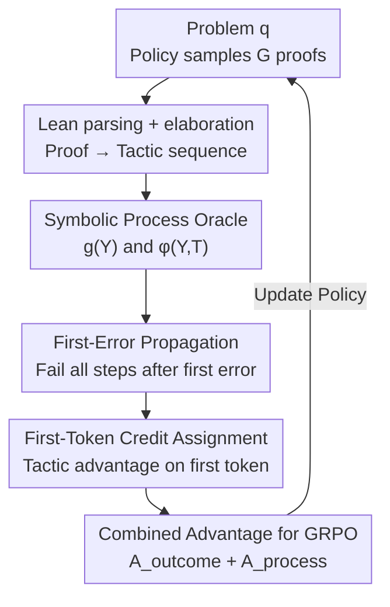

# Process-Verified Reinforcement Learning for Theorem Proving via Lean

**Conference**: ICLR 2026  
**OpenReview**: [https://openreview.net/forum?id=P00k4DFaXF](https://openreview.net/forum?id=P00k4DFaXF)  
**Area**: LLM Reasoning  
**Keywords**: Formal theorem proving, Lean, process reward, GRPO, credit assignment

## TL;DR
This paper treats the Lean proof assistant as a "symbolic process oracle," extracting both outcome-level and tactic-level (process) verifiable rewards from its elaboration feedback. By integrating first-error propagation and first-token credit assignment into GRPO, it makes RL for formal theorem proving on MiniF2F / ProofNet more stable and effective compared to baselines using only binary outcome rewards (MiniF2F pass@64 +2.5%p).

## Background & Motivation
**Background**: In formal theorem proving with LLMs (e.g., Lean), the mainstream approach treats Lean as a "judge." The model generates a whole proof, and Lean executes it to provide a binary "pass/fail" result. This 0/1 signal is used as a Reinforcement Learning from Verifiable Rewards (RLVR) signal for PPO or GRPO, forming the online RL framework for systems like DeepSeek-Prover and STP.

**Limitations of Prior Work**: Binary outcome rewards are extremely sparse. A proof might have correct tactics for the first four steps and only fail at the fifth, yet the model receives a generic "fail" signal, unable to discern which steps were actually correct. This leads to slow optimization, early performance plateaus, and often results in GRPO providing zero gain (or even performing worse than supervised baselines) on difficult datasets like ProofNet.

**Key Challenge**: Lean outputs **structured, tree-like, and information-rich** symbolic feedback (info trees, proof states, error locations), whereas LLMs learn through **autoregressive, token-by-token, scalar-reward** mechanisms. A gap exists between these representations: rich step-by-step verification information is compressed into a single scalar, and structured process signals are discarded. This is a "credit assignment" problem: how to transform feedback from a symbolic verifier into token-level training signals.

**Goal**: ① Formalize the inclusion of fine-grained Lean feedback into RL objectives; ② Propose principled rules to reduce symbolic Lean feedback into "per-tactic scores"; ③ Develop a method to map tactic scores to token-level advantages.

**Key Insight**: The authors observe that the Lean elaboration phase naturally labels **whether each tactic is locally sound**. As long as a tactic does not appear in the error log, it has passed Lean's internal verification based on dependent type theory and constitutes a "verified reasoning step," even if the entire proof is not yet closed. In other words, Lean has already labeled each step as "correct/incorrect," but this signal has been previously underutilized.

**Core Idea**: No additional Process Reward Model (PRM) is trained. Instead, Lean is used directly as a label-free, sampling-free process oracle. Tactic-level rewards are read from its AST/error logs and injected into GRPO alongside outcome rewards.

## Method

### Overall Architecture
The mechanism addresses how to transform Lean's structured step-by-step feedback into token-level scalar signals for RL. The process is: the policy model samples a group of $G$ proof candidates $\{Y_1,\dots,Y_G\}$ for a given problem $q$; each proof $Y_i$ is parsed into a tactic sequence $(T_1,\dots,T_N)$ and elaborated by Lean; Lean returns two types of feedback—the global outcome $g(Y)\in\{0,1\}$ and the elaboration status per tactic; these are reduced via first-error propagation to tactic scores $\varphi$; tactic advantages are assigned only to the first token of the respective tactic; finally, these are combined with outcome advantages to form the token-level advantage $A_{i,t}$ for the GRPO objective.

### Key Designs

**1. Formalizing Lean as a Symbolic Process Oracle: Dual-layer rewards via $f, g, \varphi$**

To address the compression of Lean's feedback, the authors formalize Lean's role into three functions. The parsing function $f:\mathcal{Y}\to\mathcal{T}^*$ maps a proof $Y$ to a tactic sequence $f(Y)=(T_1,\dots,T_{N(Y)})$ ordered by AST start positions, aligning with the LLM's autoregressive generation. The global scoring function $g:\mathcal{Y}\to\{0,1\}$ judges the full proof. The tactic scoring function $\varphi$ assigns a score to each tactic:

$$\varphi(Y,T)=\begin{cases}1, & g(Y)=1\\ d_1, & g(Y)=0\ \text{and}\ T\ \text{has no error}\\ d_2, & g(Y)=0\ \text{and}\ T\ \text{has error}\end{cases}$$

Crucially, even if the proof fails ($g=0$), a tactic is considered "locally sound" if it's absent from the error log, receiving a mild penalty $d_1$; only the actual failing tactic receives a heavier penalty $d_2$ (main experiments use $d_1=-0.05, d_2=-0.1$). This distinguishes "partially correct but incomplete" from "genuine errors," a distinction binary rewards cannot make. The full feedback is denoted $\mathrm{Lean}(Y)=\big(g(Y),[(T_1,\varphi(Y,T_1)),\dots]\big)$.

**2. First-Error Propagation: Invalidating all steps following the first error**

Lean parses proofs as tree structures, while LLMs generate autoregressively. Once the $j$-th tactic fails, subsequent tactics $T_{j+1},\dots,T_N$ are built on an invalid prefix and cannot constitute valid reasoning. Thus, first-error propagation is introduced: let $j=\min\{i:T_i\ \text{has error}\}$, then

$$\varphi(Y,T_k)=\begin{cases}1, & g(Y)=1\\ d_1, & g(Y)=0,\ k<j,\ \text{no error}\\ d_2, & g(Y)=0,\ k\ge j\end{cases}$$

Only tactics before the first error are treated as partially correct ($d_1$). All tactics from the first error onwards are treated as incorrect ($d_2$). This ensures credit assignment is consistent with the causal and type-theoretic nature of mathematical proofs: a single flaw invalidates the remainder of the proof. Ablations show significant performance drops without this rule.

**3. First-Token Credit Assignment: Mapping tactic advantages to the first token**

The process advantage is defined as:

$$A_{\text{process},i,j}=r_{\text{process},i,j}-\mathrm{mean}\big(g(Y_1),\dots,g(Y_G)\big)$$

Subtracting the group mean outcome reward serves as a **difficulty-adaptive baseline**. Easier problems (higher mean outcome) lead to heavier penalties for errors; harder problems lead to lighter penalties. This advantage is assigned **only to the first token** of the tactic:

$$A_{i,t}=A_{\text{outcome},i,t}+\mathbb{1}\{t=\mathrm{first}(T_{i,s(i,t)})\}\cdot A_{\text{process},i,s(i,t)}$$

The first token of a Lean tactic is usually the keyword (e.g., `intro`, `apply`, `have`), which represents the strategic decision point that constrains the resulting subgoals. Ablations comparing "all tokens," "last token," and "high-entropy tokens" show that first-token assignment provides the most stable and consistent gains.

**4. Merging Outcome and Process Advantages into GRPO**

Outcome advantages use standard GRPO group normalization $A_{\text{outcome},i,t}=\frac{g(Y_i)-\mathrm{mean}(g)}{\mathrm{std}(g)}$ across all tokens. Combined with the process advantage $A_{i,t}$, they are injected into the GRPO objective:

$$L(\theta)=\mathbb{E}\Big[\tfrac{1}{G}\sum_{i=1}^{G}\tfrac{1}{|Y_i|}\sum_{t=1}^{|Y_i|}\min\big(\rho_{i,t}A_{i,t},\ \mathrm{clip}(\rho_{i,t},1-\epsilon,1+\epsilon)A_{i,t}\big)-\beta D_{\mathrm{KL}}[\pi_\theta\|\pi_{\text{ref}}]\Big]$$

This combines global goals (outcome) with verifiable local credit (tactic). The outcome signal prevents premature convergence to "locally correct but globally useless" steps, while the tactic signal mitigates sparsity. The authors provide a theoretical justification using potential-based reward shaping in Appendix J.

## Key Experimental Results

### Main Results
Training on 10k random samples from the STP dataset (3.26M proofs), with a 15s Lean timeout per attempt.

| Model | Budget | MiniF2F-Test | ProofNet-Test |
|------|--------|--------------|---------------|
| STP-Lean | 32 / 64 | 55.9% / 56.7% | 17.2% / 19.1% |
| **STP-Lean + Ours** | 32 / 64 | **57.1% / 59.2%** | **18.6% / 19.0%** |
| DeepSeek-Prover-V1.5+STP | 32 / 64 | 54.9% / 57.2% | 16.8% / 17.7% |
| **+ STP + Ours** | 32 / 64 | **56.3% / 57.8%** | **17.6% / 18.5%** |

On STP-Lean, MiniF2F pass@64 improved by +2.5%p. The 59.2% result (pass@64) approaches search-heavy baselines like InternLM2.5-StepProver (58.5%) but using only single-pass generation.

### Ablation Study

| Configuration | MiniF2F (32/64) | Description |
|------|-----------------|------|
| Outcome only (GRPO) | 55.7% / 57.9% | Binary outcome reward only |
| Tactic only | 55.6% / 56.8% | Lacks global objective |
| **Outcome+Tactic (ours)** | **57.1% / 59.2%** | Best synergy |
| All tokens | 56.3% / 57.8% | Spreading advantage across all tokens |
| Last token | 56.7% / 57.5% | Advantage on last token |
| **First token (ours)** | **57.1% / 59.2%** | Most stable performance |
| No First-Error | 56.4% / 58.2% | Dropping propagation hurts results |

### Key Findings
- **Complementarity is Crucial**: Outcome-only is limited by sparsity; tactic-only suffers from premature convergence. Combining them allows tactic rewards to rise continuously during training.
- **First-token alignment**: Tactic keywords are the primary decision points; concentrating credit here is most effective.
- **Entropy reduction without collapse**: The policy becomes more decisive (lower entropy) but proof length remains stable, indicating improvements are not from "length hacking."
- **Timeout Sensitivity**: A 15s timeout is optimal. Shorter durations (5s) provide too few valid rewards; excessively long durations may bias training toward overly complex proofs.
- **Essential Components**: First-error propagation, difficulty-normalized baselines, and distinguishing penalties ($d_1 \neq d_2$) are all necessary for consistent gains.

## Highlights & Insights
- **Validator as Reward Oracle**: Instead of using Lean only for evaluation, this work highlights its utility as a process-level reward source during training—providing step-level correctness without human labels or MC sampling.
- **Bridging Type Theory and RL**: First-error propagation translates type-theoretic soundness into a causal RL credit rule (one wrong step invalidates the rest).
- **First-token Credit as a Transferable Trick**: For structured languages or DSLs where the "semantic choice" is concentrated in keywords, assigning credit to the first token of a block may be a broadly applicable strategy.

## Limitations & Future Work
- **Moderate Absolute Gains**: Most improvements are in the +1~2.5%p range; on some metrics (ProofNet pass@64), the method shows slight regression.
- **Scope of Validation**: Evaluated only on 7B models and two benchmarks; scalability to larger models or more difficult math problems is unproven.
- **Dependency on Lean REPL**: Sensitivity to the 15s timeout might systematically neglect longer proofs.
- **Heuristic Parameters**: Values for $d_1$ and $d_2$ are manually tuned; the first-error rule might be too harsh by discarding potentially useful sub-structures after an error.

## Related Work & Insights
- **vs. Lean-STaR / RMaxTS**: These use Lean as a step-checker for tree search during inference; Ours uses Lean's elaboration as a process reward oracle during training to improve single-pass generation.
- **vs. Outcome-only RL (e.g., DeepSeek-Prover)**: These use only binary "proof complete" signals; Ours utilizes fine-grained elaboration status.
- **vs. PRM methods**: PRMs require step-level labels or expensive MC rollouts; Ours uses Lean as a zero-cost verifiable process oracle.

## Rating
- Novelty: ⭐⭐⭐⭐ Solid formalization of the "Validator as Reward Oracle" perspective.
- Experimental Thoroughness: ⭐⭐⭐⭐ Strong ablations, though model and benchmark scale are somewhat narrow.
- Writing Quality: ⭐⭐⭐⭐ Clear formalization and well-structured motivation.
- Value: ⭐⭐⭐⭐ Provides a PRM-free path to dense verifiable credit assignment for formal reasoning.

<!-- RELATED:START -->

## Related Papers

- [\[ICLR 2026\] Mathesis: Towards Formal Theorem Proving from Natural Languages](mathesis_towards_formal_theorem_proving_from_natural_languages.md)
- [\[ICLR 2026\] Neural Theorem Proving for Verification Conditions: A Real-World Benchmark](neural_theorem_proving_for_verification_conditions_a_real-world_benchmark.md)
- [\[ICLR 2026\] Emergent Hierarchical Reasoning in LLMs through Reinforcement Learning](emergent_hierarchical_reasoning_in_llms_through_reinforcement_learning.md)
- [\[ICLR 2026\] EvolProver: Advancing Automated Theorem Proving by Evolving Formalized Problems via Symmetry and Difficulty](evolprover_advancing_automated_theorem_proving_by_evolving_formalized_problems_v.md)
- [\[ICLR 2026\] Generative Adversarial Reasoner: Enhancing LLM Reasoning with Adversarial Reinforcement Learning](generative_adversarial_reasoner_enhancing_llm_reasoning_with_adversarial_reinfor.md)

<!-- RELATED:END -->
## Related Papers

- [\[ICLR 2026\] Mathesis: Towards Formal Theorem Proving from Natural Languages](mathesis_towards_formal_theorem_proving_from_natural_languages.md)
- [\[ICLR 2026\] Neural Theorem Proving for Verification Conditions: A Real-World Benchmark](neural_theorem_proving_for_verification_conditions_a_real-world_benchmark.md)
- [\[ICLR 2026\] Emergent Hierarchical Reasoning in LLMs through Reinforcement Learning](emergent_hierarchical_reasoning_in_llms_through_reinforcement_learning.md)
- [\[ICLR 2026\] Generative Adversarial Reasoner: Enhancing LLM Reasoning with Adversarial Reinforcement Learning](generative_adversarial_reasoner_enhancing_llm_reasoning_with_adversarial_reinfor.md)
- [\[ICLR 2026\] EvolProver: Advancing Automated Theorem Proving by Evolving Formalized Problems via Symmetry and Difficulty](evolprover_advancing_automated_theorem_proving_by_evolving_formalized_problems_v.md)

<!-- RELATED:END -->
