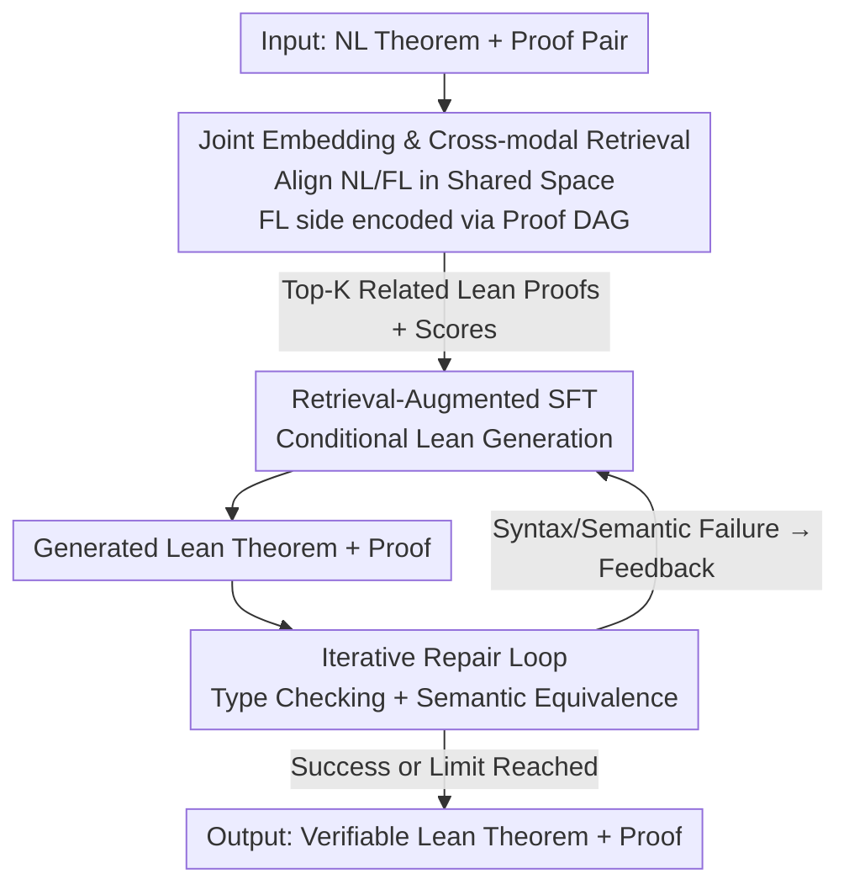

# ProofBridge: Auto-Formalization of Natural Language Proofs in Lean via Joint Embeddings

**Conference**: ICLR 2026  
**OpenReview**: [https://openreview.net/forum?id=U2jxHXuOX9](https://openreview.net/forum?id=U2jxHXuOX9)  
**Code**: TBD  
**Area**: LLM Reasoning / Auto-formalization / Neuro-symbolic  
**Keywords**: Proof Auto-formalization, Lean 4, Joint Embeddings, Cross-modal Retrieval, Iterative Repair

## TL;DR
ProofBridge unifies the "NL theorem+proof $\rightarrow$ Lean 4 theorem+proof" formalization task. It first trains a joint embedding model that aligns NL and Lean proofs (encoded via DAG structures) into a shared semantic space. This model performs cross-modal retrieval of similar Lean proofs as demonstrations for retrieval-augmented fine-tuning and inference. An iterative repair loop, driven by Lean type-checking and semantic equivalence judging, further refines the output. On the self-constructed MINIF2F-TEST-PF dataset, it achieves a +31.14% semantic accuracy improvement over the Kimina-Prover-RL-1.7B baseline.

## Background & Motivation
**Background**: Translating mathematical theorems and proofs from natural language (NL) to formal languages (FL) like Lean 4 is traditionally split into two independent tracks: auto-formalization (focused only on **theorem statements**, e.g., Herald, Kimina-Autoformalizer) and automated formal proof synthesis (AFPS, which assumes an existing FL theorem and targets proof generation, e.g., DeepSeek-Prover, Kimina-Prover).

**Limitations of Prior Work**: Formalizing an entire NL proof sequence still requires human intervention in practice. A notable example is AlphaProof, which won a silver medal at the 2024 IMO, where the problem statements were **manually** formalized before being handed to the automated proof synthesizer. Full proof auto-formalization (translating both theorem and proof) remains under-explored, with only a few precedents like Draft-Sketch-Prove (Isabelle) and FormL4 (Lean).

**Key Challenge**: The authors identify four constraints. First, large-scale paired "NL theorem $\leftrightarrow$ Lean 4 proof" data is extremely scarce; existing datasets are either small or suffer from Lean version mismatches. Second, general LLMs struggle with Lean's strict syntactic and semantic constraints, while smaller specialized models often focus only on theorems or only on proofs. Third, Lean 4's action space is nearly infinite; direct NL$\rightarrow$FL generation often ignores **semantic structures** like tactic reuse and DAG dependencies, leading to hallucinations. Fourth, evaluation is a bottleneck: Lean type-checking verifies if a proof "passes," but not if the formalized theorem preserves the original NL meaning.

**Goal**: To create a unified framework that inputs an NL theorem+proof pair and directly outputs a Lean 4 theorem+proof pair, ensuring both type correctness (passing Lean checks) and semantic correctness (consistency with the original NL).

**Core Idea**: Treat proof auto-formalization as "learning from demonstrations." Instead of generating Lean code from scratch, ProofBridge uses a joint embedding model aware of Lean proof DAG structures to **retrieve** the most semantically similar FL proofs as in-context demonstrations. These demonstrations provide "grounded" signals (tactic choices, DAG structures), guiding the model toward Lean-verifiable proofs.

## Method

### Overall Architecture
ProofBridge addresses the end-to-end translation of "NL theorem+proof $M_{\text{NL}}=\langle T_{\text{NL}}, P_{\text{NL}}\rangle \rightarrow$ Lean theorem+proof $M_{\text{FL}}=\langle T_{\text{FL}}, P_{\text{FL}}\rangle$". The system comprises three stages: **Joint Embedding + Cross-modal Retrieval** identifies semantically similar Lean proofs from a library; **Retrieval-Augmented Fine-tuning** enables an LLM (based on Kimina-Prover-RL-1.7B) to generate Lean pairs conditioned on FL demonstrations; and **Iterative Repair** employs a Lean type-checker and a semantic equivalence judge to refine results until success or a limit is reached.

The core innovation lies in treating the FL side not as plain text, but as a linearized DAG traversal of tactics, ensuring that "structurally similar" proofs are retrieved.

### Key Designs

**1. NL/FL Joint Embedding: Aligning Modalities via DAG-aware Contrastive Learning**

The limitation of prior RAG work (LeanSearch, HERALD, RAutoformalizer) was the use of text-only encoders, which fail to distinguish proofs that share common tactics but have different structural meanings. ProofBridge trains dual encoders: the NL side uses a lightweight all-MiniLM-L6-v2 (22.7M parameters) to project $M_{\text{NL}}$ into a 512-dimensional shared space. The FL side is critical: it extracts the proof $P_{\text{FL}}$ into a **linearized DAG traversal** using Lean REPL, representing it as a sequence of state transitions $S_0 \xrightarrow{\text{tac}_0} S_1 \xrightarrow{\text{tac}_1} \cdots \xrightarrow{\text{tac}_{H-1}} S_H$. Each state is encoded using LeanDojo’s ByT5 (218M parameters) and mean-pooled.

Alignment is achieved via a symmetric bidirectional InfoNCE contrastive loss:

$$\mathcal{L}(B) = -\frac{1}{2n}\sum_{i=1}^{n}\left[\log\frac{\exp([\hat{v}_{\text{NL}}^{(i)}, \hat{v}_{\text{FL}}^{(i)}]/\tau)}{\sum_{j}\exp([\hat{v}_{\text{NL}}^{(i)}, \hat{v}_{\text{FL}}^{(j)}]/\tau)} + \log\frac{\exp([\hat{v}_{\text{FL}}^{(i)}, \hat{v}_{\text{NL}}^{(i)}]/\tau)}{\sum_{j}\exp([\hat{v}_{\text{FL}}^{(i)}, \hat{v}_{\text{NL}}^{(j)}]/\tau)}\right]$$

where $\tau$ is the temperature and $[\cdot,\cdot]$ denotes cosine similarity. This DAG encoding ensures that equivalent NL-FL pairs cluster together, forming the foundation for semantic retrieval.

**2. Retrieval-Augmented Fine-tuning: Learning from Formal Logic Demonstrations**

To prevent the LLM from fabricating tactics, ProofBridge constructs prompts containing the input $M_{\text{NL}}$ and Top-K (K=5) retrieved FL pairs $\{M_{\text{FL}}^{(k)}\}$ with their **relevance scores** $\{r^{(k)}\}$. The model (Kimina-Prover-RL-1.7B) is fine-tuned using a standard autoregressive loss:

$$\mathcal{L}_{\text{CE}} = -\frac{1}{|T|}\sum_{t=1}^{|T|}\log P_\theta(\tau_t \mid \tau_{<t}, C)$$

where $C$ includes the NL input and retrieved demos. This allows the model to learn how specific mathematical concepts are formalized in Lean from real examples.

**3. Iterative Proof Repair: Dual Validation with Type-Checking and Semantic Judging**

Since LLMs are stochastic, ProofBridge employs a repair loop for the generated $\tilde{M}_{\text{FL}}$. **Syntactic validation** uses the Lean type-checker to catch compilation errors, while **semantic validation** uses an LLM-based "judge" to determine if the generated theorem $\tilde{T}_{\text{FL}}$ is logically equivalent to $T_{\text{NL}}$. If either check fails, the error/feedback is fed back to the model for regeneration, repeating up to $R_{\max}=5$ (Algorithm 1).

### Loss & Training
The strategy involves two phases. Phase 1 trains the joint embedding using $\mathcal{L}(B)$ (fine-tuning subsets of NL and ByT5 parameters). Phase 2 performs retrieval-augmented fine-tuning of Kimina-Prover-RL-1.7B using $\mathcal{L}_{\text{CE}}$ with fixed Top-5 retrieval. Training uses 90% of NUMINAMATH-LEAN-PF (35,056 samples) as both the training set and the retrieval library.

## Key Experimental Results

### Main Results
The authors created **NUMINAMATH-LEAN-PF** (38,951 pairs) for training and **MINIF2F-TEST-PF** (244 Olympiad problems ported to Lean v4.15.0) for evaluation.

Cross-modal retrieval quality (NL$\rightarrow$FL):

| Method | Params | Recall@1 (%) | MRR | mMG |
|------|--------|------|------|------|
| all-MiniLM-L6-v2 (Baseline) | 22.7M | 16.06 | 0.237 | 0.31 |
| Qwen3-Embedding-8B | 8B | 46.75 | 0.567 | 0.29 |
| **ProofBridge** | 22.7M+218M+1M | **52.83** | **0.650** | **0.65** |

ProofBridge outperforms the 8B SOTA encoder with 32x fewer parameters. Its mMG of 0.65 suggests the DAG-aware approach successfully distinguishes proofs with overlapping tactics.

Proof Auto-formalization (MINIF2F-TEST-PF, pass@32, SC = Semantic Correctness, TC = Type Correctness):

| Setting / Tool | SC (%) | TC (%) |
|------|------|------|
| Theorem-only models | 0.00 | 0.00 |
| Kimina-Prover-72B (zero-shot) | 43.03 | 79.51 |
| SoTA Two-Step (Herald$\rightarrow$Kimina-8B) | 43.44 | 59.43 |
| Kimina-Prover-RL-1.7B (random few-shot) | 31.56 | 93.85 |
| **ProofBridge (RAG SFT + Repair)** | **62.70** | **95.49** |

ProofBridge (1.7B) significantly outperforms the 72B zero-shot model and the two-step pipeline, which is hampered by cascading errors.

### Ablation Study

| Configuration | SC@32 (%) | TC@32 (%) |
|------|------|------|
| ProofBridge (SFT only) | 34.84 | 78.69 |
| + Retrieval-Augmented SFT | 55.33 | 89.75 |
| + Retrieval-Augmented SFT + Repair | **62.70** | **95.49** |

### Key Findings
- **RAG is the engine for SC**: Adding retrieval-augmented SFT boosted SC by ~20%, proving that relevant Lean demonstrations are more effective than simple fine-tuning.
- **Random demos hurt semantics**: Providing random few-shot examples improved TC but lowered SC, as it induced the model into producing syntactically correct but semantically misaligned proofs.
- **Repair loop targets TC**: The iterative process refined TC by +5.7% and peaked the SC score by reconciling compilation errors.

## Highlights & Insights
- **Proofs as First-class Retrieval Citizens**: By encoding tactic DAGs instead of plain text, the model captures structural logic. This approach is transferable to other structured domains like circuit design or SQL plans.
- **Verifiable Signals vs. Proxy Metrics**: Semantic correctness is verified via machine-checkable equivalence proofs generated by a judge, which is far more reliable than BLEU scores.
- **Clean Functional Division**: The RAG component handles semantics (SC), while the repair loop handles syntactic grounding (TC), creating a robust hybrid framework.

## Limitations & Future Work
- Semantic judging depends on Gemini-2.5-Pro's ability to generate equivalence proofs; the judge's capability bound defines the evaluation limit.
- Competition-level problems (IMO/AIME) remain difficult (SC ~35%), as retrieval is less helpful for novel tactic combinations.
- The system is coupled with Lean v4.15.0; cross-version or cross-prover (Isabelle/Rocq) migration remains a challenge.

## Related Work & Insights
- **vs. Theorem-only formalization**: ProofBridge formalizes the internal logic of the proof, avoiding the `sorry` placeholders used by previous models.
- **vs. AFPS**: ProofBridge does not assume an FL theorem is provided; it generates both the statement and the proof from NL.
- **vs. Two-step pipeline**: Avoids the "cascading error" problem where a mistranslated theorem statement makes subsequent proof synthesis impossible.

## Rating
- Novelty: ⭐⭐⭐⭐⭐ First to use DAG-aware joint embeddings for end-to-end NL/FL theorem-proof translation.
- Experimental Thoroughness: ⭐⭐⭐⭐⭐ Extensive comparison across 13 LLMs and multiple encoders with rigorous ablation.
- Writing Quality: ⭐⭐⭐⭐ Clear framework, though logic density requires careful reading of the architecture diagrams.
- Value: ⭐⭐⭐⭐⭐ Significant step toward fully automated mathematical formalization, crucial for the AI-for-Math community.

<!-- RELATED:START -->

## Related Papers

- [\[ICML 2025\] FMC: Formalization of Natural Language Mathematical Competition Problems](../../ICML2025/llm_reasoning/fmc_formalization_of_natural_language_mathematical_competition_problems.md)
- [\[ICLR 2026\] Hilbert: Recursively Building Formal Proofs with Informal Reasoning](hilbert_recursively_building_formal_proofs_with_informal_reasoning.md)
- [\[ICLR 2026\] ProofOptimizer: Training Language Models to Simplify Proofs without Human Demonstrations](proofoptimizer_training_language_models_to_simplify_proofs_without_human_demonst.md)
- [\[ICLR 2026\] Mathesis: Towards Formal Theorem Proving from Natural Languages](mathesis_towards_formal_theorem_proving_from_natural_languages.md)
- [\[ICLR 2026\] Premise Selection for a Lean Hammer](premise_selection_for_a_lean_hammer.md)

<!-- RELATED:END -->
## Related Papers

- [\[ICLR 2026\] Hilbert: Recursively Building Formal Proofs with Informal Reasoning](hilbert_recursively_building_formal_proofs_with_informal_reasoning.md)
- [\[ICLR 2026\] ProofOptimizer: Training Language Models to Simplify Proofs without Human Demonstrations](proofoptimizer_training_language_models_to_simplify_proofs_without_human_demonst.md)
- [\[ICLR 2026\] Premise Selection for a Lean Hammer](premise_selection_for_a_lean_hammer.md)
- [\[ICLR 2026\] Mathesis: Towards Formal Theorem Proving from Natural Languages](mathesis_towards_formal_theorem_proving_from_natural_languages.md)
- [\[ICML 2025\] FMC: Formalization of Natural Language Mathematical Competition Problems](../../ICML2025/llm_reasoning/fmc_formalization_of_natural_language_mathematical_competition_problems.md)

<!-- RELATED:END -->
