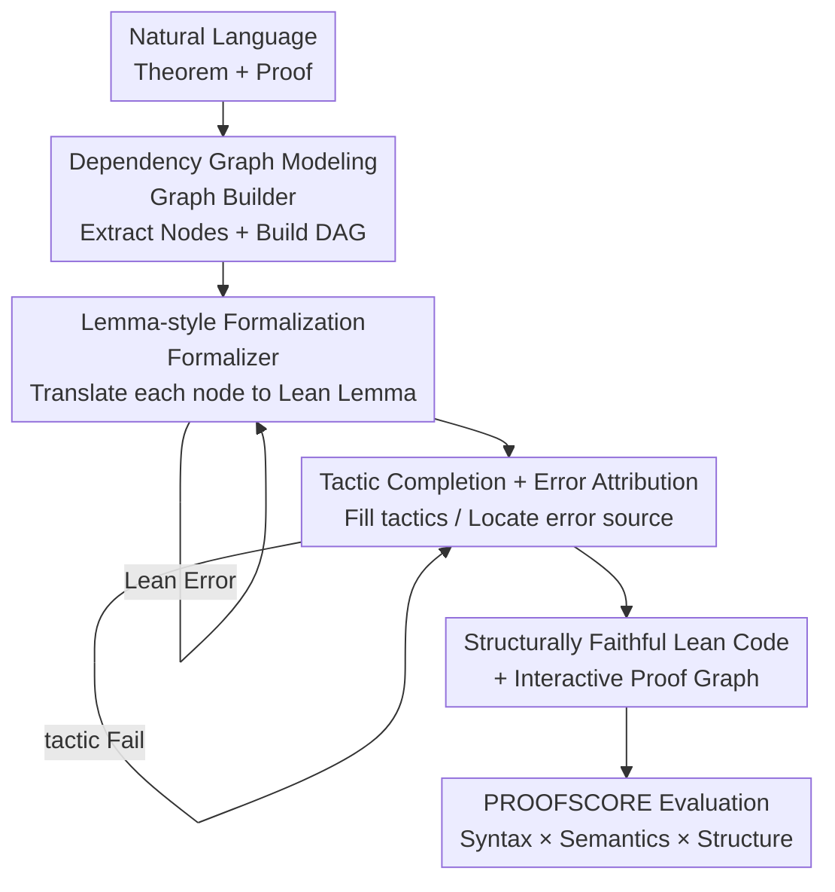

# ProofFlow: A Dependency Graph Approach to Faithful Proof Autoformalization

**Conference**: ICLR 2026  
**OpenReview**: [https://openreview.net/forum?id=s9t2FJVsBH](https://openreview.net/forum?id=s9t2FJVsBH)  
**Code**: https://github.com/Huawei-AI4Math/ProofFlow  
**Area**: LLM Reasoning / Autoformalization / Theorem Proving  
**Keywords**: Proof autoformalization, dependency graph, Lean 4, structural faithfulness, evaluation metrics

## TL;DR
ProofFlow decomposes a natural language proof into a Directed Acyclic Graph (DAG) characterizing step dependencies, and then formalizes each step into a high-level Lean 4 lemma with explicit dependencies. This preserves the logical structure of the original argument beyond mere "syntactic correctness." The authors also propose a comprehensive evaluation metric, PROOFSCORE, and a university-level benchmark, PROOFFLOWBENCH (184 problems), pushing autoformalization quality from a baseline of 0.279 to 0.545.

## Background & Motivation
**Background**: Translating natural language theorems and proofs into machine-verifiable code (proof autoformalization) is a critical step for integrating LLMs into rigorous mathematical workflows. It differs from Automated Theorem Proving (ATP)—while ATP searches for a proof from an **already formalized** statement, this work aims to faithfully translate an **existing human proof** to verify its correctness, identify missing assumptions, or fix logical gaps.

**Limitations of Prior Work**: Mainstream approaches direct LLMs to generate Lean 4 tactics (e.g., `linarith`, `have`) linearly. However, tactics are low-level, high-freedom operations that often fail to align with the step structure of the original proof. The paper illustrates this with a polynomial inequality: the original proof contains five logical steps (L1–L4, TS), whereas a tactic-based approach might compress TS, L2, and L4 into a single `linarith` call, obscuring the sequence and dependencies. This leads to two issues: first, many natural language expressions cannot be directly mapped to low-level tactics, causing formalization failure; second, even if a verifiable proof is generated, it might "take shortcuts"—bypassing intermediate steps or using premises that should not be used according to the original proof—resulting in correct results with incorrect logic.

**Key Challenge**: Human language is flexible and high-level, while formal systems are rigid and low-level. Previous methods focused solely on "compilability" (syntactic correctness) or used BLEU for rough semantic measurement, completely ignoring **structural faithfulness**—whether the dependency structure of the proof is preserved. A typical counter-example is STEP PROOF, which assumes every step depends on all preceding steps; this oversimplification allows the prover to take shortcuts in any subgraph (e.g., directly reusing L1 to prove L3, rendering L2 redundant).

**Goal**: (1) Ensure each formalized step uses only the specific set of antecedent lemmas and theorem conditions designated by the original proof logic; (2) Provide a quantifiable definition and metric for "faithfulness"; (3) Provide a specialized benchmark for evaluating proof formalization.

**Core Idea**: Instead of direct translation into low-level tactics, the proof is **deconstructed into a series of high-level lemmas with explicit dependencies**. A DAG is first used to clarify "who depends on whom," followed by node-wise formalization. The graph structure forces the prover to follow the correct dependencies, preventing shortcuts at the source.

## Method

### Overall Architecture
ProofFlow is a three-stage pipeline where each stage invokes an LLM to bridge the gap between natural language and formal code. The input is a natural language theorem and proof, and the output is structurally faithful Lean 4 code (with explicit dependencies for each lemma) plus an interactive proof graph. The first stage, **Graph Builder**, parses the dependency DAG from the original proof; the second stage, **Formalizer**, translates each node's "self-contained statement" into a Lean 4 lemma (initially using `by sorry` as a placeholder); the third stage, **Tactic Completer**, replaces `sorry` with actual tactics to complete the proof. Both formalization/proving stages include Lean compiler verification and retry loops. The process also includes an error attribution mechanism to determine if errors stem from the Formalizer, Tactic Completer, or the original natural language proof. Evaluation is unified via PROOFSCORE.

### Key Designs

**1. Dependency Graph Modeling: Explicitly Mapping the Logical Skeleton with a DAG**

To address the lack of step dependency and "shortcut" issues in tactic-based approaches, the Graph Builder uses an LLM to parse the proof into a directed acyclic graph $G=(V,E)$. Nodes are partitioned into four disjoint subsets $V = V_{TC} \cup V_D \cup V_L \cup V_{TS}$, corresponding to Theorem Conditions, Definitions, Lemmas, and Theorem Solutions, respectively. Each edge $(u,v)\in E$ indicates that node $u$ is a prerequisite for proof $v$. Theorem conditions and conclusions are extracted from the theorem statement, while lemmas and extra definitions are extracted from the proof body. Each node is assigned three elements: its original natural language statement, its dependency list, and a **self-contained statement** (supplementing all necessary premises so the step can stand alone). Once built, the system verifies graph validity—checking for forward references, cycles, and ensuring every node except the conclusion has an outgoing edge. This step is the root of "structural faithfulness" for the entire pipeline.

**2. Lemma-style Formalization: High-level Lemmas instead of Low-level Tactics**

This is the fundamental difference from existing methods. Instead of generating fragmented low-level tactics, the Formalizer translates each node's self-contained statement into an independent Lean 4 lemma. The lemma signature **explicitly lists its prerequisite lemmas/conditions** (e.g., `lemma TS (L2: ...) (L4: ...) : ...`), with the proof body initially held by `by sorry`. This offers two advantages: first, high-level lemmas correspond one-to-one with the step sequence of the original proof, whereas tactics often collapse multiple steps into one; second, explicit dependencies bake "which premises are usable" into the type signature, mechanically preventing the prover from introducing dependencies not present in the original proof. In contrast, the commonly used `have` in Lean feeds the entire preceding context to the current step, creating a breeding ground for shortcuts.

**3. Tactic Completion and Error Attribution: Completing Proofs and Locating Errors**

The Tactic Completer replaces `by sorry` in each lemma with actual Lean 4 tactics to make the proof executable, also utilizing compilation checks and retries. More importantly, it includes a **node-wise error attribution mechanism**: it first checks the semantic faithfulness score of a node against a threshold (0.6). If it fails, the natural language statement of that step is deemed problematic. If it passes, and the statement is provable (a lemma or conclusion), the Tactic Completer tries to fill tactics. If it fails, the LLM is prompted to **prove the negation of the statement**. If the negation is proven, it indicates the original natural language statement was imprecise or incorrect; otherwise, the failure is attributed to the Tactic Completer's inability to prove or disprove the statement. This transforms "formalization failure" from a black-box signal into a locatable diagnostic tool.

**4. PROOFSCORE: Integrating Syntax, Semantics, and Structure**

Previous metrics focused only on syntax or used BLEU for semantics, ignoring structure. PROOFSCORE integrates all three: for an $n$-step proof,
$$\text{PROOFSCORE} = \frac{1}{n}\sum_{i=1}^{n} f_i\, c_i\, \mathbb{I}\!\left[D_{\text{est}}(v_i)\in D_{\text{true}}(v_i)\right]$$
where $c_i\in\{0,1\}$ is **syntactic correctness** (1 if node $v_i$ has no compilation errors after the Tactic Completer); $f_i\in[0,1]$ is **semantic faithfulness** (adapted from LeanScore); and the indicator function $\mathbb{I}[\cdot]$ targets **structural faithfulness**, checking if the estimated dependency $D_{\text{est}}(v_i)$ falls within a set of valid ground-truth dependencies $D_{\text{true}}(v_i)$. Since the factors are multiplied, a failure in any dimension zeros out the score for that step, making it much stricter than syntactic metrics.

## Key Experimental Results

### Main Results
Evaluated on the self-built PROOFFLOWBENCH (184 problems) using Pass@5 (up to 5 retries per stage). Baselines include FULL PROOF (one-shot formalization) and STEP PROOF (independent step-wise formalization).

| Method | Thinking Mode | PROOFSCORE | Proof-level Syntax Pass Rate |
|------|---------|-----------|------------------|
| **ProofFlow DAG** | Yes | **0.545** | 0.375 |
| ProofFlow noDAG | Yes | 0.417 | 0.353 |
| FULL PROOF | Yes | 0.279 | 0.571 |
| STEP PROOF | Yes | 0.029 | 0.119 |
| **ProofFlow DAG** | No | 0.355 | 0.027 |
| FULL PROOF | No | 0.021 | 0.027 |
| STEP PROOF | No | 0.046 | 0.005 |

ProofFlow DAG (Thinking mode) achieves a SOTA PROOFSCORE of 0.545, nearly double that of FULL PROOF (0.279). Notably, FULL PROOF has the highest syntax pass rate (0.571). It generates code that compiles, but its low PROOFSCORE indicates that these proofs are "syntactically correct but structurally unfaithful," confirming that syntax alone overestimates quality. STEP PROOF performs worst due to difficulties in maintaining Lean 4 indentation across steps and cascading failures.

### Ablation Study

| Configuration | PROOFSCORE (Yes) | Tactic Accuracy (Yes) | Description |
|------|-----------------|--------------------|------|
| DAG (Full) | 0.545 | 0.742 | Mandatory correct dependency graph |
| noDAG | 0.417 | 0.681 | Released dependencies; fed all preceding steps as premises |

Removing the DAG constraint (noDAG) drops the PROOFSCORE from 0.545 to 0.417, with declines in both structural faithfulness and syntactic correctness. Counter-intuitively, in **non-thinking** mode, noDAG has a higher syntax pass rate (0.049 vs 0.027)—feeding all preceding steps as context to a weaker model makes it easier to piece together compilable code, but at the cost of logical inconsistency.

### Key Findings
- **Structural faithfulness is the true differentiator**: FULL PROOF has the highest syntax pass rate but lowest PROOFSCORE, proving "compilable" is not "faithful."
- **DAG enforcement is the core source of gain**: Ablations show an improvement from 0.417 to 0.545 in thinking mode, primarily driven by structural faithfulness.
- **DAG offers efficiency**: The Tactic Completer is the primary bottleneck (81–89% of time), and the DAG design inherently supports parallel formalization of independent branches.
- **Generalization**: Results on miniF2F (50 problems) show consistent ranking across configurations, with generally higher metrics, suggesting miniF2F is easier than PROOFFLOWBENCH.

## Highlights & Insights
- **Decomposing "faithfulness" into three quantifiable dimensions**: The multiplicative aggregation of Syntax × Semantics × Structure is clever—failure in any dimension results in a zero for that step, preventing metric hacking.
- **Using type signatures as dependency constraints**: Moving the "usable premises" into Lean lemma signatures forces structural faithfulness via the formal system itself, rather than relying on prompts.
- **The "proving negations" trick in error attribution**: Attempting to prove the negation of a statement when tactics fail helps distinguish between "incorrect original proof" and "incapable prover," providing diagnostic feedback to mathematicians.
- **DAG serves both correctness and efficiency**: The dependency graph restricts the search space for higher faithfulness and enables parallelism for speed.

## Limitations & Future Work
- **Tactic Completer remains a bottleneck**: Accounting for 81–89% of execution time, the proposed parallelization is more of a principle than a fully realized implementation.
- **Dependency on LLM graph quality**: Errors in DAG extraction by the Graph Builder propagate through the pipeline.
- **Non-unique ground-truth graphs**: Since granularity varies, structural faithfulness allows multiple valid graphs, introducing some subjectivity into evaluation.
- **Limited benchmark scale**: PROOFFLOWBENCH consists of only 184 undergraduate-level problems. Scalability to research-level long proofs is unverified.
- **Absolute scores remain low**: A top PROOFSCORE of 0.545 indicates that faithful autoformalization is far from solved.

## Related Work & Insights
- **vs FULL PROOF**: It formalizes the entire proof in one LLM call, yielding high syntax pass rates but poor structural faithfulness. ProofFlow sacrifices some syntax pass rate to double the PROOFSCORE.
- **vs STEP PROOF**: STEP PROOF assumes each step depends on all preceding ones, leading to shortcuts and indentation issues. ProofFlow specifies precise antecedent sets via DAGs to eliminate incorrect dependencies.
- **vs Traditional ATP**: ATP searches for any proof for a formalized statement (shortcuts are fine). ProofFlow aims to "translate an existing proof," where faithfulness to the original structure is the goal. These tasks are orthogonal but can be cascaded.

## Rating
- Novelty: ⭐⭐⭐⭐⭐ Explicitly targeting "structural faithfulness" via DAGs + lemma signatures is a novel and self-consistent approach.
- Experimental Thoroughness: ⭐⭐⭐⭐ Includes a new benchmark, miniF2F re-testing, DAG/noDAG ablation, and think/no-think modes, though absolute scores are still relatively low.
- Writing Quality: ⭐⭐⭐⭐⭐ Clear motivation and logical flow, supported by effective contrastive examples.
- Value: ⭐⭐⭐⭐⭐ Autoformalization is a key bridge for LLMs in formal mathematics. The open-sourcing of the pipeline, benchmark, and metrics is a significant contribution.

<!-- RELATED:START -->

## Related Papers

- [\[ICLR 2026\] LoC-Decomp: LLM Autoformalization via Logical Concept Decomposition and Iterative Feedback Correction](loc-decomp_llm_autoformalization_via_logical_concept_decomposition_and_iterative.md)
- [\[ICLR 2026\] ReForm: Reflective Autoformalization with Prospective Bounded Sequence Optimization](reform_reflective_autoformalization_with_prospective_bounded_sequence_optimizati.md)
- [\[ICLR 2026\] A Balanced Neuro-Symbolic Approach for Commonsense Abductive Logic](a_balanced_neuro-symbolic_approach_for_commonsense_abductive_logic.md)
- [\[ICLR 2026\] Divide and Abstract: Autoformalization via Decomposition and Abstraction Learning](divide_and_abstract_autoformalization_via_decomposition_and_abstraction_learning.md)
- [\[ICLR 2026\] Strategic Scaling of Test-Time Compute: A Bandit Learning Approach](strategic_scaling_of_test-time_compute_a_bandit_learning_approach.md)

<!-- RELATED:END -->
