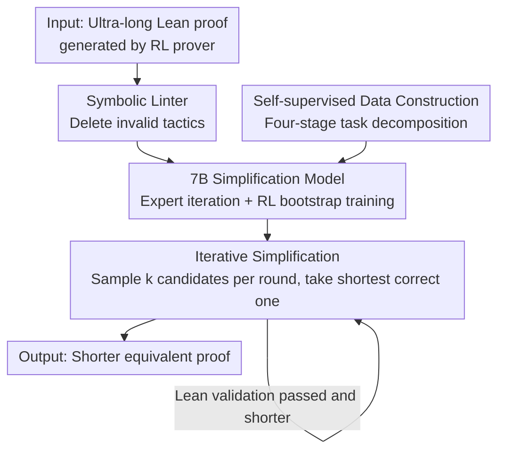

# ProofOptimizer: Training Language Models to Simplify Proofs without Human Demonstrations

**Conference**: ICLR 2026  
**OpenReview**: [https://openreview.net/forum?id=huptrb4JTa](https://openreview.net/forum?id=huptrb4JTa)  
**Code**: TBD (The paper promises to open-source the evaluation sets and model-generated proofs)  
**Area**: LLM Reasoning / Formal Theorem Proving  
**Keywords**: Proof Simplification, Lean, Expert Iteration, Reinforcement Learning, Self-supervised Training

## TL;DR
ProofOptimizer is the first 7B language model capable of shortening Lean proofs **without any human simplification demonstrations**. Utilizing a toolkit consisting of a "symbolic linter + 7B model + iterative simplification," it relies on the Lean compiler for automatic verification and uses expert iteration and RL for bootstrapping. It compresses lengthy proofs generated by SOTA neural provers by an average of 87% on miniF2F, 57% on PutnamBench, and 50% on IMO 2025 proofs from Seed-Prover. Furthermore, simplified proofs compile faster and can improve prover performance when reused as training data.

## Background & Motivation

**Background**: Neural theorem provers trained via RL (such as Seed-Prover and Goedel-Prover-V2) have made significant progress this year, reaching IMO gold medal levels. They can produce formal proofs spanning thousands of lines that are mechanically verified as correct by Lean.

**Limitations of Prior Work**: The sole reward signal for these RL provers is "whether the proof is correct." Consequently, the models prioritize correctness over conciseness, resulting in proofs that are excessively long—filled with redundant steps and heavy-duty automated tactics for goals that could be solved in a single step. An extreme example cited in the paper is a Seed-Prover proof for IMO 2025 P1 that spans 4357 lines, which is 16 times longer than an informal solution in terms of character count. Such proofs suffer from three main issues: they are unreadable to humans (losing mathematical insight), they serve as poor-quality synthetic training data (models learn nothing from convoluted proofs), and they compile extremely slowly in Lean/mathlib.

**Key Challenge**: Proof simplification (shortening a proof while maintaining correctness) has become a bottleneck, yet **training data is extremely scarce**—there are no paired corpora of "pre-simplified/post-simplified" proofs.

**Goal**: To train a specialized proof simplification model under zero human supervision that can handle the **ultra-long** proofs produced by RL provers (precisely the scenario where previous methods fail most but are needed most).

**Key Insight**: The authors noted two factors that bypass the lack of annotations: first, the Lean compiler itself is a free and reliable validator that can determine if a simplified proof remains correct; second, proof length (number of Lean tokens) is a deterministic, automatically calculable complexity metric that naturally serves as a reward. With "verifiable correctness + calculable goals," the model can bootstrap by generating its own data and signals.

**Core Idea**: Transform proof simplification into a **self-supervised closed loop**—the model proposes simplification candidates → Lean validates and filters them by length → successful simplifications flow back as training data (expert iteration) or reward signals (RL). This cycle enables continuous self-improvement without any human-written simplification demonstrations.

## Method

### Overall Architecture

ProofOptimizer aims to solve the problem: "given a long and correct Lean proof $p$, produce a shorter and still correct proof $p^*$." The task is formalized as $p^* = \arg\min_{x \text{ proves } s} L(x)$, where $L(x)=|x|$ is the proof length (tokens from a Lean-specific tokenizer, ignoring comments and newlines). However, the method is generalizable to any deterministic, automatically calculable metric.

The system consists of three components sequenced during inference: initial cleaning with a symbolic tool, major changes by the model, and final compression via iterative approximation.

The key to the entire pipeline is that the training data is **synthesized from scratch** via a four-stage pipeline (without human labeling). The model then bootstraps via expert iteration and RL, while inference combines the symbolic linter, model sampling, and iterative approximation to minimize length.

### Key Designs

**1. Self-supervised Training Pipeline: Generating "pre/post" corpora without human labels**

The biggest obstacle is the lack of paired corpora. The authors use a four-stage pipeline to **create proofs** as seeds rather than labeling simplification pairs: ① Problem collection—collecting theorem proving problems from Goedel-Pset and filtering out trivial computational ones; ② Proof sketches—training a model to formalize natural language solutions into high-level Lean proof sketches (2–10 steps) using `sorry` as placeholders; ③ Theorem extraction and filtering—breaking each sketch step into independent sub-theorems (essentially slicing long proofs into short ones), yielding 518K sub-theorems, then filtering trivial ones to leave 307K; ④ Proof generation—using Goedel-Prover-V2-32B to generate proofs for these sub-theorems, resulting in 145K proofs as the initial training set $P_0$. The brilliance of this pipeline is that it requires no "simplification demonstrations"; as long as a batch of correct proofs is created, the subsequent bootstrapping loop can "distill" simplification ability from correctness.

**2. Expert Iteration (ExpIt): Backflowing successful simplifications as supervision via STaR-style bootstrapping**

Given seed proofs but no "shorter versions" as labels, the authors use a STaR-style iterative algorithm. Starting from base model $\pi_0$ and proof set $P_0$, each round $i$ involves three steps: **Sampling**—for each proof $x\in P_i$, sample 4 candidates $\{y^1_x,\dots,y^4_x\}$ using $\pi_i$; **Filtering**—use Lean to select the shortest correct proof $y_x$ from $\{x\}\cup Y_x$, keeping only samples with significant simplification for the training set $D_i=\{(x,y_x)\mid \text{len}(y_x)\le 0.8\cdot\text{len}(x)\}$; **Training**—fine-tune $\pi_i$ on $D_i$ to get $\pi_{i+1}$, using the shorter proofs as seeds for the next round. A specific detail: from the second round, because $x$ might have been simplified from a more complex $x'\in P_0$, the authors add "larger span" pairs $(x', y_x)$ to $D_i$ to expose the model to more significant compression examples.

**3. Online Reinforcement Learning (RL): Using "relative reduction rate" as reward**

While ExpIt is offline SFT, the authors add an online RL route using the same data. The reward is defined as the relative reduction rate: if $y$ is valid and $|y|\le|x|$, $R(x,y)=\frac{|x|-|y|}{|x|}$; otherwise, it is 0. Optimization uses an asynchronous variant of GRPO where the advantage $A_i = R_i - \frac{1}{k}\sum_{j\le k}R_j$ uses the average reward of $k=8$ samples as the baseline, without standard deviation normalization or KL regularization. RL significantly pulls up the single-sample (@1) metrics, but at the cost of **diversity collapse**.

**4. Inference Trio: Symbolic linter + Test-time RL + Iterative simplification**

The authors stack three techniques, with **iterative simplification** being the primary driver. First, a symbolic linter (based on Lean's `linter.unusedTactic`) removes tactics that do not change the proof state. Then, three routes are compared: **Test-time RL**—performing an extra round of RL on the evaluation set to eliminate train/test distribution shifts; **Execution feedback repair**—feeding Lean errors back to Goedel-Prover-V2-32B for fixing (which was found to be less effective as repaired proofs are often longer); and **Iterative simplification**—sampling $k$ candidates, choosing the shortest correct one, and repeating the process. Ultimately, iterative simplification achieves the best balance between performance and diversity.

## Key Experimental Results

Evaluation was conducted using proofs generated by Goedel-Prover-V2 on miniF2F (194 proofs, average length 334) and PutnamBench (75 proofs, average length 1468).

### Main Results

Comparison of ExpIt, RL, and test-time RL (metrics relative to linted proofs; Min is lower is better, Red is higher is better):

| Dataset | Model | Min@1 ↓ | Min@32 ↓ | Red@1 ↑ | Red@32 ↑ |
|---------|-------|---------|----------|---------|----------|
| miniF2F | Linted (Baseline 302) | 302 | — | 0.0% | — |
| miniF2F | Gemini-2.5-Pro + States | 283 | 207 | 26.4% | 58.7% |
| miniF2F | ProofOptimizer-ExpIt | 241 | 153 | 49.0% | 72.3% |
| miniF2F | ProofOptimizer-RL | 190 | 152 | **63.6%** | 70.9% |
| miniF2F | It2 + Test-time RL | **160** | 154 | **72.5%** | 73.4% |
| PutnamBench | Linted (Baseline 1359) | 1359 | — | 0.0% | — |
| PutnamBench | Gemini-2.5-Pro + States | 1371 | 1319 | 6.1% | 19.2% |
| PutnamBench | ProofOptimizer-ExpIt | 1328 | 1161 | 8.2% | 26.3% |
| PutnamBench | ProofOptimizer-RL | 1303 | 1258 | 14.9% | 21.1% |
| PutnamBench | It2 + Test-time RL | **1260** | 1255 | **23.8%** | 24.2% |

ExpIt improved steadily over rounds and excelled at @32 metrics. RL pushed @1 metrics to the highest level but narrowed the gap between @1 and @32 (diversity collapse). All variants significantly outperformed Gemini-2.5-Pro.

With **iterative simplification**, results were even stronger: miniF2F average length dropped from 334 to 75, and PutnamBench from 1468 to 811, achieving average per-problem compressions of **87.9% / 57.2%**. On out-of-distribution IMO 2025 problems, P1/P3/P4/P5 were compressed by 43.8%/51.7%/50.1%/53.8% respectively.

### Ablation Study

| Dimension | Key Data | Explanation |
|-----------|----------|-------------|
| Feedback Repair | Only 4.8%(miniF2F)/1.8%(Putnam) shorter than best | Repaired proofs are often longer; resampling is superior. |
| Training Data Gain | miniF2F accuracy +2% | SFT on simplified proofs (avg length 85) is better than on original proofs (avg length 147). |
| Compile Speed | 50/75(Putnam), 114/194(miniF2F) accelerated >10% | Simplified proofs are generally faster; some accelerated >50%. |

### Key Findings

- **Iterative simplification > Large single sampling > Execution feedback repair**: Spending the sampling budget on "iteratively simplifying the shortest proof" is more effective than large-scale @128 sampling or external model repair.
- **ExpIt and RL have distinct strengths**: ExpIt maintains diversity and is better for high-sample scenarios (@32); RL excels at single-sample (@1) performance but suffers from diversity collapse.
- **Simplification yields downstream benefits**: Feeding simplified proofs back into the prover improved miniF2F performance by 2% and accelerated compilation.
- **Difficulty increases with length**: Reduction rates decrease as original proof length increases; ultra-long proofs (thousands of lines) remain challenging.

## Highlights & Insights

- **Turning "No Annotations" into "No Annotations Needed"**: The core insight is that proof simplification naturally possesses two free supervision sources—Lean's verifiability (correctness) and token length calculability (goal). This enables the distillation of simplification ability.
- **Plug-and-play Reward Function**: Since the method is agnostic to the complexity metric $L$, replacing "proof length" with "execution time" would allow the same pipeline to perform **proof acceleration**.
- **Counter-intuitive Conclusion on Repair**: Using execution feedback for external models to fix proofs sounds reasonable but fails because repaired proofs are often longer than the original.
- **Small Model, Big Impact**: A 7B model consistently beat Gemini-2.5-Pro, proving that task-specific bootstrapping is more effective than general-purpose model prompt scaffolding.

## Limitations & Future Work

- **Ultra-long Proof Challenges**: The reduction rate drops significantly for extremely long proofs; IMO-level proofs with tens of thousands of lines can only be halved, still far from human-readability.
- **Simplification Can Slow Execution**: In some cases, a simplified proof is slower—often because a fast algorithm was replaced by a shorter but slower brute-force tactic (e.g., `interval_cases`).
- **Dependency on Existing Provers**: The data generation relies on models like Goedel-Prover-V2; if a problem cannot be solved by these models, it cannot be simplified.
- **Single Metric**: Length is the primary metric, but "conciseness/readability" is multi-dimensional; focusing solely on length might produce shorter but more obscure proofs.

## Related Work & Insights

- **vs ImProver / Ahuja et al. 2024**: Previous work used agentic scaffolding with API models (like GPT-4o) to shorten human proofs but failed on ultra-long RL-generated proofs. Ours directly fine-tunes specialized models, tackling the most valuable yet difficult scenario.
- **vs Direct LLM Fine-tuning**: Simple SFT lacks paired corpora; Ours uses Lean verification and length filtering to solve the data scarcity via a self-supervised loop.
- **vs STaR / Expert Iteration**: The method adopts the STaR framework (generate, filter, train) but replaces the filter with the Lean compiler and a 0.8 length constraint.

## Rating
- Novelty: ⭐⭐⭐⭐⭐ The first zero-human-supervision Lean simplification model; the self-supervised loop is elegant.
- Experimental Thoroughness: ⭐⭐⭐⭐⭐ Solid coverage across miniF2F/Putnam/IMO and multiple ablation dimensions.
- Writing Quality: ⭐⭐⭐⭐ Concepts and pipelines are explained clearly; Figure 1 comparison is intuitive.
- Value: ⭐⭐⭐⭐⭐ Directly addresses the "redundancy" pain point in neural theorem proving with practical engineering and research value.

<!-- RELATED:START -->

## Related Papers

- [\[ICLR 2026\] ProofBridge: Auto-Formalization of Natural Language Proofs in Lean via Joint Embeddings](proofbridge_auto-formalization_of_natural_language_proofs_in_lean_via_joint_embe.md)
- [\[ICLR 2026\] Native Reasoning Models: Training Language Models to Reason on Unverifiable Data](native_reasoning_models_training_language_models_to_reason_on_unverifiable_data.md)
- [\[ICLR 2026\] Your Models Have Thought Enough: Training Large Reasoning Models to Stop Overthinking](your_models_have_thought_enough_training_large_reasoning_models_to_stop_overthin.md)
- [\[ICLR 2026\] Reinforcing General Reasoning without Verifiers](reinforcing_general_reasoning_without_verifiers.md)
- [\[ICLR 2026\] Hilbert: Recursively Building Formal Proofs with Informal Reasoning](hilbert_recursively_building_formal_proofs_with_informal_reasoning.md)

<!-- RELATED:END -->
## Related Papers

- [\[ICLR 2026\] ProofBridge: Auto-Formalization of Natural Language Proofs in Lean via Joint Embeddings](proofbridge_auto-formalization_of_natural_language_proofs_in_lean_via_joint_embe.md)
- [\[ICLR 2026\] Native Reasoning Models: Training Language Models to Reason on Unverifiable Data](native_reasoning_models_training_language_models_to_reason_on_unverifiable_data.md)
- [\[ICLR 2026\] Your Models Have Thought Enough: Training Large Reasoning Models to Stop Overthinking](your_models_have_thought_enough_training_large_reasoning_models_to_stop_overthin.md)
- [\[ICLR 2026\] Reinforcing General Reasoning without Verifiers](reinforcing_general_reasoning_without_verifiers.md)
- [\[ICLR 2026\] Hilbert: Recursively Building Formal Proofs with Informal Reasoning](hilbert_recursively_building_formal_proofs_with_informal_reasoning.md)

<!-- RELATED:END -->
