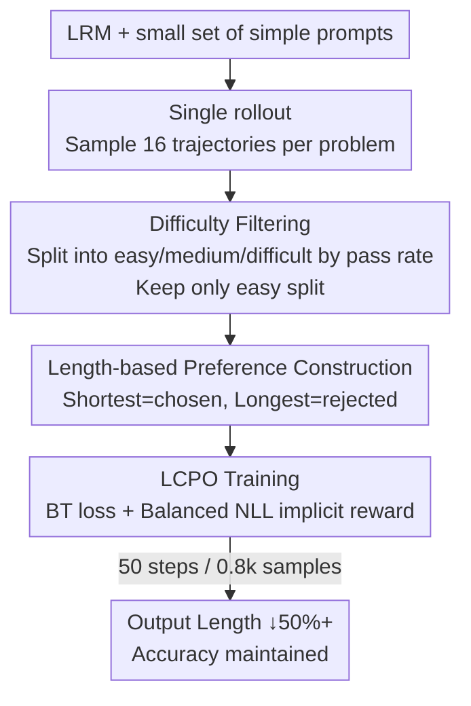

# Pruning Long Chain-of-Thought of Large Reasoning Models via Small-Scale Preference Optimization

**Conference**: ICLR 2026  
**OpenReview**: [https://openreview.net/forum?id=8xSU8Oscvg](https://openreview.net/forum?id=8xSU8Oscvg)  
**Code**: To be confirmed  
**Area**: LLM Reasoning / Efficient Inference  
**Keywords**: Efficient Inference, CoT Pruning, Preference Optimization, Length Control, Bradley-Terry

## TL;DR
This paper proposes LCPO (Length Controlled Preference Optimization), which uses only 0.8k preference samples and 50 training steps. By performing offline alignment using pure length preferences—selecting easy problems the model can already solve, treating the shortest response as "chosen" and the longest as "rejected"—it reduces the average output length of DeepSeek-R1-Distill reasoning models by over 50% with almost no loss in accuracy.

## Background & Motivation
**Background**: Large Reasoning Models (LRM) such as DeepSeek-R1 and QwQ-32B achieve strong performance on complex mathematical and logical tasks through ultra-long Chain-of-Thought (CoT). They learn to decompose problems, solve step-by-step, and perform iterative verification via online reinforcement learning with verifiable rewards (RLVR, e.g., PPO, GRPO). However, this comes at the cost of generating thousands of tokens.

**Limitations of Prior Work**: Excessively long outputs have two major drawbacks: first, a surge in computational and VRAM costs during inference, limiting the use of LRMs for continuous downstream learning; second, "overthinking," where a model may consume 5465 tokens for a simple MATH-500 problem and even think itself into an error. Existing token-saving approaches have significant flaws: inference-time pruning (forcing early stopping via prompts or tokens) is low-cost but unstable and hurts reasoning ability; mainstream large-scale multi-objective RL (adding length regularization to accuracy rewards) requires retraining on approximately 645k samples, involving complex systems and high resource consumption—contradicting the goal of "efficient inference." Furthermore, budget-forcing with preset token limits is rigid and fails to adapt to dynamic tasks.

**Key Challenge**: The core conflict lies in reducing length while preserving performance. Existing methods either sacrifice reasoning quality through "hard constraints/budgets" or sacrifice training efficiency through "large-scale online RL." Achieving both cost reduction and quality preservation is difficult.

**Goal**: To condense the generation length of LRMs while maintaining reasoning performance under the premise of minimal tuning (small data, few steps, offline). This is framed as two research questions: RQ1—Do "shorter but equally effective" reasoning paths exist within the generation space of reasoning models? RQ2—How can the generation distribution be adjusted using limited training and data?

**Key Insight**: The authors observe that RLVR essentially biases the output distribution toward rewarded trajectories. Conversely, one can **explicitly push the distribution toward the shortest valid paths** offline within the generation space. Empirical results show that when sampling 16 trajectories for the same problem and ranking them by length, the accuracy of the top (shorter) trajectories remains high, proving that short and effective paths do exist (answering RQ1).

**Core Idea**: Use preference optimization as an efficient form of "self-distillation"—treating the model's own short responses as "chosen" and long responses as "rejected" to shift the distribution. Theoretically analyze the convergence characteristics of various preference optimization objectives to design a custom objective, LCPO, specifically for length preference.

## Method

### Overall Architecture
The authors decompose the training process into the three elements of RL—Data, Reward, and Algorithm—and optimize each for lightweight execution, resulting in a low-cost length-pruning pipeline. **Data**: Perform a single rollout to sample a small number of trajectories from the model's generation space, filtering by "item difficulty" to keep only easy problems the model has mastered. **Reward**: No reward model is trained; rewards are implicitly provided by data ranking—labeling the shortest response as "chosen" and the longest as "rejected" based solely on length. **Algorithm**: Analyze current preference optimization methods under the Bradley-Terry framework; finding that the NLL loss hinders length preference alignment, the LCPO objective is proposed. The entire pipeline requires only 0.8k training samples and 50 training steps.

### Key Designs

**1. Difficulty Filtering: Learning brevity only on mastered simple problems**

Pruning length risks eliminating necessary trial-and-error for difficult problems. Thus, selecting the right training problems is critical. The authors use the pass rate as a proxy for "subjective difficulty": for each problem $q_i$, 16 outputs are sampled. Let $s_i$ be the average accuracy of these 16 samples. Problems are categorized: $s_i=1$ as "easy," $0<s_i<1$ as "medium," and $s_i=0$ as "difficult." A core observation is that the negative correlation between length and performance is **correlational, not causal**—reasoning models reflect and self-verify more on failed attempts, leading to longer responses. In other words, length is driven by the model's "perceived difficulty." Empirically, models could achieve 90%+ accuracy on certain problems using ~2200 tokens but averaged 7000 tokens before stopping, indicating a systematic "difficulty overestimation." Thus, training occurs only on the "easy split" to correct overthinking on simple problems while leaving necessary exploration for hard problems intact. Ablations (Table 4) show that longer chosen responses (from 2232 in "easy" to 3681 in "difficult") lead to longer model outputs, validating the filtering strategy.

**2. Pure Length Preference: Shortest as Correct, Longest as Incorrect**

The reward does not rely on any reward model but is implicitly determined by data ranking. For each problem in the easy split, the **shortest trajectory is selected as "chosen" and the longest as "rejected."** This maximizes the preference signal in the length direction. The intuition is that since accuracy for short and long responses is nearly identical on the easy split, "short is better than long" serves as a clean, low-noise preference. This encodes "token saving" directly into preference labels without requiring a scalar reward for length penalty. The paper also finds that even training on the "difficult split" (where chosen responses are actually incorrect) improves accuracy slightly, suggesting LCPO focuses on capturing the preference itself and is robust to noise in correctness labels.

**3. LCPO Objective: Offsetting NLL Implicit Rewards without Hyperparameter Tuning**

The authors rewrite SFT, DPO, SimPO, ORPO, and SimPER into a log-sigmoid form $-\log\sigma(R(y_w,y_l|x))$, treating them as specialized Bradley-Terry (BT) models and using $\sigma(R)\to 1$ as a convergence criterion to analyze length preference behavior. They conclude that: SFT fails due to NLL loss; ORPO's convergence becomes dominated by NLL loss as the "chosen" probability rises; SimPER has weak length alignment; and DPO/SimPO, while having looser convergence conditions, are highly dependent on hyperparameters and unstable with small data. Two required components for length control are identified: ① BT loss with a loose reward margin; ② A negative reward that balances the NLL loss.

Specifically, the NLL term itself can be written in BT form: let the length-normalized probability be $p_\theta(y|x)=\exp(\frac{1}{|y|}\log\pi_\theta(y|x))$, corresponding to an implicit reward $r_\theta(y|x)=\log\frac{p_\theta(y|x)}{1-p_\theta(y|x)}$. Then $\mathcal{L}_{\text{NLL}}=-\frac{1}{|y|}\log\pi_\theta(y|x)=\log\sigma(r_\theta(y|x))$. LCPO uses a corresponding term with the opposite sign to offset this NLL implicit reward and sets the margin $\epsilon$ to 0 for faster convergence:

$$\mathcal{L}_{\text{LCPO}}=\log\sigma\!\left(\log\frac{p_\theta(y_w|x)}{1-p_\theta(y_w|x)}-\log\frac{p_\theta(y_l|x)}{1-p_\theta(y_l|x)}\right)$$

It is isomorphic to standard BT loss but replaces raw policy probabilities with length-normalized probabilities $p_\theta$, enabling fast convergence on small datasets **without hyperparameter tuning**.

## Key Experimental Results

### Main Results
Evaluated on DeepSeek-R1-Distill-Qwen-1.5B / 7B across six math benchmarks: MATH-500, GSM8K, Minerva-Math, AIME24, AMC23, and OlympiadBench. Metrics are accuracy and average token count. Representative results for the 7B model (Length reduction % in brackets):

| Model/Method | MATH-500 Acc | MATH-500 Len(↓%) | GSM8K Acc | GSM8K Len(↓%) | Avg Len ↓ |
|--------|------|------|------|------|------|
| Original | 92.20 | 4223 | 91.81 | 1677 | - |
| CoD | 90.06 | 2778 (34.2%) | 88.32 | 416 (75.2%) | 36.9% |
| L1-Max | 88.80 | 2016 (52.3%) | 92.42 | 1640 (2.2%) | 52.5% |
| TrEff | 90.20 | 2413 (42.9%) | 89.39 | 357 (78.7%) | 42.3% |
| DAST | 91.20 | 3563 (15.6%) | 91.21 | 1092 (34.9%) | +11.4% (Inc.) |
| **Ours (LCPO)** | **91.40** | **2033 (51.9%)** | **92.95** | **796 (52.5%)** | **54.2%** |

On the 1.5B model, LCPO reduced average length by 57.31% with a total accuracy change of **+0.52** across six benchmarks. On 7B, average length was reduced by 54.21% with an accuracy change of only -1.99. On the hardest Minerva-Math benchmark, a 64% reduction in output length actually yielded a slight accuracy gain. In contrast, L1-Exact saw accuracy drops of 30 pts on AIME24 and 18 pts on AMC23 for the 7B model. DAST length increased on several benchmarks (+11.38% total), highlighting LCPO's superior trade-off.

### Ablation Study

| Config | MATH-500 Len(↓%) | GSM8K Len(↓%) | Avg Chosen Len | Description |
|------|---------|------|------|------|
| Ours w/ easy | 2033 (51.86%) | 796 (52.53%) | 2232 | Easy problems only (Full) |
| w/ medium | 2468 (41.56%) | 1068 (36.31%) | 3637 | Medium difficulty, weaker reduction |
| w/ difficult | 3130 (25.88%) | 1364 (18.66%) | 3681 | Hard problems, weakest reduction |
| w/o filter | 2954 (30.05%) | 1180 (29.64%) | 3270 | No filtering, significant degradation |

Preference algorithm ablation (Table 2, 7B/MATH-500): DPO reached only 33.15%, ORPO 25.72%, SimPER 9.26%, SFT 9.97%, and SimPO 11.20%, while LCPO reached 51.86% without hyperparameter tuning.

### Key Findings
- **Difficulty filtering is the key toggle for length reduction**: Longer chosen responses (moving from easy to difficult) result in wordier models. Removing filtering (w/o filter) dropped MATH-500 reduction from 51.86% to 30.05%, proving that "learning from short responses of mastered problems" is the effective signal.
- **LCPO is robust to label noise**: Even training on the "difficult split" where chosen responses are incorrect leads to a slight accuracy increase, indicating the model learns "preference/length" rather than "correctness."
- **Extreme training efficiency**: Only 22k raw data points, 0.8k training samples, and 50 steps are needed—compared to 645k for L1, 24.8k for TrEff, and 150k data/20.6k training samples for DAST.
- **OOD Generalization**: On out-of-distribution MMLU, GPQA-Diamond, and WinoGrande, the 1.5B model reduced length by 69.24% with a +5.68 accuracy gain; the 7B model reduced length by 57.50% with a +3.38 gain. This suggests the model learns a general "length preference" rather than memorizing task types.
- **Distribution shift and reduced variance**: Post-training, the peak of the MATH-500 length distribution shifts left and variance decreases, showing higher length consistency.

## Highlights & Insights
- **Diagnosing "length overestimation" as correlation, not causation**: The authors clarify that the "longer is worse" trend is a byproduct of trial-and-error on hard problems, not that length causes errors. This insight supports the strategy of correcting overthinking on simple tasks while preserving exploration on hard ones.
- **Reward-free training**: Preferences are constructed implicitly through "shortest=chosen, longest=rejected," encoding token efficiency into labels and eliminating the need for reward models or scalar length penalty designs.
- **Explicitly offsetting NLL loss in BT form**: This is the theoretical core of LCPO. While others are inadvertently hindered by NLL, LCPO parses it and balances it with a negative term, allowing fast convergence without hyperparameter tuning.
- **Self-distillation perspective**: All training data is self-generated. The model essentially aligns with the shortest effective paths already present within its own generation space, requiring no external teacher.

## Limitations & Future Work
- **Validated primarily on math reasoning**: Evaluation focused on math (plus some OOD knowledge/common sense); scenarios like code, Agent tasks, or multi-turn dialogue with long CoT were not covered.
- **Dependency on finding short paths in the generation space**: The upper bound is limited by existing short, valid trajectories. If a model only knows how to solve a problem with long CoT, the "easy split" and pruning headroom will be limited.
- **Potential information loss in pure length ranking**: Favoring the shortest may accidentally prefer "lucky guesses." Since chosen responses in the "difficult split" are incorrect, long-term training might reinforce negative short paths.
- **Future directions**: Adapting difficulty filtering dynamically during training or developing multi-objective LCPO (balancing length and correctness preferences) for harder tasks.

## Related Work & Insights
- **vs L1 / TrEff (Large-scale online RL + length reward)**: These methods use multi-objective RL on 645k/24.8k data points. They are training-heavy, and budget-forcing can cause accuracy drops. LCPO achieves a more stable trade-off using 0.8k samples and offline preference optimization.
- **vs DAST (Preference optimization + SimPO)**: DAST designs a difficulty-based ranking function with SimPO (150k data) but failed to reduce length in several benchmarks in this paper's replication. LCPO replaces the loss with a BT-based NLL-offsetting target and requires two orders of magnitude less data.
- **vs DPO / SimPO / ORPO / SimPER**: These general methods either exhibit NLL-dominated convergence (SFT/ORPO), weak alignment (SimPER), or high hyperparameter sensitivity (DPO/SimPO). LCPO specifically addresses convergence for length control.
- **vs Inference-time pruning (CoD, etc.)**: Prompt-based or token-forcing methods require no training but are unstable and can hurt accuracy. LCPO "bakes" the length preference into the model via offline training.

## Rating
- Novelty: ⭐⭐⭐⭐ The approach of explicitly rewriting NLL loss into BT form and using pure length-based ranking is elegant and novel.
- Experimental Thoroughness: ⭐⭐⭐⭐ Coverage of two model scales, six math benchmarks, three OOD benchmarks, and dual ablations is comprehensive, though limited to the math domain.
- Writing Quality: ⭐⭐⭐⭐ Framework (Data/Reward/Algorithm) is clear. Theoretical derivations are appropriately summarized.
- Value: ⭐⭐⭐⭐⭐ High practical value; 50%+ length reduction with 0.8k samples and 50 steps is highly efficient for deployment.

<!-- RELATED:START -->

## Related Papers

- [\[ICCV 2025\] Unsupervised Visual Chain-of-Thought Reasoning via Preference Optimization](../../ICCV2025/llm_reasoning/unsupervised_visual_chain-of-thought_reasoning_via_preference_optimization.md)
- [\[ICLR 2026\] Long Chain-of-Thought Reasoning Across Languages](long_chain-of-thought_reasoning_across_languages.md)
- [\[ACL 2026\] CRISP: Compressing Redundancy in Chain-of-Thought via Intrinsic Saliency Pruning](../../ACL2026/llm_reasoning/crisp_compressing_redundancy_in_chain-of-thought_via_intrinsic_saliency_pruning.md)
- [\[ICLR 2026\] InftyThink: Breaking the Length Limits of Long-Context Reasoning in Large Language Models](inftythink_breaking_the_length_limits_of_long-context_reasoning_in_large_languag.md)
- [\[ICLR 2026\] Elastic Reasoning: Scalable Chain-of-Thought via Elastic Reasoning](scalable_chain_of_thoughts_via_elastic_reasoning.md)

<!-- RELATED:END -->
