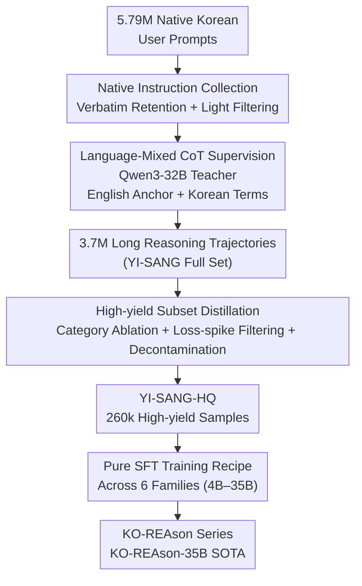

# Pushing on Multilingual Reasoning Models with Language-Mixed Chain-of-Thought

**Conference**: ICLR 2026  
**OpenReview**: [https://openreview.net/forum?id=ABc5y3741T](https://openreview.net/forum?id=ABc5y3741T)  
**Code**: https://huggingface.co/KOREAson (Data and Model Collection)  
**Area**: LLM Reasoning / Multilingual Reasoning  
**Keywords**: Language-Mixed CoT, Mid-resource Languages, Korean Reasoning, Data Distillation, SFT

## TL;DR
To address the lack of long-reasoning models for mid-resource languages (Korean), this paper proposes **Language-Mixed CoT**—using English as a "logic anchor" for reasoning while retaining key Korean terminology. Combined with 5.79M self-collected native Korean prompts and high-yield subset distillation, the authors trained KO-REAson-35B using only SFT, achieving a top average score of 64.0 across nine Korean benchmarks, with an average improvement of +18.6 points for smaller models.

## Background & Motivation
**Background**: Frontier models improve reasoning by exploring solution spaces via long chain-of-thought (long-CoT). The mainstream route for open-source replication is **distillation from teacher models**: systematic prompt collection → teacher generation of long reasoning trajectories → quality filtering → SFT. However, such pipelines almost exclusively serve English (and some Chinese), leaving mid-resource languages as a blank space.

**Limitations of Prior Work**: Directly applying recipes from high-resource languages to Korean is ineffective—Korean base models are weaker, high-quality data is scarce, and RL cold-starts rely heavily on the "strong base + reliable reward model + large-scale data" trinity. When using **translated corpora**, training a Qwen2.5-1.5B on a translated version of OpenThoughts improved MATH scores from 25.5 to 74.4, but scores on the Korean cultural benchmark HAE-RAE Bench plummeted from 35.2 to 15.3. Translationese pollutes the corpus, making the model fragile to colloquial and cultural contexts.

**Key Challenge**: Which language should be used for the reasoning process? Both monolingual options have critical flaws—using only English introduces **translation noise** (prompt mistranslation, error accumulation, "forgetting" the original Korean); using only Korean leads to a **significant drop in reasoning capability**, and prolonged Korean training on English-pre-trained bases triggers distribution shift, damaging original strengths.

**Goal**: Find a reproducible and affordable recipe for mid-resource languages that ensures robustness across both "reasoning and cultural knowledge" dimensions.

**Key Insight**: The "logic skeleton" of reasoning can be decoupled from "semantic faithfulness." English, a dominant language, handles logical deduction, while key terms and citations remain in the target language. This is combined with native (non-translated) prompts to ensure a realistic corpus distribution.

**Core Idea**: Replace monolingual CoT with **English-anchored Language-Mixed CoT** (English logic anchor with Korean terminology). Use massive native Korean data and high-yield subset distillation to push mid-resource models to SOTA via pure SFT.

## Method

### Overall Architecture
This work presents a data-centric pipeline: "Data Collection → Supervisory Signal Construction → High-yield Subset Distillation → Cross-family SFT." It does not modify model architectures; all gains derive from **supervisory signal formatting** and **data quality**. Specifically: 5.79M native user prompts (YI-SANG instruction set) were crawled from Korean communities. Qwen3-32B acted as the teacher to generate 3.7M long-reasoning trajectories (YI-SANG full set) using the **Language-Mixed CoT** format. A 260k high-yield subset (YI-SANG-HQ) was distilled via category-wise ablation, loss-spike filtering, and decontamination. Finally, the KO-REAson series was developed via SFT on this subset using models ranging from 4B to 35B across six model families.

### Key Designs

**1. Language-Mixed CoT: English Logic Anchor and Korean Terminology Code-switching**

This is the core supervisory signal addressing the choice of reasoning language. During the thinking phase, the model performs **code-switching**: logical scaffolding is written in English, while named entities, cited fragments, and key terms remain in Korean. The teacher model (Qwen3-32B) is prompted to follow this format; samples with Korean character ratios outside $[5\%, 20\%]$ are filtered out. This leverages English reasoning strengths without losing the semantic fidelity of the Korean prompt. Ablation (Table 2) shows that on Gemma-3-4B, English-anchored Language-Mixed CoT outperforms both mono-English and mono-Korean across HRB (54.9), MCLM (55.8), and KMMLU-R (53.0). Experiments with Chinese and Russian anchors showed that only the English anchor provided gains in mathematics (MCLM).

**2. Native Korean Instruction Collection: Verbatim Retention of Real Data Distribution**

To solve the "translationese" and robustness issues, native prompts were collected instead of using translations. 28 user Q&A communities were selected after filtering for licensing (re-distributable vs. non-commercial). Contrary to standard practice, prompts were **retained verbatim** including typos, abbreviations, and internet slang to preserve user features and improve deployment robustness. Only light filtering was applied (discarding samples with <30% Korean characters or extreme lengths). YI-SANG is the largest disclosed Korean post-training corpus (5.79M prompts). For competitive math challenges, a translation of OpenThought was supplemented using Gemini-2.5-Flash.

**3. High-yield Subset Distillation: Category Ablation, Loss-Spike Filtering, and Decontamination**

To manage computational costs, a "high-yield" subset was extracted. **Category-wise ablation** revealed that OpenThought benefits MATH/MCLM, Exams benefit HAE-RAE Bench/KMMLU-R, while Medical was hyperspecialized—improving ClinicalQA but dragging down all other benchmarks—and thus was removed along with Daily topics. **Loss-spike** analysis on a proxy small model (Kanana-1.5) helped identify and filter out failure modes such as infinite repetition, multiple `<think>` blocks, or final solutions in non-Korean languages. Trajectories exceeding 16k tokens were removed. **13-gram decontamination** using MeCab-KO removed approximately 0.7% of trajectories. YI-SANG-HQ ultimately contains 260k samples.

**4. Pure SFT Training Recipe: SFT Without RL or Web Oracles**

Given the lack of strong base models and RL instability in mid-resource scenarios, **pure SFT** was used. The pipeline avoids "agreement-sampling" and "hint-based refinement" due to computational costs and leakage risks. The teacher (Qwen3-32B) regenerated all targets from zero given only the prompt, without using web-crawled answers. Comparison of teacher models confirmed that explicit reasoning is the key to unlocking capability. All models were trained for 5 epochs (3 epochs for the 35B model due to constraints).

### Loss & Training
Standard SFT was used throughout. Evaluation utilized vLLM with temperature=0.7, top_p=0.9, and max_tokens=32768. Final answers were required to be within `\boxed{...}` and validated using math-verify. Main experiments report the mean of three trials.

## Key Experimental Results

### Main Results
Comparison in the 20B+ range (9 benchmarks, KO-REAson-35B based on A.X-3.1 + YI-SANG-HQ):

| Benchmark | GPT-OSS-20B | DS-R1-32B | EXAONE-Deep-32B | QwQ-32B | KO-REAson-35B |
|-----------|------|------|------|------|------|
| KMMLU-Redux | 67.6 | 70.0 | 68.2 | 74.7 | **76.0** |
| KMMLU-Hard | 39.0 | 43.3 | 43.5 | 49.0 | **51.4** |
| Math (Ko) | 82.8 | 85.4 | 84.8 | 82.3 | **87.5** |
| HRB | 65.1 | 70.8 | 76.1 | 75.5 | **78.9** |
| **Average (9 tasks)** | 58.8 | 56.4 | 57.4 | 59.6 | **64.0** |

KO-REAson-35B ranked first in 5/9 tasks and second elsewhere, achieving the highest average score. Results in competition math (AIME2024-Ko, KSM) were slightly behind GPT-OSS-20B, attributed to the limited number of high-quality competitive samples in the mixture.

### Ablation Study

| Configuration (Gemma-3-4B) | HRB | MCLM | KMMLU-R | Notes |
|------|------|------|------|------|
| English-only CoT | 50.3 | 48.1 | 52.2 | Monolingual English |
| Korean-only CoT | 40.6 | 25.6 | 42.5 | Monolingual Korean; math collapse |
| Lang-Mixed (zh/ko) | 48.2 | 26.3 | 45.3 | Chinese anchor; no math gain |
| **Lang-Mixed (en/ko)** | **54.9** | **55.8** | **53.0** | English anchor; best performance |

Category contributions (Gemma-3-4B): OpenThought yielded the largest gain for math (55.8); Exams were most effective for KMMLU-R (64.2); Medical improved ClinicalQA (65.6) but significantly degraded other tasks.

### Key Findings
- **English Anchor as the Sole Source of Math Gains**: Only en/ko mixture improved MCLM; zh/ko and ru/ko failed in math. The effectiveness of anchor languages correlates strongly with the base model's pre-training distribution.
- **Universal Across Families and Scales**: All 9 models (4B–35B across 6 families) improved after training on YI-SANG-HQ. Gains were especially notable in math-related tasks, with small/medium models seeing an average boost of +18.6 points.
- **"Free Lunch" in Cross-lingual and Multi-modal Tasks**: KO-REAson-12B, though trained only on Korean text, showed gains in English reasoning (AIME25 15.6→32.0) and Korean vision-language tasks (HAERAE-Vision 15.47→26.42).

## Highlights & Insights
- **Decoupling "Logic Language" and "Semantic Language"**: Language-Mixed CoT circumvents the "translation noise vs. reasoning degradation" dilemma. This code-switching approach is transferable to any combination of "strong English base + mid-resource target language."
- **Robustness Through Original Distributions**: Retaining verbatim user prompts (including errors) indicates that robustness comes from the real distribution rather than sanitized templates.
- **Loss-Spike as a Diagnostic Tool**: Using training loss spikes to locate bad samples and iterate on rules is a simple but effective data quality cycle for large-scale SFT.

## Limitations & Future Work
- **Gap in Competition Math**: Limited competitive samples led to lower performance on AIME2024/KSM relative to specialized models. Future work will involve incorporating more translated competition sets.
- **Verification Limited to Korean**: The method was case-studied on Korean; its effectiveness for languages with greater orthographic or linguistic distance from English remains to be verified.
- **Reliance on Strong Teachers**: The trajectory quality depends on Qwen3-32B. Performance may degrade if no strong multilingual teacher is available for the target language.
- **Scope Limited to SFT**: This work positions the model as a strong foundation for future RL, but the absolute ceiling of reasoning via online RL has not yet been explored.

## Related Work & Insights
- **Vs. Translated Corpora (lightblue, Lee et al. 2025a)**: Unlike those using machine-translated data, this work uses native collection and language-mixed supervision, avoiding cultural performance degradation.
- **Vs. Monolingual CoT (all-English or all-Korean)**: The code-switching approach captures both reasoning power and semantic faithfulness, outperforming single-language strategies.
- **Vs. RL Routes (GRPO, R1)**: While RL requires strong bases and verifiable rewards, this work demonstrates that pure SFT with high-quality data can approach closed-source SOTA in mid-resource scenarios.

## Rating
- Novelty: ⭐⭐⭐⭐ Language-Mixed CoT is a concise and effective solution to the reasoning language problem.
- Experimental Thoroughness: ⭐⭐⭐⭐⭐ 100+ ablations across 9 models, 6 families, and 9 benchmarks, including cross-modal validation.
- Writing Quality: ⭐⭐⭐⭐ Clear motivation, logical flow, and comprehensive data-centric narrative.
- Value: ⭐⭐⭐⭐⭐ Provides the largest open Korean post-training corpus and a reproducible recipe for mid-resource language communities.

<!-- RELATED:START -->

## Related Papers

- [\[ICLR 2026\] mR3: Multilingual Rubric-Agnostic Reward Reasoning Models](mr3_multilingual_rubric-agnostic_reward_reasoning_models.md)
- [\[ICLR 2026\] Variational Reasoning for Language Models](variational_reasoning_for_language_models.md)
- [\[ICLR 2026\] Pruning Long Chain-of-Thought of Large Reasoning Models via Small-Scale Preference Optimization](pruning_long_chain-of-thought_of_large_reasoning_models_via_small-scale_preferen.md)
- [\[ICLR 2026\] On the Thinking-Language Modeling Gap in Large Language Models](on_the_thinking-language_modeling_gap_in_large_language_models.md)
- [\[ICLR 2026\] Long Chain-of-Thought Reasoning Across Languages](long_chain-of-thought_reasoning_across_languages.md)

<!-- RELATED:END -->
