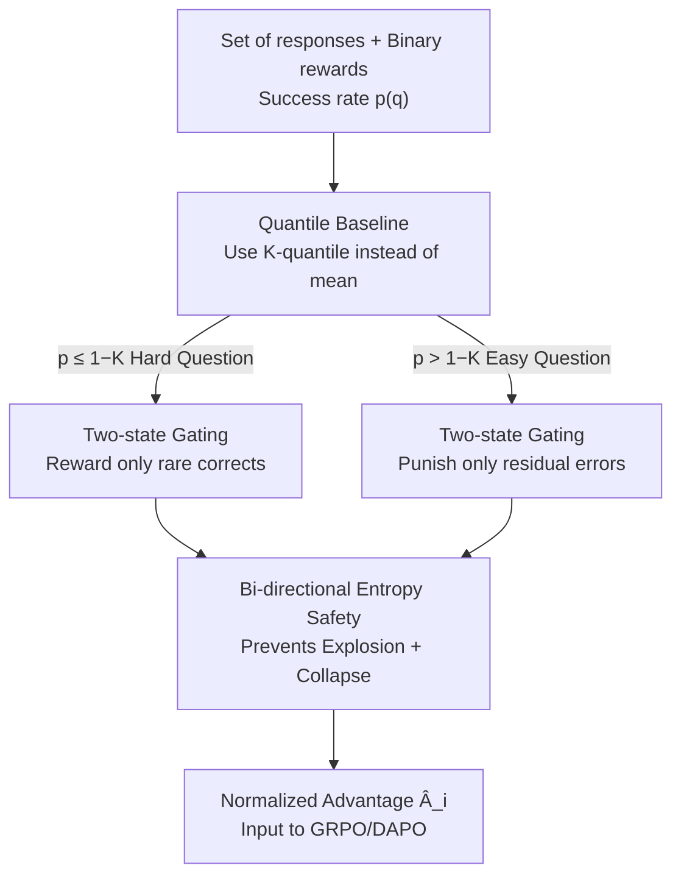

# Quantile Advantage Estimation: Stabilizing RLVR for LLM Reasoning

**Conference**: ICLR 2026  
**OpenReview**: [https://openreview.net/forum?id=WDP5b3mtFV](https://openreview.net/forum?id=WDP5b3mtFV)  
**Code**: https://github.com/junkangwu/QAE  
**Area**: LLM Reasoning / Reinforcement Learning  
**Keywords**: RLVR, Advantage Estimation, Quantile Baseline, Policy Entropy, GRPO/DAPO

## TL;DR
This paper replaces the "intra-group mean" baseline used in value-free RL (GRPO/DAPO) with a "group-wise K-quantile" baseline (QAE). By using a hyperparameter $K$ to reward rare correct answers on hard problems and punish residual errors on easy ones, it is proven that this approach simultaneously prevents entropy collapse and entropy explosion, consistently improving pass@1 on AIME/AMC mathematical reasoning tasks.

## Background & Motivation
**Background**: RLVR (Reinforcement Learning with Verifiable Rewards) is a mainstream approach for enhancing the reasoning capabilities of LLMs. To eliminate the value network, value-free methods like GRPO and DAPO sample a group of $G$ responses for each query, using the **mean** group reward as a baseline (divided by the standard deviation) to compute the advantage $\hat A_i$, relying on intra-group relative comparisons to update the policy.

**Limitations of Prior Work**: The policy entropy in these training methods is extremely unstable, often swinging between two extremes. One is **entropy collapse**, where the policy converges prematurely, loses exploration, and gets trapped in narrow reasoning patterns. The other is **entropy explosion**, where the policy becomes excessively random, gradients are overwhelmed by noise, credit assignment fails, and learning plateaus. Previous work has focused almost exclusively on "preventing collapse" (e.g., boosting low-probability tokens or punishing tokens that cause collapse) while ignoring the symmetric half. Worse, the authors observed on Qwen3-8B + DAPO that preventing collapse with Clip-Higher triggers an early entropy spike between steps 10–80, after which entropy remains high and performance plateaus—**preventing one side effectively releases the other**.

**Key Challenge**: The authors trace both entropy disasters to the same root cause: **the mean baseline is not robust to reward outliers**. When a group contains only a few high-reward samples, the mean is pushed upward, causing reasonably good responses to be treated as "negative advantages" and thus punished, suppressing valuable exploration. Conversely, negative advantage samples dominate entropy growth in the early stages (Figure 4 shows entropy growth is almost entirely contributed by negative samples). The problem lies in the **baseline design**, not token-level clipping thresholds—the authors verified that adjusting DAPO's $\epsilon_{high}$ from 0.20 to 0.28 only marginally helps, as the plateau remains.

**Goal**: Reformulate entropy regulation from a "token-level parameter tuning problem" into a "baseline design problem," seeking a minimal modification—ideally one line—that can **simultaneously** clamp entropy from both directions.

**Core Idea**: Replace the mean baseline with a group-wise **K-quantile baseline**. $K$ directly controls how many samples are judged as having positive advantage: smaller $K$ results in more samples being considered successful (encouraging exploitation/lowering entropy), while larger $K$ results in fewer successful samples (encouraging exploration/raising entropy). This stabilizes training within a productive entropy range that is neither collapsed nor exploded.

## Method

### Overall Architecture
The input to QAE (Quantile Advantage Estimation) is a group of responses and their binary rewards $\{(o_i,R_i)\}_{i=1}^G$ ($R_i\in\{0,1\}$, 1 for correct) sampled for a query $q$. The output is the normalized advantage $\hat A_i$ for each response, which is fed directly into the GRPO/DAPO objective function. All other training and decoding hyperparameters remain unchanged except for the baseline calculation.

The logic chain follows: First, calculate the empirical success rate $p(q)=\frac1G\sum_i R_i$. Instead of the mean, take the K-quantile $b_K(q)$ as the baseline. For binary rewards, this quantile simplifies into a **hard threshold** $1-K$ regarding $p(q)$, automatically routing each query into one of two states: "hard" or "easy." In each state, non-zero advantage is assigned to only one class of samples (rare correct responses or residual errors). This mechanism is theoretically proven to bound single-step entropy changes from both sides.

### Key Designs

**1. K-quantile Baseline: Replacing Fragile Mean with Robust Distribution Quantiles**

The target pain point is the mean baseline being skewed by reward outliers, killing normal exploration. For each response group, the authors define the empirical CDF $\hat F_q(x)=\frac1G\sum_j \mathbb 1\{R_j\le x\}$ and use the right-continuous K-quantile $b_K(q)=\inf\{x:\hat F_q(x)\ge K\}$ as the baseline. The normalized advantage is:

$$\hat A_i=\frac{R_i-b_K(q)}{\mathrm{std}(\{R_j\})+\varepsilon}.$$

The quantile is a robust statistic that is not pulled by a few high-reward samples. Meanwhile, $K\in(0,1)$ provides an **explicitly adjustable knob**: it determines the baseline's position in the distribution, thereby deciding how many samples are judged as having positive advantage. This is the fundamental difference from the mean baseline, which is passively determined by data, whereas the quantile is actively controlled by $K$ to balance exploration and exploitation.

**2. Two-state Response-level Gating: Reward Rare Corrects for Hard Problems, Punish Residual Errors for Easy Ones**

This is the direct consequence of K-quantiles under binary rewards and where QAE truly changes the update direction. When rewards are 0/1, the quantile baseline reduces to a threshold on the success rate $p(q)$ (Eq. 4):

$$b_K(q)=\begin{cases}0,& p(q)\le 1-K\\ 1,& p(q)> 1-K\end{cases}$$

Thus, each query is split into two states by the difficulty threshold $1-K$. **Hard problems** ($p\le 1-K$, favoring exploitation): Baseline is 0, incorrect answers receive $\hat A=0$ and no update, while rare correct answers receive $\hat A>0$ and are reinforced, supporting emerging successful trajectories. **Easy problems** ($p>1-K$, favoring exploration): Baseline is 1, correct answers receive $\hat A=0$, while residual incorrect answers receive $\hat A<0$ and are suppressed, cleaning up failure modes on solved problems. Thus, $K$ acts as a switch between "rewarding rare success" and "punishing residual failure." A byproduct is naturally sparse updates: at the default $K=0.4$, approximately **80% of response advantages are 0** (the 80/20 rule at response level), concentrating compute on the most informative samples and exposing the massive redundancy in mean-baseline methods.

**3. Discriminative Objective Rewrite: Replacing Symmetric Weights with One-sided Monotonic Weights**

Using the discriminative perspective from DisCO, the GRPO objective can be written as "query-level weight $\times$ discriminative term," where the weight is a symmetric bell curve $\sqrt{p(1-p)}$ that suppresses both very easy and very hard queries (Eq. 5). Substituting QAE advantages (Proposition 4.1) yields:

$$J_{\text{Quantile}}=\mathbb E_q\Big[\mathbb 1\{p\le 1-K\}\sqrt{\tfrac{p}{1-p}}\,\mathbb E_{o\sim\pi^+}s^+_\theta-\mathbb 1\{p> 1-K\}\sqrt{\tfrac{1-p}{p}}\,\mathbb E_{o'\sim\pi^-}s^-_\theta\Big].$$

Compared to GRPO, QAE makes two key changes: (i) it **selectively zeros out** one term in the discriminative objective based on difficulty (retaining only the positive term for hard problems and only the negative for easy ones); (ii) it replaces the symmetric bell weight with **asymmetric, monotonic** factors ($\sqrt{p/(1-p)}$ for hard and $\sqrt{(1-p)/p}$ for easy). This shifts the update focus from "medium difficulty problems" to "amplifying signals of rare success or residual failure," mechanically explaining the observed stability.

**4. Two-state Entropy Safety: Provably Preventing Both Explosion and Collapse**

This is the theoretical core that distinguishes QAE from all token-level methods. Under a bandit simplification, the first-order softmax update's single-step entropy change satisfies the entropy-covariance identity $\Delta H(q)\approx-\eta\,\mathrm{Cov}_{y}\big(\log\pi(y), \pi(y)A_b(y,q)\big)$. Treating baseline $b$ as a linear knob, it is proven that $\Delta H(q;b)$ is strictly monotonically increasing regarding $b\in[0,1]$. Thus, the K-quantile hits the two extremes (Proposition 4.2): low success rates yield $b_K=0$, reaching minimal entropy change $\Rightarrow$ **Prevents Explosion**; high success rates yield $b_K=1$, reaching maximal entropy change $\Rightarrow$ **Prevents Collapse**. The key comparison is: token-level controls (Clip-Higher, KL penalty, etc.) only scale the step size and **do not change the response-level baseline** $b(q)$. Therefore, they are inherently one-sided and cannot stop entropy explosion driven by negative advantage samples. The K-quantile baseline manages both sides by nature, aligning perfectly with the two training phases observed in Figure 4.

### Loss & Training
QAE is a "one-line swap" drop-in: in the GRPO/DAPO objective, change the response-level baseline from the mean to the K-quantile. The default is $K=0.4$ (a robust balance between exploration and exploitation). It is orthogonal to token-level controls (CLIP-COV, KL-COV) and sequence-level optimization (GSPO), meaning it can be stacked without changing their respective hyperparameters. In ablations, the authors isolated POS-MASK and NEG-MASK variants to verify the individual roles of "rewarding rare correct" and "suppressing residual error" under different clipping intensities.

## Key Experimental Results

### Main Results
Evaluation was conducted zero-shot on AIME'24, AIME'25, and AMC'23 mathematical reasoning benchmarks, with $k=32$ samples at temperature 0.7 per problem, reporting pass@1 and pass@16. QAE consistently improved pass@1 as a drop-in across various models and recipes, while pass@16 remained largely stable.

| Model | Method | AIME25 P@1 | AIME24 P@1 | AMC23 P@1 |
|------|------|------|------|------|
| Qwen3-8B-Base | Clip-Higher | 32.71 | 39.69 | 92.11 |
| Qwen3-8B-Base | + QAE | 34.90 (+6.7%) | 48.23 (+21.5%) | 92.97 (+0.9%) |
| Qwen3-8B-Base | CLIP-Cov | 33.02 | 42.40 | 87.42 |
| Qwen3-8B-Base | + QAE | 37.40 (+13.3%) | 46.04 (+8.6%) | 90.23 (+3.2%) |
| Qwen3-8B-Base | KL-Cov | 33.33 | 44.90 | 86.02 |
| Qwen3-8B-Base | + QAE | 33.44 (+0.3%) | 44.69 (−0.5%) | 87.97 (+2.3%) |
| Qwen3-30B-A3B | GSPO | 31.15 | 43.75 | 90.00 |
| Qwen3-30B-A3B | + QAE | 32.50 (+4.3%) | 47.50 (+8.6%) | 89.38 (−0.7%) |

The largest single improvement was Qwen3-8B + Clip-Higher on AIME24, where pass@1 rose from 39.69 to 48.23 (+21.5%). pass@16 mostly stayed the same or increased slightly, indicating improvements in sampling efficiency rather than just quantity.

### Ablation Study
The authors verified that "baseline design, not token tuning" is key and decomposed the effects of the two one-sided masking mechanisms.

| Experiment | Setting | Conclusion |
|------|------|------|
| $\epsilon_{high}$ scanning (DAPO) | 0.20→0.28 | Peak at 0.26 (+2.4%), total gain limited, plateau remains → token tuning is insufficient |
| One-sided mask (weak clipping $\epsilon_{high}=0.28$) | POS / NEG / QAE | NEG-MASK (controlling negative advantage) is critical, matching full QAE |
| One-sided mask (strong clipping $\epsilon_{high}=0.20$) | POS / NEG / QAE | POS-MASK (controlling positive advantage) dominates |
| Response-level Sparsity | Global Stats | ≈80% of responses have zero advantage; updates concentrate on highly informative samples (80/20 rule) |
| Entropy Dynamics Decomposition | By Adv Sign | Entropy explosion is dominated by negative advantage samples; QAE suppresses this component and keeps entropy in a productive range |

## Highlights & Insights
- **Redefining Entropy Regulation as a Baseline Design Problem**: While previous token-level tricks (boosting low-prob tokens, punishing collapsed tokens) were symptomatic treatments, this paper identifies the root cause in the response-level baseline. A one-line replacement solves it elegantly.
- **The Only Method with "Bi-directional Entropy Safety" Proof**: It clearly highlights that token-level controls only scale step size without changing the baseline, making them inherently one-sided. The quantile baseline manages both sides, consistent with the two-stage phenomena in Figure 4.
- **80/20 Sparsity as a Free Byproduct**: Approximately 80% of responses yield zero advantage, saving compute while explaining stability and revealing massive redundancy in mean-baseline methods.
- **High Composability**: QAE stacks with Clip-Cov/KL-Cov and GSPO without needing to tune their hyperparameters, making deployment extremely low-cost.

## Limitations & Future Work
- **Threshold Simplification only for Binary Rewards**: The elegant two-state gating depends on $R\in\{0,1\}$. Whether quantile baselines and "bi-directional entropy safety" hold for continuous or dense rewards requires further argument.
- **$K$ Remains a Global Fixed Hyperparameter**: The default $K=0.4$ is an empirical compromise. Since the optimal $K$ may vary by model or difficulty distribution, the current sensitivity analysis lacks an adaptive mechanism for $K$.
- **Theory Grounded in Bandit Simplification + First-order Updates**: Treating full responses as single actions ignores token-level dynamics, creating a gap from real autoregressive RL, making conclusions approximate.
- **Evaluation Limited to Math (AIME/AMC)**: Transferability to code, agentic tasks, or other general reasoning tasks with verifiable rewards has not been validated.

## Related Work & Insights
- **Value-free RLVR Lineage**: GRPO (eliminating value networks, group relative advantage) and DAPO (eliminating KL + asymmetric clipping + token-level normalization + dynamic sampling) are the direct baselines and targets for QAE adaptation.
- **Anti-Entropy Collapse Route**: Methods like Clip-Higher and Clip-Cov/KL-Cov focus on token-level control. This paper classifies them as "one-sided, step-size scaling" methods and proves they are complementary to QAE.
- **Discriminative Perspective**: DisCO decomposes the GRPO objective into "query weight $\times$ discriminative term." QAE leverages this to derive its own discriminative objective and monotonic weights.
- **Insight**: In RL and alignment, seemingly minor implementation details like the "advantage baseline" can be the master switch for training stability. Replacing a scalar statistic from mean to quantile allows switching from fragile symmetric weights to controllable one-sided weights—prompting a re-examination of the default mean baselines used in RLHF/RLVR pipelines.

<!-- RELATED:START -->

## Related Papers

- [\[ICLR 2026\] Conditional Advantage Estimation for Reinforcement Learning in Large Reasoning Models](conditional_advantage_estimation_for_reinforcement_learning_in_large_reasoning_m.md)
- [\[ICLR 2026\] Beyond Magnitude: Leveraging Direction of RLVR Updates for LLM Reasoning](beyond_magnitude_leveraging_direction_of_rlvr_updates_for_llm_reasoning.md)
- [\[ICLR 2026\] HiPO: Self-Hint Policy Optimization for RLVR](hipo_self-hint_policy_optimization_for_rlvr.md)
- [\[ICLR 2026\] Stabilizing Policy Gradients for Sample-Efficient Reinforcement Learning in LLM Reasoning](stabilizing_policy_gradients_for_sample-efficient_reinforcement_learning_in_llm_.md)
- [\[ACL 2026\] SHAPE: Stage-aware Hierarchical Advantage via Potential Estimation for LLM Reasoning](../../ACL2026/llm_reasoning/shape_stage-aware_hierarchical_advantage_via_potential_estimation_for_llm_reason.md)

<!-- RELATED:END -->
