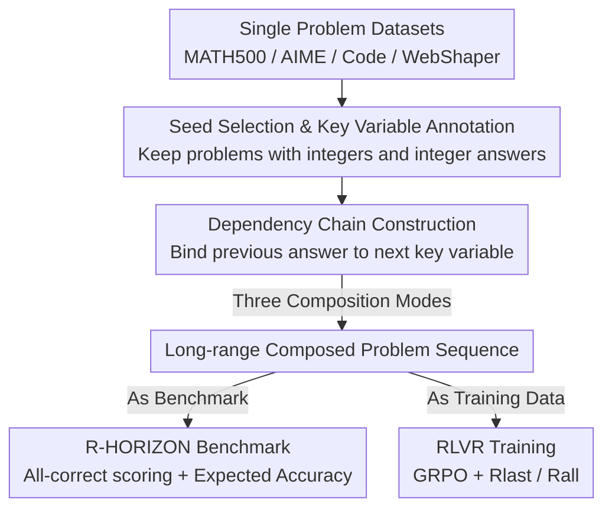

# R-HORIZON: How Far Can Your Large Reasoning Model Really Go in Breadth and Depth?

**Conference**: ICLR 2026  
**OpenReview**: [https://openreview.net/forum?id=rRB1bYErbL](https://openreview.net/forum?id=rRB1bYErbL)  
**Code**: https://github.com/meituan-longcat/R-HORIZON  
**Area**: LLM Reasoning  
**Keywords**: Long-range reasoning, query composition, reasoning benchmark, RLVR, effective reasoning length

## TL;DR
This paper introduces R-HORIZON: by chaining independent problems through "answer dependency" into a strictly sequential long-range chain, the authors create a benchmark that stresses current state-of-the-art reasoning models. Furthermore, feeding these composed data into RLVR training significantly improves multi-problem solving capabilities and even boosts single-problem performance (AIME2024 +7.5).

## Background & Motivation
**Background**: Large Reasoning Models (LRMs) such as OpenAI o1 and DeepSeek-R1 rely on test-time scaling to extend Chain-of-Thought (CoT), achieving record results in math, code, and agent tasks. However, mainstream training and evaluation sets (GSM8K, MATH, LiveCodeBench, etc.) consist almost entirely of **isolated single problems**, where each problem has one answer and no correlation exists between tasks.

**Limitations of Prior Work**: In real-world scenarios, an agent often needs to perform continuous reasoning, planning, and action over hundreds or thousands of steps, where subsequent steps depend on previous conclusions. Single-problem evaluation fails to measure how models perform when solving multiple interdependent problems, thereby concealing the true boundaries of long-range reasoning. Meanwhile, conventional RL optimization is tailored to single problems, and models are never trained to manage reasoning across multiple tasks.

**Key Challenge**: While test-time scaling to lengthen reasoning chains is generally viewed as beneficial, whether "longer chains" are an asset or a burden in **multi-problem chaining** scenarios has never been systematically examined. The authors hypothesize that a model's effective reasoning length is finite; once multiple problems are chained to exceed this threshold, performance may drop precipitously—contradicting the intuition that "thinking more is always better" seen in single-problem contexts.

**Goal**: (1) Create a controllable, low-cost, and scalable method to transform single problems into long-range multi-problem tasks; (2) build a benchmark that exposes the long-range weaknesses of LRMs; (3) generate training data to investigate whether long-range data can genuinely improve models.

**Key Insight**: Rather than laboriously collecting natural long-range tasks, it is better to **synthesize dependencies** by "welding" existing single-problem data such that a key number in the second problem must be derived from the answer of the first. This approach is inexpensive and allows for precise control over the reasoning span (number of chained problems).

**Core Idea**: Utilize "query composition" to transform $N$ independent problems into a dependency chain that must be solved sequentially, using the same methodology for both the evaluation benchmark and training data.

## Method

### Overall Architecture
The core of R-HORIZON is a **data composition pipeline**: starting with a seed set of standard single problems, the pipeline filters for problems suitable for modification and annotates "key variables." A dependency function then binds the answer of a previous problem to the prompt of the subsequent problem, forming a long chain. This chain serves two purposes: as a benchmark to evaluate 26 LRMs, or as training data for Reinforcement Learning from Verifiable Rewards (RLVR). This method requires no changes to model architecture, only to the "problem format."

### Key Designs

**1. Seed Selection and Dependency Chain Construction: Welding answers into subsequent problems to enforce sequential solving**

To ensure multiple problems are "indissolubly linked," the key is creating **real logical dependencies** rather than simple concatenation (which merely increases context length). The pipeline involves two steps. First, seed selection: given a dataset $D=\{(q_i,a_i)\}$, keep only problems containing integers with integer answers, $D_{seed}=\{(q,a)\mid |I(q)|>0 \wedge a\in\mathbb{Z}\}$, where $I(\cdot)$ extracts all integers from the prompt. A model $M$ then determines which integers are "key variables"—$K(q)=\{m\in I(q)\mid M(q,m)=1\}$, where $M(q,m)=1$ means the problem becomes unsolvable if $m$ is removed. Thus, each seed problem becomes a triplet $(q,a,K(q))$.

Second, dependency chain construction (Algorithm 1): starting from $q_1$, for problem $i+1$, a key variable $m_{i+1}$ is selected and replaced with a placeholder $v_{i+1}$. A dependency function $f_i(x)=x+(m_{i+1}-a_i)$ is defined, and the constraint $v_{i+1}=f_i(a_i)$ is explicitly included in the prompt. Consequently, the model must solve for $a_i$, substitute it into $f_i$ to recover the missing number in $q_{i+1}'$, and then proceed. The chain $Q=(q_1,q_2',\dots,q_n')$ forces serial solving; one error causes the entire chain to fail. This "answer as next input" welding is the fundamental difference from methods like NEST (direct concatenation of independent problems).

**2. Three Composition Modes: Covering dependency structures from linear to graph-based**

Long-range patterns vary across tasks. R-HORIZON supports three modes (Figure 2). **Directly Compose** places multiple problems in parallel, remaining relatively loose; **Sequential Compose** is the default for math tasks, where dependencies form a single chain; **Graphic Compose** weaves dependencies into complex computational graphs. Mathematical tasks utilize Sequential Compose, while specific constructions for code and agent tasks are detailed in the appendix. This mechanism makes the "reasoning span" a tunable knob—chains can be as long as desired ($n = 1, 2, 4, 8, 16, 20$, etc.), quantifying the model's long-range boundaries.

**3. All-correct Scoring and Expected Accuracy: Measuring the "should-have-passed" gap**

During evaluation, the entire answer sequence $\hat A=(\hat a_1,\dots,\hat a_n)$ is extracted. A strict **all-correct scoring** is applied: $Acc(Q)=1$ if and only if all sub-problems $\hat a_i=a_i$, otherwise 0. Beyond measured accuracy, the authors define **expected accuracy** as a baseline: assuming sub-problems are independent, it is the product of individual pass rates $p_i$, $Acc_{expected}(Q)=\prod_{i=1}^n p_i$. This represents what the score "theoretically should be" if sub-problems were solved in isolation. The gap between measured and expected accuracy represents the extra loss introduced by long-range composition—a gap that widens as $n$ increases, proving that the issue lies in "interference during continuous reasoning" rather than single-problem capability.

**4. Loss & Training: Training with composed data and unexpected single-problem gains**

Since evaluation exposes long-range weaknesses, the authors utilize the same composed data for **training**. Following the Skywork-OR1 RLVR pipeline, GRPO is used as the optimization algorithm. It estimates token-level policy gradients (Eq. 5) using intra-group relative advantage $\hat A_{i,t}$ with KL divergence constraints toward a reference policy. Two verifiable rewards are designed: **Final-answer-only $R_{last}$** (1 if only the last answer is correct) and **All-correct reward $R_{all}$** (1 only if all sub-problems are correct). After training R1-Qwen-7B with $n=2$ composed data, composed performance improved significantly (AIME24 n=2 +17.4), and **single-problem performance also increased (AIME24 +7.5)**. Mechanistically, composed data mitigates "overthinking"—the model learns to allocate a more reasonable token budget for subsequent problems and reflects over longer ranges. Additionally, it contributes approximately 20% more "effective samples" (neither all wrong nor all right) per rollout batch, providing more balanced reward signals and higher training efficiency.

## Key Experimental Results

### Main Results
Evaluating 25–26 LRMs across 6 datasets (MATH500, AIME24/25, AMC23, LiveCodeBench, WebShaper) shows that as the number of composed problems $n$ increases, **all models degrade significantly without exception**:

| Model / Dataset | n=1 | Post-degradation | Note |
|:---|:---:|:---:|:---|
| DeepSeek-R1 / AIME25 | 87.3% | 24.6% (n=5) | Even the strongest model collapses |
| R1-Qwen-7B / MATH500 | 93.6% | 0% (n=16) | Small models drop to zero |
| R1-Qwen-32B / MATH500 | 96.8% | ~41% (n=16) | Withstands 34.1% more than 7B |
| Qwen3-235B-Thinking / AIME24 | 93.7% | 69.2% (n=5) | Harder problems cause steeper drops |

Key trends: Larger models degrade less gracefully (longer effective reasoning length: 7B errors around 4–6k tokens, 32B around 8–10k tokens); code tasks degrade more severely than math; many models lose tool-calling ability entirely in web search tasks.

### Ablation Study
Comparison of RLVR training (R1-Qwen-7B) with different composition counts and rewards (Table 1, excerpt Origin / n=2 Average):

| Configuration | Origin Avg | Multi(n=2) Avg | Note |
|:---|:---:|:---:|:---|
| R1-Qwen-7B (Baseline) | 66.4 | 20.1 | Untrained |
| Naive Single-problem (n=1) | 74.3 | 21.3 | Almost no gain for composed tasks |
| w/ Composition (n=2) | 76.1 | 36.5 | Gain in both single and composed |
| w/ Composition (n=4) | 73.7 | 43.2 | Strongest composition capability |
| w/ Composition (mixed 1-4) | 72.8 | 43.1 | Mixed works well |
| w/ $R_{all}$ (n=2) | 75.9 | 40.2 | Better than $R_{last}$ in multi-problem |

### Key Findings
- **Single-problem training barely affects long-range capability**: Naive(n=1) only increased composed scores from 20.1 to 21.3, while $n=2$ composed data pushed it to 36.5—long-range capability requires long-range training data.
- **Errors are mostly "reasoning failures" and "early stopping"**: As problem count increases, models often terminate generation prematurely after solving only a subset of problems; dependency reasoning errors (wrong calculation of $f_i$ despite correct $a_{i-1}$) increase with $n$ but remain a small percentage.
- **Highly localized reflection**: More than half of the problems show no "long-range reflection" beyond the current sub-problem; models tend to perform "wait/but" internal checks within the current problem and fail to identify errors in earlier sub-problems.
- **Imbalanced thinking budget**: Even DeepSeek-R1 spends excessive tokens on the first few problems, leaving insufficient budget for subsequent ones; training with composed data helps regularize this allocation.

## Highlights & Insights
- **"Answer welding" for dependency** is superior to simple prompt concatenation: $f_i(x)=x+(m_{i+1}-a_i)$ ensures that missing values in later problems must be calculated from previous answers, creating genuine dependency rather than artificial length. This cleanly separates "long-range interference" from "simple context extension."
- **Expected accuracy multiplication** is an ingenious reference frame: it quantifies the score the model "should have achieved," allowing the gap between measured and expected accuracy to isolate the net loss from long-range composition. This avoids confounding "problem difficulty" with "model degradation."
- **The same data serves for evaluation and training**, with the tunable knob $n$ transforming "reasoning span" from qualitative to quantitative. This self-synthesis paradigm is low-cost, scalable, and adaptable to any dataset with integer answers.
- Counter-intuitive "Aha" moment: Training with 2-problem compositions actually benefits single-problem performance (AIME24 +7.5), suggesting that long-range training teaches the model to allocate thinking budgets more efficiently and suppress overthinking.

## Limitations & Future Work
- **Dependency construction is math-centric**: Relying on integer extraction and variable substitution naturally favors numerical problems. Methods for code/agent tasks are only covered in the appendix; creating verifiable dependencies for open-ended, non-numerical tasks remains an area for exploration.
- **Strict all-correct scoring**: $Acc(Q)$ drops to zero with a single sub-problem error. While this amplifies degradation signals, it may equate "mostly correct with minor slips" with "complete failure," potentially obscuring partial progress.
- **Limited RLVR verification scale**: Training experiments were primarily conducted on R1-Qwen-7B with 2–4 problem compositions. The benefits and stability of training on larger models or much longer chains ($n \gg 4$) have not been fully verified.
- Improvement ideas: Expanding dependency functions from linear arithmetic to richer operations/graph structures and exploring rewards that provide partial credit to smooth long-range training.

## Related Work & Insights
- **vs NEST (Direct concatenation)**: NEST places unrelated problems together to test "contextual pressure"; R-HORIZON welds problems via logical dependencies to force sequential solving, exposing failure modes amplified by lengthened reasoning chains.
- **vs GSM-Infinite**: The latter builds dependencies on calculation graphs but focuses on **long inputs**; R-HORIZON focuses on **short inputs and long outputs (long CoT)**, which is closer to real-world reasoning.
- **vs Overthinking research**: Prior work found that long chains on simple problems provide little gain and waste tokens; this paper further proves that long chains **substantially harm** performance on multi-step composite tasks and uses composed data as an RL remedy.

## Rating
- Novelty: ⭐⭐⭐⭐⭐ "Answer welding" brilliantly transforms single problems into controllable long-range tasks, unifying evaluation and training in a simple, powerful paradigm.
- Experimental Thoroughness: ⭐⭐⭐⭐⭐ 6 datasets and 25+ models evaluated, combined with RLVR training and multi-dimensional analysis of errors, reflection, and budgets.
- Writing Quality: ⭐⭐⭐⭐ The link from motivation to method and evidence is clear, though some construction details for code/agent tasks are consigned to the appendix.
- Value: ⭐⭐⭐⭐⭐ Provides a reliable metric for long-range reasoning and proves that long-range data benefits single-problem performance, impacting both evaluation and training paradigms.

<!-- RELATED:START -->

## Related Papers

- [\[ICML 2026\] How Far Ahead Do LLMs Plan? Uncovering the Latent Horizon in Chain-of-Thought Reasoning](../../ICML2026/llm_reasoning/how_far_ahead_do_llms_plan_uncovering_the_latent_horizon_in_chain-of-thought_rea.md)
- [\[ICLR 2026\] Why is Your Language Model a Poor Implicit Reward Model?](why_is_your_language_model_a_poor_implicit_reward_model.md)
- [\[ICLR 2026\] A Simple "Motivation" Can Enhance Reinforcement Finetuning of Large Reasoning Models](a_simple_motivation_can_enhance_reinforcement_finetuning_of_large_reasoning_mode.md)
- [\[ICLR 2026\] Reasoning with Sampling: Your Base Model is Smarter Than You Think](reasoning_with_sampling_your_base_model_is_smarter_than_you_think.md)
- [\[ICLR 2026\] ChainGPT: Dual-Reasoning Model with Recurrent Depth and Multi-Rank State Updates](chaingpt_dual-reasoning_model_with_recurrent_depth_and_multi-rank_state_updates.md)

<!-- RELATED:END -->
