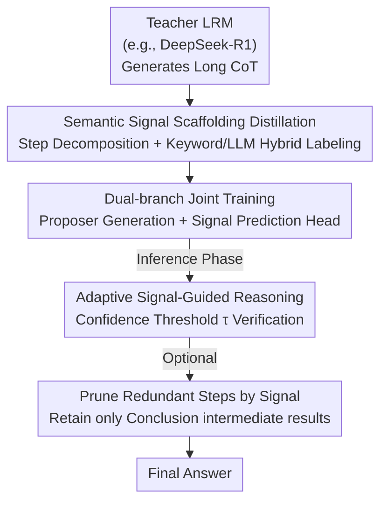

# Reasoning Scaffolding: Distilling the Flow of Thought from LLMs

**Conference**: ICLR 2026  
**OpenReview**: [https://openreview.net/forum?id=FcuJY1dK7s](https://openreview.net/forum?id=FcuJY1dK7s)  
**Code**: https://github.com/xywen97/ReasoningScaffolding  
**Area**: LLM Reasoning / Knowledge Distillation  
**Keywords**: Reasoning Distillation, Semantic Signals, Flow of Thought, Multi-task Learning, Small Model Reasoning

## TL;DR
This paper proposes **Reasoning Scaffolding**, which moves beyond verbatim cloning of teacher rationales. It abstracts the teacher's long chain-of-thought into a sequence of discrete, interpretable "semantic signals" (e.g., contrast, supplement, conclusion) acting as a scaffold. Small models are trained with a dual-task objective: "predict the next signal + generate the next step guided by the signal," transferring the **algorithmic structure** of reasoning rather than surface text. This method significantly outperforms existing distillation approaches in accuracy and logical consistency on benchmarks like GSM8K and StrategyQA.

## Background & Motivation

**Background**: The mainstream approach to distilling reasoning capabilities from Large Models (LLMs) to Small Models (SLMs) is **behavioral cloning**, which involves fine-tuning students using the Chain-of-Thought (CoT) text rationales generated by the teacher to mimic step-by-step reasoning.

**Limitations of Prior Work**: This "textual imitation" essentially treats reasoning as a text generation task, forcing small models into **rote memorization**. While they may learn the teacher's style and fluency, they fail to capture the **algorithmic structure** behind the reasoning. Consequently, student models are brittle—often producing "hallucinations" that are logically inconsistent or self-contradictory when facing new problems, appearing to reason while merely imitating.

**Key Challenge**: The true value in a teacher's reasoning process lies in **how the argument flows** (the logical skeleton: contrast, then elaboration, finally induction), not the specific words chosen. Current distillation signals are token-level, mixing "structure" and "content," which prevents the student from capturing the former.

**Goal**: To extract the teacher's **structural blueprint** and teach it explicitly to the student, enabling the small model to learn "how to think" rather than "what to write."

**Key Insight**: The authors observed that teacher reasoning chains contain keywords—`wait`, `but`, `ok`, `in addition`—that naturally mark reasoning transitions. For instance, `in addition` often introduces supplementary information. These words reveal the logical function of the argument and can be categorized into a finite set of **semantic signals**.

**Core Idea**: Use a sequence of discrete semantic signals as a "scaffold." First, the student **predicts what logical action to execute next** (signal prediction), then it **generates specific text under the constraint of that signal**. Signal prediction acts as a strong regularizer for logical coherence, forcing the student to internalize the computational patterns of coherent reasoning.

## Method

### Overall Architecture

Reasoning Scaffolding redefines reasoning as a **structured generation process** consisting of a three-stage pipeline: First, the teacher's CoT is offline decomposed into "steps + semantic signals" to build the scaffold dataset. Second, the small model is trained with a dual-branch multi-task objective to "generate the next step" and "predict the next signal" simultaneously. Finally, during inference, the signal predictor provides signals step-by-step to guide the proposer, with an optional signal-based pruning of redundant steps to save tokens.

The method revolves around 7 types of semantic signals: **Addition and Elaboration, Examples and Illustration, Personal Opinion and Recall, Contrast and Concession, Reasoning and Analysis, Conclusion and Summary, and Response Generation**. These categories ensure semantic cohesion and coverage of most transitions.

### Key Designs

**1. Semantic Signal Scaffolding: Abstracting Textual CoT into Discrete Logical Skeletons**

To address the failure of text cloning in capturing structure, the authors first prompt a Large Reasoning Model (LRM, e.g., DeepSeek-R1) to obtain long CoTs, then abstract them into scaffolds. First, **Step Decomposition**: Use delimiters like `\n\n` to split the CoT into discrete steps $S_i = [A_1, \dots, A_N]$. Second, **Signal Labeling**: A two-stage hybrid "Keyword + LLM" strategy is used. An initial label is assigned based on keyword triggers, followed by validation from a strong LLM (e.g., GPT-4o). If they align, the label is kept; if not, it is corrected. Steps without keywords are determined directly by the LLM.

Decoupling segmentation (structure) and labeling (semantics) ensures the scaffold faithfully follows the teacher's thought flow without human-induced gaps, while maintaining efficiency. Around 74% of steps start with predefined keywords, with an 87% consistency rate between keyword and LLM labels. The remaining 26% are handled by the LLM oracle. This yields two training sets: $\{Q + [A_1, \dots, A_t],\ \text{Signal}\}$ for the signal predictor and $\{Q + [A_1, \dots, A_t],\ \text{Signal} + A_{t+1}\}$ for the proposer.

**2. Dual-branch Joint Training: Signal Prediction as Regularization**

To make the student learn both "content" and "structure," two branches are attached to the SLM backbone for multi-task training. **Branch 1 (Next Step Generation)** adds a **Semantic Embedding Layer (SEL)** before the original LM head. It encodes the current step's semantic signal into an embedding, added to the backbone's last hidden state, ensuring all tokens in a step share the same signal constraint. The loss is signal-conditioned next-token prediction:

$$\mathcal{L}^{(t)} = -\frac{1}{N_t}\sum_{i=1}^{N_t} \log P_\theta\!\left(A_{t,i} \mid A_{<t}, A_{t,<i}, s_t\right)$$

**Branch 2 (Signal Prediction)** adds a signal prediction head, forcing the backbone to explicitly predict the current step's signal. This increases sensitivity to logical cues and enhances consistency. The loss is:

$$\mathcal{L}^{(t)}_{signal} = -\frac{1}{N_t}\sum_{i=1}^{N_t}\sum_{j=1}^{C} s_{t,i,j} \log P_\theta\!\left(\hat{s}_{t,i,j} \mid A_{<t}\right)$$

where $C$ is the number of signal categories. The total objective is $\beta$-weighted: $\mathcal{L}^{(t)} = (1-\beta)\mathcal{L}^{(t)}_{token} + \beta\mathcal{L}^{(t)}_{signal}$. Signal prediction acts as **strong regularization**, forcing the student to clarify the "logical intent" before generating content, internalizing reasoning patterns rather than just imitating text.

**3. Adaptive Signal-Guided Reasoning: Filtering Unreliable Signals**

During inference, signals must be generated by the predictor. Since incorrect signals can derail the reasoning, an **adaptive confidence strategy** is employed. The predictor calculates the confidence for the next signal:

$$\text{conf} = \exp\!\left(\frac{1}{L_t}\sum_{l=1}^{L_t}\log P_\phi\!\left(s_{t,l} \mid A_{<t}, s_{t,<l}\right)\right)$$

Only signals exceeding a threshold $\tau$ (experimentally set to 0.96) guide the next step. If confidence is below $\tau$, reasoning is **immediately terminated with a `Response Generation` signal** to prompt the final answer, avoiding error propagation.

Additionally, leveraging the interpretability of signals, the authors offer **Token Pruning**: intermediate non-essential steps between `Conclusion and Summary` steps are pruned, retaining only the summary steps as intermediate results. This compresses tokens significantly while preserving critical information.

## Key Experimental Results

### Main Results

Evaluated using Pass@1 on StrategyQA, CommonsenseQA (CSQA), TruthfulQA, GSM8K, and MATH-500. Models include Qwen2.5 (0.5B/7B/14B) and Llama3.1-8B. Ours improves over base models by ~14% and over CoT SFT / Long-Thinking SFT by ~8% on average.

| Configuration (Qwen2.5-14B) | StrategyQA | CSQA | TruthfulQA | GSM8K | MATH-500 |
|------|------|------|------|------|------|
| Original | 0.755 | 0.785 | 0.750 | 0.921 | 0.764 |
| CoT SFT | 0.760 | 0.810 | 0.831 | 0.928 | 0.882 |
| Long Thinking SFT | 0.768 | 0.845 | 0.812 | 0.931 | 0.901 |
| Long Thinking Distill | 0.811 | 0.805 | 0.763 | 0.936 | 0.904 |
| **Ours (Teacher=DS-R1)** | **0.858** | **0.887** | **0.917** | **0.942** | **0.928** |

Gains are particularly significant for smaller models; Qwen2.5-0.5B increased from ~27% to over 86% on TruthfulQA.

### Ablation Study

| Signal Strategy (14B) | StrategyQA | CSQA | TruthfulQA | GSM8K | MATH-500 | Description |
|------|------|------|------|------|------|------|
| Original | 0.755 | 0.785 | 0.750 | 0.921 | 0.764 | Baseline |
| w/ Golden Signals | 0.858 | 0.887 | 0.917 | 0.942 | 0.928 | Upper bound |
| w/ Signal Predictor | 0.843 | 0.869 | 0.885 | 0.933 | 0.918 | Actual setting |
| w/ Random Signals | 0.776 | 0.827 | 0.828 | 0.929 | 0.894 | Random setup |
| Summaries Only | 0.855 | 0.869 | 0.897 | 0.941 | 0.916 | Pruned steps |

The signal predictor achieves over 75% accuracy (83%+ on 14B), rising above 85% with the adaptive strategy.

### Key Findings
- **Signal Quality Dictates Performance**: Golden signals perform best, but predicted signals still far exceed the original model. Even random signals outperform standard SFT, suggesting that "structuring generation into discrete steps" is a beneficial inductive bias.
- **Intermediate Summaries are the Core**: The "Summaries Only" strategy barely loses performance, proving that `Conclusion and Summary` steps carry the most critical reasoning information.
- **Token Costs**: While "All Signals" trajectories are long (comparable to long-thinking distillation), pruning significantly reduces length (e.g., 1659 to 845 on GSM8K), though it remains longer than pure CoT—a trade-off prioritizing fidelity over token efficiency.

## Highlights & Insights
- **Decoupling "Structure" from "Content"**: This is the core "Aha!" moment. Unlike previous distillation that mixes logic and text in token supervision, this work uses 7 semantic signals to explicitly express the logical flow.
- **Signal Prediction as Regularization**: The prediction branch doesn't produce the answer but forces the model to anticipate logical functions, baking the reasoning pattern into the backbone—a clever design for robustness.
- **Interpretability yields Token Efficiency**: Clear semantic signals allow for precise localization and pruning of redundant steps, turning interpretability into a tool for acceleration.
- **Utility of Random Signals**: Structured generation itself is a valuable inductive bias, highly transferable to tasks requiring step-by-step processing.

## Limitations & Future Work
- The generated trajectories are longer than standard CoT; even with pruning, token efficiency is compromised for fidelity.
- The 7 signal categories were manually induced; whether they suffice for all domains (e.g., code, formal proofs) remains unverified.
- Labeling relies on strong LLMs (GPT-4o), incurring high data construction costs. About 26% of data depends entirely on the LLM oracle for labels.
- The fixed threshold $\tau=0.96$ may need per-task tuning, and early termination on low-confidence signals might truncate complex reasoning prematurely.

## Related Work & Insights
- **vs. Standard CoT Behavioral Cloning** (Shridhar et al.): Moving from verbatim imitation to discrete scaffolding transfers the "algorithmic structure" rather than surface text, improving robustness.
- **vs. Structural Coherence Studies** (Li et al. 2025a): Agreement with the insight that structural coherence is more vital than content accuracy; this paper provides concrete data curation and explicit guidance for that structure.
- **vs. Concept Bottleneck LLM (CB-LLM)** (Sun et al. 2025): Extends the concept bottleneck idea from classification to multi-step reasoning, using semantic signals to migrate algorithmic structures while improving interpretability.

## Rating
- Novelty: ⭐⭐⭐⭐⭐ Clear, original perspective on distilling structure via semantic signals.
- Experimental Thoroughness: ⭐⭐⭐⭐ Solid across 4 model scales and 5 benchmarks, though primary focus remains on QA/Math.
- Writing Quality: ⭐⭐⭐⭐ Smooth flow from motivation to method and results.
- Value: ⭐⭐⭐⭐⭐ Provides an interpretable, reproducible path for small models to learn reasoning over mere imitation.

<!-- RELATED:START -->

## Related Papers

- [\[ICLR 2026\] Are Reasoning LLMs Robust to Interventions on Their Chain-of-Thought?](are_reasoning_llms_robust_to_interventions_on_their_chain-of-thought.md)
- [\[ACL 2025\] Unveiling the Key Factors for Distilling Chain-of-Thought Reasoning](../../ACL2025/llm_reasoning/unveiling_the_key_factors_for_distilling_chain-of-thought_reasoning.md)
- [\[ICLR 2026\] DAG-Math: Graph-of-Thought Guided Mathematical Reasoning in LLMs](dag-math_graph-of-thought_guided_mathematical_reasoning_in_llms.md)
- [\[ACL 2026\] Reasoning Fails Where Step Flow Breaks](../../ACL2026/llm_reasoning/reasoning_fails_where_step_flow_breaks.md)
- [\[ACL 2026\] How Chain-of-Thought Works? Tracing Information Flow from Decoding, Projection, and Activation](../../ACL2026/llm_reasoning/how_chain-of-thought_works_tracing_information_flow_from_decoding_projection_and.md)

<!-- RELATED:END -->
