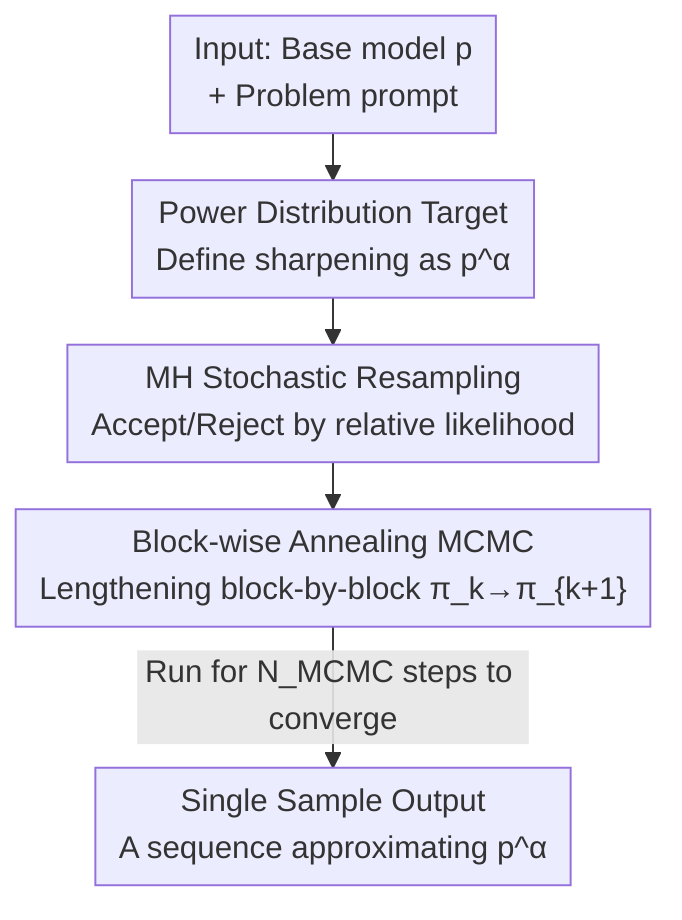

# Reasoning with Sampling: Your Base Model is Smarter Than You Think

**Conference**: ICLR 2026  
**OpenReview**: [https://openreview.net/forum?id=Vsgq2ldr4K](https://openreview.net/forum?id=Vsgq2ldr4K)  
**Code**: To be confirmed  
**Area**: LLM Reasoning  
**Keywords**: Test-time sampling, power distribution, MCMC, Metropolis-Hastings, training-free reasoning

## TL;DR
This paper proposes a **training-free, dataset-free, and verifier-free** test-time sampling algorithm: using MCMC (Metropolis-Hastings) to approximately sample from the "power distribution" $p^\alpha$ of the base model's own likelihood. On single-sample reasoning tasks such as MATH500, HumanEval, GPQA, and AlpacaEval, the performance of the base model is brought to a level comparable to or even better than GRPO (RL post-training), without losing multi-sample (pass@k) diversity.

## Background & Motivation

**Background**: The current mainstream paradigm for improving LLM reasoning capabilities is reinforcement learning post-training with verifiable rewards (RLVR), represented by algorithms like GRPO, which have brought significant single-sample performance improvements in fields such as mathematics, code, and science.

**Limitations of Prior Work**: The academic community has been asking whether RL post-training teaches the model **new abilities** or merely "sharpens" (distribution sharpening) the abilities already present in the base model. Existing evidence (He et al. 2025, Yue et al. 2025) shows that reasoning trajectories of post-trained models are highly concentrated in high-likelihood regions of the base model; on pass@k with large $k$, base models actually **outperform** post-trained models because RL sacrifices generation diversity for single-sample accuracy. In other words, RL acts as if it is "shifting" pass@k capability to pass@1. Furthermore, RL post-training itself is burdensome: it requires extensive hyperparameter sweeping to avoid training instability, carefully constructed datasets, and access to ground-truth verifiers.

**Key Challenge**: If the RL post-training distribution is truly just a "sharpened version" of the base distribution, then the improvement in single-sample reasoning should, in principle, be reproducible **without training**, directly through sampling during the inference phase—however, existing sampling methods (such as low-temperature sampling) do not truly approximate this "sharpening" target.

**Goal**: Design a sampling algorithm that depends only on the base model's own likelihood and requires no training, data, or verifiers, enabling single-sample reasoning to approach RL performance while preserving multi-sample diversity.

**Key Insight**: The authors formalize "sharpening" as sampling from a **power distribution** $p^\alpha$ ($\alpha \ge 1$), which further increases the relative weight of high-likelihood sequences and suppresses low-likelihood sequences. A key observation is that sampling from $p^\alpha$ is **not equivalent** to token-wise low-temperature sampling; the former implies planning for "future paths," which perfectly fits reasoning tasks.

**Core Idea**: Realize the fact that "the base model is already smarter" by using MCMC to approximately sample the power distribution $p^\alpha$—trading additional inference-time computation for higher-quality single samples.

## Method

### Overall Architecture

The method addresses the problem of "how to sample from the base model's power distribution $p^\alpha$ without training." The pipeline is: set the target as the sharpened power distribution $p^\alpha$ using the base LLM $p$ as the sole signal source; since $p^\alpha$ only has unnormalized values and cannot be sampled directly, use Metropolis-Hastings (MH) MCMC, which only requires relative weights, for approximation; and because direct MH over the entire long sequence space $\mathcal{X}^T$ might lead to exponential mixing time explosion, decompose the sampling into a series of "block-wise lengthening" intermediate distributions $\pi_k \propto p(x_{0:kB})^\alpha$ using the autoregressive sequential structure. Samples from the previous block serve as the initialization for the next block's MH, gradually converging to $p^\alpha$. The final output is a single-sample sequence, where all "accept/reject" decisions are made using only the base likelihood.

### Key Designs

**1. Power Distribution as Sampling Target: Defining "Sharpening" as an Explicitly Specified Distribution**

The target addresses the limitation that while RL "sharpens" the base distribution, no **explicit** sharpening target has been provided. This paper defines it as the power distribution $p^\alpha$: since $p(x)>p(x')\Rightarrow p(x)^\alpha/p(x')^\alpha > p(x)/p(x')$, exponentiation with $\alpha\ge 1$ further raises the weights of high-likelihood sequences and lowers those of low-likelihood sequences. The key is that $p^\alpha$ is entirely determined by the base LLM itself, **requiring no additional training or external rewards**.

The authors clarify a common misconception: token-wise low-temperature sampling (temperature $\tau=1/\alpha$) is **not equivalent** to sampling from $p^\alpha$ (Proposition 1). The reason lies in how the two handle future paths: the next-token weight of $p^\alpha$ is a "sum of powers" $\sum_{x_{>t}} p(x_{0:T})^\alpha$, whereas low-temperature sampling is a "power of sums" $\big(\sum_{x_{>t}} p(x_{0:T})\big)^\alpha$. This leads to Observation 1—the power distribution prefers tokens with "fewer future paths but higher individual likelihoods," while low-temperature sampling prefers tokens with "many future paths but each with lower likelihood." The authors use a toy example with two tokens $\{a,b\}$ to illustrate: when $p(aa)=0, p(ab)=0.40, p(ba)=p(bb)=0.25$, and $\alpha=2$, $p^\alpha$ selects $a$ (hitting the highest likelihood sequence $ab$), while low-temperature sampling selects $b$ (falling into two low-likelihood paths). This implicit bias toward "planning for future high-likelihood tokens" corresponds precisely to critical windows or pivot tokens in reasoning—where a few tokens determine the correctness of the entire reasoning chain, and the power distribution naturally tends to select the correct ones.

**2. Metropolis-Hastings Stochastic Resampling: Approximating Unnormalized $p^\alpha$ Using Only Relative Weights**

The target addresses the limitation that while values of $p^\alpha$ can be calculated sequence-by-sequence, they are **unnormalized**; direct sampling would require normalization across all sequences, which is computationally infeasible. MH is designed specifically for "approximate sampling from unnormalized distributions": use an arbitrary proposal distribution $q(x\mid x_i)$ to generate a candidate $x$, and accept it as the next state with an acceptance probability of
$$A(x,x_i)=\min\left(1,\ \frac{p^\alpha(x)\,q(x_i\mid x)}{p^\alpha(x_i)\,q(x\mid x_i)}\right)$$
otherwise keep the state unchanged. The normalization constant cancels out in the ratio, so **only relative weights are needed**. The specific proposal distribution chosen is "stochastic resampling": select a starting point $t$ with uniform probability $1/T$, and use a proposal LLM $p_{\text{prop}}$ to resample the suffix from $t$. Since resampling can start as early as the beginning of the sequence, the transition probability between any two sequences is non-zero, satisfying the irreducibility and aperiodicity required for MH convergence; due to symmetry, the reverse transition $q(x_i\mid x)$ is easy to compute. The proposal LLM can use any sampling strategy (e.g., low-temperature sampling). A key difference from previous MCMC $\times$ LLM works such as Faria et al. (2024) is that the target distribution in this paper is **entirely specified by the base LLM**, requiring no external reward function.

**3. Autoregressive Block-wise Annealing MCMC: Solving High-Dimensional Mixing Time Explosion via Sequence Structure**

The target addresses the limitaiton that initializing and repeatedly performing full-sequence MH on sequences of length $T$ is both expensive and prone to exponential mixing times in MCMC, which worsens as the dimensionality of the sequence space $\mathcal{X}^T$ increases. The authors leverage the autoregressive sequential structure to define a series of block-wise lengthening intermediate distributions (block size $B$):
$$\varnothing \to p(x_{0:B})^\alpha \to p(x_{0:2B})^\alpha \to \cdots \to p(x_{0:T})^\alpha$$
Let $\pi_k(x_{0:kB})\propto p(x_{0:kB})^\alpha$. After obtaining a sample from $\pi_k$, use $p_{\text{prop}}$ to autoregressively fill in the next $B$ tokens as the MH initialization for $\pi_{k+1}$, then run $N_{\text{MCMC}}$ steps of stochastic resampling MH, fix the new prefix, and move to the next block (Algorithm 1). This "annealing-style" gradual lengthening ensures that the initialization at each step is not too far off, avoiding mixing failures caused by pathological initialization. The algorithm is **single-sample**: although multiple inference calls are made internally, the acceptance/rejection relies entirely on the base likelihood, ultimately simulating the sampling of a single sequence from $p^\alpha$. The core trade-off is between $B$ and $N_{\text{MCMC}}$—larger $B$ means larger "jumps" between adjacent intermediate distributions, requiring more $N_{\text{MCMC}}$ for sufficient transition; the average number of generated tokens can be estimated as $E_{\text{tokens}}\approx N_{\text{MCMC}}T^2/(4B)$, representing a new axis for inference-time scaling: trading more sampling computation for higher likelihood/higher quality samples.

### Loss & Training

This method is **entirely training-free**. In implementation, $T_{\max}=3072$ and block size $B=3072/16=192$ are used; empirically, $\alpha=4.0$, with the proposal LLM being the base model itself at sampling temperature $\tau=1/\alpha$, is optimal for reasoning tasks; for general tasks like AlpacaEval 2.0, increasing the proposal distribution temperature to $\tau=0.5$ yields better results.

## Key Experimental Results

### Main Results

On three base models (Qwen2.5-Math-7B, Qwen2.5-7B, Phi-3.5-mini-instruct), Base, Low-temperature sampling, Power sampling (Ours), and GRPO (RL post-trained on the MATH training set) are compared using **single-sample** evaluation:

| Model | Method | MATH500 | HumanEval | GPQA | AlpacaEval2.0 |
|------|------|---------|-----------|------|---------------|
| Qwen2.5-Math-7B | Base | 0.496 | 0.329 | 0.278 | 1.61 |
| | Low-temp | 0.690 | 0.512 | 0.353 | 2.09 |
| | **Power Sampling (Ours)** | 0.748 | **0.573** | 0.389 | **2.88** |
| | GRPO (MATH) | 0.785 | 0.537 | 0.399 | 2.38 |
| Qwen2.5-7B | Base | 0.498 | 0.329 | 0.278 | 7.05 |
| | **Power Sampling (Ours)** | 0.706 | **0.622** | 0.318 | **8.59** |
| | GRPO (MATH) | 0.740 | 0.561 | 0.354 | 7.62 |
| Phi-3.5-mini | Base | 0.400 | 0.213 | 0.273 | 14.82 |
| | **Power Sampling (Ours)** | **0.508** | **0.732** | **0.364** | 17.65 |
| | GRPO (MATH) | 0.406 | 0.134 | 0.359 | 16.74 |

Power sampling is comparable to GRPO on **in-domain** tasks like MATH500 (e.g., 0.748 vs 0.785 on Qwen2.5-Math) and often outperforms it on **out-of-domain** tasks: on HumanEval, the improvement for Phi-3.5 is as high as +51.9% (where GRPO actually degraded base performance, 0.134 < 0.213). It also consistently outperforms GRPO on AlpacaEval 2.0, which lacks a verifier, indicating that the gains can generalize beyond verifiable domains.

### Ablation Study

| Dimension of Analysis | Base | Power Sampling (Ours) | GRPO |
|----------|------|--------------|------|
| Average MATH500 response length (tokens) | 600 | 679 | 671 |
| Likelihood distribution (rel. to Base) | Dispersed | High and still spread | Highly concentrated at peak |
| pass@k (large $k$) | High | High, strictly better than GRPO | Decaying, diversity collapse |

### Key Findings

- **Long reasoning is emergent rather than explicitly encouraged**: Power sampling is not required by any signal to generate longer answers, yet it naturally emerges with response lengths similar to GRPO (679 vs 671 tokens), suggesting that long reasoning is inherently a feature of high-likelihood regions.
- **Diversity does not collapse**: Likelihood and confidence in GRPO are highly concentrated (diversity collapse), while power sampling maintains a spread distribution while sampling from higher likelihood regions; on the pass@k curve, power sampling is strictly better than GRPO when $k>1$ and catches up to the base model at high $k$—achieving the best of both worlds: "single-sample approaching RL, multi-sample not inferior to base."
- **Likelihood is strongly correlated with correct reasoning**: Figure 4 shows that both GRPO and power sampling draw samples from the base model's high-likelihood and high-confidence regions, which correspond to higher empirical accuracy, supporting the idea that "base high-likelihood region ≈ strong reasoning."

## Highlights & Insights

- **Turning "Sharpening" from a Slogan into a Computable Target**: Using the power distribution $p^\alpha$ gives the intuition that "RL is just sharpening the base" an explicit, samppable mathematical object. This framing is elegant—it transforms a controversial question into a sampling problem.
- **Sum of Powers vs. Power of Sums**: Clarifying that low-temperature sampling $\neq$ power distribution sampling (Proposition 1) and explaining why the power distribution is better suited for reasoning from a "future paths" perspective (implicit planning for pivot tokens) is the most significant "aha" insight of the paper.
- **Breaking MCMC Mixing via Block-wise Annealing**: Combining classic MH with an autoregressive sequential structure and using block-wise lengthening intermediate distributions to avoid high-dimensional cold-start failures—this trick can be transferred to any scenario where one wants to "sample from a sequence-level unnormalized target" (red teaming, personalized generation, etc.).
- **New Inference-time Scaling Axis**: $E_{\text{tokens}}\approx N_{\text{MCMC}}T^2/(4B)$ provides an explicit metric for "trading sampling computation for sample quality," aligning with Chain-of-Thought and multiple sampling as another path for inference-time scaling.

## Limitations & Future Work

- **High Inference Computational Cost**: A single sample requires token generation on the scale of $\sim N_{\text{MCMC}}T^2/(4B)$, which is much higher than standard sampling; the paper does not fully compare the "performance-per-computation-budget" against RL or multiple sampling.
- **Hyperparameter Sensitivity**: $\alpha$, $B$, $N_{\text{MCMC}}$, and proposal temperature all need to be tuned. The optimal proposal temperature varies across tasks (Reasoning vs. AlpacaEval), so the "no hyperparameter sweep" claim is mostly relative to RL.
- **Limited Scale and Models**: Validated only on three 7B-level base models; performance on larger models, longer contexts, and more difficult tasks remains to be seen.
- **Boundaries of the Conclusion**: The core argument "the base model is already smarter" is built on the correlation "high likelihood ≈ correct reasoning"; when the correct solution itself lies in the base model's low-likelihood region, power sampling is powerless—it amplifies what the base already has but has not been revealed by standard sampling.

## Related Work & Insights

- **vs GRPO / RLVR**: RL uses verifiable rewards to sharpen the distribution, at the cost of training instability, the need for datasets/verifiers, and multi-sample diversity collapse; Ours is training-free, uses only base likelihood, outperforms on out-of-domain tasks, and preserves pass@k diversity, with the trade-off of being more expensive at inference.
- **vs Low-temperature Sampling**: Low-temp sampling sharpens token-by-token (power of sums), biasing toward multiple low-likelihood future paths; Ours targets the sequence-level power distribution (sum of powers), implicitly planning for future high-likelihood tokens, and the two are not equivalent (Proposition 1).
- **vs Faria et al. (2024) and others MCMC $\times$ LLM**: Methodologically most similar—similarly using MH iterative resampling, but previous work tilted the distribution toward **external rewards**, whereas the target distribution in this paper is **entirely specified by the base LLM**, thus requiring no external signals.

## Rating
- Novelty: ⭐⭐⭐⭐⭐ Uses power distribution + MCMC for a training-free implementation of "the base can already reason," with both fresh framing and method.
- Experimental Thoroughness: ⭐⭐⭐⭐ Three models, four tasks + pass@k/likelihood/length analysis; however, lacks equal-computation-budget comparisons and scale is relatively small.
- Writing Quality: ⭐⭐⭐⭐⭐ Progressive flow from intuition to toy examples to algorithms; Proposition/Observation clarify key distinctions effectively.
- Value: ⭐⭐⭐⭐⭐ Re-evaluates the relationship between RL and base models, providing a new path for inference-time scaling where verifiers are unavailable.

<!-- RELATED:START -->

## Related Papers

- [\[ICLR 2026\] Why is Your Language Model a Poor Implicit Reward Model?](why_is_your_language_model_a_poor_implicit_reward_model.md)
- [\[ICLR 2026\] R-HORIZON: How Far Can Your Large Reasoning Model Really Go in Breadth and Depth?](r-horizon_how_far_can_your_large_reasoning_model_really_go_in_breadth_and_depth.md)
- [\[CVPR 2026\] Think-as-You-See: Streaming Chain-of-Thought Reasoning for Large Vision-Language Models](../../CVPR2026/llm_reasoning/think-as-you-see_streaming_chain-of-thought_reasoning_for_large_vision-language_.md)
- [\[ICLR 2026\] Deep Think with Confidence](deep_think_with_confidence.md)
- [\[ICLR 2026\] Enhancing LLMs for Knowledge Base Question Answering by Chain-of-Decomposition](enhancing_llms_for_knowledge_base_question_answering_by_chain-of-decomposition.md)

<!-- RELATED:END -->
