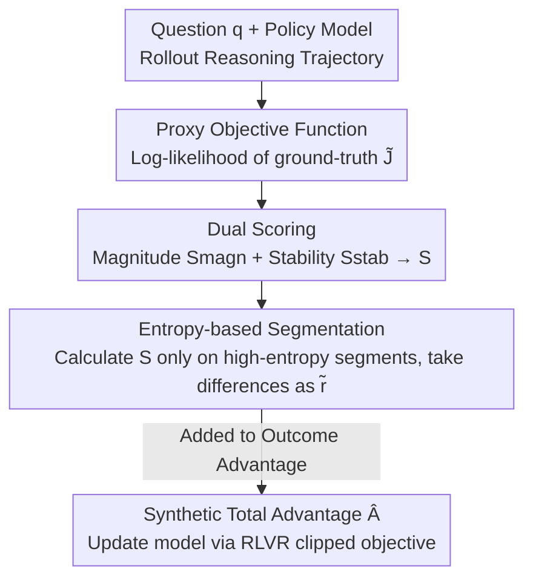

# Rectifying LLM Thought from Lens of Optimization

**Conference**: ICLR 2026  
**OpenReview**: [https://openreview.net/forum?id=bOMQmyR492](https://openreview.net/forum?id=bOMQmyR492)  
**Code**: https://github.com/open-compass/RePro  
**Area**: LLM Reasoning / Reinforcement Learning  
**Keywords**: Long Chain-of-Thought, Process-level Reward, RLVR, Overthinking, Optimization Perspective

## TL;DR
This paper analogizes the reasoning process of long Chain-of-Thought (CoT) to a "gradient descent" process and proposes REPRO. Using the model's log-likelihood of the correct answer as a proxy objective function, it synthesizes process-level rewards from two scores (Magnitude and Stability) along the reasoning trajectory. These rewards are integrated into RLVR training, consistently improving reasoning accuracy across math, science, and code benchmarks while significantly compressing "overthinking" redundancy.

## Background & Motivation
**Background**: Current state-of-the-art reasoning LLMs (o-series, DeepSeek-R1, Kimi-K1, etc.) rely on long CoT combined with RLVR (Reinforcement Learning with Verifiable Rewards) training. Models autonomously explore long sequences of reasoning steps, while weight updates are driven solely by a terminal "outcome correctness" reward. This paradigm enables models to learn repetitive exploration, backtracking, and self-reflection.

**Limitations of Prior Work**: Long CoT models commonly suffer from "overthinking." For a simple problem like "2 + 3," they might generate thousands of tokens, most of which contribute nothing to the final answer, merely increasing latency and compute costs. Terminal rewards only judge the final result and provide no constraint signals for inefficient, oscillating, or redundant intermediate steps.

**Key Challenge**: Terminal rewards are "sparse and outcome-only." They cannot distinguish between two trajectories that both yield the correct answer, where one is efficient and direct while the other is circuitous and full of self-doubt. There is a lack of process-level signals that can gradually evaluate whether "this reasoning step actually drives the model toward the answer."

**Goal**: To design a calculable, plug-and-play process-level reward for the reasoning process itself that suppresses redundant "overthinking" without damaging the original outcome-based rewards.

**Key Insight**: The authors adopt the perspective of "viewing CoT decoding as an optimization process over the LLM's internal states." Each reasoning step is equivalent to performing an (implicit) gradient update toward "increasing the probability of the correct answer." Under this lens, good reasoning equals a smooth, monotonically increasing optimization curve, while overthinking corresponds to oscillating around saddle points or local optima without converging.

**Core Idea**: Since reasoning is an optimization process, one can **directly measure the quality of this optimization**. By using the model's confidence (likelihood) in the ground-truth as a proxy for the objective function, the trajectory is monitored for "sufficient growth (Magnitude)" and "steady growth (Stability)." These two dimensions are synthesized into a process reward to "rectify" the model's trajectory.

## Method

### Overall Architecture
REPRO (Rectifying Process-level Reward) is a plug-and-play module for standard RLVR training pipelines. In one training iteration: the policy model first rolls out a set of reasoning trajectories. REPRO treats each trajectory as an optimization process, calculating a sequence of proxy objective functions $\tilde{J}$ along the path. It then computes two scores—the magnitude score $S_{magn}$ (how much optimization occurred) and the stability score $S_{stab}$ (how smooth the growth was). These are weighted into a total score $S$. To save compute, scores are calculated only on several high-entropy reasoning segments, and the differences between adjacent segments serve as the process reward $\tilde{r}$. Finally, $\tilde{r}$ is normalized and added to the original outcome advantage to obtain the total advantage $\hat{A}_t$ for updating the model via clipped policy objectives.

### Key Designs

**1. Proxy Objective: Using "Confidence in Correct Answer" as the Y-axis**

To view reasoning as optimization, an objective function is needed. Since the true optimization (implicit gradient ascent on internal states) is too complex to manifest directly, the authors use an **observable proxy**: given the context of the first $t$ reasoning steps $\tau_{\le t}$, the average log-probability of the model generating the ground-truth answer $a$:

$$\tilde{J}\!\left(\pi_\theta, q, \tau_{\le t}, a\right) \triangleq \frac{1}{|a|}\sum_{i=1}^{|a|}\log \pi_\theta\!\left(a^{(i)}\,\middle|\,q, \tau_{\le t}\right).$$

The intuition is that as reasoning progresses and the context updates the model's internal state, it should become increasingly confident in the correct answer, causing $\tilde{J}$ to rise monotonically. Using DeepSeek-R1-Distill-Qwen-1.5B on AIME problems, the authors plotted $-\tilde{J}$ against token positions and found it decreases steadily (meaning $\tilde{J}$ increases), confirming $\tilde{J}$ as a reliable probe for "optimization progress." The advantage is it requires only one forward pass with no extra reward models or human labels.

**2. Magnitude Score $S_{magn}$: Measuring Progress**

The first dimension is **magnitude**—how much net progress a reasoning segment provides. Since absolute values of $\tilde{J}$ vary by problem difficulty, a baseline $J_b(q)\triangleq\tilde{J}(\pi_\theta,q,a)$ (prior likelihood without reasoning) is introduced. The magnitude score is defined as the normalized improvement over the baseline:

$$S_{magn,(t)} \triangleq \tanh\!\Big(\Delta + 1\Big) + 1 \in (0,1],\qquad \Delta = \frac{\tilde{J}(\pi_\theta,q,\tau_{\le t},a) - J_b(q)}{J_b(q)}.$$

The $\tanh$ function constrains the relative improvement to the $(0,1]$ range, preserving monotonicity while suppressing extremes. A higher $S_{magn}$ indicates the partial trajectory $\tau_{\le t}$ has pushed the model further toward the correct answer. (Note: Signs and intervals follow the original text's notation.)

**3. Stability Score $S_{stab}$: Using Kendall's Tau for Oscillations**

The second dimension is **stability**. Ideal optimization should rise steadily at every step, whereas overthinking typically involves fluctuations. The authors use Kendall’s rank correlation coefficient to measure the monotonic consistency between the $\tilde{J}$ sequence and step indices:

$$S_{stab,(t)} = \frac{\sum_{i<j}\operatorname{sign}(\tilde{J}_i-\tilde{J}_j)\cdot\operatorname{sign}(i-j)}{|\tau_{\le t}|\,(|\tau_{\le t}|-1)}\cdot\frac{1}{2}+\frac{1}{2}\in[0,1].$$

If every step is an effective update (strictly increasing sequence), $S_{stab}\to 1$; if there is severe oscillation, it approaches 0. EMA smoothing can be applied to $\tilde{J}$ to resist noise. The final score is a weighted combination $S=(1-w)S_{magn}+w\,S_{stab}$. This "Magnitude + Stability" characterization matches the intuition that optimization should go both far and steady.

**4. Entropy-based Segments + Reward Differences: Low-noise RLVR Signals**

Calculating $S$ at every token is computationally expensive for long CoT and introduces high noise. The authors employ two strategies. First, **Entropy-based Segmentation**: the reasoning is split into $N$ segments (e.g., by `\n\n`), and only segments with the top-$k$ highest entropy for their first token are scored. High-entropy tokens are "key decision points" where oscillations or sub-optimal updates are most likely to occur. Second, **Reward Differences**: the process reward for segment $j$ is the difference between adjacent scores $\tilde{r}_j = S_j - S_{j-1}$. Steps with positive gain (key calculations, preliminary conclusions) are encouraged, while steps with negative gain (self-doubt, redundant re-checking) are penalized. $\tilde{r}_j$ is normalized and combined with the outcome advantage $A$ via $\hat{A}_t = A + \alpha\tilde{A}_t$. REPRO is thus compatible with PPO, REINFORCE++, or GRPO.

### Example: What do low-reward steps look like?
In a logarithmic equation problem (finding $xy$, answer 25), step-by-step $\tilde{r}$ calculations show: restating the problem yields $\tilde{r}=0.143$ (positive target setting); filler like "I remember logs are tricky... maybe the base-change formula helps" yields $\tilde{r}=-0.217$ (strongly negative); "this trial and error won't work" yields $\tilde{r}=-0.060$; while key calculation steps like "so $xy=25$ is the solution" yield $\tilde{r}=0.053\sim0.092$ (positive). The pattern is clear: low $\tilde{r}$ steps are almost always self-doubt or redundant checks, while high $\tilde{r}$ steps correspond to substantive progress.

## Key Experimental Results

### Main Results
Using DeepSeek-R1-Distill-Qwen-1.5B and Qwen3-1.7B, REPRO was applied to PPO, REINFORCE++ (RF++), RF++ Baseline, and GRPO. Evaluation covered Math (AIME, MATH500, LiveMathBench), Science (GPQA-Diamond), and Code (MBPP, LiveCodeBench). ♠ denotes in-domain; ♣ denotes out-of-domain.

| Backbone / Algorithm | AIME24 ♠ | AIME25 ♠ | MATH500 ♠ | LMB ♠ | GPQA-D ♣ | MBPP ♣ |
|---|---|---|---|---|---|---|
| R1-Distill-1.5B · PPO | 34.8 | 24.4 | 86.9 | 14.0 | 32.1 | 61.0 |
| · PPO + REPRO | **36.3** | **27.7** | **87.7** | **16.5** | **32.8** | 61.1 |
| R1-Distill-1.5B · GRPO | 32.9 | 25.3 | 86.0 | 10.3 | 34.5 | 62.5 |
| · GRPO + REPRO | **36.0** | **26.5** | **87.1** | **14.3** | **37.0** | **65.4** |
| Qwen3-1.7B · GRPO | 47.3 | 34.8 | 93.4 | 18.8 | 38.3 | 67.5 |
| · GRPO + REPRO | **49.8** | **37.9** | **94.1** | **19.5** | **39.1** | **68.8** |

REPRO provides consistent gains across all four RL algorithms. Improvements generalize from math to science/code and across different model families and sizes.

### Ablation Study

| Configuration | Conclusion |
|---|---|
| Weight $w$ (Fig.4) | REPRO outperforms baselines at all $w$, proving both scores are necessary; smaller $w$ is slightly better, indicating **Magnitude (Optimization Progress) is more critical**. |
| REPRO Weight $\alpha$ | Performance is relatively stable across different $\alpha$ values, showing robustness to this balance coefficient. |
| Segment Count $k$ | Increasing $k$ leads to slight performance gains (e.g., AIME24 36.0→36.9), with diminishing returns. |

### Key Findings
- **Magnitude > Stability**: Performance is better when $w$ is small, suggesting "how far you go" is more important for accuracy than "how steady you go."
- **Significant Token / Backtracking Reduction**: Reasoning token costs decrease throughout training. Inference token overhead is significantly reduced across all benchmarks. "Backtracking" behaviors also become notably less frequent compared to vanilla GRPO.
- **More Linear, Fewer Errors**: Case studies show models trained with REPRO have more direct reasoning paths and fewer errors caused by oscillating near "saddle points."

## Highlights & Insights
- **Theorizing Process Reward melalui Optimization**: Instead of heuristic PRM design, the authors derive "Magnitude + Stability" conditions based on the "CoT = Gradient Descent" assumption.
- **Lightweight Proxy Objective**: Using log-likelihood of the ground-truth avoids the need for training separate reward models or manual step-level annotations.
- **Entropy Selection Efficiency**: This kills two birds with one stone: reducing computation for long CoT and focusing rewards on "high-entropy decision points" where optimizations are most likely to fail.
- **Transferability**: The approach of using likelihood monotonicity and Kendall’s Tau to characterize generation quality could be applied to other tasks requiring process-level feedback without step labels (e.g., agent trajectories).

## Limitations & Future Work
- **Dependency on Ground-Truth**: The proxy objective $\tilde{J}$ requires the correct answer, making it suitable only for verifiable tasks (Math/Code/Science).
- **Optimization as Reasoning Assumption**: Equating monotonic $\tilde{J}$ growth with "good reasoning" is an empirical observation and might penalize valid exploratory steps that temporarily lower likelihood.
- **Hyperparameter Sensitivity**: $w, \alpha, k$ and segmenting rules are manually set. Gains on much larger models (>7B) are yet to be confirmed.

## Related Work & Insights
- **vs. Length-based Efficiency Penalties**: Length-penalty methods penalize token counts directly, but "short" isn't always "good." REPRO prunes based on quality (optimization gain) rather than length.
- **vs. Traditional Process Reward Models (PRM)**: PRMs require massive step-level human annotations. REPRO uses an unsupervised proxy, making it lighter and label-free.
- **vs. RL Algorithm Improvements (Dr.GRPO, VAPO, etc.)**: Those works modify the RL framework itself. REPRO is orthogonal and can be added as an additional signal to any of them.

## Rating
- Novelty: ⭐⭐⭐⭐ Formally modeling CoT as optimization to design a dual-score process reward is clear and concrete.
- Experimental Thoroughness: ⭐⭐⭐⭐ Covers 4 algorithms across multiple models and 7 benchmarks with behavior analysis, though model sizes are small.
- Writing Quality: ⭐⭐⭐⭐ The optimization analogy is consistent; diagrams are clear.
- Value: ⭐⭐⭐⭐ Plug-and-play and label-free; highly practical for mitigating overthinking.

<!-- RELATED:START -->

## Related Papers

- [\[ICLR 2026\] Reference-guided Policy Optimization for Molecular Optimization via LLM Reasoning](reference-guided_policy_optimization_for_molecular_optimization_via_llm_reasonin.md)
- [\[ICLR 2026\] Asymmetric Proximal Policy Optimization: Mini-Critics Boost LLM Reasoning](asymmetric_proximal_policy_optimization_mini-critics_boost_llm_reasoning.md)
- [\[ICLR 2026\] Slow-Fast Policy Optimization: Reposition-Before-Update for LLM Reasoning](slow-fast_policy_optimization_reposition-before-update_for_llm_reasoning.md)
- [\[ICLR 2026\] Making Slow Thinking Faster: Compressing LLM Chain-of-Thought via Step Entropy](making_slow_thinking_faster_compressing_llm_chain-of-thought_via_step_entropy.md)
- [\[ICLR 2026\] Scaf-GRPO: Scaffolded Group Relative Policy Optimization for Enhancing LLM Reasoning](scaf-grpo_scaffolded_group_relative_policy_optimization_for_enhancing_llm_reason.md)

<!-- RELATED:END -->
