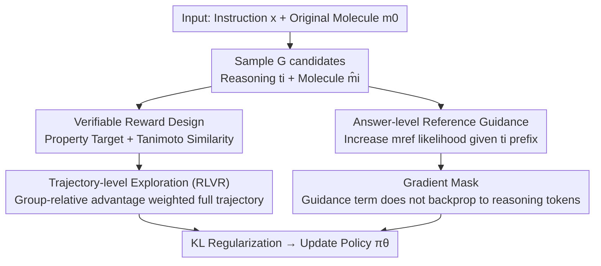

# Reference-guided Policy Optimization for Molecular Optimization via LLM Reasoning

**Conference**: ICLR 2026  
**OpenReview**: [https://openreview.net/forum?id=m4nvqQkm4X](https://openreview.net/forum?id=m4nvqQkm4X)  
**Code**: https://github.com/tmlr-group/RePO  
**Area**: LLM Reasoning / Reinforcement Learning / Molecular Optimization  
**Keywords**: Molecular Optimization, RLVR, GRPO, Reference-guided, Verifiable Reward

## TL;DR
For instructional molecular optimization tasks where "each data point provides only one optimized reference molecule without intermediate reasoning trajectories," this paper proposes RePO. Based on GRPO-style reinforcement learning with verifiable rewards, it prepends a "reference-guided term" that acts only on answer tokens. This anchors the output to the reference molecule while allowing the model to freely explore the chemical editing space, thereby alleviating early reward sparsity and significantly improving the "Success Rate × Similarity" metric.

## Background & Motivation
**Background**: The mainstream recipe for applying LLMs to reasoning tasks involves Supervised Fine-Tuning (SFT) and Reinforcement Learning with Verifiable Rewards (RLVR, exemplified by GRPO). Both allow models to "think before answering" and perform well in tasks with explicit correctness, such as mathematics or coding. However, the effectiveness of these recipes in scientific tasks, particularly instructional molecular optimization, has not been systematically studied.

**Limitations of Prior Work**: Instructional molecular optimization requires the model to **improve a specific target property** (e.g., QED, LogP, MR) while **maintaining structural similarity** to the original molecule. Adding functional groups can improve properties but often reduces similarity or violates chemical validity, representing inherently conflicting objectives. Furthermore, the supervision format of datasets is problematic: each sample only provides one optimized reference molecule $m_{\text{ref}}$, with **no step-by-step editing trajectories**. This "supervision mismatch" causes both recipes to fail: pure-answer SFT forces the model to imitate the reference directly, collapsing it into a "no-reasoning, short-answer" mode; GRPO learning from a base model struggles with sparse reward signals in the early stages, as samples satisfying both "property improvement + similarity" are rare, forcing the model into conservative near-identity edits.

**Key Challenge**: Reward signals are too sparse to push the policy out of the conservative editing comfort zone, yet reference molecules can only be imitated at the token level. Direct token-level imitation over-constrains the policy and erases diverse editing paths. The authors confirmed this modeling gap using three sets of comparative experiments (GRPO, Answer-SFT, GRPO-SFT-init): GRPO yields high similarity but low success rates; SFT yields moderate success but poor similarity control and short-answer collapse; running GRPO on top of SFT fails to recover multi-step reasoning and inherits SFT's limited exploration traits.

**Goal**: Without requiring any intermediate editing trajectory annotations, provide (i) **answer-level** directional guidance toward $m_{\text{ref}}$ to enhance learning signals, and (ii) **avoid token-level process imitation** to preserve multiple valid reasoning/editing paths under the same instruction.

**Key Insight**: Treat the reference molecule as an "answer-level anchor" rather than a "reasoning template." Retain the reward-driven exploration of GRPO over full trajectories while adding a guidance term to increase the likelihood of the reference molecule conditioned on the model's own sampled reasoning prefix. This uses guidance to alleviate sparsity and RL to maintain exploration diversity.

## Method

### Overall Architecture
RePO (Reference-guided Policy Optimization) addresses the supervision mismatch where only endpoint reference molecules exist without process trajectories. The core idea is to combine "exploration" and "anchoring" into a single objective function within one update. In each iteration: for a query $q=(x,m_0)$ (instruction $x$ + original molecule $m_0$), the old policy $\pi_{\text{old}}$ samples $G$ responses, each consisting of reasoning tokens $t_i$ and a final molecule $\hat m_i$; verifiable rewards score each $\hat m_i$; the policy is then updated using the sum of three terms: an RLVR exploration term (weighted by intra-group relative advantage over the full trajectory), an answer-level reference guidance term (increasing $m_{\text{ref}}$ likelihood conditioned on the sampled reasoning prefix $t_i$), and a KL regularization term for stability. Crucially, the guidance term is **calculated only on answer tokens and gradients do not backpropagate through reasoning tokens**, ensuring the model anchors the answer without imitating the reasoning process.

### Key Designs

**1. Verifiable Reward: Converting Dual Objectives into a Computable Scalar**
RL requires rewards to learn. Since molecular optimization lacks pre-defined verifiable answers, the authors instantiate the objective as $r(m,m_0)=r_{\text{prop}}(m,m_0)+r_{\text{struct}}(m,m_0)$. The structural term uses Tanimoto similarity $r_{\text{struct}}=\frac{|FP(m)\cap FP(m_0)|}{|FP(m)\cup FP(m_0)|}\in[0,1]$, where $FP(\cdot)$ is the molecular fingerprint. The property term uses a **binary improvement reward**: 1 if the instruction requirements are met (e.g., $F(m)\ge F(m_0)$ for increases), otherwise 0. Adding these reward terms encourages "correct direction" changes while penalizing "excessive modification."

**2. Trajectory-level Exploration: Maintaining Diversity via GRPO Updates**
To prevent the model from collapsing into conservative micro-edits, RePO retains GRPO's reward-driven exploration applied to the **full trajectory**. For a group of $G$ responses, the intra-group relative advantage $\hat A_{i,k}=(r(o_i,q)-\text{mean}(\{r\}))/\text{std}(\{r\})$ is calculated. Updates use the clipped importance ratio $\rho_{i,k}=\pi_\theta(o_{i,k}\mid q,o_{i,<k})/\pi_{\text{old}}(o_{i,k}\mid q,o_{i,<k})$ to optimize $\min(\rho_{i,k}\hat A_{i,k},\,\text{clip}(\rho_{i,k},1-\varepsilon,1+\varepsilon)\hat A_{i,k})$, **applied to all tokens (reasoning + answer) in $o_i$**. This drives exploration by up-weighting high-reward candidates and down-weighting low-reward ones.

**3. Answer-level Reference Guidance: Weighting Reference Molecules via Self-generated Prefixes**
This is the core distinction from SFT/GRPO. The guidance term is $\beta\log\pi_\theta(m_{\text{ref}}\mid q,t_i)$: under the sampled reasoning prefix $t_i$, it increases the log-likelihood of the reference molecule, with $\beta$ controlling intensity. Unlike pure SFT ($\log\pi(m_{\text{ref}}\mid q)$), which forces the model to ignore process, RePO treats the model's own reasoning as context. It pulls the probability toward the reference only at the answer level, providing a clear signal for "instruction-satisfying answers" early on, reducing reward sparsity, and shaping reasoning tokens to explore molecules with better properties. Note that $m_{\text{ref}}$ is only a proxy for the unknown optimal $m^*$ and is used only as an answer anchor.

**4. Gradient Mask: Preventing Guidance from Contaminating Reasoning Tokens**
Although the guidance term is calculated on answer tokens, letting the gradient flow back to $t_i$ would exert pressure on the reasoning process to specifically generate a prefix that leads to the reference molecule. This would reinforce hallucinated or chemically unsound reasoning patterns—the mechanism behind SFT collapse. RePO applies a gradient mask: the prefix $t_i$ acts only as context and receives no gradients from the guidance term. Mechanism verification experiments (comparing 40%/80% random masks vs. no mask) show that removing the mask causes performance to drop below baseline and rewards to stagnate.

### Loss / Training
The final objective $J_{\text{RePO}}(\pi_\theta)$ combines three components: exploration (clipped GRPO on all tokens), guidance $\beta\log\pi_\theta(m_{\text{ref}}\mid q,t_i)$ (answer tokens only, prefix masked), and KL regularization $-\gamma D_{\text{KL}}(\pi_\theta\|\pi_{\text{ref}})$ (using the K3 estimator). The base model is Qwen-2.5-3B-Instruct, updated via single-turn optimization without trajectory annotations.

## Key Experimental Results

### Main Results
TOMG-Bench Single-objective Optimization (Metric: SR×Sim, Success Rate × Similarity):

| Task | Metric | Base | SFT | GRPO | GRPO(SFT-init) | RePO |
|------|------|------|-----|------|----------------|------|
| AddComponent | SR×Sim | 0.066 | 0.147 | 0.005 | 0.156 | **0.239** |
| SubComponent | SR×Sim | 0.046 | 0.264 | 0.052 | 0.299 | **0.344** |
| QED | SR×Sim | 0.130 | 0.207 | 0.123 | 0.192 | **0.236** |
| LogP | SR×Sim | 0.168 | 0.206 | 0.305 | 0.183 | 0.297 |
| MR | SR×Sim | 0.173 | 0.238 | 0.188 | 0.225 | **0.294** |

RePO achieved the best SR×Sim in 4 out of 6 single-objective tasks; success rates improved by up to 17.4% relative to GRPO. Pure GRPO collapsed on structural tasks (AddComponent SR only 0.005), confirming that "unguided exploration fails in vast chemical spaces."

MuMOInstruct Multi-objective Optimization: RePO outperformed baselines by up to 4% on BDP and BPQ, maintaining advantages even under **unseen instruction styles** (unseen BPQ SR×Sim 0.144 was best), demonstrating generalization.

### Ablation Study

| Configuration | Observation | Explanation |
|------|------|------|
| RePO (full) | Optimal | Complete three components + gradient mask |
| No Mask | Below baseline | Guidance backprops to reasoning, reinforcing false logic; rewards stagnate |
| Random Mask 40%/80% | Below full | Partial masking is insufficient to isolate contamination |
| RePO (30% Ref. Corrupt) | Above baseline | Graceful degradation with mismatched queries |
| RePO (50% Ref. Corrupt) | Competitive | High robustness |

### Key Findings
- **Gradient masking is a prerequisite**: Without it, performance drops below baseline (Fig. 7/8), proving that "answer-level anchoring without touching reasoning gradients" prevents collapse.
- **Property gains are global shifts**: Distribution analysis shows RePO shifts the entire distribution rightward; MR task average gain was 18.89, far exceeding GRPO (6.84) and even the reference molecules (9.05).
- **Higher reasoning quality**: LLM-as-a-judge scores RePO at 4.32 (highest), compared to 3.54 for No-Mask.
- **Robust across backbones**: RePO remains superior on Qwen-2.5-7B and Llama-3.1-8B despite architectural and tokenizer differences.

## Highlights & Insights
- **Decoupling anchoring from exploration**: Treating the reference as an answer anchor rather than a token-level template prevents collapse. The difference lies in the "conditioned reasoning" and the "gradient mask."
- **Diagnosis-driven design**: The method addresses failures identified in comparative analysis (GRPO/SFT) regarding reward sparsity and answer length collapse.
- **Transferable Framework**: The "answer-level guidance + gradient mask" paradigm can be applied to any RLVR scenario where only endpoint labels are available (e.g., scientific discovery, program synthesis).

## Limitations & Future Work
- **Simple Reward Design**: Property rewards are binary (1 for any improvement), which may prevent the model from pushing for larger improvements.
- **Single-turn Optimization**: While RePO outperforms many multi-turn methods, its single-turn nature might limit its upper bound on highly complex targets.
- **Dependency on Reference Quality**: RePO relies on $m_{\text{ref}}$ as a proxy for $m^*$; if dataset references are weak, the guidance signal weakens accordingly.
- **Sensitivity to Fingerprints**: Sensitivity to Tanimoto threshold $\delta$ and fingerprint types was not fully explored.

## Related Work & Insights
- **vs. GRPO (Pure RLVR)**: RePO adds guidance to solve the early-stage sparsity that causes GRPO to resort to conservative edits.
- **vs. SFT / GRPO(SFT-init)**: SFT's token-level imitation causes reasoning collapse; RePO preserves it via masking.
- **vs. Black-box LLM Molecular Optimization**: Methods like MOLLEO use multi-turn evolution; RePO achieves competitive or superior results with smaller open-source backbones in a single turn.

## Rating
- Novelty: ⭐⭐⭐⭐ The "answer anchor + gradient mask" approach is a clean innovation for supervision mismatch.
- Experimental Thoroughness: ⭐⭐⭐⭐ Covers two benchmarks, multiple backbones, and various robustness/CoT controls.
- Writing Quality: ⭐⭐⭐⭐ Clear logic chain from diagnosis to design.
- Value: ⭐⭐⭐⭐ Provides a reusable paradigm for RLVR with endpoint-only labels.

<!-- RELATED:START -->

## Related Papers

- [\[ICLR 2026\] Inpainting-Guided Policy Optimization for Diffusion Large Language Models](inpainting-guided_policy_optimization_for_diffusion_large_language_models.md)
- [\[ICLR 2026\] HiPO: Self-Hint Policy Optimization for RLVR](hipo_self-hint_policy_optimization_for_rlvr.md)
- [\[ICLR 2026\] Slow-Fast Policy Optimization: Reposition-Before-Update for LLM Reasoning](slow-fast_policy_optimization_reposition-before-update_for_llm_reasoning.md)
- [\[ICLR 2026\] Asymmetric Proximal Policy Optimization: Mini-Critics Boost LLM Reasoning](asymmetric_proximal_policy_optimization_mini-critics_boost_llm_reasoning.md)
- [\[ICLR 2026\] Scaf-GRPO: Scaffolded Group Relative Policy Optimization for Enhancing LLM Reasoning](scaf-grpo_scaffolded_group_relative_policy_optimization_for_enhancing_llm_reason.md)

<!-- RELATED:END -->
