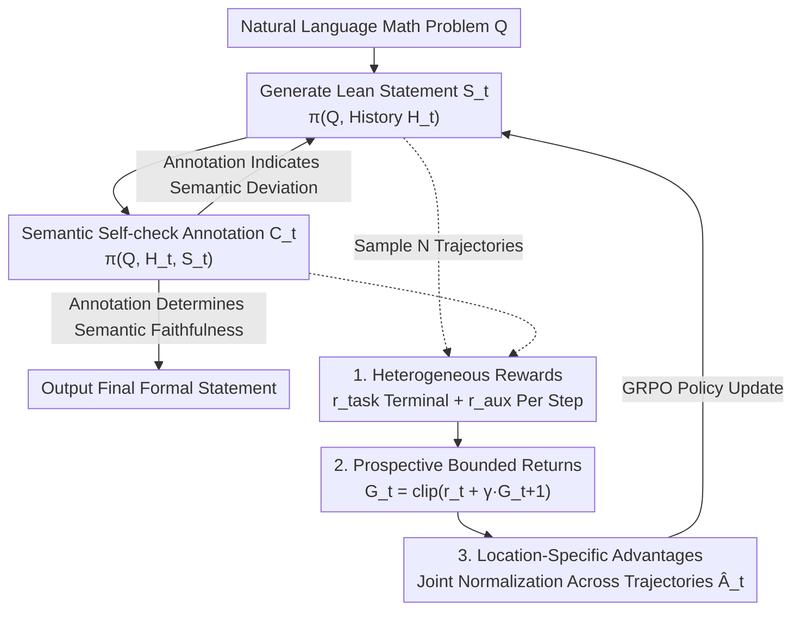

# ReForm: Reflective Autoformalization with Prospective Bounded Sequence Optimization

**Conference**: ICLR 2026  
**arXiv**: [2510.24592](https://arxiv.org/abs/2510.24592)  
**Code**: [GitHub](https://github.com/RUCAIBox/ReForm) (with models and benchmarks)  
**Area**: LLM Reasoning  
**Keywords**: autoformalization, Lean, semantic consistency, self-correction, reinforcement-learning, heterogeneous reward, PBSO

## TL;DR

ReForm is proposed as a reflective autoformalization paradigm that transforms the process of translating natural language mathematics problems into Lean formal statements from a single-pass generation into a "generation → semantic self-verification → correction" iterative cycle. It utilizes the PBSO algorithm to optimize heterogeneous reward signals, achieving an average improvement of 22.6 percentage points over the strongest baselines across four benchmarks.

## Background & Motivation

**Background**: Autoformalization, the translation of natural language mathematics problems into machine-verifiable formal statements (e.g., the Lean language), is a key bottleneck in formal mathematical reasoning. 

**Key Challenge**: 
- **Grammatical Correctness $\neq$ Semantic Correctness**: LLMs can generate grammatically correct statements that pass Lean compiler verification but frequently fail to faithfully preserve the semantic intent of the original problem (e.g., misunderstood quantifier scopes, missing implicit constraints, boundary case errors).
- **Limitations of Prior Work**: Existing methods (including Goedel-V2, Kimina) treat formalization as a simple translation task, lacking self-reflection and iterative error correction mechanisms.
- **Human experts also make mistakes**: 16.4% and 38.5% of human-authored formalizations in miniF2F and ProofNet, respectively, contain semantic errors, indicating the extreme challenge of the task.

**Core Idea**: Mimic the "review-correction" iterative process of human experts, allowing the model to discover and correct its own semantic errors during the generation process.

## Method

### Overall Architecture

ReForm reformulates autoformalization from a one-pass "read-translate" generation into a reflective loop of "generation-self-check-correction": the model first translates the natural language problem $Q$ into a Lean statement, then uses the same set of weights to evaluate whether the statement faithfully preserves the original meaning. If a deviation is discovered, it regenerates the statement with annotations until the self-check determines semantic faithfulness. The entire loop is implemented as a single autoregressive decoding step, thus requiring no multiple model calls or external judges. Specifically, at iteration $t$, the generation step yields $S_t = \pi(Q, \mathcal{H}_t)$ and the self-check step yields annotation $C_t = \pi(Q, \mathcal{H}_t, S_t)$, where the history $\mathcal{H}_t = \{(S_1, C_1), \ldots, (S_{t-1}, C_{t-1})\}$ feeds all previous "statement-annotation" pairs back into the context to facilitate corrections based on known errors.

To enable the loop to learn "honest self-checking," training solely on the final statement correctness is insufficient. PBSO therefore executes three functions on the same trajectory: **Heterogeneous Rewards** provide different signals for the final result and each step's annotation, **Prospective Bounded Returns** safely accumulate these rewards distributed at different positions into step-level returns, and **Location-Specific Advantages** convert these returns into step-wise advantages for GRPO, ensuring that corrective steps receive higher credit.

### Key Designs

**1. Heterogeneous Rewards: Simultaneous Supervision of Final Results and Intermediate Self-checks**

The primary difficulty of reflection loops is that scoring based only on final statement correctness fails to teach the model "what constitutes a proper self-check"—it might guess the correct result despite nonsensical annotations. ReForm designs two complementary signals. The terminal **Task Reward** grants 1 point only when the statement both passes Lean compilation and is semantically consistent, $r_{\text{task}}(Q, \text{Ans}) = 1$ iff $\text{PassesLean(Ans)} \land \text{IsConsistent}(Q, \text{Ans})$, otherwise 0. PassesLean is determined by the Lean compiler, while IsConsistent is judged by an LLM judge (CriticLean-14B). The intermediate **Auxiliary Reward** $r_{\text{aux}}^t = 1$ iff $\text{IsFaithfulCritique}(Q, S_t, C_t)$ is true, checking step-by-step whether each annotation accurately diagnoses the semantic relationship between the statement and the problem. Penalties are applied for false positives, false negatives, and premature termination.

**2. Prospective Bounded Returns: Safe Accumulation of Heterogeneous Rewards in Sequences**

The task reward is located at the end of the sequence, while auxiliary rewards are scattered throughout intermediate steps. Direct discounted accumulation could push returns beyond the range of the reward functions, leading to unstable gradient scales. PBSO employs backward recursion from the end of the trajectory with clipping at each step:

$$G_t = \text{clip}(r_t + \gamma \cdot G_{t+1},\, r_{\min},\, r_{\max})$$

Where $\gamma \in (0,1]$ is the discount factor, $G_{T+1} = 0$, and the reward sequence for the trajectory is $[r_{\text{aux}}^1, \ldots, r_{\text{aux}}^T, r_{\text{task}}]$. The `clip` function forces each step's return back into the valid interval $[r_{\min}, r_{\max}]$, preventing multi-step accumulation from exceeding bounds. 

**3. Location-Specific Advantages: Step-wise Credit Assignment within Trajectories**

Standard GRPO uses a single advantage value for the entire response, failing to distinguish "which self-check step contributed most." ReForm samples $N$ trajectories for each problem and aggregates all prospective returns from all trajectories and all iterations into a set $\mathcal{G} = \bigcup_{j=1}^N \{G_t^j : t=1,\dots,T_j+1\}$, then computes advantages via joint normalization:

$$\hat{A}_t^j = \frac{G_t^j - \text{mean}(\mathcal{G})}{\text{std}(\mathcal{G})}$$

This allows different iteration steps within the same trajectory to receive different advantage values—early steps that successfully identify critical errors are amplified, while late steps providing only minor tweaks or superficial checks are suppressed.

### Loss & Training

Training follows the clipped policy objective of GRPO, substituting the shared sequence advantage with the step-wise **Location-Specific Advantages** $\hat{A}_t^j$. Consequently, a single update optimizes both final formalization accuracy and intermediate self-check quality. Without any explicit length rewards, the model response length spontaneously increased from approximately 2,300 tokens to 4,800 tokens, indicating that more thorough self-checking was "induced" by heterogeneous rewards rather than artificial constraints.

## Key Experimental Results

### Main Results

| Model | miniF2F sem | ProofNet sem | Putnam sem | AIME2025 sem | AVG sem |
|------|-----------|------------|----------|------------|---------|
| GPT-5 | 66.0 | 44.6 | 45.8 | 13.3 | 42.4 |
| Goedel-V2-8B | 81.1 | 47.3 | 42.9 | 26.7 | 49.5 |
| Goedel-V2-32B | 82.0 | 50.5 | 41.4 | 26.7 | 50.1 |
| **ReForm-8B** | **87.7** | **65.6** | **57.3** | **46.7** | **64.3** |
| **ReForm-32B** | **91.4** | **70.4** | **62.3** | **66.7** | **72.7** |

ReForm-8B achieved an average semantic consistency improvement of **+14.8pp** over Goedel-V2-8B, even surpassing the 4x larger Goedel-V2-32B (+14.2pp). ReForm-32B reached an average semantic consistency of **72.7%**, a **+22.6pp** increase over the strongest baseline. Improvements were more significant on higher-difficulty datasets: ProofNet (+19.9pp), PutnamBench (+20.9pp), and AIME2025 (+40.0pp for 32B).

### Ablation Study

| Variant | miniF2F | ProofNet | Putnam | AIME25 |
|------|---------|----------|--------|--------|
| ReForm (Full) | 87.7 | 65.6 | 57.3 | 46.7 |
| w/o clip | 84.0 | 59.6 | 48.9 | 26.7 |
| w/o $r_{\text{aux}}$ | 87.7 | 65.6 | 52.1 | 40.0 |
| w/o RL | 85.2 | 62.3 | 49.4 | 30.0 |
| One-pass | 82.7 | 59.1 | 40.8 | 16.7 |

**Key Findings**:
- **Removing clip** led to severe degradation (AIME25 dropped from 46.7 to 26.7), confirming that bounded returns are critical for optimizing heterogeneous rewards.
- **Auxiliary Rewards** $r_{\text{aux}}$ had a larger impact on complex problems (Putnam -5.2, AIME25 -6.7).
- **One-pass vs ReForm**: The performance gap widened as problem difficulty increased (AIME25 gap reached 30pp), validating the necessity of the reflection paradigm for difficult problems.

### Key Findings

1. **Training Dynamics**: Response length naturally grew from 2,300 to 4,800 tokens (with no length reward), showing the model spontaneously learned deeper self-checking behaviors.
2. **ConsistencyCheck Benchmark**: 859 expert-annotated items show that frontier LLMs have an accuracy of approximately 85.8% as evaluators; however, ReForm's improvement (+22.6pp) far exceeds evaluation noise.
3. **Human mistakes**: 16.4% of miniF2F and 38.5% of ProofNet human formalizations contain semantic errors.

## Highlights & Insights

1. **Paradigm Shift**: Transitioning from one-pass translation to iterative reflection and from single terminal rewards to heterogeneous rewards are two independent yet complementary innovations.
2. **Superior Parameter Efficiency**: The 8B model outperforms the 32B baseline, demonstrating that architectural innovation in reflection is more valuable than sheer parameter scale.
3. **Generality of PBSO**: Prospective bounded returns are not only applicable to formalization tasks but also provide insights for other multi-objective sequential decision-making problems.
4. **Training Stability**: The smooth reward curves and narrowing confidence bands validate PBSO's effectiveness in balancing heterogeneous objectives.
5. **Revealing Evaluation Limitations**: The construction of the ConsistencyCheck benchmark validates evaluation reliability and quantifies formalization challenges.

## Limitations & Future Work

1. Training data comes from multiple open-source origins; despite deduplication, data quality may still limit the performance ceiling.
2. Inference token consumption increased by 2.1x, impacting inference efficiency.
3. Evaluation relies on LLM-as-judge (85.8% accuracy), introducing approximately 14% judgment noise.
4. PBSO introduces additional hyperparameters such as the discount factor $\gamma$ and clip range.

## Related Work & Insights

- **Relationship with Goedel/Kimina**: These works improve semantic consistency through high-quality data but remain one-pass; ReForm introduces a reflection loop at the methodological level.
- **Relationship with general RL for LLM**: Methods like GRPO and DAPO typically use only terminal rewards and do not supervise intermediate steps; PBSO's prospective bounded returns provide explicit supervision for intermediate steps.
- **Insights for Automated Theorem Proving (ATP)**: If formalization accuracy improves, the performance upper bound for downstream ATP will increase accordingly.

## Rating

- **Novelty**: ⭐⭐⭐⭐⭐ — Dual innovation of reflection paradigm + PBSO, solving core semantic issues in formalization.
- **Utility**: ⭐⭐⭐⭐ — While formalization is a specialized task, the methodological concepts have broad transfer potential.
- **Experimental Thoroughness**: ⭐⭐⭐⭐⭐ — Four benchmarks, comprehensive ablations, training dynamics analysis, and evaluation reliability verification.
- **Writing Quality**: ⭐⭐⭐⭐⭐ — Clear motivation, rigorous methodological derivation, and in-depth experimental analysis.
- **Overall Rating**: ⭐⭐⭐⭐⭐ — Represents a qualitative leap in the field of autoformalization with universally valuable methodological contributions.

<!-- RELATED:START -->

## Related Papers

- [\[ICLR 2026\] Divide and Abstract: Autoformalization via Decomposition and Abstraction Learning](divide_and_abstract_autoformalization_via_decomposition_and_abstraction_learning.md)
- [\[ICLR 2026\] LoC-Decomp: LLM Autoformalization via Logical Concept Decomposition and Iterative Feedback Correction](loc-decomp_llm_autoformalization_via_logical_concept_decomposition_and_iterative.md)
- [\[ICLR 2026\] ProofFlow: A Dependency Graph Approach to Faithful Proof Autoformalization](proofflow_a_dependency_graph_approach_to_faithful_proof_autoformalization.md)
- [\[ACL 2026\] JTPRO: A Joint Tool-Prompt Reflective Optimization Framework for Language Agents](../../ACL2026/llm_reasoning/jtpro_a_joint_tool-prompt_reflective_optimization_framework_for_language_agents.md)
- [\[ICLR 2026\] Test-Time Scaling with Reflective Generative Model](test-time_scaling_with_reflective_generative_model.md)

<!-- RELATED:END -->
