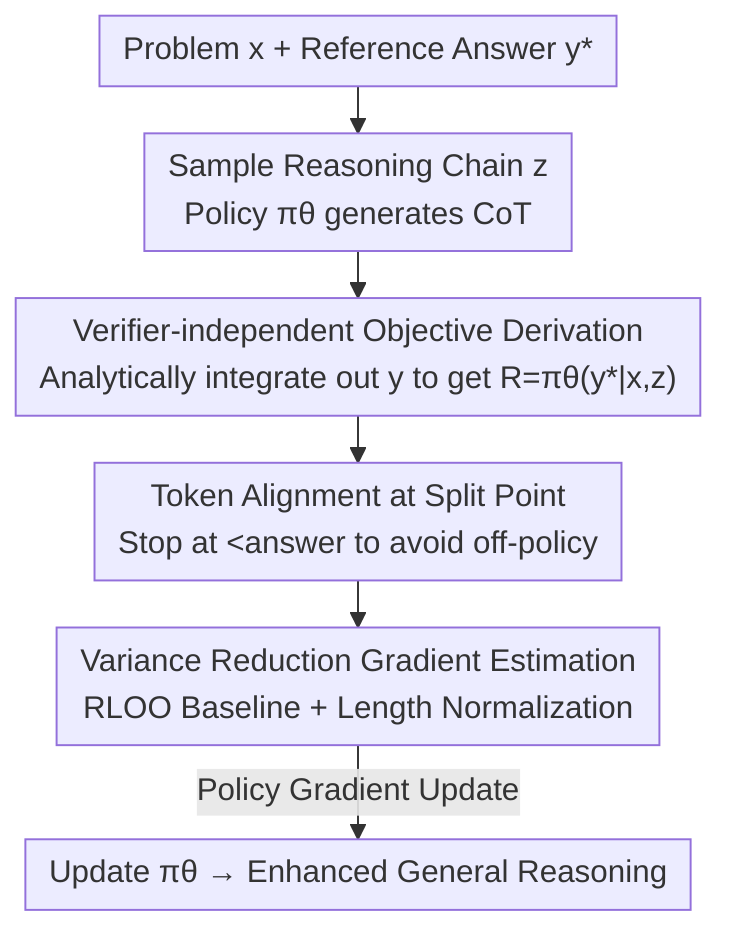

# Reinforcing General Reasoning without Verifiers

**Conference**: ICLR 2026  
**OpenReview**: [https://openreview.net/forum?id=nnwvwge40d](https://openreview.net/forum?id=nnwvwge40d)  
**Code**: Available (labeled as Code Link in the paper, Sea AI Lab)  
**Area**: LLM Reasoning / Reinforcement Learning / RLVR  
**Keywords**: Verifier-free RL, RLVR, Chain-of-Thought, Variance Reduction, General Reasoning

## TL;DR
This paper proposes VeriFree—a DeepSeek-R1-Zero-style reinforcement learning method that **requires no verifier**. Instead of judging the correctness of an answer, it directly maximizes the probability of the reference answer being generated conditioned on the model's self-generated reasoning chain. Strictly derived from the RL objective, this approach extends R1-Zero training from mathematical and code domains to general reasoning fields where rule-based scoring is difficult (e.g., chemistry, medicine, law). VeriFree achieves performance comparable to or exceeding verifier-based methods on MMLU-Pro, GPQA, and SuperGPQA.

## Background & Motivation

**Background**: DeepSeek-R1-Zero demonstrated that Reinforcement Learning with Verifiable Rewards (RLVR) significantly enhances LLM reasoning capabilities. The model generates a Chain-of-Thought (CoT) followed by a final answer; a rule-based program then extracts the answer, awarding a reward of 1 for correct answers and 0 for incorrect ones, followed by GRPO optimization. This paradigm has shown remarkable results in math and code.

**Limitations of Prior Work**: This approach is **strictly bound to domains where rule-based scoring is feasible**. While math has Math-Verify and code has test cases, real-world fields like chemistry, medicine, engineering, law, and economics make answer equivalence judgment extremely difficult, rendering rule-based verification impossible. A natural remedy is introducing a specialized LLM as a verifier (similar to reward models in RLHF). however, this introduces three new issues: ① dependency on an inherently strong verifier LLM; ② degradation into "optimizing for a reward given by another model," making it susceptible to reward hacking; ③ high computational overhead due to repeatedly querying a verifier model during training.

**Key Challenge**: Generalizing the R1-Zero paradigm to general domains requires overcoming the hurdle of judging answer correctness. Both rule-based and model-based verification have fatal flaws (unfeasible rules or unreliable/expensive models).

**Goal**: To retain the benefits of the RL paradigm while **completely eliminating the explicit step of judging answer correctness**, allowing R1-Zero-style training to be applied directly to general reasoning tasks where verification is unavailable.

**Key Insight**: By revisiting the mathematical derivation of the RL objective function, the authors found that under the assumption of a "unique correct answer," the expectation over the reward for the final answer $y$ can be **analytically integrated out**, eliminating the need to sample answers and score them.

**Core Idea**: Use the probability of the model generating the reference answer $y^\star$ given a reasoning chain $z$, denoted as $\pi_\theta(y^\star|x,z)$, directly as the reward signal. This avoids both rule-based and model-based verifiers while simultaneously reducing gradient variance.

## Method

### Overall Architecture

VeriFree takes "Problem $x$ + Reference Answer $y^\star$" as input and outputs a policy $\pi_\theta$ with enhanced general reasoning capabilities. It shares the initial stage of "sampling reasoning chains" with standard R1-Zero. The crucial difference lies in the latter half: while R1-Zero requires the model to generate the answer $y$, extract it, and send it to a verifier for a 0/1 score, VeriFree **replaces the model's own answer with the reference answer $y^\star$ from the dataset** at the end of the reasoning chain (`</think>`). It then performs a **single forward pass** to calculate the conditional probability $\pi_\theta(y^\star|x,z)$. This continuous value serves dual roles: as a reward signal for the reasoning chain and as a weight for supervised learning on the reference answer.

The entire gradient is strictly derived from the RL objective and decomposes into two terms: one resembling "RLVR with likelihood as reward" (Reasoning Term) and another resembling "supervised training on the reference answer" (Reference Answer Term).

### Key Designs

**1. Verifier-independent Objective Derivation: Replacing Scoring with Probability Calculation**

This directly addresses the pain point of unfeasible scoring in general domains. Starting from the standard R1-Zero objective $J_{\text{Verifier}}=\mathbb{E}_{z}\mathbb{E}_{y}[R_{\text{Verifier}}(y;y^\star)]$, and assuming a "unique correct answer" where $R_{\text{Verifier}}=\mathbb{1}\{y=y^\star\}$ (exact match), the authors made a key observation: given reasoning chain $z$, the expected reward over answer $y$ is equivalent to summing over all values where only the $y=y^\star$ term remains:

$$\mathbb{E}_{y\sim\pi_\theta(\cdot|x,z)}[\mathbb{1}\{y=y^\star\}]=\sum_y \pi_\theta(y|x,z)\,\mathbb{1}\{y=y^\star\}=\pi_\theta(y^\star|x,z).$$

Consequently, **the final answer $y$ is analytically integrated out**, and the expected reward equals the probability assigned by the model to the reference answer: $R_{\text{VeriFree}}(z;x,y^\star)=\pi_\theta(y^\star|x,z).$ The corresponding gradient estimate is:

$$\nabla_\theta J_{\text{VeriFree}}=\mathbb{E}_{z}\big[\underbrace{R_{\text{VeriFree}}\,\nabla_\theta\log\pi_\theta(z|x)}_{\text{Reasoning Term}}+\underbrace{\nabla_\theta\log\pi_\theta(y^\star|x,z)}_{\text{Ref. Answer Term}}\big].$$.

The Reasoning Term is a policy gradient where the reward is the probability of generating the correct answer; the Reference Answer Term is supervised learning weighted by that probability. Both terms are **mathematically equivalent** in expectation to the verifier-based version but require no verifier.

**2. Probability-weighted Reference Answer Term: Discounting Supervision Signals by Reasoning Quality**

This is the fundamental difference between VeriFree and prior works like JEPO or LaTRO, which also treat reasoning chains as latent variables. In JEPO/LaTRO, the weight for the reference answer term is **always 1**—meaning $y^\star$ is pushed up regardless of the reasoning chain quality. This leads to an issue: if a model hallucinates "...minus 2 apples, finally total 7 apples" when the correct answer is "6", a constant weight of 1 **forces the model to produce "6" from that incorrect reasoning**, solidifying the mismatch and encouraging bad reasoning.

In VeriFree, the weight is $\pi_\theta(y^\star|x,z)$ itself: the worse the reasoning chain, the lower the probability the model assigns to $y^\star$, and the lower the contribution of that sample to the supervision. This effectively weights the supervision signal by "reasoning quality," avoiding the rewarding of samples where the answer is correct by chance despite incorrect reasoning. Because VeriFree **exactingly restores** the original verifier-based objective under the single-answer assumption (whereas JEPO/LaTRO optimize a slightly biased evidence lower bound or use $\log\pi_\theta(y^\star|x,z)$ as reward), it succeeds where prior works failed to surpass verifier baselines.

**3. Variance Reduction: Rao-Blackwellization + RLOO Baseline**

Integrating out the answer $y$ not only saves the verifier but also provides a theoretical benefit. Theorem 1 proves that the variance of the VeriFree single-sample gradient estimate is **no greater than** the verifier-based version: $\text{Var}_z(\hat G_{\text{VeriFree}})\le\text{Var}_{z,y}(\hat G_{\text{Verifier}})$. Intuitively, the verifier-based variance stems from "sampling $z$" and "sampling $y$", while VeriFree's analytical marginalization of $y$ eliminates one source of randomness (Rao-Blackwellization).

This estimator also stacks with existing variance reduction techniques: the authors sample multiple responses per prompt, apply the RLOO baseline to the Reasoning Term, and use a modified length normalization from Dr. GRPO. The final online gradient is:

$$\nabla_\theta J=\frac{1}{G}\sum_{i=1}^{G}\big[A_i\,\nabla_\theta\log\pi_\theta(z_i|x)+R_i\,\nabla_\theta\log\pi_\theta(y^\star|x,z_i)\big],$$

where $R_i=\pi_\theta(y^\star|x,z_i)$ and $A_i=\pi_\theta(y^\star|x,z_i)-\frac{1}{G-1}\sum_{j\ne i}\pi_\theta(y^\star|x,z_j)$ is the leave-one-out baseline. Lower variance results in more stable training and faster convergence.

**4. Token Alignment at split point: Stopping at `<answer` instead of `<answer>`**

This engineering detail is critical for stability. To replace the answer with $y^\star$, the reasoning chain $z$ must be accurately sliced. However, since LLMs operate on token sequences, slicing by the text `<answer>` is risky: the `>` character might be tokenized differently depending on the context of $y$ versus $y^\star$, causing token boundary inconsistency between sampling and optimization (introducing off-policy data).

The solution is to define the end of $z$ at the token corresponding to `<answer` (**excluding `>`**). This ensures that sampling and optimization share a consistent token space alignment. Operationally, `<answer` is set as a stop word during sampling, allowing the **direct sampling of reasoning chain $z$** without generating the full $(z,y)$ and post-processing.

### Loss & Training

The Qwen3 series (1.7B / 4B / 8B) were used as base models, following the R1-Zero "Zero" setting by **skipping SFT and using direct RL fine-tuning**. Implemented based on the Oat framework, the training **uses no KL regularization or KL penalty**, thus requiring no reference model in VRAM. For each step, 8 responses are sampled for each of 16 problems (group size 8). Rollout uses temperature=1.0, top_p=1, max_tokens=3000. 1.7B/4B models were trained for ~4000 steps and the 8B model for ~3000 steps on 8×H100 nodes. Data consists of ~61k general reasoning samples (WebData) cleaned from WebInstruct, keeping only samples with answers under 7 tokens.

## Key Experimental Results

### Main Results

| Benchmark | Model | Base | w/ Verifier | VeriFree (Ours) |
|------|------|------|----------|------------------|
| MMLU-Pro | Qwen3-4B | 47.2 | 63.0 | **63.5** |
| MMLU-Pro | Qwen3-8B | 59.8 | 65.9 | **67.2** |
| SuperGPQA | Qwen3-4B | 24.7 | 34.3 | **35.1** |
| SuperGPQA | Qwen3-8B | 31.0 | 37.1 | **38.0** |

Starting from the base models, VeriFree increases average accuracy by 12%–40%, and on the 8B model, it **surpasses both the verifier-based baseline and Qwen3 instruct (thinking mode)**—despite having no dependency on explicit verification signals. Post-fine-tuning response lengths increased, indicating the model learned to explore longer reasoning chains, echoing the R1-Zero phenomenon.

### Ablation Study

| Configuration | Phenomenon | Explanation |
|------|------|------|
| Full (VeriFree) | Baseline | Complete method |
| w/o RLOO | Final accuracy drops >3% | Removing RLOO leads to premature convergence, highlighting the importance of variance reduction |
| w/o token split | Unstable convergence | Text-based slicing introduces off-policy data, leading to unstable optimization |
| w/ Equiv. Sets | Slight improvement | Introducing sets of equivalent answers brings marginal gains; a minor limitation of the current method |

### Key Findings
- **Higher Learning Efficiency**: At the same expected reward, VeriFree’s continuous reward + RLOO yields lower gradient variance, thus **reaching higher accuracy in fewer training steps**.
- **Model Confidence as a Reasoning Proxy**: MMLU-Pro accuracy on Qwen3-8B is strongly correlated ($\rho=0.82$) with the average confidence $\pi_\theta(y^\star|x,z)$ during training, suggesting the model's self-estimated probability of the correct answer effectively quantifies emergent reasoning ability.
- **Transferability of Reasoning Skills**: Training on data with all mathematical samples removed still improves performance on general benchmarks and **transfers to math benchmarks without math supervision**, indicating that VeriFree induces cross-domain general reasoning capabilities.

## Highlights & Insights
- **The "integration step" is the pivot**: A pure mathematical observation (expected reward = reference probability under unique answer) addresses three challenges simultaneously: it eliminates the verifier, reduces gradient variance, and replaces scoring with a cheap forward pass.
- **Engineering-to-Methodology elevation**: The `<answer` vs `<answer>` token alignment is not just a trick; it ensures on-policy training. Explaining and ablating this detail reflects a deep understanding of RL training stability.
- **Probability-weighted supervision is the key to beating JEPO/LaTRO**: While both use reasoning chains as latent variables, a constant weight of 1 solidifies bad reasoning. Using $\pi_\theta(y^\star|x,z)$ weights automatically discounts bad reasoning—an insight transferable to any "weak supervision with reference answers" scenario.

## Limitations & Future Work
- **Single Answer Assumption**: The method is strictly equivalent only when the answer is uniquely correct (exact match). In reality, multiple equivalent answers often exist. While using a single reference answer is empirically sufficient, ablation shows room for improvement by incorporating equivalence classes.
- **Dependence on Reference Answer Quality**: Training requires short answers (<7 tokens) and high-quality filtered reference answers. Its applicability to domains with long or open-ended generation is unproven.
- **Multiple-choice Evaluation**: To facilitate verification, general reasoning benchmarks are still evaluated in a multiple-choice format, which may not fully represent open-ended generation performance.

## Related Work & Insights
- **vs. Verifier-based methods**: These require an additional LLM verifier. Ours **requires no external verifier**, making it immune to reward hacking, more VRAM-efficient, and lower in variance.
- **vs. JEPO / LaTRO**: These optimize an ELBO where reference answer weights are constant, resulting in biased objectives and lower empirical performance than verifier baselines. VeriFree restores the original objective and uses probability weighting to suppress bad reasoning.
- **vs. Dr. GRPO / RLOO**: This work reuses their length normalization and RLOO components as variance reduction building blocks, stacking with them rather than replacing them.

## Rating
- Novelty: ⭐⭐⭐⭐⭐ Strictly deriving a "verifier-free" estimator from the RL objective is an elegant and theoretically grounded approach.
- Experimental Thoroughness: ⭐⭐⭐⭐ Covers various model scales and multiple benchmarks with ablation and transfer analysis, though predominantly multiple-choice.
- Writing Quality: ⭐⭐⭐⭐⭐ Clear derivations, good comparisons with prior work, and well-documented engineering details.
- Value: ⭐⭐⭐⭐⭐ Unlocks the R1-Zero paradigm for non-verifiable general domains; it is simple, fast, VRAM-efficient, and stable.

<!-- RELATED:START -->

## Related Papers

- [\[ICLR 2026\] Taming Imperfect Process Verifiers: A Sampling Perspective on Backtracking](taming_imperfect_process_verifiers_a_sampling_perspective_on_backtracking.md)
- [\[ICLR 2026\] ProofOptimizer: Training Language Models to Simplify Proofs without Human Demonstrations](proofoptimizer_training_language_models_to_simplify_proofs_without_human_demonst.md)
- [\[ICLR 2026\] C-Voting: Confidence-Based Test-Time Voting without Explicit Energy Functions](c-voting_confidence-based_test-time_voting_without_explicit_energy_functions.md)
- [\[NeurIPS 2025\] On Learning Verifiers and Implications to Chain-of-Thought Reasoning](../../NeurIPS2025/llm_reasoning/on_learning_verifiers_and_implications_to_chain-of-thought_reasoning.md)
- [\[ACL 2026\] Self-Reinforcing Controllable Synthesis of Rare Relational Data via Bayesian Calibration](../../ACL2026/llm_reasoning/self-reinforcing_controllable_synthesis_of_rare_relational_data_via_bayesian_cal.md)

<!-- RELATED:END -->
