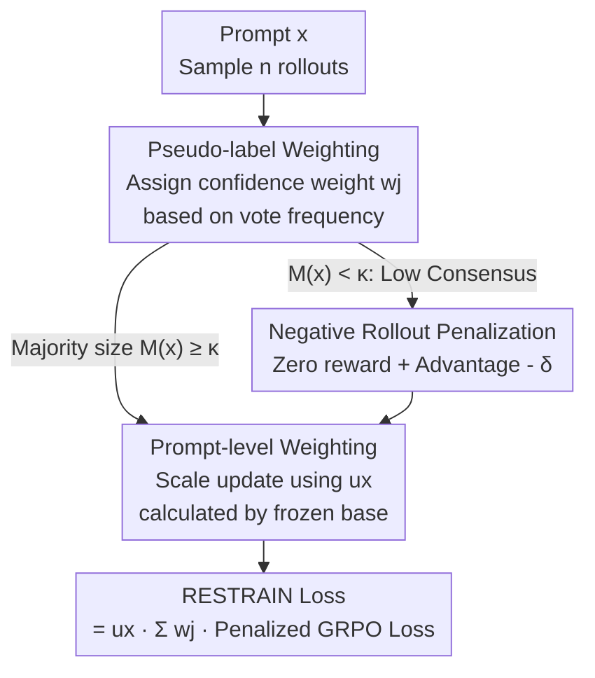

# RESTRAIN: From Spurious Votes to Signals — Self-Training RL with Self-Penalization

**Conference**: ICLR 2026  
**OpenReview**: [https://openreview.net/forum?id=87ySF7viys](https://openreview.net/forum?id=87ySF7viys)  
**Code**: To be confirmed  
**Area**: LLM Reasoning / Unsupervised Reinforcement Learning  
**Keywords**: Self-driven RL, Self-penalization, Pseudo-label weighting, GRPO, Label-free reasoning  

## TL;DR
RESTRAIN transforms the problem of "missing golden labels" into training signals. By adding triple self-penalization mechanisms—pseudo-label weighting, negative rollout penalization, and prompt-level weighting—onto GRPO, the model avoids blindly trusting majority votes. This pushes the average Pass@1 of Qwen3-4B on label-free data to 51.0%, nearly matching the upper bound of GRPO trained with golden labels (51.4%).

## Background & Motivation
**Background**: Reinforcement Learning with Verifiable Rewards (RLVR) using human annotations + verifiable rewards has significantly strengthened long-chain reasoning in large models. However, this path depends on a continuous supply of high-quality annotated data, which is costly and lacks momentum for more difficult tasks. A natural next step is **experience-driven learning**—allowing models to self-improve on unlabeled data.

**Limitations of Prior Work**: In an unlabeled setting, generating learning signals is the core challenge. One approach is self-rewarding (the model scores its own rollouts), but there is lack of evidence that it stably improves complex reasoning. Another approach leverages self-consistency, most notably **majority voting** (e.g., TTRL treats the majority answer as the sole pseudo-label for reinforcement). However, majority voting has severe reliability issues: when self-consistency is low, the majority answer itself may be systematically wrong; on hard problems, correct solutions are often hidden in **minority rollouts** but are ignored because they are suppressed by overconfident "pseudo-majorities." Training on such distorted reward signals leads to **training collapse** as task difficulty increases.

**Key Challenge**: The authors demonstrate this contradiction in Figure 2—on DAPO-MATH, there is a massive gap between Pass@64 (correct if any of the 64 samples are correct) and majority voting accuracy. When the majority size is small, the accuracy of the majority answer drops sharply. Collapsing all probability mass onto a single majority answer both discards correct solutions in the minority and treats noise as supervision in low-consensus regions.

**Goal / Key Insight**: Rather than betting that the "majority answer is correct," it is better to utilize signals from the model's **entire answer distribution**—preserving promising reasoning chains while actively penalizing overconfident rollouts and low-consistency samples.

**Core Idea**: Replace "self-rewarding" with "self-penalization"—transforming the lack of labels into negative learning signals at both the rollout and prompt levels. Scallable and seamlessly embedded into GRPO, this enables continuous self-improvement without any golden labels.

## Method

### Overall Architecture
RESTRAIN is built upon GRPO. Standard GRPO samples $n$ rollouts for each prompt $x$, uses golden labels $y$ to calculate rewards $r_i$ and advantages $A_i$ normalized by the group baseline, and updates the policy with a PPO-style clipping objective. RESTRAIN's modification is: **in the absence of golden labels, replace them with the model's own prediction distribution and apply triple self-penalization**, ensuring "pseudo-labels" are utilized without being blindly trusted.

The workflow is: given prompt $x$, sample $n$ rollouts → collect all unique answers $\{a_j\}$ and vote counts $c_j$ → ① Treat each $a_j$ as a pseudo-label, applying a weighted sum loss based on a **confidence weight $w_j$** derived from frequency (instead of only the majority); ② For prompts where the majority size is too low ($M(x) < \kappa$), deem them untrustworthy, **zero out rewards, and apply a negative advantage offset $\delta$** to all rollouts; ③ Use a **prompt weight $u_x$** pre-calculated by a frozen base model to scale the update magnitude of the entire sample. The final RESTRAIN loss is the product of these three components.

### Key Designs

**1. Pseudo-label Weighting: Replacing Single Majority with Entire Distribution**

This layer directly addresses the issue where majority voting discards minority correct solutions. Given prompt $x$ and $n$ rollouts, collect unique answers $\{a_j\}_{j=1}^m$ and counts $c_j$. **Treat every $a_j$ as a candidate pseudo-label**. The final loss is the weighted sum of GRPO losses for all candidates:

$$L_{\text{GRPO}}(x;\theta)=\sum_{j=1}^{m} w_j \cdot L_{\text{GRPO}}(x, a_j; \theta)$$

Weights $w_j$ are normalized from frequencies $f_j=c_j/n$ via a monotonic shaping function $g$: $w_j = g(f_j) / \sum_\ell g(f_\ell)$, where $g$ is a Gaussian function centered at $k \in [0,1]$ with bandwidth $\sigma > 0$. This is equivalent to a "soft selection" on frequencies: high-frequency answers receive proportionally larger weights, and low-frequency spurious answers are suppressed without collapsing all mass to one answer like majority voting. $\sigma$ controls the "skewness"—if $\sigma$ is too small, it approximates a step function and reverts to majority voting; if $\sigma$ is too large, it gives too much influence to noisy low-frequency answers. Ablation shows this is the **most critical component for preventing training collapse**, with its removal dropping performance to 37.5%.

**2. Negative Rollout Penalization: Prompt-wide Negative Signals for Low Consensus**

Pseudo-label weighting relies on Pass@n logic—as long as one rollout is correct, it can provide a valid positive signal. However, when the majority size is extremely low, it is likely the model has zero correct rollouts, making any answer untrustworthy. This layer handles such cases: define majority count $M(x) = \max_j c_j$. When $M(x) < \kappa$ (self-consistency below threshold), rewards for all candidates are zeroed, and a uniform negative offset $\delta$ is applied to all rollout advantages:

$$\tilde{r}_{i,j}=\begin{cases} r_{i,j} & M(x) \ge \kappa \\ 0 & M(x) < \kappa \end{cases} \qquad \tilde{A}_{i,j}=\begin{cases} A_{i,j} & M(x) \ge \kappa \\ A_{i,j}-\delta & M(x) < \kappa \end{cases}$$

In the PPO/GRPO objective, this means prompts with $M(x) < \kappa$ contribute only negative updates—penalizing all rollouts with low self-consistency, thereby **preventing the model from reinforcing fake majorities and guiding it to explore alternate reasoning paths**. Removing this layer drops the average from 51.0% to 42.1%.

**3. Prompt-level Weighting: Estimating Reliability via Frozen Base Model**

While the first two layers operate at the rollout level, this layer adds a prompt-level penalty. Model certainty varies significantly across prompts. RESTRAIN scales the update of the entire sample based on the "model's confidence in the prompt"—low-confidence prompts have smaller updates, while high-confidence prompts have larger ones. Crucially, weights are calculated **offline once using the frozen base model** and fixed throughout training to avoid false feedback loops caused by rising confidence during training. Specifically, for each prompt, $n$ rollouts are sampled using the reference policy $\pi_{\text{ref}}$ to get a majority count $c_{\text{ref}}$, and weights are calculated as $u_x = g(c_{\text{ref}}/n)$. The paper (Appendix E) notes that pre-calculated offline weights are superior to dynamic online variants. Removing this layer primarily hurts science benchmarks (MMLU STEM drops from 80.9 to 63.8).

### Loss & Training
Combining the three signals results in the final loss: prompt weight $u_x$ scales the exterior, pseudo-label weights $w_j$ weight the candidates internally, and the penalized $\tilde{A}_{i,j}$ replaces standard advantages in the GRPO loss:

$$L_{\text{RESTRAIN}}(x;\theta)=u_x\sum_{j=1}^{m} w_j\,\tilde{L}_{\text{GRPO}}(x,a_j;\theta)$$

$$\tilde{L}_{\text{GRPO}}(x,a_j;\theta)=-\frac{1}{n}\sum_{i=1}^{n}\min\!\big(\rho_i(\theta)\tilde{A}_{i,j},\ \text{clip}(\rho_i(\theta),1-\epsilon,1+\epsilon)\tilde{A}_{i,j}\big)-\beta D_{\text{KL}}[\pi_\theta\Vert\pi_{\text{ref}}]$$

The mechanism is seamlessly integrated into GRPO, requiring no additional reward models or external supervision, allowing for continuous self-training on unlabeled data.

## Key Experimental Results

### Main Results
Pass@1 results averaged over 16 seeds across 6 benchmarks (4 Math + 2 Science), trained on DAPO-14k-Math:

| Setup | Model | aime25 | mmlu | gpqa-d | Avg.↑ |
|------|------|--------|------|--------|-------|
| With Golden Labels (Upper Bound) | Qwen3-4B GRPO | 20.8 | 73.7 | 38.7 | 51.4 |
| Unlabeled | TTRL | 8.3 | 59.4 | 33.6 | 42.2 |
| Unlabeled | SRT (offline majority) | 12.0 | 59.4 | 34.5 | 43.1 |
| Unlabeled | **RESTRAIN** | **17.9** | **80.9** | **40.2** | **51.0** |

RESTRAIN achieves 51.0% without labels, 8.8 percentage points (pp) higher than TTRL and only 0.4 pp below the golden-label GRPO upper bound. It **outperforms** the golden-label setup on MMLU STEM and GPQA-Diamond. Similar comprehensive improvements over TTRL/SRT are observed on Octothinker Hybrid-8B, with a +140.7% relative gain on AIME25. It also remains the strongest unlabeled method on synthetic S1k data, exceeding the next best baseline by at least 7.7 pp.

### Ablation Study
Component removal results on Qwen3-4B (Avg Pass@1):

| Configuration | aime25 | mmlu | gpqa-d | Description |
|------|--------|------|--------|------|
| RESTRAIN (Full) | 17.9 | 80.9 | 40.2 | 51.0 |
| (-) Pseudo-label weighting | 6.0 | 59.3 | 33.7 | 37.5, fast collapse, largest drop |
| (-) Negative rollout penalization | 9.6 | 56.4 | 33.0 | 42.1 |
| (-) Prompt-level weighting | 18.1 | 63.8 | 37.0 | Primary impact on science benchmarks |

### Key Findings
- **Pseudo-label weighting is critical for stability**: Removing it causes a 13.5 pp drop and training instability. Further experiments show that "considering all candidates" is insufficient—applying **uniform** weights leads to even earlier collapse, indicating that low-frequency pseudo-labels are mostly noise and must be suppressed via frequency-based soft selection.
- **Training Stability**: On MATH500, TTRL collapses rapidly after ~50 steps, whereas RESTRAIN maintains stability because self-penalization suppresses overconfident updates.
- **Hyperparameter Sensitivity**: Small $\sigma$ (e.g., 0.1) performs poorly due to excessive influence from noisy low-frequency answers; offline prompt weights outperform online dynamic updates.

## Highlights & Insights
- **Translating "Label-free" from a burden to a signal**: The core revelation is moving away from seeking "positive signals" via self-rewarding and instead systematically constructing **negative signals**—penalizing overconfidence and low consensus, which is far more robust than blindly trusting majority votes.
- **Orthogonal and specialized components**: Pseudo-label weighting prevents collapse into a single answer, negative rollout penalization prevents learning from low-consensus noise, and prompt weighting adjusts updates based on sample reliability. Ablations show different failure modes (collapse vs. overall drop vs. science-specific drop) for each, highlighting their complementarity.
- **Transferable Trick**: Using a frozen base model to pre-calculate prompt reliability weights to avoid self-reinforcing feedback loops is a strategy transferable to any self-training or self-distillation scenario to prevent confidence inflation.

## Limitations & Future Work
- The method depends on a set of threshold/shape hyperparameters ($\kappa$, $\delta$, $\sigma$, center $k$ of $g$). Robust values across different models and tasks require tuning, though the paper validates them primarily on math and science reasoning.
- Part of the outperformance over the "golden-label upper bound" (e.g., on MMLU STEM) might be related to specific benchmark annotation or distribution characteristics; cross-benchmark improvements should be interpreted carefully.
- Self-penalization is essentially soft selection within the model's current distribution. If the base model fails to produce any correct rollouts in a domain (very low Pass@n), negative penalization cannot materialize correct reasoning out of nothing; the prerequisite is that the base model possesses some latent capability.

## Related Work & Insights
- **vs TTRL**: TTRL reinforces the majority vote as the sole pseudo-label, relying heavily on "majority is correct," making it prone to redirection by false majorities. RESTRAIN uses distribution weighting and negative penalization, offering higher stability and performance ceilings.
- **vs SRT**: SRT's heuristics (offline majority or keeping only "easy prompts" with high vote rates) either still reward self-consistency over correctness or discard low-consensus prompts entirely—which often contain valuable, albeit undervalued, reasoning paths. RESTRAIN chooses to **keep and penalize** rather than discard.
- **vs ETTRL**: RESTRAIN outperformed ETTRL (entropy-based test-time RL) in test-time RL experiments, particularly on AMC and MATH500 benchmarks.

## Rating
- Novelty: ⭐⭐⭐⭐⭐ Flips the self-rewarding paradigm to "self-penalization" with a clean triple-layer design motivated by empirical observations of majority vote failure.
- Experimental Thoroughness: ⭐⭐⭐⭐ Uses two base models, two datasets, six benchmarks, detailed component ablations, training stability curves, and hyperparameter analysis.
- Writing Quality: ⭐⭐⭐⭐ Clear formulas and convincing empirical motivation in Figure 2.
- Value: ⭐⭐⭐⭐⭐ Approaches golden-label GRPO performance in unlabeled settings, providing a scalable path for reasoning self-training to surpass supervised limits.

<!-- RELATED:START -->

## Related Papers

- [\[ICLR 2026\] Co-rewarding: Stable Self-supervised RL for Eliciting Reasoning in Large Language Models](co-rewarding_stable_self-supervised_rl_for_eliciting_reasoning_in_large_language.md)
- [\[ICLR 2026\] SkillFactory: Self-Distillation for Learning Cognitive Behaviors](skillfactory_self-distillation_for_learning_cognitive_behaviors.md)
- [\[ICLR 2026\] HiPO: Self-Hint Policy Optimization for RLVR](hipo_self-hint_policy_optimization_for_rlvr.md)
- [\[ICLR 2026\] Semantic Voting: A Self-Evaluation-Free Approach for Efficient LLM Self-Improvement on Unverifiable Open-ended Tasks](semantic_voting_a_self-evaluation-free_approach_for_efficient_llm_self-improveme.md)
- [\[ICLR 2026\] Toward Effective Tool-Integrated Reasoning via Self-Evolved Preference Learning](toward_effective_tool-integrated_reasoning_via_self-evolved_preference_learning.md)

<!-- RELATED:END -->
