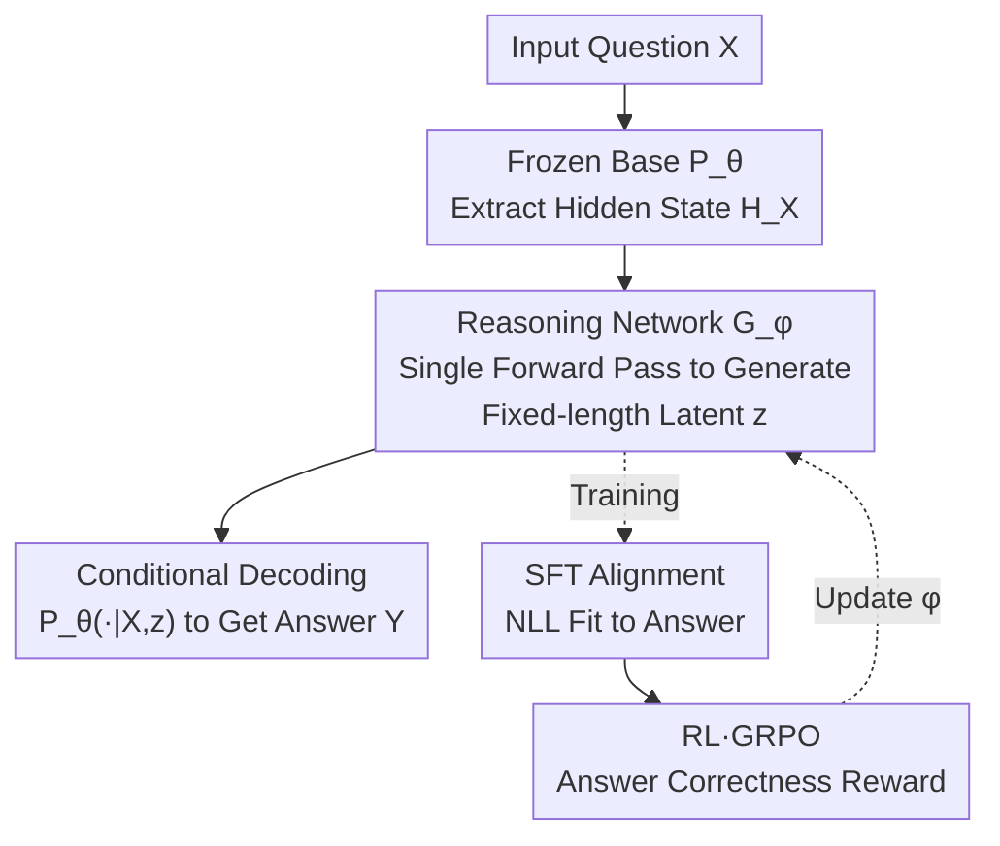

# Rethinking LLM Reasoning: From Explicit Trajectories to Latent Representations

**Conference**: ICLR 2026  
**OpenReview**: [https://openreview.net/forum?id=CbK7lYbmv8](https://openreview.net/forum?id=CbK7lYbmv8)  
**Code**: https://github.com/MobiusDai/LRT  
**Area**: LLM Reasoning  
**Keywords**: Efficient Reasoning, Implicit Reasoning, latent representation, overthinking, reasoning network

## TL;DR
Addressing the "overthinking" problem in slow-thinking reasoning models that generate thousands of tokens, this paper empirically finds that reasoning trajectories are highly redundant (randomly deleting 50% of tokens results in only a 2-point accuracy drop). It proposes Latent Reasoning Tuning (LRT), which uses a lightweight reasoning network $G_\phi$ to map inputs into fixed-length implicit latent reasoning tokens via a **single forward pass**, replacing autoregressive explicit chains. LRT consistently outperforms existing efficient reasoning methods on mathematical and cross-domain benchmarks and surpasses the non-thinking mode of Qwen3.

## Background & Motivation
**Background**: Slow-thinking models like OpenAI o1, DeepSeek-R1, and Qwen-QwQ improve performance on complex tasks by generating long "step-by-step" reasoning trajectories before providing an answer. This capability is acquired through SFT + Reinforcement Learning (e.g., GRPO with rule-based rewards in DeepSeek-R1).

**Limitations of Prior Work**: Trajectory lengths often far exceed the final answer ($k \gg m$ in the paper's notation). Even for simple questions, models generate long chains for backtracking and self-checking, leading to massive inference overhead and latency—known as **overthinking**.

**Key Challenge**: Existing mitigation strategies do not address the root cause. One category involves post-training **trajectory compression** (e.g., ShorterBetter selects the shortest correct samples as rewards; LC-R1 adds length and compression rewards), but these are essentially still "slow thinking"—the model still follows a shortened explicit trajectory, and length rewards might restrict the solving of truly difficult problems. Another category is **directly bypassing reasoning** (e.g., NoThinking prepends a fake thinking block; Qwen3 uses special tokens to force direct answers), which relies on rigid prefilling that leads to vulnerability and potential performance degradation. A common issue is that they either still operate on dense explicit token decoding or use fixed representations for all inputs, failing to optimize for specific cases.

**Key Insight**: The authors first perform a critical empirical analysis: what happens if the reasoning model is fed **fragmented trajectories**? The results show that models are surprisingly robust to noise/missing parts, suggesting that full token-by-token trajectories are not a necessary condition for correct reasoning.

**Core Idea**: Since explicit trajectories are redundant and unnecessary, instead of generating them token-by-token, a learnable reasoning network is used to compute the "reasoning logic" directly into a compact latent representation. The base LLM then produces the answer conditioned on this latent, replacing expensive autoregression with a single forward pass.

## Method

### Overall Architecture
The goal of LRT is to replace "explicit token-by-token reasoning" with "implicit latent reasoning" **without modifying any parameters of the base reasoning LLM**. The pipeline is: the input question $X$ first passes through the frozen base model $P_\theta$ to obtain the final hidden state $H_X$, which is then fed into a lightweight **reasoning network $G_\phi$**. This network outputs fixed-length (e.g., 256) **latent reasoning tokens** $z = G_\phi(H_X)$ in a single forward pass. $z$ acts as a compact substitute for the explicit trajectory $R$ and is concatenated with the input, allowing the base model to autoregressively decode the final answer $Y$ via $P_\theta(\cdot \mid [X, z])$. During inference, thousands of reasoning tokens that originally required token-by-token sampling are replaced by 256 latent tokens computed in one go.

The reasoning network learns to generate effective latents through **two-stage training**: Stage 1 (SFT) aligns the behavior of $G_\phi$ with the base model's explicit reasoning results, and Stage 2 (RL via GRPO) further enhances problem-solving capability using verifiable rewards based on answer correctness. Because the base parameters remain frozen and the design is modular and non-intrusive, the same model can switch seamlessly between latent and explicit reasoning modes, naturally providing a "hybrid reasoning" solution.

### Key Designs

**1. Fragmentary Trajectory Redundancy Analysis: Proving Full Trajectories are Not Essential**

This is the empirical foundation. Addressing the pain point that "everyone assumes reasoning must follow a full explicit chain," the authors conducted a controlled experiment using DeepSeek-R1-Distill-Qwen-7B on MATH-500. Given $X$ and its full trajectory $R$, they constructed **fragmentary trajectories** at two granularities—token-level $R_t(p)$ (randomly deleting tokens with probability $p$) and step-level $R_s(p)$ (randomly deleting sentences/steps). They then evaluated the accuracy of $\hat{Y}\sim P_\theta(\cdot\mid[X,R_t(p)])$. The counter-intuitive results showed that while full trajectories averaged 3529 tokens with 92.8% accuracy, **randomly deleting 30% of tokens resulted in a less than 2-point drop, and 90.6% accuracy was maintained even at 50% deletion**. Two conclusions were drawn: reasoning trajectories contain heavy redundancy, and models possess strong information-filtering capabilities for noisy/fragmented inputs. This finding challenges the implicit assumption of "token-by-token generation" and justifies using latents as substitutes.

**2. Reasoning Network $G_\phi$: Compressing Reasoning into Fixed-length Latents via One Forward Pass**

Targeting the latency of "autoregressive explicit trajectory generation." Under greedy decoding, trajectory generation is deterministic and can be formalized as $R=h(X,\theta)$, leading to the answer distribution $P_\theta(Y\mid[X,h(X,\theta)])$. Since the analysis suggests strict autoregressive constraints are unnecessary, a specialized reasoning network $G_\phi: X \to Z$ is introduced to **bypass explicit generation** and map inputs directly to compact latents $z = G_\phi(X)$. $G_\phi$ uses Qwen3-Embedding-0.6B as a backbone and operates on a vocabulary of 256 **learnable embeddings**. It takes the input hidden state $H_X$ from the base model and outputs fixed-length latent reasoning tokens. Unlike "training a latent reasoner from scratch" or Coconut-style iterative refinement, LRT **adapts an existing explicit reasoning LLM** to utilize latent representations for computation without decoding back to text at every step. It also differs from the fixed prefilling of NoThinking/Qwen3 because these latents are computed by a network and can be optimized.

**3. SFT Phase: Guiding Latents to Reproduce Base Model Answers**

The goal of the first stage is to ensure that the latent trajectory produced by $G_\phi$ can drive the base model to reproduce the answer it would have given after full explicit reasoning. That is, $P_\theta(\cdot\mid[X,G_\phi(X)])$ should approximate $P_\theta(\cdot\mid[X,h(X,\theta)])$. Instead of expensive KD (Knowledge Distillation) via KL divergence, the authors use an efficient SFT approach. The training set $D$ consists of triples $(X_i,R_i,Y_i)$ sampled from the reasoning LLM, but the training objective **only uses** $(X_i,Y_i)$. For each $X_i$, its final hidden state $H_{X_i}$ is used as the context embedding, passed through $G_\phi$ to get the latent, and $\phi$ is optimized using Negative Log-Likelihood:

$$\mathcal{L}(\phi) = -\log f_\theta\big(Y \mid [X, G_\phi(H_X)]\big).$$

This stage is essentially "imitation"—learning to elicit the same answer as explicit reasoning, though its upper bound is limited by the training data quality.

**4. RL Phase: Using GRPO for Reward-based Exploration to Break Imitation Limits**

To surpass the imitation ceiling of SFT and enhance intrinsic problem-solving, the second stage uses RL to refine $G_\phi$ with verifiable rewards for answer correctness. Using the GRPO framework: after computing latent $z$ for an input, $K$ candidate answers are sampled from $P_\theta(\cdot\mid[X,z])$. Rule-based rewards $r_k$ are calculated, group-normalized to obtain advantage $A_k=(r_k-\bar r)/\sigma_r$, and $\phi$ is updated with a clipped policy loss:

$$\mathcal{L}_{\mathrm{GRPO}} = -\frac{1}{K}\sum_{k=1}^{K}\min\Big(\rho_k A_k,\ \mathrm{clip}(\rho_k,1-\epsilon,1+\epsilon)A_k\Big).$$

Unlike SFT "imitation," RL encourages the reasoning network to **explore** more effective trajectories in the latent space that stably produce correct answers. Ablative results show this stage is critical: SFT+RL yields a 13.37-point gain on GSM8K compared to SFT alone.

### Loss & Training
Two-stage serial training: ① SFT using OpenR1-Math-220k with the objective $-\log f_\theta(Y\mid[X,G_\phi(H_X)])$; ② RL using the DeepScaleR-Preview dataset with GRPO clipped policy loss + rule-based rewards. The base $\theta$ remains frozen throughout, with only the reasoning network $\phi$ being updated. The default latent token count is 256 (the optimal point for test-time scaling).

## Key Experimental Results

### Main Results
Models: DeepSeek-R1-Distill-Qwen-1.5B and Qwen3 series. Benchmarks cover in-domain (AMC / MATH-500 / GSM8K) and cross-domain (LSAT / GPQA). The table below compares methods under a 512-token budget (Accuracy %):

| Method | AMC | MATH-500 | GSM8K | LSAT | GPQA | Average |
|------|-----|----------|-------|------|------|------|
| Baseline | 33.25 | 43.15 | 70.00 | 19.02 | 24.24 | 37.93 |
| NoThinking | 37.75 | 58.35 | 73.24 | 18.15 | 23.74 | 42.25 |
| ShorterBetter | 33.87 | 55.11 | 60.78 | 19.05 | 26.23 | 39.01 |
| LC-R1 | 35.75 | 48.00 | 74.26 | 18.59 | 24.24 | 40.17 |
| **Ours (LRT)** | **38.00** | **60.65** | **77.16** | **19.57** | **29.17** | **44.91** |

Under the 512 budget, LRT outperforms NoThinking by 2.16, ShorterBetter by 8.68, and LC-R1 by 5.93 points on average. Comparing with Qwen3 series (converting thinking mode to latent reasoning vs. native non-thinking):

| Model | Metric | base Average | ours Average |
|------|------|-----------|-----------|
| Qwen3-1.7B | pass@1 | 46.93 | 48.42 |
| Qwen3-1.7B | pass@4 | 62.60 | 66.81 |
| Qwen3-4B | pass@1 | 54.07 | 55.04 |
| Qwen3-4B | pass@4 | 65.78 | 71.60 |

The gain in pass@4 is particularly significant, indicating that latent reasoning generates more **diverse** problem-solving paths.

### Ablation Study

| Configuration | Average Accuracy | Note |
|------|-----------|------|
| latent token = 64 | 42.53 | Insufficient information |
| latent token = 128 | 45.04 | — |
| **latent token = 256** | **48.42** | Optimal point (test-time scaling) |
| latent token = 512 | 46.92 | Performance drop; requires more data scale |
| SFT only | 41.29 | Pure imitation capped by data |
| **SFT + RL** | **48.42** | Substantial gain over SFT |

### Key Findings
- **Trajectory redundancy validates the approach**: Deleting 50% of tokens with only a 2-point loss directly proves that "full explicit trajectories are not necessary," providing the fundamental basis for LRT.
- **Latent token count follows test-time scaling but with a saturation point**: Improvement is monotonic from 64 to 256, but performance drops at 512, suggesting larger latent capacities require more training data to be fully utilized.
- **RL stage is the primary driver for gains**: SFT only achieved 41.29, which increased to 48.42 after RL, with a 13.37-point gain on GSM8K alone. This shows pure imitation is insufficient; correctness rewards are needed for exploration.

## Highlights & Insights
- **Robust logic of "Prove then Replace"**: Instead of merely asserting that latents are better, the authors use fragmentary trajectory experiments to falsify the "necessity of full trajectories," making the introduction of latent networks very well-motivated.
- **Non-intrusive, zero modification to base parameters**: By training only a plug-in reasoning network and freezing the base, it allows for free switching between latent and explicit modes, effectively adding a "hybrid reasoning" switch to any explicit reasoning LLM for free.
- **Explicit modeling of "Reasoning" as a function of input**: Formalizing greedy decoding as $R=h(X,\theta)$ provides a clean theoretical justification for approximating a whole trajectory with a single forward pass, a perspective transferable to other autoregressive tasks.

## Limitations & Future Work
- Performance drop at 512 latent tokens is attributed to insufficient training scale, suggesting the method is sensitive to data/compute budget, and "latent scaling" is not yet fully unlocked.
- Experiments focused on 1.5B–4B models and math/logic/science benchmarks; effectiveness on larger models or open-ended tasks (e.g., long-horizon agents, code) remains unverified.
- Latent reasoning sacrifices **interpretability**: The model no longer outputs readable intermediate steps, making debugging and verification of trust more difficult.
- Future directions: Adapting latent token counts based on question difficulty (instead of a fixed 256) or dynamically routing between latent and explicit modes to balance efficiency and performance.

## Related Work & Insights
- **vs. ShorterBetter / LC-R1 (RL Trajectory Compression)**: These use rewards to shorten explicit chains, but the model still follows explicit tokens and remains in "slow thinking" mode. LRT removes autoregressive overhead by using latents computed in one forward pass.
- **vs. NoThinking / Qwen3 Non-thinking (Fixed Prefill)**: These use rigid bypasses or control tokens, applying the same static representation to all inputs. LRT’s latents are calculated per-input and optimized via RL, making them more resilient and higher-performing.
- **vs. Coconut / Recurrent Depth (Latent Reasoning)**: Those works often train latent reasoners from scratch or refine hidden states iteratively. LRT differs by **adapting existing explicit reasoning LLMs**, reusing latent calculations without needing token-by-token decoding, making it lighter and "plug-and-play."

## Rating
- Novelty: ⭐⭐⭐⭐⭐ Uses "explicit trajectory as an input function" as an entry point; single-forward replacement of autoregressive reasoning is novel and well-supported.
- Experimental Thoroughness: ⭐⭐⭐⭐ 5 benchmarks for in-domain/cross-domain, includes ablations on token counts and strategies, though model sizes are small and tasks are concentrated on reasoning.
- Writing Quality: ⭐⭐⭐⭐ Clear narrative of "falsifying assumptions before proposing methods"; complete formulas and algorithms.
- Value: ⭐⭐⭐⭐ Non-intrusive, mode-switchable; holds direct reference value for the implementation of efficient and hybrid reasoning.

<!-- RELATED:START -->

## Related Papers

- [\[ICLR 2026\] The Path of Least Resistance: Guiding LLM Reasoning Trajectories for Efficient Consistency](the_path_of_least_resistance_guiding_llm_reasoning_trajectories_for_efficient_co.md)
- [\[ICLR 2026\] The Path of Least Resistance: Guiding LLM Reasoning Trajectories with Prefix Consensus](the_path_of_least_resistance_guiding_llm_reasoning_trajectories_with_prefix_cons.md)
- [\[ICLR 2026\] ∇-Reasoner: LLM Reasoning via Test-Time Gradient Descent in Latent Space](nabla-reasoner_llm_reasoning_via_test-time_gradient_descent_in_latent_space.md)
- [\[ICLR 2026\] Off-Trajectory Reasoning: Can LLMs Collaborate on Reasoning Trajectories?](off-trajectory_reasoning_can_llms_collaborate_on_reasoning_trajectories.md)
- [\[ICML 2026\] Prioritize the Process, Not Just the Outcome: Rewarding Latent Thought Trajectories Improves Reasoning in Looped Language Models](../../ICML2026/llm_reasoning/prioritize_the_process_not_just_the_outcome_rewarding_latent_thought_trajectorie.md)

<!-- RELATED:END -->
