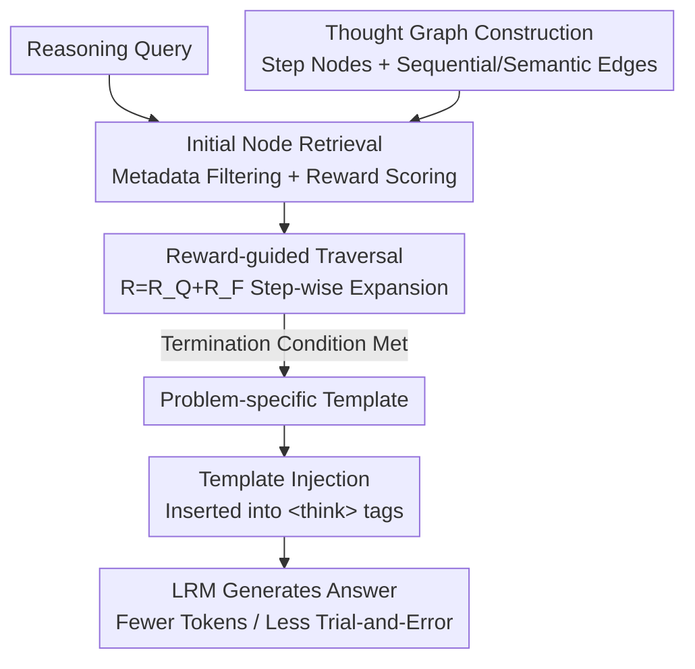

# Retrieval-of-Thought: Efficient Reasoning via Reusing Thoughts

**Conference**: ICLR 2026  
**OpenReview**: [https://openreview.net/forum?id=Wy7NyScKlD](https://openreview.net/forum?id=Wy7NyScKlD)  
**Code**: https://github.com/ahme0599/Retrieval-of-Thought  
**Area**: LLM Reasoning  
**Keywords**: Efficient Reasoning, Thought Reuse, Thought Graph, Retrieval-Augmented, Reasoning Template

## TL;DR
This work decomposes past reasoning processes into reusable "thought steps" stored in a thought graph. During inference, relevant steps are retrieved and dynamically assembled into problem-specific templates guided by rewards. These templates are injected into the `<think>` tag to guide generation, reducing output tokens by up to 40%, latency by 82%, and costs by 59% with almost no loss in accuracy.

## Background & Motivation
**Background**: Large Reasoning Models (LRMs, such as o1, DeepSeek-R1, and Qwen-QwQ) improve accuracy on complex tasks by generating long and fine-grained chains of thought. Current "test-time scaling" approaches—such as Best-of-N, beam search, MCTS, and GRPO—essentially encourage the model to generate more tokens to simulate deliberate thinking.

**Limitations of Prior Work**: Longer outputs impose two direct costs. First, tokens must be decoded serially; longer outputs lead to higher latency. Second, API providers typically price output tokens at 2–5 times the rate of input tokens, making the cost prohibitive at scale. Thus, a sharp trade-off exists between "thinking more accurately" and "thinking more efficiently."

**Key Challenge**: Existing retrieval-based reasoning methods (e.g., Buffer of Thought, SuperCorrect, RAT) attempt to save tokens by reusing "historical reasoning templates." However, they rely on **static templates fixed before generation**—where one template corresponds to a problem category—failing to dismantle and reassemble new reasoning paths on the fly. In contrast, human problem-solving involves "connecting the dots," reconfiguring fragments of past solutions into new pipelines. Static templates lack this **dynamic assembly** capability.

**Goal**: Equip LRMs with a **fine-grained memory of thought steps** and enable them to **dynamically synthesize** templates tailored to the current problem rather than applying fixed scaffolds.

**Key Insight**: The authors support this approach with three observations (Fig. 2). **O1**: Reasoning steps in the same domain (e.g., AIME/AMC math problems) are highly repetitive, with frequent algebraic transformations and simplification patterns. **O2**: Retrieving from a vector database is significantly faster than model generation (0.02s vs. 0.343s, a ~17× difference). **O3**: Providing a model with a correct reasoning path for a similar problem allows it to solve new problems using fewer tokens.

**Core Idea**: Replace "exploration from scratch" with "retrieval and recombination of existing thought steps" into dynamic templates, shifting redundant trial-and-error paths to a low-cost graph retrieval.

## Method

### Overall Architecture
The goal of RoT is as follows: given a reasoning query, instead of allowing the model to engage in repeated trials from zero, it first retrieves relevant reasoning steps from a pre-built thought graph. It then uses reward-guided traversal to assemble these into a **problem-specific reasoning template**. This template is injected into the `<think>` tag as an "anchor" to guide generation, thereby eliminating redundant path switching and reducing output tokens.

The pipeline consists of **offline graph construction** and a **three-step online process**. The offline phase decomposes 3.34k reasoning templates into step nodes to form a Thought Graph (one-time construction). The online phase executes for each query: ① Initial node retrieval → ② Reward-guided traversal to expand the template → ③ Template injection. These match the four key designs below.

### Key Designs

**1. Thought Graph: Decomposing Reasoning into Reusable Step Nodes**

To address the limitation that static templates cannot be recombined, RoT stores reasoning trajectories at a **single-step granularity** as graph nodes, allowing steps to be spliced across templates. The graph is a directed, weighted, non-connected multigraph $G=(V, E_{\text{Sequential}} \cup E_{\text{Semantic}}, w)$. Each node $(t,i)$ represents the $i$-th step of template $t$. Two types of edges are used: **Sequential edges** connect adjacent steps $(t,i) \to (t,i+1)$ within the same template to preserve logical flow; **Semantic edges** connect similar steps across templates bidirectionally when the normalized embedding similarity $g_{\text{sim}}(u_{t,i}, u_{t',j}) \geq \tau$ ($\tau=0.85$). Similarity is calculated using $\ell_2$-normalized cosine product and linearly scaled to $[0, 1]$: $g_{\text{sim}}(a,b)=\frac{\text{sim}(a,b)+1}{2}$. Sequential edge weights are constant at 1, while semantic edges use $g_{\text{sim}}$. This enables the model to "connect the dots" along semantic edges to form new paths.

**2. Initial Node Retrieval: Metadata Filtering followed by Reward-based Entry Selection**

Building a template starts with selecting an appropriate "entry node." RoT uses multi-level filtering and scoring. **Filtering** narrows the search space using metadata: nodes must match the problem category (e.g., Algebra/Geometry) and domain concepts (e.g., Calculus, Number Theory). **Scoring** selects the optimal entry using a reward that balances semantic relevance and structural validity:

$$R_{\text{Initial}} = \alpha \cdot R_Q + (1-\alpha) \cdot R_S$$

where $R_Q$ is the cosine similarity between the query and the node embedding, and $R_S$ is a structural indicator—1 if the node is step 0 ($i=0$) of a template, and 0 otherwise. With $\alpha=0.8$, the system prioritizes semantic relevance while preferring valid starting points.

**3. Reward-guided Traversal: Iterative Splicing Guided by Cumulative Reward**

Once an entry is selected, the template is expanded iteratively. Each step evaluates the neighbors of the current node using a reward that balances semantic alignment and sequential flow:

$$R = R_Q + R_F$$

$R_Q$ measures semantic relevance to the query, and $R_F$ is the flow reward—1 if the candidate forms a sequential edge $((t,i), (t,i+1)) \in E_{\text{Sequential}}$ with the current node, and 0 otherwise. **Termination** occurs when $\max(R) < \tau$ (no relevant candidates), length $l_{\text{Template}} \geq l_{\max}$ ($l_{\max}=8$), or no valid candidates remain. This ensures templates remain concise and relevant.

**4. `<think>` Tag Injection: Ensuring Model Adherence**

The challenge is ensuring the model **actually follows** the template during its internal deliberation. Since LRMs often ignore explicit instructions, RoT adopts "Thinking Intervention," injecting the template directly inside the `<think>` and `</think>` tags. Crucially, this requires **no fine-tuning**, avoiding catastrophic forgetting while effectively "anchoring" the model's internal reasoning space.

## Key Experimental Results

### Main Results
Evaluations were conducted on four math reasoning benchmarks (AIME 2023/2024/2025, AMC 2023) using the Qwen3 family (0.6B–14B). RoT+TI consistently falls in the "High Accuracy + Low Token" Pareto-efficient region, maintaining accuracy comparable to CoT while significantly reducing tokens.

| Model | Method | Accuracy | Output Tokens | Function |
|-------|--------|----------|---------------|----------|
| Qwen3-1.7B | CoT | ~46% | ~11.0k | Baseline |
| Qwen3-1.7B | RoT+TI | ~44% | ~8.0k | Accuracy near-parity, ~3k tokens saved |
| Qwen3-4B | CoT | ~74% | ~9.9k | Baseline |
| Qwen3-4B | RoT+TI | ~72% | ~9.1k | Accuracy near-parity, ~800 tokens saved |
| Qwen3-8B | RAG | ~80% | ~10.1k | Static template baseline |
| Qwen3-8B | RoT+TI | ~83% | ~9.6k | Higher accuracy and more efficient |

**Cost & Latency**: RoT+TI shows the largest gains on smaller models. For Qwen3-0.6B, costs dropped by **59.0%** and latency by **72.9%**. For 14B models, gains were smaller but remained positive (8.5% cost/latency reduction).

### Ablation Study

| Configuration / Analysis | Key Metric | Description |
|--------------------------|------------|-------------|
| Bare RoT vs RoT+TI | Token Savings | Injection in `<think>` significantly increases token savings. |
| Graph Size (0.9k vs 3.34k) | Qwen3-8B Acc +17.0% | Larger graphs lead to higher accuracy; strong scalability. |
| Path Switches (CoT vs RoT+TI) | Up to −81.8% | RoT+TI anchors the model to good paths, reducing trial-and-error. |
| Cross-Model Families | Pareto Efficient | Generalizes to DLER-7B and DS-R1-L8B. |
| Cross-Domain (GPQA) | Tokens saved ~80% | Abstract reasoning structures can be reused beyond math. |
| Memory Overhead | 1.7GB (~4.3%) | Global graph + embeddings are negligible compared to KV cache. |

### Key Findings
- **Path switching reduction is the mechanism**: RoT+TI reduces "path switching" (detected by transitions like "however" or "alternatively") by up to 81.8%. The template acts as an anchor, preventing the model from wandering into redundant trials.
- **Smaller models benefit more**: Smaller models retain better instruction-following capabilities (fewer GRPO rounds), making them more compliant with templates.
- **Abstract operations over specific values**: Nodes encode operations like "perform substitution" rather than hardcoded constants, ensuring robustness against problem variants with different numerical values.

## Highlights & Insights
- **From Paragraphs to Steps**: RoT's core novelty is reducing the granularity of "templates" to thought steps, enabling the "recombination" of paths that did not exist in the original database.
- **Hybrid Graph Encoding**: Using sequential edges for logic and semantic edges for cross-template transfer, balanced by a simple reward function $R=R_Q+R_F$.
- **Zero-Training Deployment**: Achieving template adherence through `<think>` tag injection avoids the cost and risks of fine-tuning.
- **Efficiency via "Anchoring"**: The demonstration that savings come from reduced path switching rather than quality compression is a strong mechanism-level argument.

## Limitations & Future Work
- **Dependency on Metadata**: Initial retrieval relies on category labels (Algebra/Geometry). While these can be automated with small encoders, the prototype used manual labels.
- **Diminishing Returns on Scale**: Gains are lower on 14B+ models because highly specialized reasoning models sometimes exhibit lower adherence to external templates.
- **Domain Density**: Benefits are highest when problem steps are repetitive. In sparse or highly unique domains, the graph's utility may decrease.

## Related Work & Insights
- **vs. BoT / SuperCorrect / RAT**: These use static, pre-generation segments. RoT uses dynamic, step-wise assembly, making it more flexible.
- **vs. CoT-SC / MCTS / GRPO**: These increase accuracy by generating *more* tokens. RoT is orthogonal—it can serve as a retrieval layer to make these expensive scaling methods more efficient.
- **vs. Thinking Intervention (TI)**: RoT utilizes the TI mechanism but replaces human-written instructions with dynamically retrieved thought templates.

## Rating
- Novelty: ⭐⭐⭐⭐
- Experimental Thoroughness: ⭐⭐⭐⭐
- Writing Quality: ⭐⭐⭐⭐
- Value: ⭐⭐⭐⭐

<!-- RELATED:START -->

## Related Papers

- [\[ICLR 2026\] RL of Thoughts: Navigating LLM Reasoning with Inference-Time Reinforcement Learning](rl_of_thoughts_navigating_llm_reasoning_with_inference-time_reinforcement_learni.md)
- [\[ICLR 2026\] Evoking User Memory: Personalizing LLM via Recollection-Familiarity Adaptive Retrieval](evoking_user_memory_personalizing_llm_via_recollection-familiarity_adaptive_retr.md)
- [\[ICLR 2026\] PEAR: Phase Entropy Aware Reward for Efficient Reasoning](pear_phase_entropy_aware_reward_for_efficient_reasoning.md)
- [\[ICLR 2026\] FROST: Filtering Reasoning Outliers with Attention for Efficient Reasoning](frost_filtering_reasoning_outliers_with_attention_for_efficient_reasoning.md)
- [\[ICLR 2026\] Thinking-Free Policy Initialization Makes Distilled Reasoning Models More Effective and Efficient Reasoners](thinking-free_policy_initialization_makes_distilled_reasoning_models_more_effect.md)

<!-- RELATED:END -->
