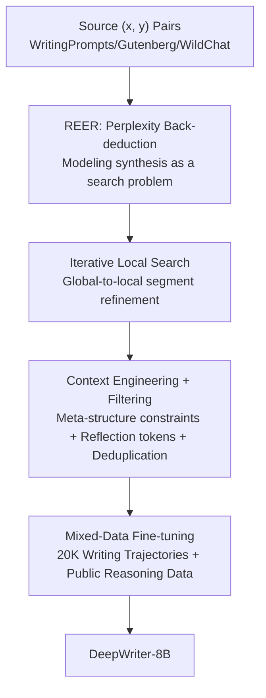

# Reverse-Engineered Reasoning for Open-Ended Generation

**Conference**: ICLR 2026  
**OpenReview**: [https://openreview.net/forum?id=aK9JneKTL8](https://openreview.net/forum?id=aK9JneKTL8)  
**Code**: To be confirmed (DeepWriting-20K dataset and DeepWriter-8B model have been open-sourced)  
**Area**: LLM Reasoning  
**Keywords**: Deep Reasoning, Open-Ended Generation, Reverse-Engineered Reasoning, Perplexity Search, Chain-of-Thought Data Synthesis

## TL;DR
To address the challenge that "deep reasoning is difficult to implement in open-ended creative tasks," this paper proposes REER (Reverse-Engineered Reasoning). Instead of forward-constructing reasoning processes through Reinforcement Learning (RL) trial-and-error or distillation, it "back-deduces" implicit chains of thought (CoT) from existing high-quality answers. Using perplexity as a quality proxy and gradient-free local search, it synthesizes 20,000 deep reasoning trajectories (DeepWriting-20K). The resulting 8B model, DeepWriter, matches or exceeds GPT-4o and Claude 3.5 on writing benchmarks.

## Background & Motivation

**Background**: The "deep reasoning" paradigm (long-chain thinking before answering), represented by o1 and DeepSeek-R1, has achieved significant success in **verifiable** domains such as mathematics and coding. The core driver is RL—clear correct/incorrect reward signals allow models to search efficiently within a vast solution space.

**Limitations of Prior Work**: This approach falters in open-ended creation (e.g., writing stories, papers, or marketing copy). Creative writing lacks a unique standard answer; quality is judged by **subjective** criteria like originality, emotional resonance, and narrative coherence. Two mainstream "teaching reasoning" paths fail here: RL lacks clear reward signals (and training a reward model to approximate human preference is extremely difficult and inefficient); instruction distillation is prohibitively expensive and restricted by the performance ceiling of the teacher model.

**Key Challenge**: Teaching models to "think deeply" requires large volumes of high-quality reasoning trajectory data, which is extremely scarce in open-ended tasks. Forward construction via RL trial-and-error is inefficient, and instance-by-instance distillation is too costly.

**Goal**: To find a third path—bypassing both RL sample inefficiency and distillation cost—to inject deep reasoning capabilities into models for open-ended generation without task verifiability.

**Key Insight**: The authors pose a reverse question: "Given a well-written output, what would the most coherent, logical thinking process look like?" Since high-quality answers already exist (massive volumes of good stories and articles online), chains of thought should not be "created" but "mined" by back-deducing the process from result.

**Core Idea**: Redefine "teaching reasoning" as "reverse-engineering reasoning." Use the perplexity of a reference answer as a proxy for reasoning quality and apply gradient-free search to back-deduce implicit chains of thought from known high-quality outputs, enabling the scalable synthesis of deep reasoning training data.

## Method

### Overall Architecture

The REER pipeline consists of three stages: "answer acquisition, reasoning chain back-deduction, and mixed fine-tuning." Given a query $x$ (e.g., a writing prompt) and a high-quality reference answer $y$ (e.g., a short story), the goal is to find a deep reasoning trajectory $z$ that best "explains" why $y$ was generated. The quality of this explanation is measured by the generator LLM's perplexity of $y$, denoted as $\mathrm{PPL}(y\mid x, z)$: lower perplexity indicates the reasoning chain makes the good answer appear more natural and logical. Thus, synthesizing trajectories becomes a search problem:

$$z^* = \arg\min_{z \in \mathcal{Z}} \mathrm{PPL}(y \mid x, z)$$

Due to the massive solution space and non-differentiable objective, the authors use **gradient-free iterative local search** to approximate $z^*$: an initial coarse reasoning chain is generated and then refined segment-by-segment, using the perplexity signal to select superior fragments until the perplexity falls below a threshold. The searched $(x, z^*, y)$ triplets are filtered and mixed with public math/code reasoning data to fine-tune a base model, internalizing the "think before answering" behavior.

### Key Designs

**1. REER: Back-deducing implicit reasoning chains via reference answer perplexity**

This design addresses the core pain point of lacking verifiable rewards in open-ended domains. Rather than evaluating whether an output is "correct," REER asks "How well does this reasoning chain explain this known good answer?" It uses $\mathrm{PPL}(y\mid x,z)$ as a proxy: if a model finds writing $y$ natural and highly probable given reasoning chain $z$, then $z$ is a high-quality plan. This transforms the synthesis of reasoning data into a search problem with a clear objective function (minimizing perplexity), bypassing reward models and distillation.

**2. Iterative Local Search: Global-to-local segment refinement**

Since searching the entire trajectory space $z^*$ is intractable, a gradient-free iterative local search is designed. It begins with a "heuristic prompt" to generate an initial coarse reasoning chain $z^{(0)}=[z_1,\dots,z_n]$. During refinement, one segment $z_i$ is selected; the LLM generates candidate fragments given the context (query $x$, reference $y$, refined prefix $z^*_{<i}$, and original suffix $z_{>i}$). Each candidate $c$ is evaluated by the perplexity $S(c)=\mathrm{PPL}(y\mid x, z'_{\text{cand}})$, and the fragment with the lowest perplexity is selected:

$$z_i^* = \arg\min_{c \in C_i \cup \{z_i\}} \mathrm{PPL}(y \mid x, z'_{\text{cand}})$$

Retaining the original segment $z_i$ in the candidate set ensures monotonic decrease in perplexity. The process stops when perplexity falls below a threshold (0.25) or reaches a maximum of 10 steps. This "global-to-local" approach differs from MCTS by using the full reference answer perplexity as a proxy (avoiding expensive rollouts) and starting from a global plan rather than building incrementally from a local state.

**3. Context Engineering + Heuristic Filtering: Ensuring human-like and stable trajectories**

The synthesis quality depends on the generator's instructions and post-hoc filtering. **Context Engineering** uses meta-structure constraints to force segmented editing, ensuring the model only modifies the target fragment. It also injects human-like thinking patterns by explicitly encouraging markers of cognitive exploration and self-correction (e.g., "Hmm... perhaps I should...", "Wait, that's too direct..."). **Heuristic Filtering** includes an ending filter to discard trajectories that "think" indefinitely without concluding, and a repetition filter using n-gram frequency to remove samples with repetitive circular logic.

**4. Mixed-Data Fine-tuning: Avoiding catastrophic forgetting**

Training solely on domain-specific data can damage the model's general knowledge priors. The authors mix the 20,000 synthetic open-ended writing trajectories with public OpenThoughts data (covering math, code, and science) to create a training set of approximately 37,000 samples. Each $(x, z^*, y)$ triplet is formatted to specifically teach the model to "reason deeply before producing the final answer," maintaining broad knowledge while specializing in open-ended reasoning.

## Key Experimental Results

The base model is Qwen3-8B-Base. The generator for trajectory synthesis is Qwen2.5-32B-Instruct. Fine-tuning was performed for 3 epochs with a learning rate of $2\times10^{-5}$ and a global batch size of 96. Evaluation used LongBench-Write (LB), HelloBench (HB-A/B), and WritingBench (WB).

### Main Results

| Model | LB | HB-A | HB-B | WB-A | WB-D | WB-F |
|------|------|------|------|------|------|------|
| GPT-4o | 83.1 | 83.7 | 87.6 | 74.4 | 77.9 | 78.0 |
| Claude 3.5 | 89.3 | 82.9 | 88.3 | 59.1 | 59.3 | 67.7 |
| Claude 3.7 | 97.8 | 83.9 | 93.2 | 78.2 | 79.3 | 80.8 |
| Qwen3-8B | 85.2 | 81.4 | 85.3 | 68.7 | 67.2 | 71.3 |
| LongWriter-8B | 76.5 | 80.1 | 82.6 | 57.9 | 52.0 | 52.0 |
| **DeepWriter-8B** | **91.3** | **82.6** | **87.4** | **72.2** | **70.6** | **72.3** |

DeepWriter-8B significantly outperforms LongWriter-8B in all WritingBench domains (averaging >18 points higher). In creative tasks (HB-B), it is statistically on par with GPT-4o (87.6) and Claude 3.5 (88.3). Notably, on LongBench-Write, it scores 91.3, surpassing GPT-4o (83.1), suggesting that structured reasoning chains provide a strong inductive bias for long-range coherence.

### Ablation Study

| Configuration | HB-B | WB-A | WB-D | Description |
|------|------|------|------|------|
| DeepWriter-8B (Full) | 87.5 | 72.2 | 70.6 | Full model |
| − Remove synthetic data | 73.7 | 63.4 | 57.7 | Public reasoning data only |
| − Remove iterative search | 84.4 | 66.7 | 65.6 | Use $z^{(0)}$ instead of $z^*$ |
| − Remove reflection tokens | 82.8 | 71.6 | 62.0 | Remove Hmm/Wait markers |
| − Downsample long trajectories | 84.0 | 69.6 | 67.5 | Professional writing suffers |
| − Downsample short trajectories | 82.1 | 70.8 | 66.9 | Creative tasks suffer |

### Key Findings
- **Synthetic data is the primary contributor**: Removing the 20,000 synthetic trajectories caused the largest drop in performance, confirming that structured trajectories tailored for open-ended domains are critical.
- **Iterative refinement is valuable**: Replacing $z^*$ with unrefined $z^{(0)}$ lowered WB-A scores from 72.2 to 66.7, proving that perplexity-guided search discovers superior reasoning paths.
- **Reflection tokens are crucial for artistic creation**: Removing these tokens caused a massive drop in the Literature and Art domain (WB-D) from 70.6 to 62.0, indicating their importance for flexibility and creativity.
- **Trajectory length preference is task-dependent**: Longer trajectories benefit professional writing requiring multi-step planning, while shorter trajectories are better suited for creative inspiration.
- **Literary data has spillover effects**: Removing literary data reduced performance across all benchmarks, suggesting that training on creative narrative tasks improves the model's general ability to handle structure and nuance.

## Highlights & Insights
- **"Perplexity as a quality proxy" is a crucial insight**: In domains without ground truth, translating "reasoning quality" into "how well it explains a known good answer" creates an unsupervised search objective without needing reward models.
- **"Reverse-engineering" bypasses the distillation ceiling**: Unlike traditional distillation capped by the teacher model's capability, REER learns logic from high-quality human outputs, offering a higher performance ceiling at a lower cost.
- **Global-to-local search is robust**: Starting from a global plan and refining locally while ensuring monotonic perplexity improvement avoids the high cost of MCTS and is highly scalable.

## Limitations & Future Work
- **Dependence on high-quality $(x,y)$ pairs**: The method requires a large volume of existing good answers; performance may be limited in niche fields where such data is scarce.
- **Potential bias in the perplexity proxy**: Using an LLM's perplexity may favor expressions predictable to that specific model rather than "optimal" human reasoning.
- **Reliance on LLM judges**: Benchmarks like LB/WB rely on Claude or GPT-4o for scoring; subjective evaluation biases and reproducibility issues remain concerns.

## Related Work & Insights
- **vs. Reinforcement Learning (e.g., WritingZero)**: RL attempts to train reward models to approximate subjective quality, which is inefficient. REER uses perplexity and search to bypass reward modeling entirely.
- **vs. Instruction Distillation**: Distillation is limited by teacher capabilities; REER reverse-engineers human excellence, making it more scalable and potentially superior.
- **vs. MCTS / Self-Refinement**: MCTS relies on expensive rollouts; REER uses reference answer perplexity for global-to-local refinement, which is more suitable for large-scale synthesis.

## Rating
- Novelty: ⭐⭐⭐⭐⭐ 
- Experimental Thoroughness: ⭐⭐⭐⭐ 
- Writing Quality: ⭐⭐⭐⭐⭐ 
- Value: ⭐⭐⭐⭐⭐ 

<!-- RELATED:START -->

## Related Papers

- [\[ICLR 2026\] ShinkaEvolve: Towards Open-Ended and Sample-Efficient Program Evolution](shinkaevolve_towards_open-ended_and_sample-efficient_program_evolution.md)
- [\[ICLR 2026\] Think in Parallel, Answer as One: Logit Averaging for Open-Ended Reasoning](think_in_parallel_answer_as_one_logit_averaging_for_open-ended_reasoning.md)
- [\[ICLR 2026\] MetaMuse: Algorithm Generation via Creative Ideation](metamuse_algorithm_generation_via_creative_ideation.md)
- [\[ICLR 2026\] Log-Augmented Generation: Scaling Test-Time Reasoning with Reusable Computation](log-augmented_generation_scaling_test-time_reasoning_with_reusable_computation.md)
- [\[ICLR 2026\] Unleashing Scientific Reasoning for Bio-Experimental Protocol Generation via Structured Component-based Reward Mechanism](unleashing_scientific_reasoning_for_bio-experimental_protocol_generation_via_str.md)

<!-- RELATED:END -->
