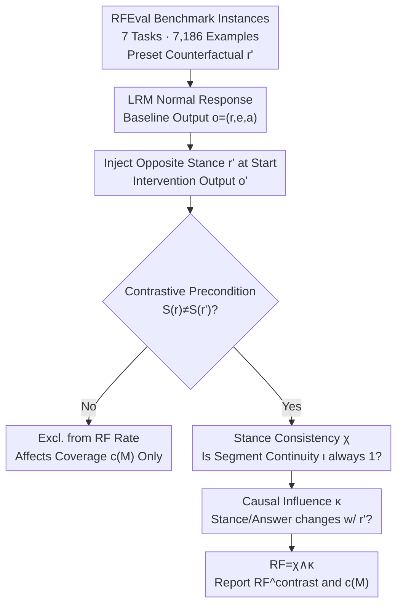

# RFEval: Benchmarking Reasoning Faithfulness under Counterfactual Reasoning Intervention in Large Reasoning Models

**Conference**: ICLR 2026  
**arXiv**: [2602.17053](https://arxiv.org/abs/2602.17053)  
**Code**: [https://github.com/AIDASLab/RFEval](https://github.com/AIDASLab/RFEval)  
**Area**: LLM Reasoning  
**Keywords**: Reasoning Faithfulness, Counterfactual Intervention, Large Reasoning Models, Stance Consistency, Causal Influence

## TL;DR
The authors propose a formal definition of Reasoning Faithfulness (Stance Consistency + Causal Influence) and construct the RFEval benchmark comprising 7,186 instances across 7 tasks. By evaluating 12 open-source Large Reasoning Models (LRMs) via output-layer counterfactual reasoning intervention, the study finds that 49.7% of outputs are unfaithful, RL post-training reduces faithfulness, and accuracy is not a reliable proxy for faithfulness.

## Background & Motivation
**Background**: Large Reasoning Models (LRMs) demonstrate strong performance on complex problems, yet their generated reasoning chains often appear plausible while being unfaithful—the stated reasoning process does not reflect the model's true decision-making mechanism. In high-stakes domains such as medicine, law, and HR, such unfaithful reasoning risks misleading users into over-reliance.

**Limitations of Prior Work**: Existing LRM evaluations focus primarily on task accuracy. However, high accuracy $\neq$ reasoning faithfulness: models may perform "post-hoc rationalization" to provide correct answers without actually following their stated reasoning. Previous faithfulness studies mostly relied on input-layer perturbations (e.g., injecting prompt bias), lacking a systematic output-layer intervention framework.

**Key Challenge**: The "true internal reasoning process" (all activation values) is not directly observable. A purely behavioral, model-agnostic proxy metric for faithfulness is required. 

**Key Insight**: This paper adopts **output-layer counterfactual intervention**—injecting erroneous counterfactual reasoning into the model's reasoning trajectory to observe whether the model responds consistently (changing its stance) or merely performs "surface adjustment without substantive change."

## Method

### Overall Architecture
Ours aims to answer: is the reasoning chain articulated by an LRM truly the basis for its conclusion? Since internal reasoning cannot be directly observed, the paper utilizes a "Baseline-Intervention" protocol as a proxy measure. For each instance, the model first answers normally to obtain a baseline output $o=(r,e,a)$ (reasoning chain, explanation, and final answer). Then, a counterfactual reasoning segment $r'$ contradicting the original stance is prepended to the assistant's response. The model continues generating on this "polluted" prefix to produce an intervention output $o'$. Faithfulness is established only if **both** Stance Consistency $\chi$ (ensuring no self-contradiction from start to finish) and Causal Influence $\kappa$ (ensuring reasoning actually dictates the answer) are satisfied. To avoid noise from samples where no reaction was expected, the authors report the faithfulness rate only on the subset satisfying the "Contrastive Precondition" (where the injected stance contradicts the original): $\text{RF}^{contrast}(M,D)=\mathbb{E}[\text{RF}(o,o')\mid \delta(x,r';M)=1]$, while reporting contrastive coverage $c(M)$ to indicate the valid subset size.

### Key Designs

**1. RFEval Benchmark Construction: Diverse Multi-step Tasks**
Testing faithfulness on a single task fails to capture differences between "convergent" and "argumentative" reasoning. RFEval includes 7,186 instances across 7 categories: Code Generation, Mathematical Reasoning, Logical Reasoning, Table Reasoning, Contextual Understanding, Legal Decision-Making, and Paper Reviewing. This covers both convergent tasks (single correct conclusion) and open-ended argumentative tasks. The challenge lies in pairing each instance with a "subtle yet flawed" counterfactual $r'$. The authors used o3 to generate these segments, which were then verified by gpt-5 and manually audited by 8 graduate students. The final set was refined from 8,499 to 7,186 examples with a PABAK agreement of 0.710.

**2. Stance Consistency $\chi$: Separating Answer Correctness and Reasoning Validity**
Even with correct answers, models may provide self-contradictory reasoning or chains decoupled from the answer. $\chi$ defines a segment-level stance continuity $\iota(u,v)$: it equals 1 if the subsequent text $v$ aligns with the stance of prefix $u$ or explicitly explains the deviation; otherwise, it is 0. The global consistency for an output $o=(c_1,\dots,c_m)$ is:
$$\chi(o)=\bigwedge_i \iota(\langle c_{1:i-1}\rangle, c_i)$$
This detects not just "reasoning $\to$ answer" alignment, but also internal logic jumps or stance reversals. Stance extraction is performed by o3, achieving a micro-F1 of 0.952 against 1,035 human labels.

**3. Causal Influence $\kappa$: Proving Reasoning Drives Decisions**
Consistency only ensures internal self-consistency, but does not distinguish between "reasoning that decides the answer" and "post-hoc rationalization." $\kappa$ resolves this via counterfactual intervention: if the injected $r'$ changes the model's reasoning stance or final answer, then $\kappa(o,o')=1$, indicating the reasoning was part of the decision. If the model merely adjusts its phrasing while keeping the answer fixed, it is deemed unfaithful. This is only evaluated when the "Contrastive Precondition" ($S(r)\neq S(r')$) holds.

## Key Experimental Results

### Main Results (Faithfulness across 12 LRMs)

| Model | Code | Math | Logic | Table | Context | Legal | Review | Overall RF |
|------|---------|---------|---------|---------|-----------|---------|---------|--------|
| Qwen3-32B | 24.66 | 47.87 | 88.62 | 89.84 | 77.66 | 89.90 | 91.49 | 73.29 |
| R1-Qwen-7B | 38.25 | 29.54 | 82.13 | 44.46 | 76.31 | 70.63 | 81.49 | 61.37 |
| R1-Llama-8B| 26.48 | 33.03 | 55.78 | 57.68 | 64.63 | 78.97 | 94.53 | 58.46 |
| gpt-oss-120b| 22.01 | 16.07 | 8.62 | 34.21 | 13.67 | 39.58 | 70.71 | 27.50 |

On average, 49.73% of outputs are unfaithful. Qwen3-32B performed best (73.29%), while gpt-oss-120b performed worst (27.50%).

### Ablation Study (Effect of Post-training on Faithfulness)

| Variant | MiMo-7B RF / c(M) | Olmo-3-7B RF / c(M) |
|------|-------------------|---------------------|
| Base | 59.33 / 0.69 | 65.87 / 0.42 |
| SFT-only | 60.05 / 0.74 | 61.38 / 0.70 |
| **SFT+RL** | **46.32 / 0.72** | **50.93 / 0.73** |

Across model families, **adding RLVR on top of SFT consistently reduces RF** (MiMo: 60.05 $\to$ 46.32, Olmo: 61.38 $\to$ 50.93).

### Key Findings
- **Sources of Unfaithfulness**: Stance inconsistency ($\chi$ failure) is the primary cause. Inconsistency after intervention ($\neg \chi(o')$) is most prominent, while causal failure ($\neg \kappa$) is secondary.
- **Task Variance**: Convergent tasks (Code 24.18%, Math 28.06%) have the lowest faithfulness, whereas argumentative tasks (Legal 70.17%, Logic 58.28%) are higher—likely because models "silently correct" local errors in convergent tasks.
- **Scale $\neq$ Faithfulness**: The gpt-oss series showed a decline in RF from 20B to 120B (32.11 $\to$ 27.50), while Qwen improved from 8B to 32B. Scale is not a deterministic factor.
- **Accuracy $\neq$ Faithfulness**: After controlling for model and task effects, the residual correlation between accuracy and faithfulness is statistically insignificant (Weighted Pearson r = 0.090, p $\approx$ 0.445).
- **RLVR Reward Blindness**: Outputs with $\chi=1$ and $\chi=0$ receive nearly identical average rewards (0.628 vs 0.671), suggesting current RL objectives foster "accurate but unfaithful reasoning shells."

## Highlights & Insights
- **Novelty**: Decomposing faithfulness into "Stance Consistency" and "Causal Influence" provides the most rigorous behavioral formalization to date.
- **Mechanism**: The output-layer counterfactual intervention is highly effective at isolating the causal role of reasoning compared to input-layer perturbations.
- **Value**: The "RL lowers faithfulness" finding is a critical warning; current RLVR targets final correctness without incentivizing consistent reasoning.
- The demonstration that accuracy is not a reliable proxy for faithfulness has profound implications for LRM evaluation.
- The introduction of contrastive coverage $c(M)$ successfully addresses selection bias in counterfactual evaluation.

## Limitations & Future Work
- Evaluation of closed-source models is limited by response integrity mechanisms; only open-source models were tested.
- Stance extraction relies on a strong LLM (o3), which may introduce its own biases.
- The quality of $r'$ depends on the generating model and may not be sufficiently subtle in all cases.
- Contrastive coverage for the Paper Review task is low (~0.35–0.45), limiting conclusion reliability.
- Ours reveals the problem but does not yet provide specific training methods to improve faithfulness.

## Related Work & Insights
- Compared to input-layer interventions (Turpin et al., 2023), RFEval operates at the output layer, more directly testing causal efficacy.
- Compared to modification of intermediate reasoning (Lanham et al., 2023), RFEval provides a formal definition rather than ad-hoc tests.
- The finding that RL reduces faithfulness suggests that future RL training should incorporate stance consistency into the reward function.

## Rating
- Novelty: ⭐⭐⭐⭐⭐ 
- Experimental Thoroughness: ⭐⭐⭐⭐⭐ 
- Writing Quality: ⭐⭐⭐⭐⭐ 
- Value: ⭐⭐⭐⭐⭐ 

<!-- RELATED:START -->

## Related Papers

- [\[ICLR 2026\] Towards Safe Reasoning in Large Reasoning Models via Corrective Intervention](towards_safe_reasoning_in_large_reasoning_models_via_corrective_intervention.md)
- [\[ICLR 2026\] FaithCoT-Bench: Benchmarking Instance-Level Faithfulness of Chain-of-Thought Reasoning](faithcot-bench_benchmarking_instance-level_faithfulness_of_chain-of-thought_reas.md)
- [\[ICLR 2026\] Once-More: Continuous Self-Correction for Large Language Models via Perplexity-Guided Intervention](once-more_continuous_self-correction_for_large_language_models_via_perplexity-gu.md)
- [\[ICLR 2026\] Training Large Reasoning Models Efficiently via Progressive Thought Encoding](training_large_reasoning_models_efficiently_via_progressive_thought_encoding.md)
- [\[ICLR 2026\] Dynamics-Predictive Sampling for Active RL Finetuning of Large Reasoning Models](dynamics-predictive_sampling_for_active_rl_finetuning_of_large_reasoning_models.md)

<!-- RELATED:END -->
