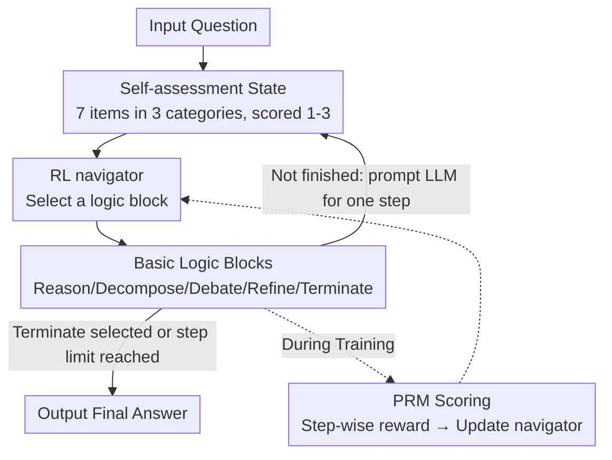

# RL of Thoughts: Navigating LLM Reasoning with Inference-Time Reinforcement Learning

**Conference**: ICLR 2026  
**OpenReview**: [https://openreview.net/forum?id=Dw034qKrP5](https://openreview.net/forum?id=Dw034qKrP5)  
**Code**: https://github.com/tsinghua-fib-lab/RL-LLM-Reasoning  
**Area**: LLM Reasoning  
**Keywords**: Inference-time enhancement, logical structure, reinforcement learning, process reward model, transferability

## TL;DR
RLoT models the multi-step reasoning of LLMs as a Markov Decision Process (MDP), training a "navigator" with fewer than $3\text{K}$ parameters using reinforcement learning. This navigator dynamically selects and concatenates five cognitively-inspired "basic logic blocks" based on the current state during inference to generate a task-specific logical structure on the fly. It achieves a maximum Gain of $13.4\%$ on benchmarks such as AIME, MATH, and GPQA, enabling sub-10B models to approach the performance of models $10\times$ their size.

## Background & Motivation

**Background**: There are two primary paths to improving LLM reasoning capabilities. One is fine-tuning, which is effective but requires massive computational resources and data, making it costly. The other involves inference-time techniques, represented by Chain-of-Thought (CoT), Tree-of-Thoughts (ToT), and Graph-of-Thoughts. These methods do not modify LLM parameters and rely on externally predefined logical structures to guide reasoning, offering a lightweight and cost-effective alternative.

**Limitations of Prior Work**: The logical structures of these inference-time methods are **hand-crafted and task-agnostic**. A fixed CoT or ToT structure is indiscriminately applied to various tasks such as mathematics, STEM, and common-sense QA, lacking adaptability. Furthermore, complex reasoning is often multi-step; while the problem-solving state changes with each step, predefined structures remain static and cannot dynamically adjust subsequent logic based on the state.

**Key Challenge**: Reasoning tasks vary across two dimensions: **domain diversity** and **procedural dynamics**. Hand-designed logical structures fail to be specifically customized for every task or adjusted in real-time according to the reasoning state—this is the fundamental limitation of fixed structures.

**Goal**: To make inference-time techniques "adaptive"—capable of generating different logical structures for different tasks and dynamically adjusting them during the reasoning process based on current progress.

**Key Insight**: The authors noted that "making sequential decisions based on the current state" is precisely what Reinforcement Learning (RL) excels at. If "generating a logical structure" is viewed as a sequence of decisions—where each step selects a reasoning operation based on the current state—then an RL agent can serve as a "navigator" during inference, dynamically assembling general reasoning operations into task-specific structures.

**Core Idea**: Model long-sequence reasoning as an MDP and train a lightweight navigator using RL. At inference time, this navigator dynamically selects and combines five basic logic blocks to "navigate" a unique logical structure for each problem on the fly, without modifying the LLM itself.

## Method

### Overall Architecture

The core of RLoT (RL-of-Thoughts) is a **navigator** trained via RL. Given a problem, the reasoning process is decomposed into several steps, each following the same cycle: first, the LLM performs a "self-evaluation" of the current reasoning progress to obtain a low-dimensional state vector; the navigator observes this state and **selects an action** from five basic logic blocks. This action corresponds to a specific reasoning operation (e.g., "Reason one step," "Decompose," "Debate," "Refine," "Terminate"), which is translated into a prompt to guide the LLM for one step. After reasoning, self-evaluation is performed again to obtain a new state for the next cycle. Through this iteration, the navigator effectively **concatenates logic blocks step-by-step to build a reasoning path** from the problem to the answer on the fly, until "Terminate" is selected or the maximum step limit is reached.

During the training phase, a Process Reward Model (PRM) is introduced: after each action, the PRM scores the intermediate result. This score serves as the step-wise reward for the action to train the navigator. The LLM and PRM remain frozen throughout the process, with only the navigator (a small MLP with fewer than $3\text{K}$ parameters) being updated. Once training is complete, the PRM can be discarded; only the LLM and the navigator are used during inference.

### Key Designs

**1. Self-assessment State: Compressing evolving reasoning progress into low-dimensional vectors**

To enable the navigator to "make decisions based on state," a compact state representation that reflects the current solving progress is required. Feeding long reasoning texts directly into an RL agent is both high-dimensional and noisy. RLoT employs LLM **self-evaluation**: at each step, a prompt directs the LLM to score the current reasoning across three categories and seven sub-items (each 1–3 points). The categories are Correctness (A: Modeling correctness A1, Clarity of subsequent reasoning A2, Calculation correctness A3), Complexity (B: Complexity to final answer B1, Available alternative methods B2), and Completeness (C: Proximity to final solution C1, Internal completeness of the current step C2). These seven scores are aggregated into the state vector of the MDP.

This approach summarizes "a large segment of complex reasoning steps" into a low-dimensional state, providing the navigator with a global profile of progress and allowing it to adjust subsequent strategies dynamically. The state updates with each reasoning step; this "dynamic state" design empowers the navigator to respond to reasoning in real-time—addressing the pain point where fixed structures cannot adapt to state changes.

**2. Five Cognitively-Inspired Basic Logic Blocks: A flexible action space**

Another limitation of fixed structures is their lack of flexibility. Drawing from human cognition, RLoT defines five "basic logic blocks" that can be freely cascaded as the action space of the MDP. The navigator assembles logical structures by selecting and chaining these blocks: **Reason one step** (advances reasoning by one step without necessarily reaching the answer); **Decompose** (breaks the current task into simpler sub-tasks to be solved sequentially, then summarizes the results); **Debate** (generates multiple solutions for a task, compares them to pick the most promising one, and proceeds based on it); **Refine** (reviews and revises current reasoning steps to improve clarity and correctness); **Terminate** (provides the final answer based on all preceding steps in a specified format, marking the end of reasoning).

These five blocks correspond to common cognitive strategies used by humans—decomposing complex problems, reviewing/correcting errors, and weighing multiple solutions. By treating them as "building blocks," the navigator can pave different reasoning paths for different tasks rather than following a hard-coded template. To ensure logical consistency, simple constraints are applied to state transitions: if an answer appears in a step, only "Terminate" is allowed; if "Refine" appears in the first step, it automatically converts to "Reason one step" (as there is nothing to refine yet); and a total step limit is enforced to prevent infinite reasoning chains.

**3. PRM Reward + Lightweight Navigator RL Training: Only $3\text{K}$ parameters, LLM remains frozen**

With states and actions defined, a reward signal is needed to train the navigator. RLoT utilizes a Process Reward Model (specifically Math-Shepherd) to score intermediate results after each action, using the PRM score as the **step-wise reward**. This quantifies "logical structure quality" into an optimizable objective. Since the action space is discrete, training is a standard discrete RL problem, making the framework **algorithm-agnostic**. The authors use Double-Dueling-DQN: Double Q-learning mitigates value overestimation, while the Dueling architecture separately represents state value and advantage, together enhancing training stability. The navigator itself is a three-layer MLP (Dueling Network) with a total of only **2,566 parameters**.

During training, only the navigator is updated while the LLM and PRM are frozen, resulting in extremely low computational overhead. To focus on difficult problems, the authors extract "hard questions" from the target task training set (those the LLM cannot solve directly). Each episode randomly selects a question and repeats it multiple times. After training, the PRM is no longer needed; the trained navigator is used directly during inference. Because the navigator "generates the logical structure on the fly" rather than performing search-based trial and error like ToT, it achieves peak performance while maintaining low cost.

### A Complete Example

Consider a GPQA problem requiring significant computation: after observing the initial self-evaluation state, the navigator typically selects **Reason one step** first, followed by **Refine** to check and revise calculations. This frequent "Reason-Refine" pattern compensates for the LLM's relatively weak computational accuracy, making results more reliable. For harder problems, three-step patterns might involve **Decompose** or **Debate**, with Refine steps inserted before and after to ensure coherence. The entire path is not preset; it is dynamically assembled by the navigator based on the state at each step. High-frequency patterns vary significantly across different tasks (MATH/GPQA/StrategyQA), demonstrating the interpretability of "task-specific logical structures."

## Key Experimental Results

### Main Results

Evaluations were conducted across 4 task categories (Olympiad math AIME24/AMC23, elementary math MATH/GSM8K, STEM GPQA/MMLU-STEM, common sense StrategyQA) using 5 LLMs (Qwen2.5-7B/14B, Llama3.1-8B, GPT-4o-mini, DeepSeek-R1-Distill-Qwen-7B). RLoT consistently outperformed inference-time baselines (Direct QA / Zero-shot CoT / Few-shot CoT / CoT-SC / ToT) on almost all tasks, with CoT-SC being the strongest baseline.

| LLM | Method | AIME24 | AMC23 | MATH | GPQA | Average |
|-----|------|--------|-------|------|------|------|
| Qwen2.5-14B | Prev. SOTA (CoT-SC) | 6.67 | 47.50 | 80.04 | 45.54 | 64.57 (ZeroCoT) |
| Qwen2.5-14B | **Ours (RLoT)** | **23.33** | **65.00** | **80.38** | **51.34** | **69.19** |
| Llama3.1-8B | Prev. SOTA (CoT-SC) | – | – | 51.74 | 33.48 | 64.89 |
| Llama3.1-8B | **Ours (RLoT)** | – | – | **56.56** | **46.88** | **71.70** |
| DeepSeek-R1-7B | Prev. SOTA (CoT-SC) | 56.67 | 67.50 | 95.54 | 60.94 | 78.38 |
| DeepSeek-R1-7B | **Ours (RLoT)** | **63.33** | **77.50** | **96.56** | **67.19** | **82.92** |

The most significant Gains were seen in difficult tasks where LLMs generally underperform, such as GPQA, where Llama3.1-8B saw a $13.4\%$ improvement. Notably, although ToT has a more complex design, it performed poorly on many tasks (consistent with existing research).

### Parameter Efficiency and Transferability

- **Parameter Efficiency**: A navigator with fewer than 3,000 parameters can elevate sub-10B LLMs (Qwen2.5-14B, Llama3.1-8B, GPT-4o-mini) to levels comparable to models with approximately $10\times$ the parameters, closing most performance gaps or even surpassing them.
- **Cross-LLM Transfer** (Table 3, on MATH): A navigator trained on Model A and used to enhance Model B performs similarly to one "self-trained on Model B," both exceeding the strongest baseline, CoT-SC.
- **Cross-Task Transfer** (Table 4): Mutual training and testing between MATH/GPQA/StrategyQA yielded generally consistent performance. Transferability between math (MATH) and STEM (GPQA) was higher, while common sense (StrategyQA) showed weaker transfer with the other two—reflecting the inherent relationships and differences between these domains.

### Ablation Study

Removing individual logic blocks and retraining the navigator (Table 6):

| Configuration | MATH | GPQA | StrategyQA | Average |
|------|------|------|-----------|------|
| Full RLoT (Qwen2.5-7B) | 76.70 | 44.64 | 79.04 | **66.79** |
| w/o Decompose | 75.42 | 31.92 | 77.00 | 61.45 |
| w/o Debate | 74.02 | 36.61 | 77.58 | 62.74 |
| w/o Refine | 75.76 | 41.29 | 72.93 | 63.33 |
| Full RLoT (GPT-4o-mini) | 77.36 | 54.02 | 82.68 | **71.35** |

### Key Findings
- **Every logic block is useful**: Removing any block leads to a performance drop. Decompose has the largest impact on GPQA (STEM) ($44.64 \rightarrow 31.92$ on Qwen2.5-7B), while Refine has the largest impact on StrategyQA (common sense) ($79.04 \rightarrow 72.93$), indicating that different blocks contribute differently across task types.
- **Interpretable high-frequency reasoning patterns**: MATH/GPQA frequently use Reason-Refine (compensating for calculation weakness), while common sense tasks use Reason-Debate more often; Refine is often paired with Decompose/Debate to bridge steps.
- **Greater Gains on difficult problems**: The largest improvements occur on GPQA and Olympiad math where LLMs are naturally weak, suggesting that adaptive structures provide the highest value in "hard" scenarios.

## Highlights & Insights
- **Ingenious abstraction of "using RL to select logic blocks"**: Replacing static, manual, and task-agnostic CoT/ToT structures with a dynamic structure generated via sequential decisions by an RL agent effectively addresses both "domain diversity" and "procedural dynamics."
- **Extreme Efficiency**: With only 2,566 parameters and a three-layer MLP, and training only the navigator while freezing LLM/PRM, the system can push small models to large-model performance—a high-ROI approach of "the tail wagging the dog."
- **Self-assessment state is a reusable trick**: Using the LLM to score itself and compress reasoning into a 7-dimensional state provides a ready-made abstraction for any RL or control task that needs to monitor LLM reasoning progress.
- **Transferability implies multi-use training**: The navigator learns a meta-strategy of "when to decompose/debate/refine," which is weakly coupled to specific LLMs or tasks, allowing direct application across various models and tasks.

## Limitations & Future Work
- **Reliance on PRM during training**: Step-wise rewards come from models like Math-Shepherd, which are primarily oriented toward Math/STEM; the quality of reward signals in domains lacking high-quality PRMs (like open-ended generation) is questionable.
- **Weak transfer in the common sense domain**: Limited transferability between StrategyQA and Math/STEM suggests that navigator strategies still have domain dependencies and are not entirely universal.
- **Human-designed logic blocks**: The five basic blocks are derived from human cognitive priors; whether the granularity or variety of these blocks is optimal, or if the model can discover new blocks on its own, remains unexplored.
- **Reliability of self-evaluation**: The state depends entirely on LLM self-scoring; if the LLM has biased judgment of its own reasoning (e.g., overconfidence), state noise could mislead the navigator (discussed by authors in Appendix F).

## Related Work & Insights
- **vs. CoT / CoT-SC**: CoT uses a fixed "step by step" prompt, and CoT-SC adds multi-path sampling and voting; both are static and task-agnostic. RLoT's logical structure is generated dynamically per problem, replacing CoT-SC's "multi-path sampling" with "single-path navigation," achieving higher accuracy without the search cost.
- **vs. ToT / GoT**: ToT/GoT use predefined tree/graph structures for trial-and-error search, which is expensive and often ineffective. RLoT avoids search; the navigator directly decides the structure, offering lower cost and superior performance on hard tasks like GPQA.
- **vs. Fine-tuning / RLHF**: Fine-tuning directly modifies LLM parameters and requires massive resources. RLoT leaves the LLM untouched, training only an external 3K-parameter navigator, representing a lightweight, deployable, and transferable inference-time enhancement.

## Rating
- Novelty: ⭐⭐⭐⭐⭐ "Modeling logical structure generation as an MDP and using an RL navigator to assemble logic blocks on the fly" is a clean and powerful new abstraction for inference-time technology.
- Experimental Thoroughness: ⭐⭐⭐⭐⭐ 4 task categories × 5 LLMs, including main experiments + parameter efficiency + bidirectional transfer + block ablation + pattern analysis.
- Writing Quality: ⭐⭐⭐⭐ The four MDP elements and five logic blocks are explained clearly, and the framework diagram is intuitive; some key details (PRM selection, self-evaluation reliability) are in the appendix.
- Value: ⭐⭐⭐⭐⭐ Raising small models to large-model levels with $<3\text{K}$ parameters, alongside cross-model/task transferability, offers high practicality and cost-effectiveness.

<!-- RELATED:START -->

## Related Papers

- [\[ICLR 2026\] Incentivizing LLM Reasoning via Reinforcement Learning with Functional Monte Carlo Tree Search](incentivizing_llm_reasoning_via_reinforcement_learning_with_functional_monte_car.md)
- [\[ICLR 2026\] Curriculum Reinforcement Learning from Easy to Hard Tasks Improves LLM Reasoning](curriculum_reinforcement_learning_from_easy_to_hard_tasks_improves_llm_reasoning.md)
- [\[ICLR 2026\] NFT: Bridging Supervised Learning and Reinforcement Learning in Math Reasoning](nft_bridging_supervised_learning_and_reinforcement_learning_in_math_reasoning.md)
- [\[ICLR 2026\] Learning to Reason over Continuous Tokens with Reinforcement Learning (HyRea)](learning_to_reason_over_continuous_tokens_with_reinforcement_learning.md)
- [\[ICLR 2026\] Emergent Hierarchical Reasoning in LLMs through Reinforcement Learning](emergent_hierarchical_reasoning_in_llms_through_reinforcement_learning.md)

<!-- RELATED:END -->
