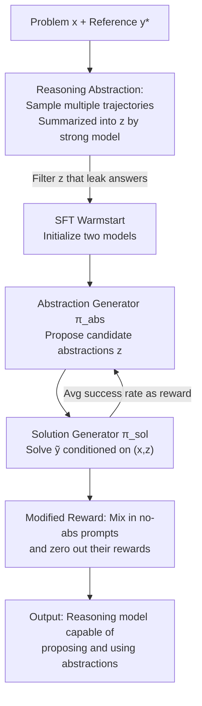

# RLAD: Training LLMs to Discover Abstractions for Solving Reasoning Problems

**Conference**: ICLR 2026  
**OpenReview**: [https://openreview.net/forum?id=fvJPjCioeR](https://openreview.net/forum?id=fvJPjCioeR)  
**Area**: LLM Reasoning  
**Keywords**: Reasoning abstraction, Two-player RL, Test-time compute allocation, Exploration breadth, Mathematical reasoning

## TL;DR
This paper introduces "reasoning abstractions"—reusable segments of procedural or factual knowledge written in natural language—and designs RLAD, a two-player RL paradigm. By jointly training an "abstraction generator" and an "abstraction-conditional solution generator," the model learns to propose abstractions before solving problems. This approach achieves a 44% average improvement over pure long-chain-of-thought RL (DAPO) on AIME 2025.

## Background & Motivation
**Background**: The prevailing approach for training LLM reasoning is using RL to incentivize longer chains of thought (Long CoT), allowing models to continuously verify and extend preceding reasoning steps within a single trajectory.

**Limitations of Prior Work**: This training essentially optimizes "depth"—subsequent iterations primarily lengthen responses and stack new operations on pre-selected reasoning paths. Consequently, models generate long "brute-force" trajectories that explore the solution space sequentially. Such models succeed on specific problems but fail on others of similar difficulty, exhibiting poor generalization.

**Key Challenge**: Many difficult problems require "breadth"—exploring diverse problem-solving strategies—rather than committing to a seemingly good strategy immediately. Depth-first searches often get trapped in "locally optimal but globally incorrect" paths. A structural trade-off exists between depth and breadth, and Long-CoT RL naturally favors depth.

**Goal**: To enable models to "hypothesize" multiple attack strategies for a problem and utilize them during the solution process, shifting exploration from "searching within procedural knowledge" to "composing given procedural knowledge."

**Key Insight**: Multiple candidate trajectories for a single problem often share underlying processes (intermediate lemmas, reusable algorithms, or even "which moves are incorrect"). If these shared sub-structures are compressed into concise natural language descriptions, they serve as "hints" in the context, allowing the model to solve harder problems based on these insights.

**Core Idea**: Use self-proposed "reasoning abstractions" as high-level subgoals or priors. A two-player RL framework is used to co-train the ability to "propose abstractions" and "solve problems using abstractions"—replacing the search for procedural knowledge with the reuse and composition of such knowledge.

## Method

### Overall Architecture
RLAD addresses how to enable a model to both propose useful reasoning abstractions and solve problems based on them. The framework consists of two stages: initial SFT to warmstart the models into states capable of producing and utilizing abstractions, followed by joint optimization using a collaborative two-player RL (RLAD). The system involves two LLMs: the abstraction generator $\pi^{abs}_\theta(z\mid x)$, which proposes one or more natural language abstractions $z$ for a given problem $x$, and the abstraction-conditional solution generator $\pi^{sol}_\theta(y\mid x,z)$, which produces a solution $y$ conditioned on $x$ and $z$. The key coupling lies in the reward: the abstraction generator's reward equals the solution generator's average success rate under that abstraction, framing it as a cooperative game.

### Key Designs

**1. Reasoning Abstractions: Compressing Shared Structures into Reusable Hints**

To address the poor generalization of Long-CoT RL, the authors first define and acquire high-quality abstractions. Considering the solution space as a graph where nodes are intermediate states, a good abstraction identifies useful sub-structures, such as strategy categories leading to similar results or patterns of recurring errors. These are obtained by having a model (Qwen3) sample multiple trajectories, which are then summarized into useful patterns (abstraction $z$) by a stronger model (o4-mini). An abstraction $z$ is considered "good" if the conditional accuracy improves: $\mathbb{E}_{\tilde y\sim\pi^{sol}_\theta(\cdot\mid x,z)}[\mathrm{Acc}(\tilde y,y^*)] > \mathbb{E}_{\tilde y\sim\pi^{sol}_\theta(\cdot\mid x)}[\mathrm{Acc}(\tilde y,y^*)]$.

To prevent "answer leakage," a validation step is performed: if the base model samples the correct answer more than 0 times given only the abstraction (without the problem) over 16 trials, the abstraction is discarded. Empirically, these summarized abstractions improve the base solver's accuracy by 30% on average, typically falling into categories like useful tricks, reusable lemmas/heuristics, or "warning examples" highlighting traps. This step also generates the SFT warmstart data.

**2. Two-player RL: Collaborative Game Binding Abstraction Rewards to Success Rates**

The core is to cultivate both abstraction proposal and utilization capabilities. RLAD frames this as a collaborative two-player game. The solution generator $\pi^{sol}_\theta$ is trained with a standard 0/1 outcome reward conditioned on sampled abstractions $z$: $r(x,z,\tilde y):=\mathrm{Acc}_x(\tilde y,y^*)$. The abstraction generator $\pi^{abs}_\theta$ is rewarded based on the solver's expected success rate under that abstraction:

$$r_{\pi^{sol}_\theta}(x,z) := \mathbb{E}_{\tilde y\sim\pi^{sol}_\theta(\cdot\mid x,z)}[\mathrm{Acc}_x(\tilde y,y^*)]$$

Thus, an abstraction's quality is measured by its ability to help the solver find the correct solution (without leaking it). The models are optimized iteratively: training $\pi^{abs}_\theta$ to maximize $r_{\pi^{sol}_\theta}$ while fixing $\pi^{sol}_\theta$, and vice versa. This decouples the learning signals, allowing abstractions to naturally act as high-level subgoals or priors. Implementation-wise, the abstraction generator uses "batched" offline RL (RFT/RPO), while the solution generator uses DAPO.

**3. Modified Reward: Forcing Abstraction Reliance**

Naive reward design has risks: (1) $\pi^{abs}_\theta$ might solve the problem entirely; (2) if $\pi^{sol}_\theta$ is too weak or strong, the signal vanishes; (3) $\pi^{sol}_\theta$ might ignore $z$. 

The authors use a critical modification: during $\pi^{sol}_\theta$ training, "prompts with abstractions" are mixed with "prompts without abstractions," but rewards for the latter are zeroed out:

$$r(x,z,\tilde y) := \begin{cases} 0, & z=\varnothing \\ \mathrm{Acc}_x(\tilde y,y^*), & \text{otherwise}\end{cases}$$

Under KL-constrained RL (GRPO/DAPO), this forces $\pi^{sol}_\theta$ to stay close to the reference distribution for no-abstraction problems while aggressively seeking rewards only when abstractions are present. Consequently, the model must utilize abstractions to gain scores.

**4. SFT Warmstart + Curriculum Training**

Success depends on starting with models that can produce reasonable abstractions and solutions. Following a "SFT then RL" paradigm, o4-mini generates abstractions, which are filtered by GPT-4.1-mini based on whether they improve accuracy. Qwen3-1.7B undergoes 5 epochs of SFT to become the initial abstraction generator. A two-stage curriculum is applied during RL: problems are categorized into easy/medium/hard based on base success rates, training sequentially on easy and medium sets.

### Loss & Training
Solver: DAPO (KL-constraint + token-level loss normalization + asymmetric clipping + difficulty/length curriculum), with the "zeroed no-abstraction" version of the 0/1 outcome reward. Abstraction generator: Batched offline RL (RFT + RPO), with the solver's expected success rate as the reward. These are optimized iteratively.

## Key Experimental Results

### Main Results
Using Qwen3-1.7B as the base model, RLAD outperformed DAPO without abstractions across three mathematical reasoning benchmarks (32K token budget, pass@1 averaged over 16 samples, best as pass@16):

| Benchmark | Setting | Qwen3-1.7B | +DAPO | +RLAD |
|-----------|------|-----------|-------|-------|
| AIME 2025 | w/o abs | 33.75 | 37.92 | **38.04** |
| AIME 2025 | w/ abs (avg) | 36.25 | 34.90 | **42.45** |
| AIME 2025 | w/ abs (best) | 40.00 | 39.79 | **48.33** |
| DeepScaleR [Hard] | w/ abs (best) | 32.50 | 33.54 | **35.54** |
| AMC 2023 | w/ abs (best) | 84.53 | 88.44 | **91.72** |

Notably, RLAD-trained models perform better even when no abstraction is provided at inference (w/o abs), suggesting that exposure to diverse abstractions during training enhances general reasoning capabilities.

### Ablation Study

| Analysis | Key Metric | Description |
|------|---------|------|
| Abstraction Source | o4-mini long abs +8.1% / +7.0% | Gains require strong generators and detailed abstractions; weak or short ones often fail. |
| Compute Parity (AIME, pass@k) | n=16: 0.71 vs 0.65; n=256: 0.87 vs 0.82 | "$n$ abstractions × $n$ solutions" is superior to "$n^2$ pure solution samples." |
| Weak-to-Strong Generalization | o4-mini pass@1 80.38%→85.83% | Abstractions from Qwen3-1.7B still improve the stronger o4-mini solver. |
| Abstraction Adherence | Highest adherence under "Abstraction" | Solvers follow the provided strategy rather than ignoring it or applying irrelevant ones. |

### Key Findings
- **Prioritizing Abstraction Diversity**: Given a fixed compute budget $C = m \times k$ ($m$ abstractions, $k$ solutions each), allocating more budget to "generating diverse abstractions" yields higher gains than "repeatedly sampling solutions," especially at higher total budgets.
- **Dependency on Quality**: Incremental gains require long abstractions, a strong generator, and a capable solver simultaneously.
- **Cross-domain Universality**: The summarization process improves performance by 30% on average across 37 non-math tasks (e.g., medical, legal, web security).

## Highlights & Insights
- **Explicit Parameterization of Exploration Breadth**: The abstraction generator essentially trains the "strategy switching" logic separately from the solution trajectory, compensating for the inherent breadth deficiency of Long-CoT RL.
- **The Zero-Reward Trick**: This simple mechanism prevents answer leakage, solver negligence, and signal drowning between asymmetric players at almost zero additional cost.
- **Abstraction as a New Dimension for Test-Time Compute**: Unlike scaling via parallel sampling or longer trajectories, this work proposes scaling the diversity of abstractions, which is more efficient under equal compute.

## Limitations & Future Work
- The study focuses primarily on mathematical tasks; generalizing to broader reasoning domains and unifying generators into a single model remain open questions.
- The abstraction generator is restricted to offline RL due to compute costs; on-policy collaborative play remains unverified.
- Gains depend heavily on strong backbone models for data generation and high instruction-following capabilities.

## Related Work & Insights
- **vs. Long-CoT RL (DAPO, etc.)**: While DAPO optimizes "depth," RLAD introduces "breadth" via the abstraction generator, showing significant gains on AIME 2025.
- **vs. Handcrafted Scaffolding (ToT, etc.)**: RLAD does not rely on fixed procedures and instead learns to propose useful abstractions via RL.
- **vs. RAG / Prompt Optimization**: Unlike RAG (static corpora) or prompt optimization (input-independent or feedback-based), RLAD's abstractions are input-dependent procedural knowledge learned through two-player interaction.

## Rating
- Novelty: ⭐⭐⭐⭐⭐ 
- Experimental Thoroughness: ⭐⭐⭐⭐ 
- Writing Quality: ⭐⭐⭐⭐ 
- Value: ⭐⭐⭐⭐⭐ 

<!-- RELATED:START -->

<!-- RELATED:END -->

## Related Papers

- [\[CVPR 2026\] Hilbert-Geo: Solving Solid Geometric Problems by Neural-Symbolic Reasoning](../../CVPR2026/llm_reasoning/hilbert-geo_solving_solid_geometric_problems_by_neural-symbolic_reasoning.md)
- [\[ICLR 2026\] STAT: Skill-Targeted Adaptive Training](stat_skill-targeted_adaptive_training.md)
- [\[ICLR 2026\] $\textbf{Re}^{2}$: Unlocking LLM Reasoning via Reinforcement Learning with Re-solving](textbfre2_unlocking_llm_reasoning_via_reinforcement_learning_with_re-solving.md)
- [\[ICLR 2026\] Exposing Weaknesses of Large Reasoning Models through Graph Algorithm Problems](exposing_weaknesses_of_large_reasoning_models_through_graph_algorithm_problems.md)
- [\[ICLR 2026\] Training Large Reasoning Models Efficiently via Progressive Thought Encoding](training_large_reasoning_models_efficiently_via_progressive_thought_encoding.md)

<!-- RELATED:END -->
