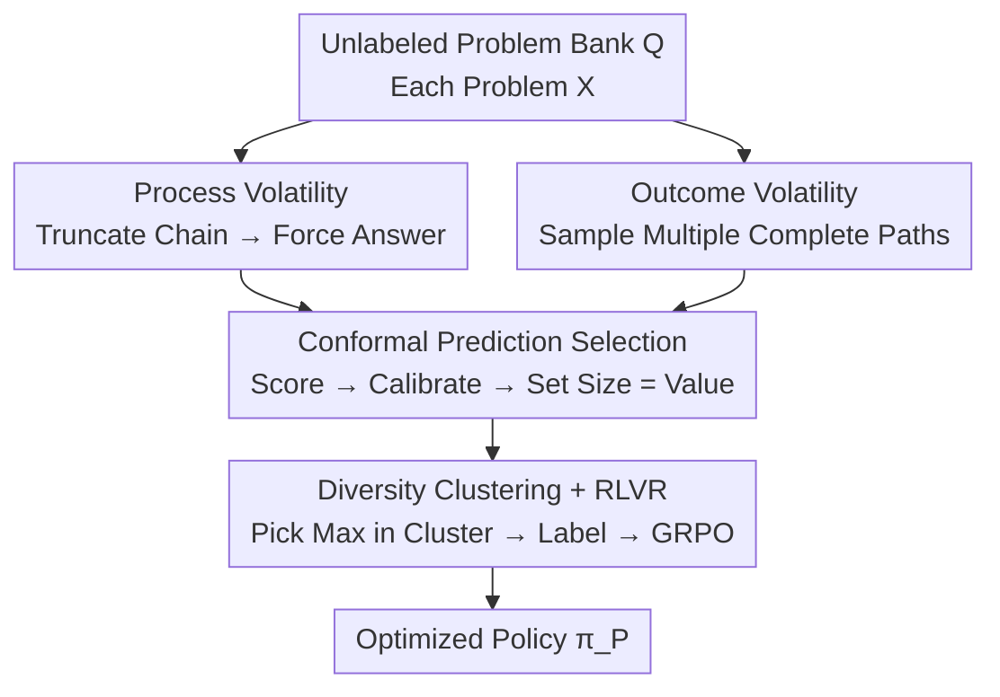

# Sample Lottery: Unsupervised Discovery of Critical Instances for LLM Reasoning

**Conference**: ICLR 2026  
**OpenReview**: [https://openreview.net/forum?id=76OZBE4Rb6](https://openreview.net/forum?id=76OZBE4Rb6)  
**Code**: https://github.com/YushengZhao/SampleLottery  
**Area**: LLM Reasoning / RLVR / Data Selection  
**Keywords**: Lottery Sample Hypothesis, Process Volatility, Outcome Volatility, Conformal Prediction, GRPO

## TL;DR
This paper proposes the "Lottery Sample Hypothesis"—asserting that a minimal subset exists within the RLVR training set which, when used for training alone, can approximate the performance of the full dataset. The authors design an unsupervised selection framework, CONST, which characterizes the potential value of each problem using "Process Volatility + Outcome Volatility." By using the size of the conformal prediction set as a filtering criterion, the approach achieves reasoning performance close to that of the full dataset while labeling and training on < 0.5% of samples, outperforming various baselines by an average of 10.97%.

## Background & Motivation

**Background**: Reinforcement Learning from Verifiable Rewards (RLVR) has become a mainstream post-training technique for enhancing the logical reasoning capabilities of LLMs. Tasks with standard answers, such as mathematics, allow for direct verification of correctness to provide 0/1 rewards. When combined with policy optimization algorithms like GRPO, this significantly strengthens the model's chain-of-thought reasoning.

**Limitations of Prior Work**: Conventional RLVR involves two types of waste. First, it requires complete labeling (providing answers) for the **entire training set**, which incurs high human labor costs. Second, it distributes computational power **uniformly** across all samples, regardless of whether a specific problem is truly valuable for training. An increasing number of studies suggest that samples in a training set are not equivalent, and a satisfactory result can be achieved using only a small portion.

**Key Challenge**: Given the unequal value of samples, the critical question becomes: **How can one identify the "lottery" samples from the raw training set without knowing the answers?** Most existing data selection or valuation research assumes the training set is already fully labeled (relying on ground-truth answers to calculate gradients or influence). However, in this setting, answers are not yet labeled, necessitating **unsupervised** value judgment, which is the primary difficulty.

**Goal**: Under a budget $b$ (e.g., labeling only 4 or 8 problems), find a subset $Q' \subset Q$ such that the strategy $\pi_P = \Phi(\pi_0, Q', A')$ trained on it approximates $\pi_F$ from full training.

**Key Insight**: The authors observe that problems truly valuable for reasoning often induce **complex and volatile** reasoning trajectories. Simple problems yield consistent answers regardless of the cognitive process, offering little help in improving reasoning. In contrast, for difficult problems, the final answer "swings" when the reasoning process is interrupted or alternate paths are taken. This "degree of swinging" can be measured **without knowing the correct answer**.

**Core Idea**: Two complementary signals, "process instability (Process Volatility)" and "outcome inconsistency (Outcome Volatility)," are used to characterize problem value. With the help of conformal prediction, these signals are converted into a theoretically grounded "set of possibly correct answers." **A larger set indicates that the problem carries richer optimization signals**, serving as the basis for selection.

## Method

### Overall Architecture

The goal of CONST (Complementary Conformal Selection) is to identify critical samples from an **unlabeled** problem bank $Q$ and perform standard RLVR using only this small labeled subset. The pipeline is as follows: for each problem, "possible answers" are generated as a multiset (allowing duplicate elements) from two complementary perspectives—**Process Volatility** truncates the reasoning chain at different stages to force the model to report answers, while **Outcome Volatility** samples multiple complete reasoning paths. These two multisets are merged and fed into **conformal prediction** to obtain a "set of possibly correct answers." The **cardinality** of this set serves as the value score for the problem. Finally, problems are clustered, the highest-scoring problem in each cluster is selected, and after labeling, optimization is performed via GRPO.

### Key Designs

**1. Process Volatility: Unsupervised Difficulty Measurement via "Answer Change After Truncation"**

To judge a problem's value for reasoning training without supervision, the authors use an intuition: difficult problems worth training induce "winding" reasoning, while simple problems follow a straight path and yield the same answer regardless of truncation. For problem $X$, a complete output $O = [t_1, t_2, \ldots, t_L; \hat{Y}]$ is sampled deterministically. Then, the reasoning chain is truncated at $n_P$ different positions, resulting in a set of truncated trajectories:

$$\mathcal{T}(X) = \{[t_1, t_2, \ldots, t_{\lceil iL/n_P \rceil}] \mid i = 1, 2, \ldots, n_P\}$$

Each trajectory is fed back into the LLM, requiring it to **report a final answer directly without further reasoning**, yielding an answer multiset $B_P(X) = \{\!\{\hat{Y} = \pi_0(\hat{Y} \mid X, \tau) \mid \tau \in \mathcal{T}(X)\}\!\}$. Simple problems converge to the same answer across truncation points, while difficult problems yield diverse answers. This "process-level swinging" reflects reasoning complexity without needing ground truth.

**2. Outcome Volatility: Supplementing the Process Perspective via "Answer Dispersion across Paths"**

Process volatility examines changes when a single reasoning chain is interrupted, but a problem's value is also reflected in whether "changing the thought process leads to different answers." The authors note that diverse answers induced by a problem during policy optimization provide gradients from multiple directions, helping the model avoid traps. Thus, $n_O$ independent outputs are sampled from the original policy $\pi_0$ (pre-RLVR) to form another answer multiset:

$$B_O(X) = \{\!\{\hat{Y}_i \mid i = 1, 2, \ldots, n_O,\ \hat{Y}_i \sim \pi_0(\hat{Y} \mid X)\}\!\}$$

This complements process volatility: the former captures "process instability," while the latter captures "outcome inconsistency." Both are merged into $B(X) = B_P(X) \uplus B_O(X)$ as input for conformal prediction, covering both the twists in the reasoning process and the divergence in final answers.

**3. Conformal Prediction Selection: Converting "Set Dispersion" into Theoretically Grounded Value Scores**

With the multiset $B(X)$, the question is "how many answers in here appear correct." The authors use Conformal Prediction (CP) to provide a theoretically controlled "set of possibly correct answers." A scoring function $f^{\pi_0}(X, Y)$ is designed to measure the inconsistency between a problem and an answer (lower scores indicate higher model confidence). it combines two terms: negative frequency $f_{\mathrm{NF}}(X, \hat{Y}) = -\mathrm{freq}(\hat{Y}; B(X))$ and an entropy term $f_{\mathrm{ent}}(X, \hat{Y}) = H(B(X)) / \log|B(X)|$ to avoid over-concentration of scores, resulting in $f^{\pi_0}(X, \hat{Y}) = f_{\mathrm{NF}}(X, \hat{Y}) + \lambda \cdot f_{\mathrm{ent}}(X, \hat{Y})$. A **labeled** calibration set (e.g., 1024 problems from BigMath) is used to find a threshold $\hat{\rho}$—the $\lceil(m+1)(1-\alpha)\rceil/m$ quantile of calibration scores. During calibration, if the ground truth does not appear in the multiset, its score is set to $+\infty$. Finally, each problem receives a prediction set $\hat{C}_{1-\alpha}(X) = \{\hat{Y} \in \mathrm{set}(B(X)) \mid f^{\pi_0}(X, \hat{Y}) \le \hat{\rho}\}$. **A larger set indicates more candidates the model deems "possibly correct" and richer optimization signals related to the correct answer.** CP is model-agnostic and provides probabilistic guarantees ($1-\alpha$) for covering the correct answer.

**4. Clustering Diversity + RLVR Optimization: Avoiding Homogeneous Hard Problems**

Simply taking the Top-$b$ problems by prediction set size might lead to selecting a group of similar problems, lacking diversity. To address this, problems are encoded using Sentence-BERT and clustered into $b$ clusters $Q_1, \ldots, Q_b$ using K-means. The problem with the **largest prediction set in each cluster** is then selected:

$$Q' = \Big\{\arg\max_{X \in Q_i} |\hat{C}_{1-\alpha}(X)| \ \Big|\ i = 1, 2, \ldots, b\Big\}$$

This ensures both that each selected problem is the most valuable within its semantic cluster and that the $b$ problems cover different types. Finally, only these $b$ problems are labeled with ground truth $A'$, and $\pi_0$ is optimized using standard GRPO to obtain the final model $\pi_P$. Theoretical analysis shows that under the "Lottery Sample Hypothesis" ($\ell_2$ difference between subset and full gradients $\le \epsilon$), smoothness, and PL conditions, CONST effectively approximates optimal policy parameters $\theta^*$.

### Loss & Training
The final optimization uses the standard GRPO objective (group relative advantage $a_i = (r_i - \mathrm{mean}\{r_j\}) / \mathrm{std}\{r_j\}$ + importance clipping + KL regularization). Key hyperparameters: process volatility stages $n_P = 20$, outcome sampling $n_O = 20$, CP error rate $\alpha = 0.1$, scoring balance coefficient $\lambda = 0.02$, labeling budget $b \in \{4, 8\}$. Training uses a max length of 8192 tokens, inference 3072 tokens, learning rate $1\times10^{-6}$, GRPO $\beta = 1\times10^{-3}$, on 4×H800.

## Key Experimental Results

### Main Results
Sampling was performed on BigMath-sub (2048 problems) across 4 math reasoning benchmarks, using avg@32 (avg@256 for AMC23). The table below shows the average accuracy (AVG column) for each model with a budget of 8:

| Model | NoFinetune | RandSelect | BADGE | CEC | CONST | FullDataset |
|------|-----------|-----------|-------|-----|-------|-------------|
| LLaMA-3.1-8B-Instruct | 20.12 | 22.32 | 23.65 | 24.43 | **28.31** | 28.03 |
| DeepSeek-R1-Distill-Qwen-1.5B | 28.21 | 46.13 | 43.78 | 44.14 | **48.14** | 49.15 |
| Qwen2.5-Math-1.5B | 24.79 | 41.11 | 40.53 | 41.58 | **43.82** | 44.41 |
| Qwen2.5-Math-7B | 52.06 | 53.52 | 53.25 | 53.71 | **54.94** | 55.00 |

Key Conclusion: With only 8 critical samples, CONST improves the original LLaMA-3.1-8B by 40.71%, DeepSeek-R1-1.5B by 70.65%, and Qwen2.5-Math-1.5B by 76.76%. Using < 0.5% of samples, it approximates the full dataset with < 1.09% average gap at budget 8. On LLaMA-3.1-8B, it even slightly outperforms full training (28.31 vs 28.03). Overall, it exceeds baselines by an average of 10.97%.

### Ablation Study
Variants V1–V6 were designed under LLaMA-3.1-8B with a budget of 8 (AVG column):

| Configuration | AVG | Description |
|------|-----|------|
| CONST (Full) | 28.31 | Complete model |
| V1: w/o CP, random in cluster | 23.01 | -5.30, most severe drop |
| V2: w/o clustering, global top set | 25.54 | -2.77, diversity loss |
| V3: Entropy instead of CP set | 23.30 | -5.01 |
| V4: $b/2$ clusters, Top-2 per cluster | 27.60 | -0.71, selection variant |
| V5: w/o Process Volatility | 26.38 | -1.93 |
| V6: w/o Outcome Volatility | 23.04 | -5.27, similar to w/o CP |

### Key Findings
- **Conformal Prediction is core**: Variants V1/V3 using random or pure entropy yield ~5% drop, showing that using prediction set cardinality as a value score is irreplaceable.
- **Outcome Volatility is more critical than Process Volatility**: Removing outcome volatility (V6, -5.27) hurts more than removing process volatility (V5, -1.93), indicating that divergence at the answer level relates more directly to optimization value; however, both are complementary.
- **Clustering-based diversity is effective**: V2 dropped by 2.77 without clustering, validating the need to avoid homogeneous difficult problems.
- **Hyperparameters optimal at median**: $n_P$ and $n_O$ are best around 20—too coarse (small $n_P$) misses the twists in reasoning, while too fine (large $n_P$) interrupts logical segments too frequently.
- **Robustness to calibration sets**: Results are almost unchanged with the in-distribution BM Calib-2 and only drop slightly with cross-distribution MMLU, meaning existing datasets like MMLU can be reused for calibration.

## Highlights & Insights
- **The combination of "Lottery Sample Hypothesis + Unsupervised Selection" is novel**: While data selection usually requires full labeling to calculate sample value, this paper reverses the setting—**select first without labels, then label only these few**, reducing labeling costs from full to < 0.5%.
- **Using CP set size as a value signal cleverly turns uncertainty quantification into a scalar for selection**. CP is typically used for "prediction intervals with coverage guarantees," but here it measures "how many candidate answers the model thinks are possibly correct." Larger set = richer optimization signals.
- **Process/Outcome volatility are zero-truth difficulty probes**: Truncating chains or sampling paths to see answer dispersion does not require the correct answer but reflects problem value for training—this "using the model's own inconsistency as a signal" is highly adaptable.

## Limitations & Future Work
- **Verified only on math reasoning**: All four benchmarks are math problems; transferability to code, logic, or multi-step planning remains unknown.
- **Dependency on a labeled calibration set**: Although existing data like MMLU can be reused, it technically still requires some labeled samples, thus not being perfectly zero-label.
- **Non-negligible selection overhead**: Each problem requires $n_P + n_O = 40$ extra LLM queries to estimate volatility, which is a trade-off for significantly reduced labeling and training costs.
- **Variance under minimal budget**: With budgets as low as 4/8, results are sensitive to selection fluctuations, addressed in the paper by averaging multiple runs.

## Related Work & Insights
- **vs. Supervised Data Selection (e.g., Gradient Matching, Influence Functions)**: These require full ground-truth answers to calculate sample value. Ours uses model volatility + CP for valuation without answers, fitting RLVR's "expensive labeling" scenario.
- **vs. Active Learning Baselines (EntSampling / BADGE / CEC)**: These are not designed for LLM reinforcement learning. CONST consistently outperforms them (e.g., by 10.97% at budget 8), showing that tailored volatility signals are more effective than general uncertainty sampling.
- **vs. Reasoning-specific Selection (SCF / EWS)**: While also targeting reasoning, the innovation here lies in complementary modeling of process/outcome volatility with theoretical CP guarantees.

## Rating
- Novelty: ⭐⭐⭐⭐⭐ The "Lottery Sample Hypothesis + Unsupervised Conformal Selection" approach is unique and theoretically supported.
- Experimental Thoroughness: ⭐⭐⭐⭐ Solid across 4 models, 4 datasets, 6 ablations, and robustness tests, though limited to math.
- Writing Quality: ⭐⭐⭐⭐ Clear motivation, complete formulas/algorithms, and well-organized framework and conclusions.
- Value: ⭐⭐⭐⭐⭐ Reducing RLVR labeling costs to < 0.5% while approximating full performance has high practical utility.

<!-- RELATED:START -->

## Related Papers

- [\[ICLR 2026\] Stabilizing Policy Gradients for Sample-Efficient Reinforcement Learning in LLM Reasoning](stabilizing_policy_gradients_for_sample-efficient_reinforcement_learning_in_llm_.md)
- [\[ICML 2026\] ResRL: Boosting LLM Reasoning via Negative Sample Projection Residual Reinforcement Learning](../../ICML2026/llm_reasoning/resrl_boosting_llm_reasoning_via_negative_sample_projection_residual_reinforceme.md)
- [\[ICLR 2026\] ShinkaEvolve: Towards Open-Ended and Sample-Efficient Program Evolution](shinkaevolve_towards_open-ended_and_sample-efficient_program_evolution.md)
- [\[ICLR 2026\] Sample Smart, Not Hard: Correctness-First Decoding for Better Reasoning in LLMs](sample_smart_not_hard_correctness-first_decoding_for_better_reasoning_in_llms.md)
- [\[NeurIPS 2025\] GPO: Learning from Critical Steps to Improve LLM Reasoning](../../NeurIPS2025/llm_reasoning/gpo_learning_from_critical_steps_to_improve_llm_reasoning.md)

<!-- RELATED:END -->
