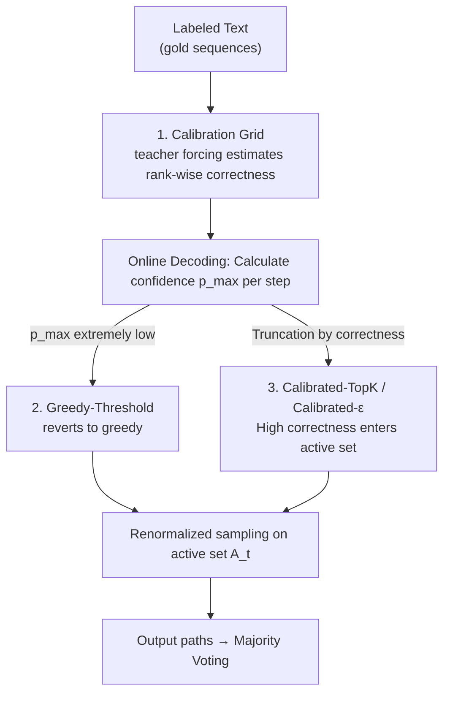

# Sample Smart, Not Hard: Correctness-First Decoding for Better Reasoning in LLMs

**Conference**: ICLR 2026  
**OpenReview**: [https://openreview.net/forum?id=pNwCWIBHBC](https://openreview.net/forum?id=pNwCWIBHBC)  
**Code**: https://github.com/xueyan-lii/Sample-Smart-Not-Hard  
**Area**: LLM Reasoning  
**Keywords**: Decoding strategy, truncation sampling, uncertainty, calibration, reasoning tasks

## TL;DR
This paper argues that the intuition "low confidence steps = worth more exploration" is incorrect for reasoning tasks. It proposes that decoding truncation should be calibrated based on token "correctness" rather than "probability": specifically, by reverting to greedy (Greedy-Threshold) when confidence is extremely low and using a training-free calibration grid to map probabilities to correctness for dynamic truncation (Calibrated-TopK / Calibrated-$\varepsilon$). This approach yields stable gains across several reasoning benchmarks, with AIME improving by up to approximately 6%.

## Background & Motivation

**Background**: For tasks like mathematical reasoning and multi-step problem solving, the mainstream approach involves sampling multiple CoT (Chain-of-Thought) paths followed by majority voting (self-consistency). This requires decoding to satisfy two goals: injecting enough randomness to explore multiple paths while ensuring each path remains accurate. Existing work generally falls into two camps: one "adds more exploration" at uncertain steps (increasing temperature or expanding candidate sets, e.g., top-p / top-k / min-p / EDT) under the assumption that high entropy implies "multiple valid next steps"; the other "performs more filtering" post-generation, rejecting low-confidence samples based on the observation that "low confidence often corresponds to low quality."

**Limitations of Prior Work**: These two camps are actually in conflict because they conflate different sources of uncertainty. The "add exploration" camp assumes low confidence reflects **aleatoric uncertainty**—where multiple valid continuations indeed exist, making broader sampling reasonable. The "perform filtering" camp implicitly acknowledges that low-confidence positions are where the model is most prone to error. If the latter holds, adding randomness at low-confidence steps only amplifies **epistemic uncertainty**—systematic errors arising from a lack of knowledge—thereby accumulating and magnifying errors.

**Key Challenge**: Are low-confidence steps "crossroads for multiple valid branches" or "danger zones where the model is prone to error"? These two interpretations lead to diametrically opposed decoding strategies. Existing methods focus only on token probability (confidence) and fail to distinguish "probability" from "actual correctness."

**Goal**: (1) Empirically clarify the role of low-confidence steps; (2) Design decoding rules that truncate candidate sets based on "correctness" rather than "probability"; (3) Ensure these rules are training-free, involve near-zero inference overhead, and can be stacked onto existing samplers.

**Key Insight**: Using teacher forcing on labeled text, the authors statistically analyzed the frequency of gold tokens appearing at each confidence bin and rank. They discovered that correctness is overall low at low-confidence bins and decays sharply as rank increases—meaning low-confidence positions are error-amplification states rather than crossroads.

**Core Idea**: Shift the basis for decoding truncation from "token probability" to "estimated token correctness"—allowing open sampling where expected correctness is high, while tightening or reverting to greedy where expected correctness is low.

## Method

### Overall Architecture

The method involves two tracks: **Offline Calibration**, which uses labeled text via teacher forcing to estimate a calibration grid (confidence bin × rank $\rightarrow$ correctness); and **Online Decoding**, where each step first examines the current maximum probability (confidence) and then selects a truncation rule based on calibration results to prune the "active set" $A_t$. Finally, sampling is performed after renormalization on the active set. Three specific samplers instantiate this framework: Greedy-Threshold (reverts to greedy if confidence is too low); Calibrated-TopK (calculates a "safe rank limit" using the grid); and Calibrated-$\varepsilon$ (fits the grid to a continuous probability-to-correctness mapping to filter tokens by predicted correctness). All truncation rules can be intersected/stacked, and if the active set becomes empty after filtering, the system defaults to greedy.

### Key Designs

**1. Calibration Grid: Translating "Probability" into "Likelihood of Correctness"**

This is the signal foundation, addressing the pain point that existing decoding looks at token probability without knowing the corresponding actual correctness. The authors partition the model confidence $p_{t,\max} \triangleq \max_j p_t(j)$ (i.e., the probability of rank 1, $p^{(1)}_t$) into $n=10$ equal-width bins $B_m=\left(\frac{m-1}{n}, \frac{m}{n}\right]$. For each step, it is assigned to a bin based on its confidence. Using teacher forcing with gold prefixes, two metrics are calculated for each "bin $m$ × rank $r$": average probability $\hat p_{m,r}=\mathbb{E}[p^{(r)}_t \mid p_{t,\max}\in B_m]$ and **rank-wise correctness** $\hat c_{m,r}=\mathbb{P}[\text{rank}_t(x^\star_t)=r \mid p_{t,\max}\in B_m]$, where $x^\star_t$ is the actual next token. Essentially, $\hat c_{m,r}$ answers: "When the model is in confidence bin $m$, if I pick the $r$-th candidate, what is the probability it is correct?"

The grid reveals a critical phenomenon: correctness is overall low in low-confidence bins and drops sharply with rank—e.g., in the highest bin $(0.8, 1.0]$, correctness drops from 0.907 at rank 1 to 0.039 at rank 2. This suggests that candidates beyond rank 1 are almost always wrong. Low-confidence positions are systematic failure points rather than multi-path crossroads. This also allows defining an expected accuracy $C_m=\sum_{r=1}^{R}\hat p_{m,r}\hat c_{m,r}$ for each bin. Calibration requires only one teacher forcing pass over a benchmark training set (or even cross-domain data like alpaca-gpt4-en), making it training-free.

**2. Greedy-Threshold: Stopping Exploration in "Danger Zones"**

This addresses the issue that "adding exploration at low-confidence steps is harmful." Empirical evidence (Figure 5) shows that once a low-probability token ($p < 0.1$) is sampled or the model enters a low-confidence state ($p_{\max} < 0.3$), sequence-level accuracy drops significantly as such events accumulate; higher average sampling ranks correlate with lower accuracy. An early error can derail the entire chain, especially for smaller models.

Greedy-Threshold reverses common heuristics: given a threshold $p_{GT} \in (0,1)$, if the maximum probability is below it, the active set retains only the argmax token, forcing greedy:

$$A^{GT}_t=\begin{cases}\{v^\star_t\}, & p_{t,\max}<p_{GT}\\ V, & p_{t,\max}\ge p_{GT}\end{cases}$$

The experiment uses $p_{GT}=0.3$. Its advantage is that it can be used alone or stacked on top of existing samplers like top-p / top-k / min-p—retaining the original sampler's behavior when confidence is above 0.3, while curbing exploration in dangerous low-confidence areas to mitigate "error propagation."

**3. Calibrated-TopK and Calibrated-$\varepsilon$: Shifting Truncation from "Probability" to "Estimated Correctness"**

Greedy-Threshold only handles the "extremely low confidence" edge case. More generally, how many candidates should be allowed at each step? Traditional top-k uses a fixed $k$, while $\varepsilon$-sampling truncates based on a probability threshold $\varepsilon$ ($A^\varepsilon_t=\{v:p_t(v)\ge\varepsilon\}$), but probability does not equal correctness. Two calibrated samplers use the correctness values from the grid.

**Calibrated-TopK** does not fix $k$. Instead, for the current confidence bin $m(t)$, it identifies the maximum rank where correctness remains above a threshold $c_{CT}$: $K_m(c_{CT})=\max\{r:\hat c_{m,r}\ge c_{CT}\}$. The active set includes tokens up to rank $K_m$ (reverting to greedy if $K_m=0$). **Calibrated-$\varepsilon$** replaces discrete bins with a continuous mapping: the authors found $(\hat p,\hat c)$ in the calibration grid to be approximately linear in log-log coordinates, $\log_{10}\hat c\approx A+B\log_{10}\hat p$. Coefficients $A$ and $B$ are fitted via least squares ($A \approx -0.506, B \approx 0.795$ in the paper). During decoding, estimated correctness $\hat c_t(j) \triangleq 10^A p_t(j)^B$ is computed for each token, and the set $A^{C\varepsilon}_t=\{v:\hat c_t(v)\ge c_\varepsilon\}$ is kept. This is a simple scalar transformation with virtually zero overhead. Experiments use $c_{CT}=c_\varepsilon=0.05$. Finally, probabilities are renormalized over the active set $p'_t(v)=p_t(v)/\sum_{w\in A_t}p_t(w)$.

### Loss & Training
This method is **entirely training-free**: no gradient optimization or additional parameters are involved. The only "learning" is the least squares fitting for the line (two coefficients $A, B$ for Calibrated-$\varepsilon$). Calibration requires one teacher forcing pass; inference requires a 2-parameter lookup or a vector operation over the vocabulary, adding negligible overhead.

## Key Experimental Results

### Main Results

Comparison of majority voting accuracy (maj@32) on Qwen2.5-0.5B-Instruct; calibrated samplers show the largest gains over the "No restrictions" baseline.

| Dataset | Metric | No restrictions | min-p | ε-sampling | Calibrated-TopK | Calibrated-ε |
|--------|------|-----------------|-------|------------|------------------|---------------|
| GSM8K | maj@32 | 38.6 | 46.6 | 46.7 | 47.1 | 47.1 |
| MMLU-Pro | maj@32 | 17.3 | 18.6 | 18.3 | 18.7 | **18.6** |
| BBH | maj@32 | 16.2 | 31.7 | 31.6 | 31.6 | **32.0** |

On the "reasoning-heavy" GPT-OSS-20B model and AIME math benchmark, stacking ε-sampling ($\varepsilon=0.05$) / Greedy-Threshold also yielded improvements:

| Benchmark | Method | Maj@32 | Pass@32 | Overall Correct |
|-----------|------|--------|---------|-----------------|
| AIME25 | Baseline | 90.0 | 92.2 | 56.1 |
| AIME25 | Greedy-Threshold | **91.1** | **94.4** | **59.9** |
| AIME24 | Baseline | 92.6 | 93.3 | 48.7 |
| AIME24 | Greedy-Threshold | 92.6 | **94.0** | **55.2** |

Overall Correct ratios improved by up to ~6.5%, while output diversity remained stable—the number of unique answers in 32 samples only dropped from 14.1 to 13.3.

### Ablation Study

Gains from stacking Greedy-Threshold on various samplers for GSM8K majority voting (gains are more pronounced for smaller models):

| Configuration | Qwen2.5-0.5B (maj@32) | Qwen2.5-1.5B (maj@32) | Qwen2.5-3B (maj@32) |
|------|-----------------------|-----------------------|---------------------|
| Baseline T=1 | 38.6 → +2.0 | 73.1 → +2.4 | 81.1 → -0.1 |
| top-k | 41.9 → +1.1 | 73.9 → +2.8 | 81.0 → -0.2 |
| η-sampling | 41.0 → +1.7 | 74.2 → +2.7 | 81.0 → +0.1 |
| EDT | 46.8 → +0.1 | 78.9 → -0.1 | 80.9 → +0.1 |

### Key Findings
- **Low Confidence $\neq$ Worth Exploring**: Restricting sampling in the lowest bins does not improve majority voting accuracy and barely contributes to unique answer counts; exploration benefits most in the medium confidence range (0.3–0.6). This refutes the common "high entropy = multiple valid branches" assumption.
- **Smaller Models Benefit More**: Greedy-Threshold consistently provides 1–3 point gains for 0.5B / 1.5B models, while remaining neutral for 3B models. This is because smaller models have more epistemic errors in low-confidence regions, making truncation more effective.
- **EDT Benefits Little**: EDT is already a strong adaptive temperature sampler. Stacking Greedy-Threshold on it yields nearly zero gain—indicating that Greedy-Threshold specifically addresses the flaws of samplers that "explore blindly" in low-confidence zones.
- **Cross-domain Calibration is Robust**: Calibration using general instruction data (alpaca-gpt4-en) yields performance comparable to in-domain calibration on GSM8K training sets, suggesting the probability $\rightarrow$ correctness mapping is transferable.

## Highlights & Insights
- **Redefining "Where to Add Randomness"**: Shifting the decoding criterion from probability to correctness clarifies that high entropy in reasoning reflects epistemic lack of knowledge rather than aleatoric variety.
- **Rank-wise Correctness as a Reusable Signal**: The "cliff-like" decay (e.g., 0.907 to 0.039) quantifies how "beyond top-1 is almost always wrong." This can be applied to speculative decoding verification, hallucination detection, etc.
- **Training-free and Stackable**: Greedy-Threshold acts as a "safety valve" for any existing sampler. Calibrated-$\varepsilon$ is a simple scalar transformation, making it highly practical for production.
- **Log-log Linear Fit Intuition**: Compressing the calibration grid into two coefficients $A, B$ avoids granularity issues and allows vectorized correctness prediction across the vocabulary.

## Limitations & Future Work
- Calibration depends on teacher forcing over short instruction-style data, while reasoning models generate long CoT chains. Calibration on short data may not perfectly represent long-chain behavior—the authors compromised by using fixed threshold $\varepsilon$-sampling on GPT-OSS-20B.
- The method assumes tasks have single correct answers where correctness outweighs diversity. For open-ended creative writing, strong truncation might be harmful.
- Thresholds ($p_{GT}, c, \varepsilon$) and bin counts ($n=10$) are empirical. While ablations were provided, cross-model stability of optimal values requires further study.
- Future Work: Extending calibration to online/segmented calibration for long reasoning chains, or integrating rank-wise correctness into other frameworks like beam search or speculative decoding.

## Related Work & Insights
- **vs. Exploration Methods (top-p / top-k / min-p / EDT)**: These expand candidate sets at high-entropy steps. This paper empirically invalidates their underlying assumption for reasoning tasks and suggests tightening instead.
- **vs. $\varepsilon$-sampling (Hewitt et al., 2022)**: Conventional $\varepsilon$-sampling uses a fixed probability threshold and was designed for NMT/MBR with very small $\varepsilon$ ($\approx 3\text{–}9\times10^{-4}$). This paper shows reasoning tasks favor much larger $\varepsilon=0.05$ and improves it by calibrating probabilities to correctness.
- **vs. Post-generation Filtering**: While both leverage the "low confidence = low quality" link, post-filtering occurs after generation. This method moves the signal to every decoding step to prevent error propagation at the source.

## Rating
- Novelty: ⭐⭐⭐⭐ The shift to correctness-based truncation is clean and compelling, though specific rules are calibrated variations of $\varepsilon$-sampling / top-k.
- Experimental Thoroughness: ⭐⭐⭐⭐ Covers Qwen/Llama/GPT-OSS across scales and benchmarks, including cross-domain analysis and detailed visuals.
- Writing Quality: ⭐⭐⭐⭐ Clear motivation and rigorous definitions of the calibration grid and formulas.
- Value: ⭐⭐⭐⭐ Training-free, stackable, and zero-cost; highly practical for reasoning-intensive self-consistency scenarios.

<!-- RELATED:START -->

## Related Papers

- [\[ICLR 2026\] WavefrontDiffusion: Dynamic Decoding Schedule for Improved Reasoning](wavefrontdiffusion_dynamic_decoding_schedule_for_improved_reasoning.md)
- [\[ICLR 2026\] Making, Not Taking, the Best of N](making_not_taking_the_best_of_n.md)
- [\[ICLR 2026\] ShinkaEvolve: Towards Open-Ended and Sample-Efficient Program Evolution](shinkaevolve_towards_open-ended_and_sample-efficient_program_evolution.md)
- [\[ICLR 2026\] Curriculum Reinforcement Learning from Easy to Hard Tasks Improves LLM Reasoning](curriculum_reinforcement_learning_from_easy_to_hard_tasks_improves_llm_reasoning.md)
- [\[ICLR 2026\] Stabilizing Policy Gradients for Sample-Efficient Reinforcement Learning in LLM Reasoning](stabilizing_policy_gradients_for_sample-efficient_reinforcement_learning_in_llm_.md)

<!-- RELATED:END -->
