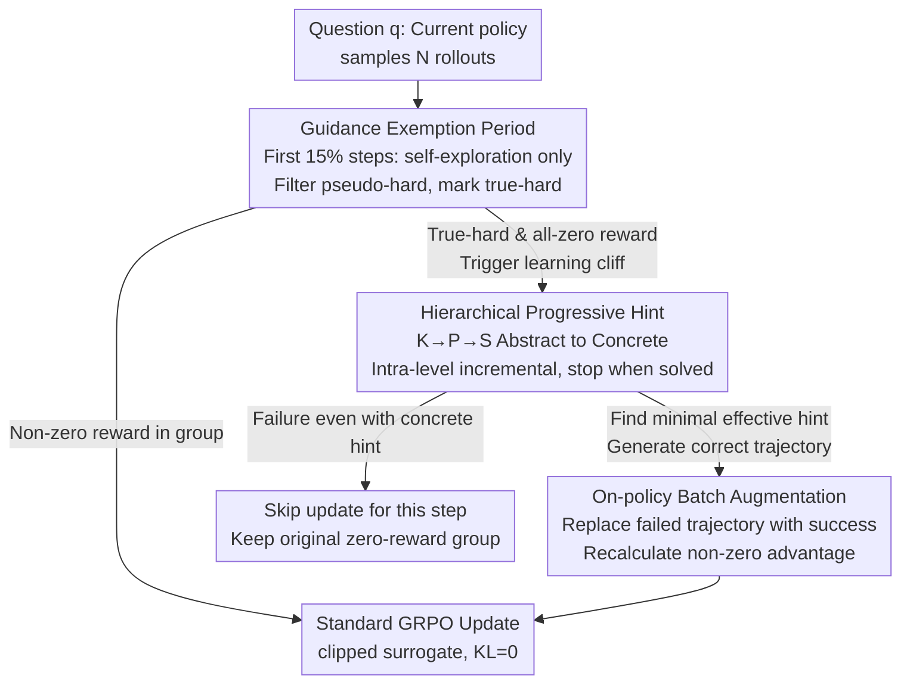

# Scaf-GRPO: Scaffolded Group Relative Policy Optimization for Enhancing LLM Reasoning

**Conference**: ICLR 2026  
**arXiv**: [2510.19807](https://arxiv.org/abs/2510.19807)  
**Code**: None  
**Area**: Optimization / LLM Reasoning Enhancement  
**Keywords**: GRPO, Reinforcement Learning, Learning Cliff, Progressive Guidance, Scaffolded Teaching

## TL;DR

The Scaf-GRPO framework is proposed to overcome the "learning cliff" (zero-reward) problem in GRPO training through hierarchical in-prompt hint injection (Knowledge $\to$ Planning $\to$ Solution). It achieves a 44.3% relative improvement in pass@1 on AIME24 using Qwen2.5-Math-7B while maintaining on-policy consistency.

## Background & Motivation

**Background**: Reinforcement Learning from Verifiable Rewards (RLVR) has become a mainstream paradigm for enhancing LLM reasoning. Algorithms like GRPO update policies using advantage signals calculated from relative rewards within a group.

**Limitations of Prior Work**: When a model faces difficult problems far beyond its current capability, all exploratory attempts fail, resulting in persistent zero-reward signals. In GRPO, zero rewards across the entire group lead to an advantage $\hat{A}_i = \frac{R(o_i) - \mu_\mathcal{G}}{\sigma_\mathcal{G}} = 0$, causing gradient vanishing and forming a "learning cliff."

**Key Challenge**: Existing solutions (such as LUFFY) employ a prefix-continuation strategy—providing the model with a prefix of the correct solution. However, this creates a distribution mismatch between the teacher and student policies and forces the model along a predetermined path, suppressing exploration.

**Goal**: Help the model overcome learning cliffs and learn reasoning capabilities from unsolvable problems without introducing off-policy distribution mismatches.

**Key Insight**: Inspired by educational "Scaffolding Theory," minimal and progressive in-prompt hints are provided instead of mandatory solution prefixes.

**Core Idea**: Provide "road signs" (hints) instead of "rails" (prefixes). By injecting hierarchical hints into the prompt, the model is enabled to generate correct solutions using its own strategy, avoiding off-policy issues and preserving exploratory freedom.

## Method

### Overall Architecture

Scaf-GRPO divides training into two phases: the first 15% of steps serve as a "Guidance Exemption Period," where the model explores entirely on its own to filter out "pseudo-hard" problems and identify truly "hard" problems. Intervention occurs only for true-hard problems thereafter. When every rollout in a batch receives zero reward (triggering a learning cliff), hints are injected into the prompt hierarchically from abstract to concrete (Knowledge $\to$ Planning $\to$ Solution) until the model generates a correct solution using its own strategy. This successful trajectory then replaces one failed trajectory in the group to recalculate non-zero advantages, followed by a standard GRPO loss update. This intervention modifies only the data, not the loss function, ensuring the model always learns from its own distribution.

### Key Designs

**1. Guidance Exemption Period: Distinguishing between true inability and temporary failure**

Injecting hints for all zero-reward problems immediately can be counterproductive. Many problems are not beyond the model's capacity but involve unfamiliar formats or basic techniques that are naturally mastered during training. These are "pseudo-hard" problems. Scaf-GRPO provides no hints during the first 15% of steps and monitors the resolution rate of zero-reward problems. A rapid decline in this rate indicates pseudo-hard problems being solved. Only problems that remain unsolved when the rate plateaus are marked as "true-hard." This ensures hints are targeted only at genuine capacity gaps, preventing the model from becoming dependent on prompts. Ablation shows that starting scaffolding from step one (no exemption) results in a 9.2% performance drop.

**2. Hierarchical Progressive Hint: Providing road signs, not rails**

For true-hard problems, Scaf-GRPO injects three levels of in-prompt hints: $H_{\text{knowledge}}$ (key concepts/formulas), $H_{\text{planning}}$ (high-level strategic framework), and $H_{\text{solution}}$ (specific calculation steps). The guidance performs a deterministic search starting from $H_{\text{knowledge}} \to H_{\text{planning}} \to H_{\text{solution}}$. Each level is further divided into 4 incremental chunks. The search stops once the model generates a correct solution, recording the "minimal effective hint." This "minimal intervention" principle forces the model to complete the reasoning chain itself, fostering transferable skills rather than memorization. Removing the Knowledge layer drops performance to 49.2, while removing the Solution layer causes the largest drop to 48.0.

**3. On-policy Batch Augmentation: Data replacement without breaking consistency**

After obtaining a successful hint-guided trajectory, Scaf-GRPO replaces a random failed trajectory in the group: $\mathcal{G}_{\text{final}} = (\mathcal{G} \setminus \{o_j\}) \cup \{o_h^*\}$, where $o_h^* \sim \pi_\theta(\cdot \mid q \oplus h^*)$ is sampled by the current policy. Crucially, both the numerator and denominator of the probability ratio use the same hint-augmented condition $q \oplus h^*$: $r_{i,t}'(\theta) = \frac{\pi_\theta(o_{i,t}'\mid o_{i,<t}', q \oplus h^*)}{\pi_{\theta_{\text{old}}}(o_{i,t}'\mid o_{i,<t}', q \oplus h^*)}$. This maintains a standard on-policy ratio. Prefix-based methods (like LUFFY), which mix conditions, are inherently off-policy and require policy shaping. Scaf-GRPO avoids this by unifying the conditions.

### Loss & Training

The loss function follows the standard GRPO clipped surrogate objective, with the only change being the replaced success trajectory and its recalculated advantage: $J_{\text{Scaf-GRPO}}(\theta) = \hat{\mathbb{E}}_{i,t}[\min(r_{i,t}'(\theta)\hat{A}_i', \text{clip}(r_{i,t}'(\theta), 1-\epsilon, 1+\epsilon)\hat{A}_i')]$. To maximize exploration, the KL penalty is set to 0. Training runs for 10 epochs with a maximum response length of 2048 tokens.

## Key Experimental Results

### Main Results

| Model / Benchmark | Metric | Scaf-GRPO | Vanilla GRPO | LUFFY | Gain vs. GRPO |
|------------|------|-----------|-------------|-------|---------|
| Qwen2.5-Math-7B / AIME24 | pass@1 | 43.3 | 30.0 | 33.3 | +44.3% |
| Qwen2.5-Math-7B / AIME25 | pass@1 | 20.0 | 13.3 | 16.7 | +50.4% |
| Qwen2.5-Math-7B / AMC | pass@1 | 70.0 | 60.0 | 62.5 | +16.7% |
| Qwen2.5-Math-7B / 7-Avg | pass@1 | 50.9 | 45.2 | 46.6 | +12.6% |
| Qwen2.5-Math-1.5B / Avg | pass@1 | 41.5 | 37.6 | — | +10.4% |
| DeepSeek-R1-Distill-1.5B / Avg | pass@1 | 53.6 | 50.6 | — | +5.9% |

### Ablation Study

| Configuration | 7-Avg | Description |
|------|----------|------|
| Full K→P→S | 50.9 | Complete three-level hierarchy |
| w/o Progressive (Solution-Only) | 48.4 | Providing only the most concrete hint |
| w/o Knowledge Hint | 49.2 | Removing the conceptual layer |
| w/o Solution Hint | 48.0 | Removing specific steps (largest drop) |
| w/o Incremental Chunking | 47.7 | Providing full hints at once |
| No Guidance (Vanilla GRPO) | 45.2 | Baseline without guidance |

### Key Findings

- Progressive guidance outperforms Solution-only hints by 2.5 points, as abstract hints force autonomous reasoning.
- Removing any hint level degrades performance, suggesting the three levels are complementary.
- Incremental delivery of hints outperforms full delivery by 3.2 points, validating the minimal intervention principle.
- The model exhibits an evolution from "mimicking hints" to "autonomous problem solving."

## Highlights & Insights

- The metaphor of "road signs vs. rails" is precise: in-prompt hints allow free selection of reasoning paths, whereas prefix-continuation forces a specific route.
- The hierarchical exemption period mimics effective teaching by allowing self-correction before intervention.
- The approach preserves the integrity of the GRPO loss function, intervening only at the data level, which is engineering-elegant.

## Limitations & Future Work

- Generating three-level hints requires a strong external teacher model (DeepSeek-R1), increasing data preparation costs.
- Currently only validated on mathematical reasoning; transferability to code or logic is unknown.
- Sensitivity to hint quality (4% gap between DeepSeek-R1 and Qwen-72B hints) poses a potential bottleneck.
- The optimal exemption period (15%) may vary by model.

## Related Work & Insights

- **vs. LUFFY**: LUFFY's prefix-continuation causes mismatch requiring policy shaping; Scaf-GRPO's in-prompt hints maintain an on-policy state, outperforming LUFFY by 4.3 points on 7B models.
- **vs. Vanilla GRPO**: Scaf-GRPO restores signals where GRPO would otherwise suffer from zero gradients at learning cliffs.
- **vs. DAPO/DeepScaleR**: While these improve the GRPO algorithm itself, Scaf-GRPO improves the data/guidance strategy; the approaches are orthogonal and combinable.

## Rating

- Novelty: ⭐⭐⭐⭐ Innovative application of scaffolding in RL; in-prompt hints are a key departure from prefixes.
- Experimental Thoroughness: ⭐⭐⭐⭐ Multiple models (Qwen/Llama/DeepSeek) and scales (1.5B~7B), with detailed ablations.
- Writing Quality: ⭐⭐⭐⭐ Clear motivation and intuitive visualization of training dynamics.
- Value: ⭐⭐⭐⭐ Provides a practical and theoretically supported solution for the learning cliff problem in RLVR.

<!-- RELATED:START -->

## Related Papers

- [\[ICLR 2026\] Improving Reasoning for Diffusion Language Models via Group Diffusion Policy Optimization](improving_reasoning_for_diffusion_language_models_via_group_diffusion_policy_opt.md)
- [\[ICLR 2026\] Slow-Fast Policy Optimization: Reposition-Before-Update for LLM Reasoning](slow-fast_policy_optimization_reposition-before-update_for_llm_reasoning.md)
- [\[ICLR 2026\] Reference-guided Policy Optimization for Molecular Optimization via LLM Reasoning](reference-guided_policy_optimization_for_molecular_optimization_via_llm_reasonin.md)
- [\[ACL 2026\] N-GRPO: Embedding-Level Neighbor Mixing for Enhanced Policy Optimization](../../ACL2026/llm_reasoning/n-grpo_embedding-level_neighbor_mixing_for_enhanced_policy_optimization.md)
- [\[ICLR 2026\] DRPO: Efficient Reasoning via Decoupled Reward Policy Optimization](drpo_efficient_reasoning_via_decoupled_reward_policy_optimization.md)

<!-- RELATED:END -->
