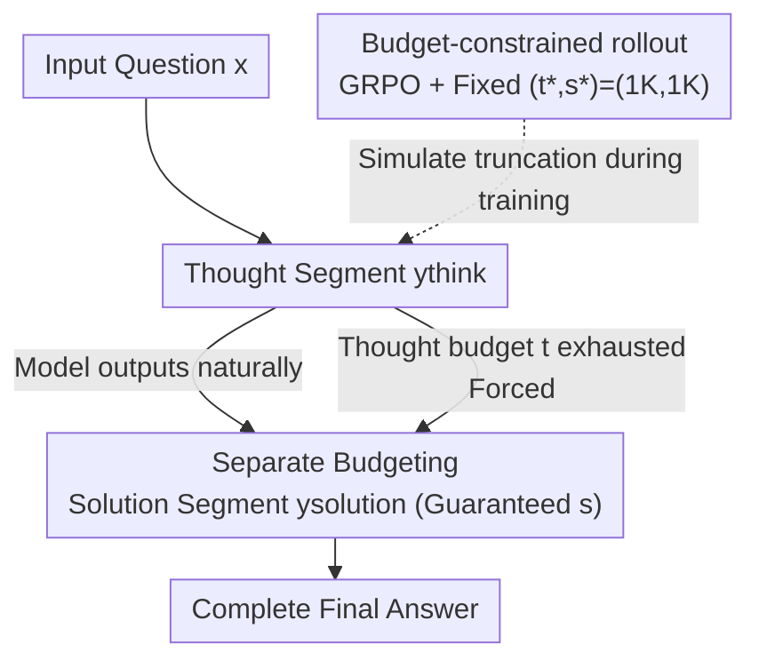

# Elastic Reasoning: Scalable Chain-of-Thought via Elastic Reasoning

**Conference**: ICLR 2026  
**OpenReview**: [https://openreview.net/forum?id=E0Qfhma53J](https://openreview.net/forum?id=E0Qfhma53J)  
**Code**: https://github.com/SalesforceAIResearch/Elastic-Reasoning  
**Area**: LLM Reasoning  
**Keywords**: Length control, Test-time budget, Efficient reasoning, GRPO, Chain-of-Thought

## TL;DR
This paper proposes Elastic Reasoning: explicitly splitting reasoning outputs into a "thought segment" and a "solution segment" with separate token budgets, combined with a budget-constrained rollout (integrated into GRPO) that trains the model to "answer correctly even when thinking is truncated." This allows large reasoning models to provide complete solutions stably under strict token budgets—with training costs at a fraction of L1, while making reasoning shorter and more efficient even without budget limits.

## Background & Motivation

**Background**: Large Reasoning Models (LRM, such as DeepSeek-R1, o1) achieve breakthroughs in complex tasks like mathematics and programming by generating ultra-long Chain-of-Thought (CoT) trajectories. Reinforcement Learning (RL) further trains these trajectories to become increasingly long and detailed.

**Limitations of Prior Work**: The length of reasoning trajectories is **uncontrolled**. In real-world deployment, there are often hard budgets for tokens, latency, and compute, yet models neither know nor care how long they should write. Existing approaches are suboptimal: Long2Short uses trajectory penalties or compression fine-tuning to shorten reasoning but cannot achieve "precise, user-specified" lengths; the length control route, such as S1 (budget forcing), relies on forced truncation or special tokens to limit length, which results in significant performance drops; L1 uses RL to impose explicit length constraints on the entire trajectory, which is more flexible but requires inserting length instructions into prompts, incurs massive training costs (700~820 steps for 4K response length), and still shows noticeable degradation compared to the original model.

**Key Challenge**: Existing truncation methods treat the entire trajectory as a homogeneous token stream to be cut, **ignoring the critical role of the solution segment**. Once the budget is exhausted, what gets truncated is often the final "solution" at the very end. Consequently, the output becomes incomplete and unusable—even if the reasoning is mostly correct, failing to output the answer results in a zero score.

**Goal**: Enable models to **prioritize maintaining a complete solution** under any given token budget $c$, while learning to provide high-quality answers even when thinking is prematurely terminated, ensuring this capability generalizes to budget configurations unseen during training.

**Key Insight**: The authors observe that S1 (forcing the output of a special token like "Final Answer" to conclude) performs better than direct hard truncation of the entire trajectory, which suggests that "preserving the solution segment" is key. Following this observation, rather than limiting the length of a trajectory as a whole, it is better to **split thought and solution and assign a budget to each**.

**Core Idea**: Replace "one-size-fits-all truncation of the entire trajectory" with a "separate budget ($c=t+s$) for thought budget $t$ and solution budget $s$." Use a "budget-constrained rollout" to train the model to be robust to truncation, thereby ensuring solution integrity under strict budgets and generalizing to arbitrary budgets.

## Method

### Overall Architecture

The output of Elastic Reasoning follows the two-part structure: `<think> intermediate reasoning </think>, solution`. The method revolves around two synergistic components: **At inference time**, separate budgeting ensures that the solution segment always has tokens available; **at training time**, a budget-constrained rollout (integrated into GRPO) trains the model to provide good answers under the condition that "thinking is forcibly truncated." Both share the same mechanism—inserting `</think>` at $t$ and writing the solution with $s$ tokens. By training on a single fixed budget $(t^*,s^*)=(1\text{K},1\text{K})$, the model can generalize directly to any inference budget $c_i=t_i+s^*$ without further fine-tuning.

### Key Designs

**1. Separate Budgeting: Reserving the solution space before discussing thought length**

To address the pain point where "one-size-fits-all truncation cuts off the solution," the authors explicitly split the total budget $c$ into two parts—the thought budget $t$ and the solution budget $s$, such that $c=t+s$. During inference, the model reasons within the `<think>` block: if it outputs `</think>` before using up $t$, it immediately switches to the solution phase; if $t$ is exhausted before completion, the model **forcibly appends `</think>`** to terminate reasoning and uses the remaining $s$ tokens to write the solution. This ensures the solution segment always has a **guaranteed reserved budget** and is not squeezed out by reasoning. A key supporting observation is that even if reasoning is forcibly terminated, the model can still produce coherent and often correct solutions. $t$ can be freely adjusted during inference based on the scenario, while $s$ remains guaranteed. As shown in Figure 1, separate budgeting outperforms vanilla budgeting (naive truncation) and S1 (budget forcing) across various budgets because the latter two often result in incomplete final answers.

**2. Budget-constrained Rollout: Training the ability to "answer correctly even if thinking is cut off"**

Separate budgeting alone is not enough—the authors found that in complex tasks like code generation, **naively truncating thoughts leads to significant performance drops** because the model was never trained under "incomplete reasoning" conditions. To this end, they propose budget-constrained rollout: using GRPO for RL fine-tuning, the training process **exactly reproduces the separate budgeting process used during inference**. Specifically, the policy $\pi_\theta$ samples under a fixed budget pair $(t^*,s^*)$: the thought segment $y_\text{think}$ rolls out for a maximum of $t^*$ tokens; if `</think>` is output midway, it enters the solution normally; otherwise, `</think>` is forcibly added at $t^*$, and the remaining $s^*$ tokens are used to generate the solution $y_\text{solution}$. The training objective is to maximize the task reward:

$$J(\theta) = \mathbb{E}_{x\sim D,\, y\sim \pi_\theta(\cdot\mid x;\, t^*,s^*)}\big[r(y)\big],$$

The advantage term in GRPO is normalized using the mean and variance of group rewards: $A(x,y) = \big(r(y) - \mathbb{E}_{y'}[r(y')]\big)\big/\sqrt{\mathbb{V}_{y'}[r(y')]}$, where all trajectories are sampled under the $(t^*,s^*)$ constraint. The authors trained with a fixed $(t^*,s^*)=(1\text{K},1\text{K})$, taking **only 200 steps** (compared to 700 steps for L1-Exact and 820 steps for L1-Max), yet it generalized surprisingly well to many unseen budget configurations. Training teaches the model to **front-load** informative reasoning and strengthens the ability to "write good solutions based on incomplete reasoning," allowing solution quality to hold up even as $t$ shrinks. Ablations show that after training, **the improvement in the solution segment is more significant than in the thought segment**, which is the source of generalization.

### Loss & Training

The base models are DeepScaleR-1.5B-Preview (Math) and DeepCoder-14B-Preview (Code), both of which were derived from the DeepSeek-R1-Distill-Qwen series through iterative context lengthening. The training data follows the recipes of the respective base models (Math: AIME 1984–2023, AMC, Omni-Math, STILL; Code: TACO, SYNTHETIC-1, LiveCodeBench). The RL algorithm is GRPO, with the only key modification being the rollout limitation to $(t^*,s^*)=(1\text{K},1\text{K})$ and a maximum response length of 2K. Rewards are task-specific correctness rewards. Math results are averaged over 16 runs, and code results over 8 runs.

## Key Experimental Results

### Main Results

Math (AIME2024, Pass@1):

| Method | Accuracy under Budget Constraint | Degradation vs. Original | Training Steps |
|------|------|------|------|
| Original DeepScaleR-1.5B | 41.0% | — | — |
| S1 (Budget Forcing) | Low | High | — |
| L1-Exact | 24.2% | 16.8% | 700 |
| L1-Max | 27.1% | 12.9% | 820 |
| **E1-Math-1.5B** | **35.0%** | **6.0%** | **200** |

On MATH500, E1-Math-1.5B achieved 83.6% using 1,619 tokens/problem, while L1-Exact achieved only 79.9% with 1,959 tokens, and L1-Max reached 83.6% with 1,796 tokens—making E1 more token-efficient. When budgets are unlimited, E1-Math-1.5B's accuracy is higher than all baselines across all math benchmarks, and its average token usage is reduced by over 30% compared to the original DeepScaleR (32.1% reduction on AIME2024).

Code (Table 1): E1-Code-14B achieved a Codeforces rating of **1987 (96.0th percentile)** without budget limits, +42 points over the DeepCoder baseline, comparable to O1-2024-12-17 (Low) at 1991 (96.1st percentile), and superior to O3-Mini (Low); it scored 58.4 (+0.3) on LiveCodeBench while reducing average tokens from 17,815 to 11,145 (**−37.4%**).

### Ablation Study

Who was enhanced by training (AIME2024, mixing DeepScaleR and E1 to generate thought/solution segments):

| Budget (Thought + Solution) | Gain from E1 Thought segment only | Gain from E1 Solution segment only |
|------|------|------|
| 0.5K+1K | +1.4 | **+8.7** |
| 1K+1K | +3.1 | +9.4 |
| 2K+1K | +8.1 | +9.4 |
| 3K+1K | +4.0 | +12.7 (Thought segment perspective) |

Ablation of thought budget $t^*$ (fixed $s^*=1$K, across five math benchmarks): $t^*\in\{0.5\text{K}, 1\text{K}, 2\text{K}, 3\text{K}\}$ all generalize to different inference budgets, with $t^*=1$K being the best overall and the most efficient given the maximum generation length of only 2K.

### Key Findings

- **Solution segments are the key to generalization**: Budget-constrained rollout improves the solution segment much more than the thought segment (e.g., +8.7% by replacing only the solution segment at 0.5K+1K), explaining why training with a single fixed $(1\text{K},1\text{K})$ generalizes to any budget—the model learns to "write good answers even based on incomplete reasoning."
- **Extremely efficient training**: At only 200 steps and a 2K maximum response, it reaches or exceeds the performance of L1, which requires 700~820 steps and 4K length; this is an order of magnitude reduction in training cost.
- **Unintended simplicity**: After training, even without any budget constraints, the trajectories generated by E1 are significantly shorter (AIME2024 −32.1%, LiveCodeBench −37.4%), while performance remains stable or slightly improves—suggesting that the training doesn't just "cap length" but also pushes the model toward being more concise and efficient.
- **Token allocation patterns**: As the budget tightens, thought tokens decrease accordingly, while solution tokens remain basic stable or even slightly increase, confirming the design intent of "protecting the solution segment."

## Highlights & Insights

- **Promoting "Solution Integrity" as a first-class citizen**: The essence of separate budgeting is to "reserve the solution space first before discussing reasoning"—a simple yet critical perspective. Many performance drops in length control methods actually stem from cutting off the answer.
- **Training as a simulation of inference**: Budget-constrained rollout perfectly aligns the training distribution with the truncation behavior at inference time. This "train as you infer" approach can be transferred to any scenario where reasoning is rewritten by external constraints (e.g., tool-use budgets, streaming truncation).
- **Single-point training, global generalization**: A single training session at $(1\text{K},1\text{K})$ covers any budget, removing the burden of putting length instructions in prompts like L1. On the deployment side, one only needs to adjust $t$.
- **Byproducts are better than the main goal**: An approach originally designed to "save budget" inadvertently made unconstrained reasoning shorter and more accurate, suggesting that "forced refinement" might itself act as a form of regularization.

## Limitations & Future Work

- The paper only validates the method on math and programming tasks where explicit correctness rewards are available; its effectiveness on open-ended reasoning without clear verifiable rewards (e.g., multi-step planning, long-form writing) has not been explored.
- The boundary between thought and solution depends on the structured output of special tokens like `<think>/</think>`. Models without an explicit two-part structure would need adaptation first.
- The solution budget $s$ was mostly fixed at 1K in the main experiments; whether this guarantee is sufficient when the "solution itself needs to be very long" (e.g., long code, multi-step proofs) and how to dynamically allocate $s$ remains for future work (some solution-token ablations are in the appendix).
- The generalization mechanism is currently an empirical observation and hypothesis ("solution segment enhancement brings generalization"), lacking a more rigorous theoretical characterization.

## Related Work & Insights

- **vs S1 (Budget Forcing)**: S1 relies on inserting special tokens throughout the trajectory to force length limits, often leading to incomplete solutions and significant performance drops. This paper uses separate budgeting to mechanismally preserve the solution segment and trains the model to adapt to truncation, resulting in much better stability.
- **vs L1 (Length control via RL)**: L1 imposes explicit length constraints on the entire trajectory, requires length instructions in prompts, and is expensive to train (700~820 steps). This paper does not require length instructions in prompts, generalizes to any budget with only 200 steps of training at a single fixed budget, achieves comparable accuracy to L1-Max, and has much lower training costs.
- **vs Long2Short / Efficient Reasoning routes**: These methods use trajectory penalties or compression fine-tuning to shorten chains but cannot achieve precise user-specified lengths. This paper provides a controllable mechanism precisely aligned with compute budgets without needing separate training for different budgets.

## Rating
- Novelty: ⭐⭐⭐⭐ The combination of "thought/solution separate budgeting + training-simulated truncation" is simple but addresses the core pain point of length control.
- Experimental Thoroughness: ⭐⭐⭐⭐ Covered dual domains (math + code), multiple benchmarks, quantified training cost and token efficiency, and provided clear ablations.
- Writing Quality: ⭐⭐⭐⭐⭐ The logical chain of motivation—observation—method is clean, and charts directly address the core issues.
- Value: ⭐⭐⭐⭐⭐ Extremely low training cost, plug-and-play, and makes reasoning more concise as a bonus; highly practical for real-world deployment budget constraints.

<!-- RELATED:START -->

## Related Papers

- [\[ICLR 2026\] FROST: Filtering Reasoning Outliers with Attention for Efficient Reasoning](frost_filtering_reasoning_outliers_with_attention_for_efficient_reasoning.md)
- [\[ICLR 2026\] PEAR: Phase Entropy Aware Reward for Efficient Reasoning](pear_phase_entropy_aware_reward_for_efficient_reasoning.md)
- [\[ICLR 2026\] Vision-R1: Incentivizing Reasoning Capability in Multimodal Large Language Models](vision-r1_incentivizing_reasoning_capability_in_multimodal_large_language_models.md)
- [\[ICLR 2026\] RFEval: Benchmarking Reasoning Faithfulness under Counterfactual Reasoning Intervention in Large Reasoning Models](rfeval_benchmarking_reasoning_faithfulness_under_counterfactual_reasoning_interv.md)
- [\[ICLR 2026\] Towards Safe Reasoning in Large Reasoning Models via Corrective Intervention](towards_safe_reasoning_in_large_reasoning_models_via_corrective_intervention.md)

<!-- RELATED:END -->
