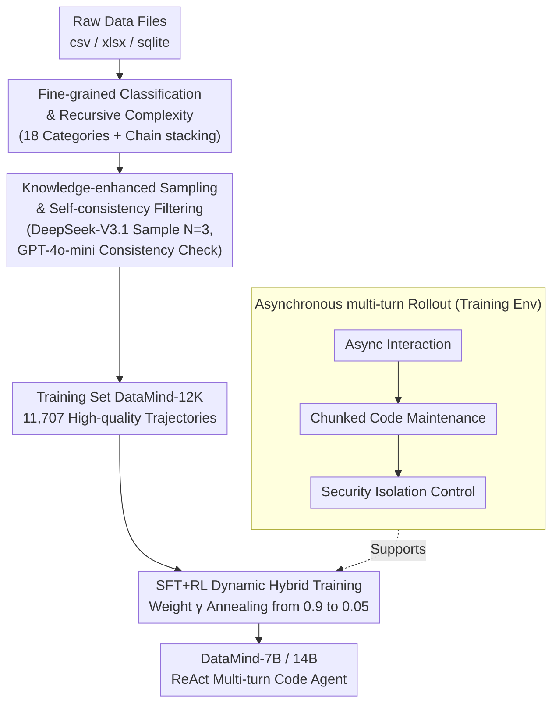

# Scaling Generalist Data-Analytic Agents

**Conference**: ICLR 2026  
**arXiv**: [2509.25084](https://arxiv.org/abs/2509.25084)  
**Code**: [GitHub](https://github.com/zjunlp/DataMind)  
**Area**: LLM Reasoning  
**Keywords**: Data Analysis Agent, Agent Training, Multi-turn Code Execution, Data Synthesis, SFT+RL

## TL;DR

Ours proposes DataMind—a comprehensive training scheme for data analysis Agents. Through fine-grained task classification combined with recursive difficulty synthesis for diverse query generation, knowledge-enhanced trajectory sampling with self-consistency filtering for quality assurance, an SFT+RL dynamic hybrid training strategy, and a memory-friendly asynchronous rollout framework, the resulting DataMind-14B achieves SOTA with a 71.16% average score across multiple benchmarks, surpassing GPT-5 and DeepSeek-V3.1.

## Background & Motivation

**Background**: Data analysis Agents discover useful information by generating code for processing, modeling, and computing data. They are key catalysts for AI-driven scientific discovery and automated decision support. Existing data analysis Agents (DS-Agent, AutoKaggle, Data Interpreter, etc.) rely almost entirely on closed-source models built via prompt engineering and multi-Agent scaffolding.

**Limitations of Prior Work**:
- **Insufficient training data**: Public data analysis benchmarks only provide limited test sets and lack step-by-step trajectory annotations, making them unsuitable for direct training.
- **Unclear training strategies**: The traditional SFT-then-RL paradigm remains ambiguous regarding step allocation and stability maintenance in long-range Agent training.
- **Unstable multi-turn code execution**: Managing data files and code interpreters involves complex memory management; parallel Agent rollout + multi-turn code generation often crash under limited memory resources.
- **Capability gap in open-source models**: Few open-source trained models (TableLLM, Table-R1) can only handle simple table understanding tasks, failing when faced with large-scale data files in diverse formats and long-range multi-step reasoning.

**Key Challenge**: High-quality training requires massive diverse trajectory data, stable training strategies, and reliable environmental interaction. However, all three face unique challenges in data analysis scenarios—diverse task formats (csv/xlsx/sqlite), long reasoning chains, and side effects from code execution.

**Goal**: Ours proposes DataMind, an end-to-end scalable data synthesis and Agent training scheme to systematically address these three challenges.

## Method

### Overall Architecture

DataMind aims to solve the problem of "training an open-source model from scratch into a generalist data analysis Agent." The bottlenecks lie in three areas: absence of training data with step-by-step trajectories, lack of clarity on how to mix SFT and RL for long-range Agents, and memory-related crashes during multi-turn code execution. DataMind maps these challenges to an end-to-end pipeline: first, **synthesizing diverse queries with difficulty gradients** through fine-grained task classification and recursive difficulty combinations; then, **sampling high-quality trajectories with dual filtering** to obtain the training set DataMind-12K; next, optimizing the model using a **dynamic hybrid objective** of SFT and RL; all while running on an **asynchronous rollout framework** specifically designed for multi-turn code execution. The trained Agent follows the ReAct paradigm, iterating in a Thought $\rightarrow$ Action (Python/SQL code) $\rightarrow$ Observation (execution feedback) loop for a maximum of $\mathcal{T}=10$ turns until a final answer is provided.

### Key Designs

**1. Fine-grained Classification and Recursive Complexity: Making Synthetic Queries Diverse and Graded**

Data analysis benchmarks provide few test cases and no trainable trajectories. Mass-producing problems with expert models often leads to monotonous types and flat difficulty. DataMind first decomposes data analysis into **18 fine-grained categories** (e.g., data cleaning, descriptive statistics, correlation analysis, time-series analysis, anomaly detection), each equipped with few-shot examples to ensure broad horizontal coverage. Complexity is amplified vertically through **recursive composition**: treating the output of a previous task as the input for the next, stacking them in a chain to create multi-hop analysis challenges. The underlying data files cover three mainstream formats—3,400 csv and 560 xlsx files from Kaggle, and 1,954 sqlite databases from BIRD/OmniSQL—ensuring the Agent encounters diverse real-world files from the source.

**2. Knowledge-enhanced Sampling and Self-consistency Filtering: Ensuring Trajectory Correctness**

Trajectories directly rolled out by expert models contain both correct and incorrect answers; training with SFT on these would result in learning faulty reasoning. DataMind implements two-stage quality assurance. During sampling, a high-level workflow knowledge $k$ is manually written for each task category and injected into prompts to guide DeepSeek-V3.1 in generating standardized trajectories, with $\mathcal{N}=3$ independent samples per query. During filtering, a judge model (GPT-4o-mini) checks the final answer consistency across these $\mathcal{N}$ samples. If consistent, the most concise and accurate trajectory is selected as a training instance; if inconsistent, the judge's CoT feedback is returned to the Agent for reflection and revision before another filtering round. After applying rules for format compliance, answers $< 1024$ tokens, and language completeness, **DataMind-12K** (11,707 trajectories) is obtained. Subsequent ablation proves this self-consistency stage is more critical than "best trajectory selection"—answer correctness is the root of trajectory quality.

**3. SFT+RL Dynamic Hybrid Training: Balancing Expert Knowledge and Autonomous Exploration via Annealing**

Traditional SFT-then-RL often fails: long SFT phases stagnate thought patterns and stifle RL exploration, while early RL is ineffective as the model is too weak to roll out valid trajectories. DataMind optimizes both jointly by weighted summation of the losses:

$$\mathcal{L}_{\text{Final}}(\theta) = \gamma \cdot \mathcal{L}_{\text{SFT}}(\theta) + (1-\gamma) \cdot \mathcal{L}_{\text{DAPO}}(\theta)$$

The weight $\gamma$ is dynamically scheduled: starting at 0.9 to let the model absorb knowledge from expert data, then annealing to 0.05 to give control to RL for exploration. SFT loss is calculated only on Agent-generated tokens (masking environment feedback), and RL uses the DAPO algorithm with decoupled clipping and dynamic sampling, cold-started with DataMind-12K. To prevent collapse, **Void Turns Filtering** is introduced: if a trajectory contains invalid turns (failing to produce valid code or answers), its loss is masked entirely to prevent distribution drift from misguiding the training.

**4. Asynchronous Multi-turn Rollout: Stable Code Execution within Finite Memory**

Data files and code interpreters require complex memory management. Parallel Agents generating and executing code simultaneously can easily exhaust memory. DataMind stabilizes environmental interaction through three techniques: **Asynchronous Interaction** decouples model generation and code execution across samples, staggering GPU and CPU memory peaks; **Chunked Code Maintenance** adopts a notebook style, generating only current snippets and concatenating history at execution, saving memory from overhead of global variable pools; **Security Control** isolates the execution environment for each trajectory, limiting CPU time and peak memory while filtering unsafe function calls. These ensure stable large-scale parallel rollouts on limited resources.

## Key Experimental Results

### Main Results: Multi-benchmark Performance Comparison

| Model Type | Method | DABench pass@1 | TableBench pass@1 | BIRD pass@1 | Avg pass@1 |
|---------|------|---------------|-------------------|-------------|------------|
| **Closed-source** | GPT-4o | 76.39 | 64.97 | 50.20 | 63.85 |
| **Closed-source** | o4-mini | 79.12 | 71.03 | 57.04 | 69.06 |
| **Closed-source** | DeepSeek-R1 | 78.73 | 68.96 | 55.80 | 67.83 |
| **Closed-source** | DeepSeek-V3.1 | 81.32 | 72.52 | 57.89 | 70.58 |
| **Closed-source** | GPT-5 | 78.21 | 69.93 | 60.17 | 69.44 |
| Open-7B | ReAct (Qwen-Coder-7B) | 15.05 | 11.70 | 7.02 | 11.26 |
| Open-7B | TableLLM | 36.71 | 41.01 | 11.99 | 29.90 |
| Open-7B | Table-R1 | 42.54 | 56.36 | 10.69 | 36.53 |
| Open-7B | **DataMind-7B** | **77.30** | **67.60** | **59.41** | **68.10** |
| Open-14B | ReAct (Qwen-Coder-14B) | 71.21 | 56.96 | 41.76 | 56.64 |
| Open-14B | TableLLM | 38.26 | 46.44 | 20.99 | 35.23 |
| Open-14B | **DataMind-14B** | **80.29** | **70.95** | **62.23** | **71.16** |

**Key Findings**:
- DataMind-14B **surpasses all closed-source models** with a 71.16% average score (including GPT-5’s 69.44% and DeepSeek-V3.1’s 70.58%).
- DataMind-7B outperforms all existing open-source models at 68.10%.
- Specialized models (OmniSQL/SQL-R1) are competitive on BIRD but drop significantly on other benchmarks.
- DataMind uses only 12K training samples, far fewer than baselines (TableLLM 20K, OmniSQL 2.5M).

### Ablation Study: Training Strategy Comparison

| Training Strategy | Avg pass@1 | Avg pass@3 |
|---------|------------|------------|
| SFT only | 62.54 | 73.74 |
| zero-RL (No SFT) | 58.03 | 71.72 |
| SFT-then-RL | 63.42 | 75.46 |
| **SFT-and-RL (Dynamic $\gamma$)** | **68.10** | **79.07** |

**Key Findings**:
- Pure SFT improves the baseline from 11.26% to 62.54%—**data quality contributes most of the performance gain**.
- zero-RL performs worse than SFT—7B models lack the multi-turn reasoning strength to roll out high-quality trajectories independently.
- SFT-then-RL provides only marginal gains and tends to be unstable.
- Dynamic hybrid strategy adds another 5.56 percentage points—balancing knowledge absorption and exploration.

### Data & Filtering Analysis

| Filtering Strategy | Effect |
|---------|------|
| Con-select (Consistency + Best selection) | Baseline setting |
| Non-select (Keep all consistent trajectories) | Better on DABench—trajectory diversity is more important |
| Random-select (Randomly select consistent) | Similar to con-select—judge preference might reduce diversity |
| Non-con (No consistency filtering) | **All metrics drop significantly**—answer quality is the core guarantee of trajectory quality |

**Key Findings**: **Self-consistency filtering is more critical than best-trajectory selection**—answer correctness guarantees the intrinsic quality of a trajectory, and diverse reasoning paths are more beneficial for model learning than a single "best" path.

## Highlights & Insights

### Value
- **Engineering Thoroughness**: End-to-end system design covering data synthesis, training strategies, and rollout engineering, with independent innovations in each part.
- **Deep Insights**: Findings such as SFT loss acting as a stabilizer for RL (yet potentially a cause of collapse) and the superiority of self-consistency over "best-track" selection offer strong practical guidance.
- **Convincing Results**: A 14B model trained on only 12K samples surpasses GPT-5 and specialized models with 2.5M samples.
- **Dynamic Training Analysis**: The "parenting" analogy intuitively explains the principles of the SFT$\rightarrow$RL dynamic weight scheduling.

### Limitations
- Evaluation uses GPT-4o-mini as a judge, which might introduce bias (though cross-validation shows a Pearson correlation of 0.96).
- The 18-category task classification relies on manual design; classification boundaries and coverage may have omissions.
- Performance has only been verified at 7B and 14B scales; behavior for larger or smaller models remains unknown.
- Chunked code maintenance may lose efficiency in scenarios with long dependency chains (e.g., cross-turn variable references).

### Rating
⭐⭐⭐⭐⭐ — A model of systematic engineering: clear problem definition, comprehensive solution, solid experimentation, and deep insights. High reference value for the Agent training community.

<!-- RELATED:START -->

## Related Papers

- [\[ICLR 2026\] Understanding the Role of Training Data in Test-Time Scaling](understanding_the_role_of_training_data_in_test-time_scaling.md)
- [\[ICLR 2026\] Adaptive Social Learning via Mode Policy Optimization for Language Agents](adaptive_social_learning_via_mode_policy_optimization_for_language_agents.md)
- [\[ICLR 2026\] USTBench: Benchmarking and Dissecting Spatiotemporal Reasoning Capabilities of LLMs as Urban Agents](ustbench_benchmarking_and_dissecting_spatiotemporal_reasoning_capabilities_of_ll.md)
- [\[ICLR 2026\] OpenThoughts: Data Recipes for Reasoning Models](openthoughts_data_recipes_for_reasoning_models.md)
- [\[ICLR 2026\] DESIGNER: Design-Logic-Guided Multidisciplinary Data Synthesis for LLM Reasoning](designer_design-logic-guided_multidisciplinary_data_synthesis_for_llm_reasoning.md)

<!-- RELATED:END -->
