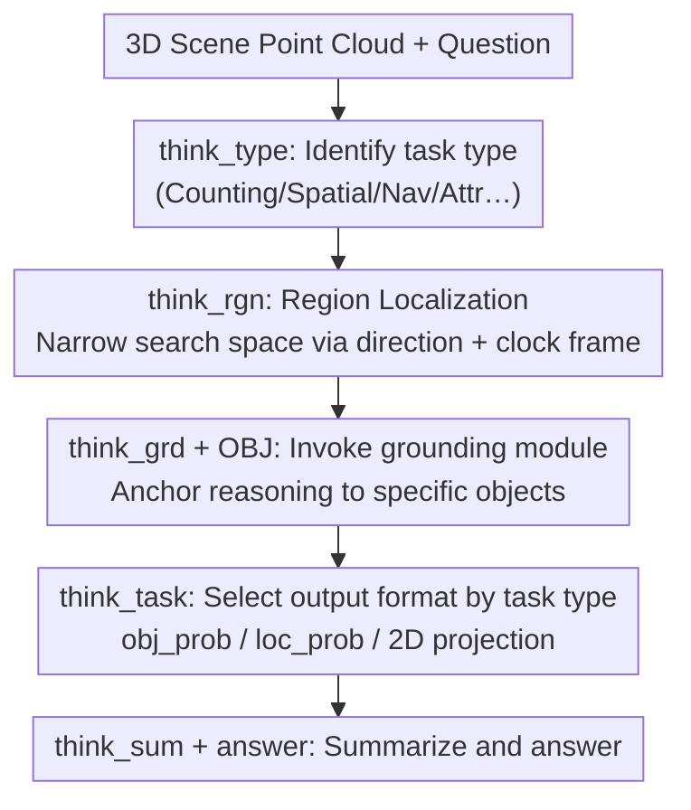

# SceneCOT: Eliciting Grounded Chain-of-Thought Reasoning in 3D Scenes

**Conference**: ICLR 2026  
**arXiv**: [2510.16714](https://arxiv.org/abs/2510.16714)  
**Code**: Yes (provided on project page)  
**Area**: LLM Reasoning  
**Keywords**: 3D reasoning, chain-of-thought, grounded QA, 3D-LLM, scene understanding

## TL;DR
Ours proposes SceneCOT, the first framework to introduce Chain-of-Thought reasoning into 3D scene understanding. By employing a four-stage reasoning pipeline (task recognition → region localization → entity grounding → grounded reasoning), it explicitly associates intermediate reasoning steps with visual grounding, achieving 34.7% Good Coherence on Beacon3D (over 70% higher than the strongest baseline's 20.4%).

## Background & Motivation

**Background**: 3D-LLMs have made progress in scene question answering, but answers often lack a connection to the actual grounding of the scene—models may provide plausible answers without truly "seeing" the relevant objects.

**Limitations of Prior Work**: Beacon3D evaluations found that grounding-QA consistency (Good Coherence) is extremely low: LEO 1.6%, PQ3D 16.5%, Chat-Scene 19.5%. A large number of responses fall into categories of "correct grounding but incorrect QA" or "correct QA but incorrect grounding," indicating a disconnect between the reasoning process and visual perception.

**Key Challenge**: 3D reasoning tasks are complex and diverse (counting, existence, attributes, spatial relationships, navigation, etc.), requiring different types of visual cues and reasoning strategies. A single end-to-end model lacks the flexibility to handle all task types effectively.

**Key Insight**: Migrate CoT reasoning from the text domain to 3D scenes, decomposing complex reasoning into interpretable steps where each step is explicitly associated with objects or regions in the scene.

**Core Idea**: Densely couple linguistic reasoning with 3D visual perception through a four-stage CoT reasoning process (task → region → grounding → reasoning) encoded by special tokens.

## Method

### Overall Architecture
SceneCOT decomposes "answering questions in a 3D scene" into a four-stage chain of thought connected by special tokens. The model first identifies the task type, then narrows down to relevant regions in the scene, subsequently anchors reasoning to specific objects, and finally provides an answer using a task-appropriate output format based on these "seen" objects. The entire chain is driven by a Multimodal Large Language Model (MLLM) backbone, but region identification, 3D grounding, and attribute reasoning are assigned to specialized modules to ensure every step of linguistic reasoning has verifiable visual evidence. The following diagram illustrates the data flow of this chain, where `<think_*>` represents the special tokens separating each stage:

### Key Designs

**1. Four-stage grounded CoT: Linking reasoning explicitly to visual evidence**

Previous 3D-LLMs output answers end-to-end, leading to responses that "make sense but fail to see the right objects." SceneCOT explicitly segments reasoning into four steps marked by special tokens: `<think_type>` identifies the task type, `<think_rgn>` localizes the region, `<think_grd>` + `[OBJ]` grounds to specific entities (invoking a specialized grounding module), and `<think_task>` completes the reasoned output after grounding, followed by a `<think_sum>` summary and `<answer>`. Crucially, `[OBJ]` is not a text description but a trigger for the grounding module to find objects in the scene. Subsequent reasoning must be based on these localized objects, mechanically closing the loophole of "hallucinated answering," which is why Good Coherence substantially leads baselines.

**2. Region localization as a spatial prior: Narrowing the search space with orientation and clock frames**

Direct grounding in a full scene is prone to interference from irrelevant objects. Thus, the second stage `<think_rgn>` performs region localization before grounding. SceneCOT uses directional cues (front, back, left, right) and a clock reference frame (1–12 o'clock, in 30° increments) to discretize space into finite orientation intervals. A rule parser then extracts directional information from the question to filter out irrelevant objects. This serves as a precursor attention mechanism for the subsequent grounding module, significantly narrowing the candidate range and making the third stage of entity grounding both more accurate and faster—removing region identification drops the Overall score from 55.6 to approximately 50.

**3. Task-aware routing: Different reasoning paths and formats for different problems**

3D reasoning tasks vary significantly—counting, spatial relations, navigation, and attributes each require distinct visual cues and answer representations. Using a single output head causes mutual interference. Therefore, the task type identified in the first stage is not just a label; it dictates the output format in the `<think_task>` stage: counting tasks use object probabilities `<obj_prob>` to directly count grounded objects, spatial reasoning uses `<obj_loc_prob>` for positional probabilities, navigation uses polar coordinates `<obj_loc_plr_prob>`, and attribute judgment uses image tokens `<highlight_obj>` to project objects back to 2D for the VLM to inspect details. This "classify first, then route" design clearly benefits tasks like counting that depend on precise grounding (47.9% vs. Chat-Scene† 37.4%).

### Loss & Training
The training objective jointly optimizes three components—CoT supervision, the final answer, and grounding results: $\mathcal{L} = \mathcal{L}_{\text{CoT}} + \mathcal{L}_{\text{ans}} + \mathcal{L}_{\text{ground}}$. The grounding term directly constrains whether the objects localized by `[OBJ]` are correct. Ablations show that removing it drops the Overall score from 55.6 to approximately 53. The backbone is LLaVA-1.5 + LoRA, combined with a fine-tuned PQ3D for 3D grounding, a 2D VLM for attribute reasoning, and a lightweight mask predictor. The model is fine-tuned for 5 epochs using LoRA on 4×A100 GPUs using the self-constructed SceneCOT-185K dataset (145.6K situational reasoning + 40K object reasoning).

## Key Experimental Results

### Main Results

| Method | MSQA Overall | Beacon3D Case | Beacon3D Obj. | Good Coherence |
|------|------------|-------------|-------------|---------------|
| GPT-4o | 52.3 | 57.1 | 20.2 | - |
| LEO | 54.8 | 43.2 | 7.8 | 1.6 |
| Chat-Scene† | 56.6 | 53.6 | 14.0 | 19.5 |
| **Ours** | **55.6** | **58.9** | **23.2** | **34.7** |

### Ablation Study

| Configuration | Overall |
|------|---------|
| Full Model | 55.6 |
| w/o Task recognition | ~45 (forced error types) |
| w/o Region recognition | ~50 |
| w/o Grounding Loss | ~53 |
| Oracle (Perfect grounding) | 78.1 |

### Key Findings
- **Good Coherence is the primary highlight**: 34.7% vs. 20.4% (SceneVerse)—the only method to truly achieve grounding-QA alignment.
- **Largest Gain in counting tasks**: 47.9% vs. Chat-Scene† 37.4% (+10.5), benefiting from counting objects via grounding.
- **Oracle analysis** reveals that grounding errors are the main bottleneck—perfect grounding could improve the overall score from 55.6 to 78.1.
- **Zero-shot generalization**: Performs well on SQA3D/ScanQA without fine-tuning (F1@50: 51.6/40.8).

## Highlights & Insights
- **Interpretable Reasoning**: Every step of the four-stage CoT is verifiable—is the task type correct? Is the region right? Did it ground the correct object? This was impossible in previous 3D-LLMs.
- **Region Localization as Attention**: The clock reference frame elegantly discretizes 3D space, significantly reducing candidate objects—analogous to regional attention in Vision Transformers.

## Limitations & Future Work
- The Overall MSQA score does not exceed Chat-Scene† (55.6 vs. 56.6), and performance is weaker on attribute tasks (49.6).
- Dependence on an external grounding module (PQ3D) means grounding accuracy is the performance ceiling, as proven by the oracle experiments.
- Trained only on ScanNet scenes; generalization to outdoor or large-scale scenes remains unverified.
- The four-stage pipeline results in higher inference latency, making it less suitable for real-time interaction.

## Related Work & Insights
- **vs. Chat-Scene**: Chat-Scene has slightly higher QA accuracy, but its Good Coherence is only 19.5%—answers are not always based on correct grounding.
- **vs. LEO**: LEO's GC is only 1.6%, showing it answers almost entirely without grounding.
- **vs. GPT-4o**: GPT-4o performs well on Beacon3D (57.1) but lacks 3D grounding capabilities.

## Rating
- Novelty: ⭐⭐⭐⭐⭐ First to introduce CoT into 3D scene reasoning; the four-stage design is systematic and complete.
- Experimental Thoroughness: ⭐⭐⭐⭐ Evaluation across multiple benchmarks, detailed ablations, oracle analysis, and zero-shot generalization.
- Writing Quality: ⭐⭐⭐⭐ Clear problem definition and well-motivated CoT design.
- Value: ⭐⭐⭐⭐⭐ Defines a new paradigm for 3D reasoning; the Good Coherence metric deserves broad adoption.

<!-- RELATED:START -->

## Related Papers

- [\[ICLR 2026\] Are Reasoning LLMs Robust to Interventions on Their Chain-of-Thought?](are_reasoning_llms_robust_to_interventions_on_their_chain-of-thought.md)
- [\[ICLR 2026\] CoT-RVS: Zero-Shot Chain-of-Thought Reasoning Segmentation for Videos](cot-rvs_zero-shot_chain-of-thought_reasoning_segmentation_for_videos.md)
- [\[ICLR 2026\] FaithCoT-Bench: Benchmarking Instance-Level Faithfulness of Chain-of-Thought Reasoning](faithcot-bench_benchmarking_instance-level_faithfulness_of_chain-of-thought_reas.md)
- [\[ICLR 2026\] Co-rewarding: Stable Self-supervised RL for Eliciting Reasoning in Large Language Models](co-rewarding_stable_self-supervised_rl_for_eliciting_reasoning_in_large_language.md)
- [\[ICLR 2026\] TATTOO: Tool-Grounded Thinking PRM for Test-Time Scaling in Tabular Reasoning](tattoo_tool-grounded_thinking_prm_for_test-time_scaling_in_tabular_reasoning.md)

<!-- RELATED:END -->
