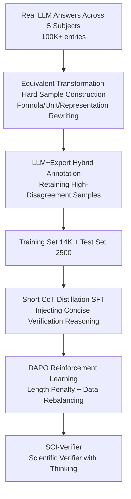

# SCI-Verifier: Scientific Verifier with Thinking

**Conference**: ICLR 2026  
**OpenReview**: [https://openreview.net/forum?id=kBzqPE8FTE](https://openreview.net/forum?id=kBzqPE8FTE)  
**Code**: None (Project Page: SCI-Verifier)  
**Area**: LLM Reasoning / Answer Verification / Scientific Reasoning  
**Keywords**: Answer Verifier, Equivalence Judgment, Chain-of-Thought, Interdisciplinary Benchmark, Post-training

## TL;DR
Addressing the pain point where scientific reasoning answers possess diverse forms making equivalence judgment difficult, this work tackles the problem from both data and modeling sides: constructing SCI-VerifyBench, an interdisciplinary verification benchmark with equivalent transformations covering five subjects (Math, Physics, Chemistry, Biology, and General QA), and post-training a verifier SCI-Verifier with "concise thinking" via SFT+RL. The 8B version matches the performance of the closed-source SOTA model GPT-5 on scientific verification tasks.

## Background & Motivation

**Background**: As LLMs are increasingly applied to scientific reasoning, judging whether a model's output is equivalent to a reference answer has become a fundamental step for evaluating capabilities, providing RL rewards, and benchmarking. Current verification methods mainly fall into two categories: rule-based matching (handwritten templates, regex, string normalization) and using general LLMs or specialized verifiers (e.g., xVerify, CompassVerifier) for direct "True/False" judgments.

**Limitations of Prior Work**: Both approaches are insufficient in scientific scenarios. Rule-based methods rely on manual templates and heuristics, failing on domain-specific equivalent forms such as unit conversions, formula rewrites, or 3-letter/1-letter protein sequence representations. Existing verifiers and general models rely heavily on prompt engineering, exhibit instability, and lack generalization across multi-step reasoning and interdisciplinary tasks. Furthermore, the evaluation metrics themselves lack high-quality standards—existing benchmarks have narrow subject coverage (mostly limited to Math/Logic) and do not intentionally construct hard "equivalent but different form" samples, making it impossible to truly measure a verifier's capability.

**Key Challenge**: There is a fundamental contradiction between the inherent complexity of scientific answers (multi-step reasoning + numerous equivalent forms for the same answer) and the "no-thinking, surface-matching" nature of existing verifiers. Most verifier research intentionally removes the reasoning process to output a direct conclusion for deployment efficiency, which discards precisely the capability most needed for judging equivalence.

**Goal**: This work decomposes the objective into two sub-problems: (1) building a cross-disciplinary verification benchmark with difficulty control and specifically included equivalent transformation hard samples; (2) training a verifier that can reason, output concisely and stably, and generalize across subjects.

**Key Insight**: The authors made an observation overlooked by most verifier research: enabling CoT (Chain-of-Thought) significantly improves scientific verification accuracy across various model scales (Fig. 1). This is because scientific answers often have multiple equivalent forms requiring deduction from multiple perspectives to judge equivalence, where simple surface string matching is insufficient.

**Core Idea**: Re-inject "reasoning capability" into the verifier, but keep it "concise"—distill short CoT tracks using SFT, then tighten the output using RL with length penalties. This allows the verifier to perform complex equivalence judgments while maintaining the short, stable output necessary for deployment.

## Method

### Overall Architecture
This work follows a dual path of "Benchmark + Model." On the data side, SCI-VerifyBench follows a pipeline: "Collecting Real Answers → Synthesizing Equivalent Hard Samples → Hybrid LLM+Expert Annotation → Filtering by Difficulty/Disagreement." This results in 2,500 test samples (500 per subject) and 14K training samples. Each sample is a quadruple $(q, a, r, l)$ consisting of a question, reference answer, response to be judged, and ground truth label (True/False). On the model side, SCI-Verifier undergoes two-stage post-training on Qwen3-4B/8B-Base: high-quality short reasoning trajectories generated via rejection sampling are used for SFT to "inject" basic verification reasoning, followed by RL using DAPO (a GRPO variant with length penalties) to prevent overfitting and enforce concise reasoning.

### Key Designs

**1. Equivalent Transformation Hard Sample Construction: Making "Different Form, Same Answer" the Core Difficulty**

A blind spot in existing benchmarks is that samples are mostly simple cases where the response matches the reference answer verbatim. Even strong verifiers get near-perfect scores on such data, failing to measure actual gaps. This work first collects 15k+ Q&A pairs from five subjects and uses 8 models of varying scales to generate 100K+ real answers. Then, for each subject, 500 representative questions allowing equivalent transformations are selected, and 5 equivalent answers are generated for each, covering numerical equivalence in Math, unit conversion in Physics, name-formula conversion in Chemistry, protein sequence representations in Biology, and equivalent phrasing in QA. During generation, 5 LLMs cross-evaluate equivalent quality; invalid samples or those unanimously rejected by models are regenerated. These equivalent samples create the largest gap—in experiments, even GPT-5 drops below 60% on Math and Physics equivalent subsets, while SCI-Verifier performs significantly better.

**2. LLM+Expert Hybrid Labeling & Difficulty Filtering: Using "Model Disagreement" to Automatically Screen Tough Cases**

Manually labeling 5,000+ samples is expensive and risks wasting budget on simple samples. The authors first have 5 LLMs judge each sample; only samples where the models disagree are retained—high disagreement indicates a hard sample. From both real and synthetic pipelines, 2,500 samples with the highest disagreement (500 per subject) are selected for human labeling by experts with at least a bachelor's degree. In cases of disagreement, a third person arbitrates based on whether the two answers can be transformed into each other. The test set requires total expert consensus and prioritizes human-machine disagreement samples to increase difficulty, while the training set filters out samples with excessive LLM disagreement to ensure label reliability, resulting in a 14K training set. This mechanism of using "disagreement as a difficulty signal" allows the benchmark to maintain high discriminative power while controlling costs.

**3. Short CoT Distillation SFT: Injecting Reasoning while Keeping Refined Traces**

Verification tasks differ from IMO-level Math/Physics problems; they are relatively simple and require domain knowledge + brief reasoning. Long chains of thought might waste resources or lead to hallucinations. During the SFT stage, after generating structured reasoning paths via rejection sampling with large models, strict filtering is applied: for reasoning models, only the conclusive summary paragraphs are kept; for non-reasoning models, over-long or unstructured answers are discarded. Only "valuable and concise" trajectories are used to fine-tune the smaller models. The training objective is standard trajectory likelihood $L_{\text{SFT}}(\theta) = -\mathbb{E}_{(x,y)\sim D_{\text{SFT}}}[\log \pi_\theta(y\mid x)]$. Unlike Math/Physics SFT which focuses on output format, verification SFT focuses on transferring domain-specific verification knowledge. Ablations show that distilling full CoT not only fails to improve performance but also significantly elongates the output, confirming that "short reasoning" is the correct choice for verification.

**4. DAPO Reinforcement Learning with Length Penalty: Preventing Overfitting and Compressing Output**

After SFT, the model possesses basic verification capabilities and formatting but is prone to overfitting. The RL stage uses DAPO (an improved GRPO), which filters out excessively easy and difficult samples and adds a length penalty to encourage concise reasoning. The advantage function is normalized within groups $\hat{A}_{i,t} = (R_i - \text{mean}(\{R_j\}))/\text{std}(\{R_j\})$. The final reward combines alignment reward $R_{\text{align}}$ and an over-long penalty $P_{\text{overlong}}$: $R_i = R_{\text{align},i} + P_{\text{overlong},i}$. $R_{\text{align}}=1$ if the prediction matches the ground truth, otherwise 0. The over-long penalty has three segments: no penalty for length $\le L_{\max}$; linear penalty $-\frac{|o_i|-L_{\max}}{L_{\text{buffer}}}\cdot\lambda_{\text{penalty}}$ between $L_{\max}$ and $L_{\max}+L_{\text{buffer}}$; and a fixed penalty $-\lambda_{\text{penalty}}$ thereafter. Since verification is binary classification, unbalanced labels can lead models to answer based on priors; thus, RL rebalances positive and negative samples to 1:1. SFT and RL are complementary: experiments show their combination yields the best cross-dataset generalization.

## Key Experimental Results

### Main Results
On the self-constructed SCI-VerifyBench (500 per subject, balanced, reported as Accuracy), SCI-Verifier-8B leads across the board and matches or surpasses the closed-source SOTA GPT-5:

| Model | Math | Physics | Chemistry | Biology | QA | Total | Avg. Token |
|------|------|---------|-----------|---------|----|-------|-----------|
| GPT-5 (Closed) | 90.0 | 89.0 | 85.4 | 84.8 | 95.4 | 88.92 | 384.6 |
| CompassVerifier-32B | 90.0 | 82.0 | 84.0 | 85.4 | 89.8 | 86.24 | 212.0 |
| xVerify-8B (No-thinking) | 77.8 | 60.6 | 85.8 | 88.6 | 88.0 | 80.16 | 1.0 |
| **SCI-Verifier-4B (Ours)** | 92.4 | 84.6 | 86.4 | 94.2 | 93.4 | **90.20** | 485.1 |
| **SCI-Verifier-8B (Ours)** | 93.8 | 90.4 | 87.8 | 96.4 | 95.2 | **92.72** | 490.7 |

On external benchmarks VerifierBench and VerifyBench-Hard, SCI-Verifier also leads, demonstrating cross-task generalization:

| Model | VerifierBench Acc/F1 | VerifyBench-Hard Acc/F1 |
|------|----------------------|--------------------------|
| GPT-5 | 91.80 / 90.48 | 90.40 / 85.34 |
| CompassVerifier-32B | 89.88 / 88.91 | 88.30 / 85.86 |
| **SCI-Verifier-8B (Ours)** | **93.01 / 93.06** | **90.30 / 87.45** |

### Ablation Study

| Configuration | Key Conclusion | Description |
|------|---------|------|
| SFT only | Strong baseline capability | Supervised adaptation injects basic reasoning. |
| Only-RL (RL from Base) | Worst performance | Lacks SFT warm-up; fails to learn targeted reasoning. |
| RL from Reasoning Model | Competitive | But inferior to SFT+RL. |
| **SFT+RL** | **Best** | Two stages are complementary, especially for generalization. |
| Full CoT Distillation | No gain + long output | Verification does not require long-chain reasoning. |
| w/o Thinking | Faster but significant drop | Confirms the necessity of thinking for scientific verification. |

### Key Findings
- **Thinking is crucial for scientific verification**: Enabling CoT brings significant improvements; removing it leads to sharp performance drops because scientific answers often have multiple equivalent forms requiring multi-angle deduction.
- **Equivalent samples are the true litmus test**: On the equivalence-augmented subset, even GPT-5 drops below 60% in Math/Physics, while SCI-Verifier remains significantly higher, proving that optimizing for equivalence provides core value.
- **Model scale is not the decider**: Increasing parameter count does not necessarily improve performance (Fig. 4a), as general models are not optimized for "answer equivalence." This explains why 4B/8B models can outperform much larger general models.
- **Subject difficulty varies**: Math and Physics scores are lower due to complex transformations like Taylor expansions; other subjects are more straightforward given prior knowledge, suggesting a need for subject-specific verifiers.
- **Strong prompt robustness**: SCI-Verifier hardly loses performance when using xVerify-style prompts, whereas general models (e.g., Qwen3-30B on VerifyBench-Hard) are highly sensitive, dropping from 88.7 to 75.4.

## Highlights & Insights
- **"Using model disagreement as a difficulty signal" is ingenious**: It automatically filters for truly hard samples while concentrating expensive manual labeling where it matters most.
- **Counter-intuitive "short reasoning > long reasoning"**: Verification is not problem-solving; it requires rapid checks of equivalence from fixed perspectives. Distilling short CoT saves tokens without sacrificing performance, making it deployment-friendly.
- **Rediscovering "thinking" overlooked by the verifier community**: Most verifiers sacrifice reasoning for efficiency; this work proves that this removes the exact capability needed to judge equivalence.
- **Transferability**: The approach of explicitly building "equivalence transformation" into benchmarks can be extended to code, SQL, chemical equations, or any scenario where a single correct answer has multiple valid forms.

## Limitations & Future Work
- **Subject specialization not fully realized**: Although the authors note difficulty differences between subjects, the output is a unified model without subject-level customization.
- **Limited benchmark scale**: The test set contains 2,500 entries (500 per subject). While equivalence types are listed, they are not exhaustive, and complex interdisciplinary problems (e.g., Physical Chemistry) are underrepresented.
- **LLM labeling dependency**: The training set relies heavily on LLM labels with limited human samples; the impact of label noise on RL rewards is not fully quantified.
- **Future Directions**: Exploring adaptive reasoning depth based on subject (more for Math, less for QA) and using the verifier directly as an RL reward model to train stronger reasoning LLMs.

## Related Work & Insights
- **vs. xVerify**: xVerify is efficient but lacks reasoning, making it weak on equivalent/complex samples (only 60.6% in Physics); this work shows injecting concise reasoning can significantly surpass it while maintaining small model scales.
- **vs. CompassVerifier**: CompassVerifier relies on error templates for robust verification but is still limited by reasoning capacity; SCI-Verifier learns reasoning directly via SFT+RL and proves more robust to prompts.
- **vs. Reward Models (J1 / Think-J / Compass-Judger2)**: Reward models rank response quality, while verifiers judge correctness; different goals lead to different data and training strategies. This work focuses on the explicit semantic judgment of "True/False" equivalence.

## Rating
- Novelty: ⭐⭐⭐⭐ Re-introducing "overlooked thinking" + equivalence-focused benchmark; solid approach by combining known techniques in the right direction.
- Experimental Thoroughness: ⭐⭐⭐⭐⭐ Three benchmarks, four classes of baselines, and four dimensions of ablation (scale/subject/prompt/training); complete chain of evidence.
- Writing Quality: ⭐⭐⭐⭐ Clear motivation, well-supported by charts, though some equivalence details are relegated to the appendix.
- Value: ⭐⭐⭐⭐⭐ Small models matching GPT-5 with direct utility as RL rewards; high practical value for scientific reasoning evaluation and training pipelines.

<!-- RELATED:START -->

## Related Papers

- [\[ICLR 2026\] ROC-n-Reroll: How Verifier Imperfection Affects Test-Time Scaling](roc-n-reroll_how_verifier_imperfection_affects_test-time_scaling.md)
- [\[AAAI 2026\] Improving Value-based Process Verifier via Low-Cost Variance Reduction](../../AAAI2026/llm_reasoning/improving_value-based_process_verifier_via_low-cost_variance_reduction.md)
- [\[ICLR 2026\] Unleashing Scientific Reasoning for Bio-Experimental Protocol Generation via Structured Component-based Reward Mechanism](unleashing_scientific_reasoning_for_bio-experimental_protocol_generation_via_str.md)
- [\[ACL 2025\] Local Look-Ahead Guidance via Verifier-in-the-Loop for Automated Theorem Proving](../../ACL2025/llm_reasoning/local_look-ahead_guidance_via_verifier-in-the-loop_for_automated_theorem_proving.md)
- [\[ICLR 2026\] TSLM: Tree-Structured Language Modeling for Divergent Thinking](tslm_tree-structured_language_modeling_for_divergent_thinking.md)

<!-- RELATED:END -->
